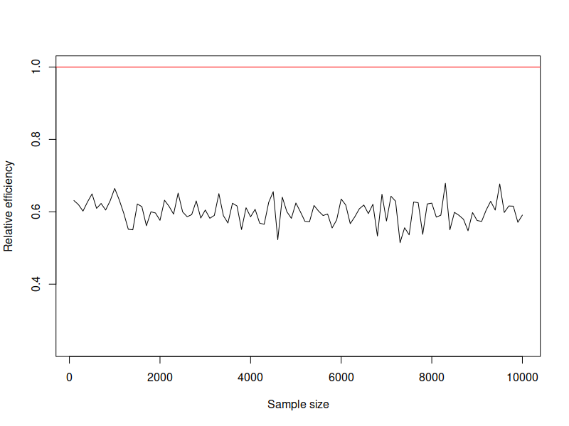
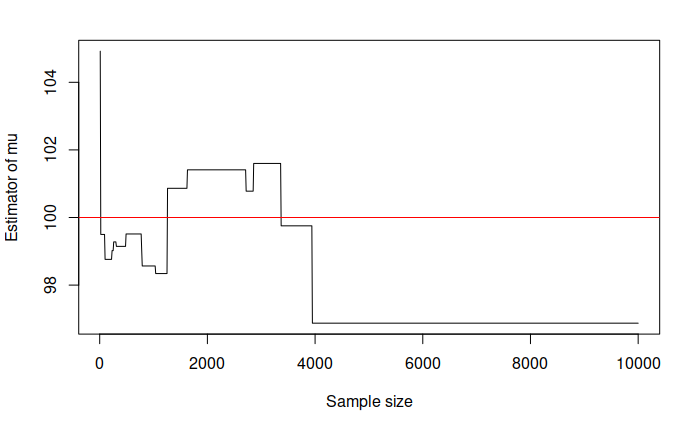

--- 
title: "Statistics for Business Analytics"
author: "Ivan Svetunkov"
date: "`r Sys.Date()`"
site: bookdown::bookdown_site
output: bookdown::gitbook
documentclass: book
bibliography: [library.bib, packages.bib, websites.bib]
csl: elsevier-harvard.csl
biblio-style: elsarticle-harv
link-citations: true
github-repo: config-i1/sba
description: "This book covers the main principles of statistics for Business Analytics, focusing on the application side and how analytics and forecasting can be done with conventional statistical models."
---

# Preface {-}

```{r SBATitle, echo=FALSE, out.width='60%', fig.align='center'}

```

Have you encountered the term "Business Analytics" in your life? If not, then you are probably wondering what it means. If yes, then again, you are probably wondering what it means. It is a term that is used nowadays instead of such terms as "Operations Research" and "Management Science". It is a discipline that covers a variety of qualitative and quantitative methods that can be used in practice for real life decisions. It uses methods and approaches from different scientific areas, including statistics, forecasting, optimisation, operations management etc. These lecture notes are focused on the core of quantitative side of the discipline - statistics. While there are many books on statistics, the author failed to find one that would be focused on the application of statistics both for analysis and forecasting and would rely on modern statistical approaches.

These lecture notes relies heavily on the `greybox` package for R, which focuses on forecasting using regression models. In order to run examples from the lecture notes, you would need to install this package [@R-greybox]:
```{r eval=FALSE}
install.packages("greybox")
```

A very important thing to note is that these lecture notes **do not use `tidyverse` packages**. I like base R, and, to be honest, I am sure that `tidyverse` packages are great, but I have never needed them in my research. So, I will not use pipeline operators, `tibble` or `tsibble` objects and `ggplot2`. It is assumed throughout the lecture notes that you can do all those nice tricks on your own if you want to.

If you want to get in touch with me, there are lots of ways to do that: comments section on any page of [my website](https://forecasting.svetunkov.ru/), [my Russian website](https://ivan.svetunkov.ru/), [vk.com](https://vk.com/isvetunkov), [Facebook](https://www.facebook.com/isvetunkov), [Linkedin](https://www.linkedin.com/in/isvetunkov), [Twitter](https://twitter.com/iSvetunkov).

You can also find me on [ResearchGate](https://www.researchgate.net/profile/Ivan_Svetunkov), [StackExchange](http://stats.stackexchange.com/users/87585/ivan-svetunkov) and [StackOverflow](http://stackoverflow.com/users/5296618/ivan-svetunkov), although I’m not really active there. Finally, I also have [GitHub](https://github.com/config-i1) account.

```{r include=FALSE}
# automatically create a bib database for R packages
knitr::write_bib(c(
  .packages(), 'bookdown', 'knitr', 'rmarkdown', 'greybox', 'DescTools', 'plotrix'
), 'packages.bib')
# Load the necessary packages
library("latex2exp")
library("kableExtra")
library("statmod")
library("pracma")
library("greybox")
library("vioplot")
library("DescTools")
library("plotrix")
library("scatterplot3d")

ourPalette <- c("white","black",
                # 3-Red, 4-green, 5-blue,
                rgb(0.5,0.2,0.2,1), rgb(0.2,0.5,0.2,1), rgb(0.2,0.3,0.5,1),
                # 6-yellow, 7-purple, 8-orange;
                rgb(0.9,0.8,0.4,1), rgb(0.8,0.4,0.8,1), rgb(1,0.65,0.4,1),
                # translucent 9-R, 10-G, 11-B
                rgb(0.9,0.6,0.6,0.5), rgb(0.5,0.8,0.5,0.5), rgb(0.6,0.8,1,0.5),
                # translucent 12-Y, 13-P, 14-O
                rgb(0.9,0.8,0.4,0.5), rgb(0.8,0.4,0.8,0.5), rgb(1,0.65,0.4,0.5),
                # 15-Grey, 16-Light grey and 17-dark grey
                "grey", "lightgrey", "darkgrey")

palette(ourPalette)
```

---

You can use the following to cite the online version of this book:

::: adamCitation
- Svetunkov, I. (2022) Statistics for Business Analytics: Lancaster, UK. openforecast.org/sba. Accessed on [current date].
:::

If you use LaTeX, the following can be used instead:

```{r eval=FALSE}
@MISC{SvetunkovSBA,
    title = {Statistics for Business Analytics},
    author = {Ivan Svetunkov},
    howpublished = {Lecture notes. OpenForecast},
    note = {(version: [current date])},
    url = {https://openforecast.org/sba/},
    year = {2022}
}
```

### License {-}

These lecture notes are licensed under [Creative Common License by-nc-sa 4.0](https://creativecommons.org/licenses/by-nc-sa/4.0/), which means that you can share, copy, redistribute and remix the content of the lecture notes for non-commercial purposes as long as you give appropriate credit to the author and provide the link to the original license. If you remix, transform, or build upon the material, you must distribute your contributions under the same CC-BY-NC-SA 4.0 license. See [the explanation on the Creative Commons website](https://creativecommons.org/licenses/by-nc-sa/4.0/).

<!--chapter:end:index.Rmd-->

# Introduction {#intro}
<!-- What statistics is about -->

Whenever we talk about statistics, analytics or forecasting, we deal with models that are constructed based on available information. So, it is important to understand what a model is, what types of models exist and how to measure information in order to use it in models afterwards. This is what we will discuss in this chapter.


## What is model?
Reality is complex. Everything is connected with everything, and it is difficult to isolate an object or a phenomenon from the other objects or phenomena and their environment. Furthermore, due to this complexity of reality, we cannot work with itself, we need to simplify it, leave only the most important parts and analyse them. This process of simplification implies that we create a model of reality, work with it and make conclusions about the reality based on it.

@Pidd2010 defines **model** as "*an external and explicit representation of part of reality as seen by the people who wish to use that model to understand, to change, to manage and to control that part of reality*". Let us analyse this definition.

- It is *external and explicit*, because if you only think about something, it is not a model. The unclear view on an object is not a model, it needs to be formulated.
- It is a *representation of part of reality*, because it is not possible to represent the reality at full - it is too complex, as discussed above.
- Technically speaking, the model without a purpose is still a model, but @Pidd2010 points out in his definition that without it, the model becomes useless (thus "*to understand, to change, to manage and to control*").
- Finally, *as seen by people* is an important element that shows that models are always subjective. One and the same question can be answered with different models based on preferences of analyst.

<!-- Some argue that there are models for prediction and the others for interpretation. This does not make sense from my perspective. -->

This definition is wide and covers different types of models, starting from simple graphical ones and ending with complex imitations. In fact, there are four fundamental types of models (they are ordered by the increase of complexity):

1. Textual,
2. Visual,
3. Mathematical,
4. Imitation.

*Textual* model is just a description of an object or a process. An instruction of how to assemble a chair is an example of a textual model. Any classification will be a textual model as well, so the list of four types of models is a textual model.

*Visual* model is a graphical or a schematic representation of an object or a process. An example of such a model is provided in Figure \@ref(fig:chairAssembly).

```{r chairAssembly, echo=FALSE, out.width='60%', fig.align='center', fig.cap="Chair assembly instruction. Found on Reddit."}
knitr::include_graphics("images/chairAssembly.jpg")
```

*Mathematical* model is a model that is represented using equations. It is more complex than the previous two, because it requires an understanding of mathematics. At the same time it can be more precise than the previous two models in terms of capturing the structure of reality and making predictions about it. The mass-energy equivalence equation is an example of such model:
\begin{equation*}
    E = m c^2 .
\end{equation*}

A mathematical model in turn can be either deterministic or stochastic. The former one assumes that there is no randomness in it, while the latter implies that the randomness exists and can be modelled in one way or another. The related classification of models based on the amount of randomness is:

a. White box - the deterministic model. An example of such model is a linear programming, which assumes that there is no randomness in the data;
b. Grey box - the model that assumes some randomness, but for which the structure is known (or assumed). Any statistical model can be considered as a grey box: typically, we have an understanding of how elements in it interact with each other and how the result is obtained;
c. Black box - the model with randomness, for which we do not know what is happening inside. An example of such model is an artificial neural network.

Finally, the *imitation* model is a simplified reproduction of a real object or a process. This can be, for example, a physical model of a building standing in a room of an architect, or a mental arrangement in psychology.

In these lecture notes, we will deal with only first three types of models, focusing on the third one.

When constructing mathematical models, we will inevitably deal with variables, with factors that are potentially related to each other and reflect some aspects of the real object or phenomenon. These variables can be split into two categories:

1. Input, or external, or exogenous, or explanatory variables - those that are provided to us and are assumed to impact the variable (or several variables) of interest;
2. Output, or internal, or endogenous, or response variable(s) - the variable of the main interest, which is assumed to be related by a set of explanatory variables.

The models that have only one response variable are called "*univariate*" models. But in some cases, we might have several response variables (for example, sales of several similar products). We would then deal with a *multivariate* model. In the literature, you might meet a different definition of univariate / multivariate models. For example, some consider a model with several variables multivariate, even if it has only one response and several explanatory ones. But throughout these lecture notes we use the definitions above, focused on response variable.


### Models, methods et al. {#modelsMethods}
There are several other definitions that will be useful throughout these lecture notes:

- **Statistical model** (or 'stochastic model', or just 'model' in these lecture notes) is a 'mathematical representation of a real phenomenon with a complete specification of distribution and parameters' [@Svetunkov2019a]. Very roughly, the statistical model is something that contains a structure (defined by its parameters) and a noise that follows some distribution.
- **True model** is the idealistic statistical model that is correctly specified (has all the necessary components in correct form), and applied to the data in population. By this definition, true model is never reachable in reality, but it is achievable in theory if for some reason we know what components and variables and in what form should be in the model, and have all the data in the world. The notion itself is important when discussing how far the model that we use is from the true one.
- **Estimated model** (aka 'applied model' or 'used model') is the statistical model that was constructed and estimated on the available sample of data. This typically differs from the true model, because the latter is not known. Even if the specification of the true model is known for some reason, the parameters of the estimated model will differ from the true parameters due to sampling randomness, but will hopefully [converge to the true ones](#statistics) if the sample size increases.
- **Data generating process** (DGP) is an artificial statistical model, showing how the data could be generated in theory. This notion is utopic and can be used in simulation experiments in order to check, how the selected model with the specific estimator behave in a specific setting. In real life, the data is not generated from any process, but is usually based on complex interactions between different agents in a dynamic environment. Note that I make a distinction between DGP and true model, because I do not think that the idea of something being generated using a mathematical formula is helpful. Many statisticians will not agree with me on this distinction.
- **Forecasting method** is a mathematical procedure that generates point and / or interval forecasts, with or without a statistical model [@Svetunkov2019a]. Very roughly, forecasting method is just a way of producing forecasts that does not explain how the components of time series interact with each other. It might be needed in order to filter out the noise and extrapolate the structure.

Mathematically in the simplest case the true model can be presented in the form:
\begin{equation}
    y_t = \mu_{y,t} + \epsilon_t,
    (\#eq:TrueModel)
\end{equation}
where $y_t$ is the actual observation, $\mu_{y,t}$ is the structure in the data and $\epsilon_t$ is the noise with zero mean, unpredictable element, which arises because of the effect of a lot of small factors and $t$ is the time index. An example would be the daily sales of beer in a pub, which has some seasonality (we see growth in sales every weekends), some other elements of structure plus the white noise (I might go to a different pub, reducing the sales of beer by one pint). So what we typically want to do in forecasting is to capture the structure and also represent the noise with a distribution with some parameters.

When it comes to applying the chosen model to the data, it can be presented as:
\begin{equation}
    y_t = \hat{\mu}_{y,t} + e_t,
    (\#eq:AppliedModel)
\end{equation}
where $\hat{\mu}_{y,t}$ is the estimate of the structure and $e_t$ is the estimate of the white noise (also known as "**residuals**"). As you see even if the structure is correctly captured, the main difference between \@ref(eq:TrueModel) and \@ref(eq:AppliedModel) is that the latter is estimated on a sample, so we can only approximate the true structure with some degree of precision.

If we generate the data from the model \@ref(eq:TrueModel), then we can talk about the DGP, keeping in mind that we are talking about an artificial experiment, for which we know the true model and the parameters. This can be useful if we want to see how different models and estimators behave in different conditions.

The simplest forecasting method can be represented with the equation:
\begin{equation}
    \hat{y}_t = \hat{\mu}_{y,t},
    (\#eq:Method)
\end{equation}
where $\hat{y}_t$ is the point forecast. This equation does not explain where the structure and the noise come from, it just shows the way of producing point forecasts.

In addition, we will discuss in these lecture notes two types of models:

1. Additive, where (most) components are added to one another;
2. Multiplicative, where the components are multiplied.

\@ref(eq:TrueModel) is an example of additive error model. A general example of multiplicative error model is:
\begin{equation}
    y_t = \mu_{y,t} \varepsilon_t,
    (\#eq:TrueModelMultiplicative)
\end{equation}
where $\varepsilon_t$ is some noise again, which in the reasonable cases should take only positive values and have mean of one. We will discuss this type of model later in the textbook. We will also see several examples of statistical models, forecasting methods, DGPs and other notions and discuss how they relate to each other.

::: remark
Throughout these lecture notes we will use index $t$ to denote the time and index $j$ to denote the cross-sectional elements. So, for example, $y_t$ will mean the response variable changing over time, while $y_j$ will mean the response variable changing from one object to another (for instance, from one person to another).
:::


<!-- Furthermore, we will be talking about forecasting in these lecture notes, so it is also important to introduce the notation $\hat{y}_{t+h}$, which corresponds to the $h$ steps ahead **point forecast** produced from the observation $t$. Typically, this corresponds to the conditional expectation of the model $\mu_{t+h|t}$, given all the information on observation $t$, although this does not hold all the time for the classical ETS models. When we use notation $\mu_{y,t}$, then this means one step ahead conditional expectation on observation $t$, given the information on the previous observation $t-1$. We will also discuss **prediction interval**, the term which means specific bounds that should include $(1-\alpha)\times100$% of observations in the holdout sample (for example, 95% of observations). Finally, we will also use sometimes the term **confidence interval** usually refers to similar bounds constructed either for parameters of models or for the specific statistics (e.g. conditional mean or variance). -->


## Scales of information {#scales}
Whenever we work with information, we need to understand how to measure it properly. If we cannot do that, then we cannot construct any model and make proper decisions, supported by evidence. For example, if a person feels ill but we cannot say what the temperature of their body is, then we cannot decide, whether anything needs to be done to reduce it. If we can measure something then we can model it and produce forecasts. Continuing our example, if the temperature is 39°C, then we can conclude that the person is sick and needs to take Paracetamol or some other pills that would reduce the temperature. So, whenever we collect some sort of information about a system's behaviour or about a process, we will inevitably deal with scales of information and it is important to understand what we are dealing with in order to process that information correctly. There are four fundamental scales:

1. Nominal,
2. Ordinal,
3. Interval,
4. Ratio.

The first two form the so called "categorical" scale, while the latter two are typically united in the "numerical" one. Each one of these scales can have one of the following characteristics:

1. Description,
2. Order,
3. Distance,
4. Natural zero,
5. Natural unit.

The last characteristics is typically ignored analytics and forecasting as it does not provide any useful information. But as for the other four, they provide important properties to the scales of information, giving them more flexibility. Here we discuss the scales in detail.

### Nominal scale
This is the scale that only has "description" characteristics. It does not have an order, a distance or a natural zero. There is only one operation that can be done in this scale, and it is comparison, whether the value is "equal" or "not equal" to something. An example of data measured in such scale is the following question in a survey:

What is your nationality?

- Russian,
- English,
- Greek,
- Swiss,
- Belgian,
- Lebanese,
- Indonesian,
- Other.

In this case after collecting the data we can only say whether each respondent is Russian or not, English or not etc. So, the only thing that can be done with the data measured in this scale is to produce a basic summary, showing how many people selected one option or another. Among the statistical instruments, **only the mode** is useful, as it shows which of the options was selected the most. If there are several variables measured in nominal scale, we can calculate some measures of association to see if there are any patterns in respondents behaviour (e.g. those who select "Russian" would prefer Vodka, while those who selected "Belgian" will tend to drink "Beer").

When it comes to constructing models, the nominal scale is typically transformed in a set of dummy variables, which will be discussed later in [regression analysis](#regression) of these lecture notes.

If you are not sure, whether your data is measured in nominal or another scale, you can do a simple test: if changing the places of two values does not break the scale, then this is the nominal one. For example, in the question above, moving "Greek" to the first place will not change anything, so this is indeed the nominal scale. Another example of nominal scale is the number on the T-shirt of football players. They are only descriptive, and if two players change numbers, this will not change anything (although it might confuse football fans).


### Ordinal scale
In addition to description, the ordinal scale has the "order". It is possible to say that one value can be placed higher or lower than the other on a scale (thus, permitting operations "greater" and "smaller" in addition to the "equal" and "not equal") However, it is not possible to say how far the elements are placed from each other, so the number of operations in the scale is still limited. Here is an example of a survey question with such scale:

How old are you?

1. Too young,
2. Young,
3. Not too young,
4. Not too old
5. Old,
6. Too old.

In this scale above we have a natural order, and when collecting the data in this scale we can conclude, whether a respondent is older than another one or not. Sometimes ordinal scales look confusing and seem to be of a higher level than they are, here is an example:

How old are you?

1. Younger than 16,
2. 16 - 25,
3. 26 - 40,
4. 41 - 60
5. Older than 60.

This is still an ordinal scale, because it has the natural order, and because we cannot measure the distance between the value: if, for example we subtract "16 - 25" from "26 - 40", we will not get anything meaningful.

The ordinal scale, being more complex than the nominal one, allows using some additional statistical instruments (besides the mode), such as *quantiles of distribution, including median*. Unfortunately, the **arithmetic mean is not applicable to the data in ordinal scale**, because of the absence of distance. Even if you encode every answer in numbers, the resulting average will not be meaningful. Indeed, if in the question above with the five options, we use the numbers ("1" for the first option, "2" for the second one, etc.) and take average, the resulting number of, for example, 3.75 will not mean anything, as there is no element in the scale that would correspond to that number.

When it comes to measuring relations between two variables in ordinal scale, we can use Kendall's $\tau$ correlation coefficient, Goodman-Kruskal's $\gamma$ and Yule's Q. These are discussed in detail in Section \@ref(correlations). As for using the variables in ordinal scale in modelling, the typical thing to do would be to create a set of dummy variables, similarly to how it is done for variables in nominals scale.

As for the identification of scale, if in doubt, you can do any transformation of elements of scale without the loss of its meaning. For example, if we assign numbers from 1 to 5 to the responses above, we can square each one of them and get 1, 4, 9, 16 and 25, which would not change the original scale, but only encode the answers differently (select "16" for the option "41 - 60").


### Interval scale
This scale is even more complex than the previous two, as in addition to description and order it also has a distance. This permits doing addition and subtraction to the elements of scale, which are meaningful operations in this case. Arithmetic mean and standard deviation become available in this scale in addition to all those used in lower level scales discussed above. The classical example of a variable measured in this scale is the temperature. Indeed, we can not only say if the temperature of one person is higher than the temperature of the other one, but also by how much: 39°C - 37°C = 2°C, which is a meaningful number in the scale. The only limitation in this scale is that there is no natural zero. 0°C does not mean the absence of temperature, but rather means the point at which water starts freezing. If we switch to Fahrenheit (although why would anyone do that?!), then the 0°F would correspond to the point, where the mixture of ice, water, and ammonium chloride used to stabilise back in 1724, when Fahrenheit proposed the scale.

Almost all descriptive statistics are meaningful in this scale (see Section \@ref(dataAnalysis)). This includes, but is not limited with **mean, variance, skewness, kurtosis**. Coefficient of variation and other statistics, where division is done by an actual value or mean, are not meaningful, because the scale does not have a meaningful zero. For example, switching from Celsius to Fahrenheit would change the value of coefficient of variation, although the distribution of the variable will stay the same. Furthermore, some error measures [see Chapter 2 of @SvetunkovADAM] cannot be used for the measurement of accuracy of models for this scale (for example, MAPE cannot be used as it assumes meaningful zero).

The relation between two variables in interval scale can be measured by Pearson's correlation coefficient. The scale can be used in the model as is.

Finally, when it comes to the identification of scale, only linear transformations are permitted for the variables without the loss of its properties. This means that if we measure temperature of two respondents and then do their linear transformations via $y=a+bx$, then the characteristics of scale will not be broken: it will still have description, order and distance with the same meaning as prior to the transformation. In the example of temperature, this is how you switch, for example, from Celsius to Fahrenheit ($y=a+bx$).


### Ratio scale
The most complex of the four, this ratio has a natural zero (in addition to all the other characteristics). It permits any operations to the values of scale, including product, division, and non-linear transformations. Coefficient of variation can be used together in addition to all the previous instruments. An example of the information measured in this scale is the height of respondents in meters. You can compare two respondents via their height and not only say that one is higher than the other, but also by how much and how many times. All these operations will be meaningful in this scale.

If you need to check, whether the variables is indeed in ratio scale, note that only the transformation via multiplication would maintain the meaning of the scale. For example, height measured in meters can be transformed into height in feet via the multiplication by approximately 3.28. If you add a constant to the values of scale, it will break it.

All the statistics and error metrics work for the variables measured in this scale. Furthermore, being the most complex, this scale also permits usage of all [correlation coefficients](#correlations).

Finally, the variables measured in this scale can be either integer or continuous. This might cause some confusions, because the integer numbers sometimes look suspiciously similar to the values of ordinal scale, but the tools of identification discussed above might help. If a company needs to buy 7 planes, then this is an integer variable measured in ratio scale: 7 planes is more than 6 planes by one plane, and zero planes means that there are no planes (all the characteristics of ratio scale). Furthermore, squaring the number of planes breaks the distance between them ($7^2 - 6^2 \neq 1^2$), while linear transformation breaks the scale ($7\times 2 + 3$ has a completely different meaning in the scale than just 7).


## Types of data {#typesOfData}
After doing measurement (e.g. measuring temperature of patients), an analyst typically obtains data. According to Cambridge dictionary, **data is "information, especially facts or numbers, collected to be examined and considered and used to help decision-making"** [@CambridgeData]. Data can be *unprocessed* (or raw data), containing an disorganised array of recordings about a process under consideration, or it can be *cleaned*, having a proper structure with correctly encoded variables, without obvious mistakes or missing values. When first dealing with data, an analyst needs to clean it and transform it into a usable format in order to be able to extract useful information from it or apply models.

The process of data cleaning itself depends on a variety of factors, and most importantly on what the analyst wants to do. For example, if an analyst is interested in getting insights about daily A&E attendance, and they have records of every patient arriving to A&E, the first step would be to aggregate those values into daily buckets, obtaining the information about the number of A&E arrivals per day. As another example, if an analyst conducts a survey, aiming to find brand preferences of citizens of Lancaster, then after collecting the survey data, they need to transform some of the questions into appropriate variables to be able to work with them (e.g. if there were multiple choice questions with several options, they need to be transformed into a set of variables equal to the number of that options).

The question related to the data cleaning is what type of data the analyst is working with. There are three fundamental types:

1. Cross-sectional data;
2. Time series;
3. Panel data.

In the example above the **cross-sectional data** is the data collected after conducting a survey in a specific location over a fixed period of time. We end up with answers to the questions (and thus values of variables) of different respondents at the fixed time. Mathematically, we denote these observations with index $j$, which separates, for example, one respondent from another, and in this textbook we will use letter $n$ to denote the number of elements (respondents) in our sample. So, the variable $y_j$ would mean the value of a variable for the $j^{\mathrm{th}}$ respondent. 

The **time series data** is typically measured for one and the same object over time. In the example above, the A&E arrival would imply time series data, where we observe a value (number of patients arriving) over time (daily). Mathematically, we denote the observation over time with index $t$, separating, for example, one day from another. The last available observation in this case will be denoted with the capital letter $T$. In our notations, the variable $y_t$ contains the value at a specific moment of time.

::: remark
In time series, the observations typically do not happen at random, the number of A&E arrivals will depend on the time of day, day of week and month of year. This is an important characteristic of this specific type of data, and we will come back to it later in this textbook.
:::

Finally, in some situations we might be able to measure data of several objects over time. For example, we could have daily A&E arrival in several hospitals. This type of data would be called **panel data**, and in this situation we would use both indices $j$ and $t$, ending up with a variable $y_{j,t}$, showing, for example, a specific number of patients arriving to a specific hospital at a specific moment of time.

In this textbook we will focus on cross-sectional data and then will move to the time series one. We will also briefly discuss panel data models, but we do not discuss them in detail, as they become available to analysts less often than the other two types.

We have already used the term "variable" several times in this chapter, assuming that a reader is familiar with it. In mathematics, **variable is a symbol that represents any of a set of potential values**. In this textbook, we will face several types of variables. We will work with a **response** variable, representing a place holder for a quantity of the main interest of our analysis, something that is formed using an assumed mechanism. This will be denoted with letter $y$. We will also work with **explanatory** variables, which are supposed to explain how the response variable is formed and are denoted using letter $x$ with potential subscripts, e.g. $x_1$, $x_2$ etc, representing a first, a second etc variables. In some cases, we will also use terms "exogenous" and "endogenous" variables, where the former means the variable that is formed on its own and is not impacted by any of variables under consideration, while the latter represents a variable that is created by a combination of variables under consideration. Sometimes, the terms "response" and "endogenous" are used as synonyms. Similarly, the terms "explanatory" and "exogenous" are used as synonyms as well. The basic model with one response variable $y_j$ and one explanatory variable $x_j$ can be written as:
\begin{equation*}
    y_j = \beta_0 + \beta_1 x_j + \epsilon_j ,
\end{equation*}
where $\beta_0$ and $\beta_1$ are parameters of the model. This model is discussed in more detail in Chapter \@ref(simpleLinearRegression).


## Sources of uncertainty {#sourcesOfUncertainty}
When estimating any model on a sample of data, we will inevitably have to deal with uncertainty. Consider an example, when we want to estimate the average height of a person in the room. We could take heights of all the people in the room, then take average and we would get our answer. But what would happen with that average if another person comes in the room? We would need to do additional measures and re-estimate the average, and inevitably it will be different from the one we had before. This example demonstrates one of the classical sources of uncertainty - the one caused by estimation on a sample of data.

Furthermore, we might be interested in predicting the weight of a person based on their height. The two variables will be related, but would not have a functional relation: with the increase of height we expect that a person will weigh more, but this only holds on average. So, based on a sample of data, we could estimate the relation between the two variables and then having a height of a person, we could predict their expected weight. Their individual weight will inevitably vary from one person to another. This is the second source of uncertainty, appearing because of the individual discrepancies from one person to another.

Finally, the model of weight from height could be wrong for different reasons. For example, there might be plenty of other factors that would impact the weight of person that we have not taken into account. In fact, we never know the true model (see Section \@ref(modelsMethods)), so this is the third source of uncertainty, the one around the model form.

These three sources of uncertainty have been summarised for the first time in @Chatfield1996. Whenever we need to construct any type of model, we will deal with:

1. Uncertainty about the data, e.g. the error term $\epsilon_t$ (see Section \@ref(PopulationSampling));
2. Uncertainty about estimates of parameters (see Section \@ref(uncertaintyParameters));
3. Uncertainty about the model form (see Section \@ref(uncertaintyModel)).

In these lecture notes we will discuss all of them, slowly moving from (1) to (3), introducing more advanced techniques for model building.

<!--chapter:end:Chapters//01-intro.Rmd-->

# Probability theory {#probabilityTheory}
Before moving to the discussion of statistics, we need to understand the basics of probability theory. In this chapter we will discuss the definition of probability, the definition of random variable then addition and multiplication of probabilities, conditional and independent probabilities and finally the Bayes' Theorem. All these theoretical ideas form the basis of more advanced statistical tools, which is why they are important.


## What is probability? {#whatIsProbability}
We start with a classical example: tossing a coin. If you have one, take it in your hands, look at it, and answer a question: what outcome will you have if you toss it? Toss it once and, let's say, it ended up showing heads. Can you predict the outcome of the next toss based on this observation? What if you toss it again and end up with tails? Would that change your prediction for the next toss?

What we could do in this situation to predict future outcomes is to write down the results of tosses as zeroes (for heads) and ones (for tails). We will then have a set of observations of a style:

1 0 1 0 0 1 1 0 1 1

If we then take the mean of this series, we will see that the expected outcome based on our sample is 0.6. We would call this value the **empirical probability**. It shows us that roughly in 50% of the cases in our sample we get tails. But this is based on just 10 experiments. If we continue tossing the coin for many more times, this probability (in the case of a fair coin) will eventually converge to 0.5, meaning that in the 50% of the cases the coin will show heads and in the other 50% it will be tails. In fact, we know that there are only two possible outcomes in this experiment, and that in case of a fair coin, there are no specific forces that could change the outcome and lead to more tails than heads. In this case, we can say that the **theoretical probability** of having tails is 0.5. Note that this does not tell us anything about each specific outcome, but only demonstrates what happens on average, when we repeat the experiment many times.

::: definition
Probability is the measure of how likely an event is expected to occur if we observe it many times.
:::

This definition implies that we cannot tell what the next outcome of the experiment will be (whether the coin toss will result in heads or tails). Instead, we can say what will happen on average if the experiment is repeated many times. By definition, the probability lies between 0 and 1, where 0 means that the event will not occur and 1 implies that it will always occur.

::: remark
When interpreting the probability, we can never say whether the event will happen or not unless the probability equals exactly to 0 or 1. For example, if the probability of rain today is 0.05, this does not mean that we will not have rain today. It only means that if this day repeats many times, in 5% of them it will rain. And there is no guarantee that today we will have one of those 95% sunny days.
:::

We could do other similar experiments, for example rolling a six-sided dice, and calculating the probability of a specific outcome. In the simple cases with coins, cards, dices etc, we can even tell the probability without running the experiments. All we need to do is calculate the number of outcomes of interest and divide it by the sum of all the possible outcomes. For example, the probability of getting 3 on a 6-sided dice is $\frac{1}{6}$, because there are overall six outcomes: 1, 2, 3, 4, 5 and 6, and the probability of getting any one of them is the same for all of them (if the dice is fair). The probability of getting 5 is $\frac{1}{6}$ as well for the same reason: all the six outcomes are considered equally possible and will happen **on average** every sixth roll.

::: remark
In some tabletop games, the number of dices and their outcomes are encoded as $a \mathrm{d} b$, where $a$ is the number of dices, $b$ is the number of sides and d stands for the word "dice". In our example, the 10-sided dice can be encoded as 1d10, while the classical 6-sided one is 1d6.
:::

Mathematically, we will denote probability as $\mathrm{P}(y)$, where $y$ represents a specific outcome. We can write, for example, that the probability of having 3 in the dice roll experiment is:
\begin{equation}
    \mathrm{P}(y=3) = \frac{1}{6} .
    (\#eq:ProbabilityExample01)
\end{equation}
We can calculate more complicated probabilities. For example,  what is the probability of having an odd number when rolling a 1d6? We need to calculate the number of events of interest and divide that number by the number of possible outcomes. In our case, the former is 1, 3, and 5 (three numbers), while the latter is any integer number from 1 to 6 (six numbers). This means that:
\begin{equation}
    \mathrm{P}(y \text{ is odd}) = \frac{3}{6} = \frac{1}{2}.
    (\#eq:ProbabilityExample02)
\end{equation}


<!-- Definitions of outcome, random event,  -->


## What is random variable? {#whatIsRandomVariable}
We have already discussed what a variable is in Section \@ref(typesOfData) of this textbook. Just as a reminder, it is a symbol that represents any of a set of potential values. If the value of a variable is known in advance, then it can be considered a deterministic variable. However, if the value depends on random events (and thus is not known in advance) then such variable is called **random variable** (or stochastic variable). In Section \@ref(whatIsProbability) we discussed the idea of probability and random events with example of coin tossing. If we continue that example then we could encode the outcome of coin tossing as $y$, expecting it to take value of 0 in case of heads and 1 in case of tails. This variable would be random because the outcome of each coin toss is not known in advance.

Fundamentally speaking, the randomness appears because of the lack of information about the environment. If we knew the initial state of the coin, the power of toss and could take into account all movements of air around it and somehow control all possible uncertainties around the flight of the coin, then we would be able to predict the outcome. In that case, the event would not be random any more, and thus the variable encoding the process would be deterministic. In real life, we do not know all the factors impacting the response variable (the variable of interest) and thus we consider their impact random.

::: remark
The randomness disappears as soon as we observe the outcome of the event. For example, if we toss the coin for the first time and obtain tails, then the first value of the variable $y$ is $y_1=1$. The variable itself stays random, but the specific outcome for the first trial is not random any more.
:::

Furthermore, there are two types of random variables:

1. Discrete;
2. Continuous.

The first type represents the variable that takes count values. For example, variable $y$ for the event "coin tossing" is discrete because it can only take values of 0 and 1. Another classical example is the variable encoding the score on a 1d6, the experiment with dice roll. We cannot get a value of 4.123 in this experiment, so the variable encoding it is discrete.

The second type of random variable represents the case, when it takes non-count value, such as real number over the whole range of values or on a specific interval of values. An example of a continuous variable is the time on a stopwatch, when a runner crosses the finish line.

::: remark
The discrete variable can be considered as a continuous or approximated by the models for continuous ones when it has many outcomes. For example, the sales of wine can be measured in bottles, which is a discrete variable. But if the sales are measured in thousands of units then it might be easier to consider the variable to be continuous instead.
:::

Finally, if we want to measure the probability of random variable taking specific values, then for the discrete variable it can be done by considering the chance of that specific outcome over all possible ones. For example, for the fair dice, the chance of obtaining 3 is $\frac{1}{6}$: it can take values of 1, 2, 3, 4, 5 and 6. However, the probability that a continuous variable takes a specific value is zero, because the number of all possible cases for the continuous variable is infinite. For example, the time of a 100 meter runner can be anything between 9.2 seconds (which comes from the physics of human body) and infinity (if person never finishes). The probability that I will finish a race in 10 seconds is zero not because I am not fit enough, but rather because it is almost impossible to do that precisely on 10.000000 and not, let us say, on 10.000001.


<!-- ## Addition of probabilities -->


<!-- ## Multiplication of probabilities -->


<!-- ## Conditional probabilities and independence -->


<!-- ## Bayes theorem -->


<!-- ## Mean and variance of r.v. -->


<!--chapter:end:Chapters//02-probability-theory.Rmd-->

# Discrete distributions {#countDistributions}
In this chapter we discuss the idea of discrete distributions, their properties and then move to the discussion of specific examples: Bernoulli, Binomial, Poisson, Geometric and Negative Binomial distributions.


## What is discrete distribution?
A random variable discussed in Section \@ref(whatIsRandomVariable) can take a variety of values. For now we focus on discrete random variable, which means that it can take one of the several possible values with some probabilities. For example, if we roll two six-sided dices, we will have a variety of outcomes from 2 (both having score of one) to 12 (both having score of six), but not all outcomes will have equal probability. For example, there are different ways of obtaining score of 7: 1+6, 2+5, 3+4, 4+3, 5+2 and 6+1 - but there is only one way of obtaining 2: 1+1. In this case, we are dealing with a distribution of values from 2 to 12, where each value has its own probability of occurrence. This situation is shown in Figure \@ref(fig:distributionDice12).

```{r distributionDice12, echo=FALSE, fig.cap="Distribution of outcomes for scores based on two dices."}
y <- c(1:6,5:1)/36
names(y) <- c(2:12)
yBarplot <- barplot(y, xlab="Dice score", ylab="Probability of outcome", col="grey95")
axis(1, at=yBarplot, labels=FALSE)
```

As can be seen from Figure \@ref(fig:distributionDice12), the distribution of probabilities in this case is symmetric, the chances of having very low and very high scores are lower than the chance of having something closer to the middle. The probability of having 7 is the highest and is $\frac{6}{36}=\frac{1}{6}$, which means that it will occur more often than other values if we repeat the experiment and roll the dices many times.

Any discrete distribution can be characterised using the following functions:

1. Probability Mass Function (PMF);
2. Cumulative Distribution Function (CDF);
4. Moment Generation Function (MMF);
5. Characteristic function (CF).

PMF is the function of probability of occurrence from specific values of random variable. An example of PMF is shown in Figure \@ref(fig:distributionDice12). Based on it, we can say what the probability of a specific outcome is for the random variable.

CDF shows the probability of the event lower than the specified one. For example, the probability of getting the score lower than 4 is $\frac{1}{36}+\frac{2}{36}=\frac{1}{12}$, which corresponds to the sum of the first two bars in Figure \@ref(fig:distributionDice12). The CDF for our example is shown in Figure \@ref(fig:distributionDice12CDF).

```{r distributionDice12CDF, echo=FALSE, fig.cap="Cumulative distribution of outcomes for scores based on two dices."}
yBarplot <- barplot(cumsum(y), xlab="Cumulative dice score", ylab="Probability of outcome", col="grey95")
axis(1, at=yBarplot, labels=FALSE)
```

Any CDF is equal to zero for the values below possible (e.g. it is impossible to get score of 1 rolling two dices) and is equal to one for the values at and above the maximum (if we roll two dices, the score will be below 13). Given that CDF shows probabilities, it can never be greater than one or lower than zero.

Finally, MGF and CF are the functions that allow obtaining the moments of distributions, such as mean, variance, skewness etc. We do not discuss these functions in detail in this textbook, and we will discuss the moments later in the Section \@ref(dataAnalysisNumerical).

Because we considered the discrete random variable, the distribution shown in Figure \@ref(fig:distributionDice12) is discrete as well.


## Bernoulli distribution (Tossing a coin) {#distributionBernoulli}
Consider a case when we track whether it rains at Lancaster or not and want to understand based on this information whether it will rain today or not. In this example, we have two values for a random variable (1 - it rains, 0 - it does not), and if we do not have any additional information, we assume that the probability that it rains is fixed. This situation can be modelled using the Bernoulli distribution.

It is one of the simplest distributions. It can be used to characterise the situation, when there are only two outcomes of event, like the classical example with coin tossing. In this special case, according to this distribution, the random variable can only take two values: zero (e.g. for heads) and one (e.g. tails) with a probability of having tails equal to $p=0.5$. It is a useful distribution not only for the coin experiment, but for any other experiment with two outcomes and some probability $p$. For example, consumers behaviour when making a choice whether to buy a product or not can be modelled using Bernoulli distribution: we do not know what a consumer will choose and why, so based on some external information we can assign them a probability of purchase $p$.

In general, the distribution can be characterised with the following PMF:
\begin{equation}
    f(y, p) = p^y (1-p)^{1-y},
    (\#eq:BernoulliPMF)
\end{equation}
where $y$ can only take values of 0 and 1. Figure \@ref(fig:bernoulliPMF) demonstrates how the PMF \@ref(eq:BernoulliPMF) looks for several probabilities.

```{r bernoulliPMF, fig.cap="Probability Mass Function of Bernoulli distribution with probabilities of 0.2, 0.5 and 0.8", echo=FALSE}
par(mfcol=c(1,3))
test <- barplot(dbinom(c(0,1), size=1, prob=0.2), ylim=c(0,1),
                ylab="Probability",xlab="y",
                main="p=0.2", col="grey95")
axis(side=1,at=test,labels=c(0,1))

test <- barplot(dbinom(c(0,1), size=1, prob=0.5), ylim=c(0,1),
                ylab="Probability",xlab="y",
                main="p=0.5", col="grey95")
axis(side=1,at=test,labels=c(0,1))

test <- barplot(dbinom(c(0,1), size=1, prob=0.8), ylim=c(0,1),
                ylab="Probability",xlab="y",
                main="p=0.8", col="grey95")
axis(side=1,at=test,labels=c(0,1))
```

The mean of this distribution equals to $p$, which is in practice used in the estimation of the probability of occurrence $p$: collecting a vector of zeroes and ones and then taking the mean will give the empirical probability of occurrence $\hat{p}$. The variance of Bernoulli distribution is $p\times (1-p)$.

Finally, the CDF of the distribution is:
\begin{equation}
    F(y, p) = \left\{ \begin{aligned}
                            1-p, & \text{ for } y=0 \\
                            1,   & \text{ for } y=1 .
                    \end{aligned} \right.
    (\#eq:BernoulliCDF)
\end{equation}
which can be plotted as shown in Figure \@ref(fig:bernoulliCDF).

```{r bernoulliCDF, fig.cap="Cumulative Distribution Function of Bernoulli distribution with probabilities of 0.2, 0.5 and 0.8", echo=FALSE}
par(mfcol=c(1,3))
test <- barplot(pbinom(c(0,1), size=1, prob=0.2), ylim=c(0,1),
                ylab="Probability",xlab="y",
                main="p=0.2", col="grey95")
axis(side=1,at=test,labels=c(0,1))

test <- barplot(pbinom(c(0,1), size=1, prob=0.5), ylim=c(0,1),
                ylab="Probability",xlab="y",
                main="p=0.5", col="grey95")
axis(side=1,at=test,labels=c(0,1))

test <- barplot(pbinom(c(0,1), size=1, prob=0.8), ylim=c(0,1),
                ylab="Probability",xlab="y",
                main="p=0.8", col="grey95")
axis(side=1,at=test,labels=c(0,1))
```

The CDF of Bernoulli distribution is seldom used in practice and is provided here for completeness.

::: task
While sitting at home during the COVID pandemic isolation, Vasiliy conducted an experiment: he threw paper balls in a rubbish bin located in the far corner of his room. He counted how many times he missed and how many times he got the balls in the bin. It was 36 to 64.

1. What is the probability distribution that describes this experiment?
2. What is the probability that Vasiliy will miss when he throws the next ball?
3. What is the variance of his throws?
:::

::: solution
This is an example of Bernoulli distribution: it has two outcomes and a probability of success.

We will encode the miss as zero and the score as one. Based on that, taking the mean of the outcomes, we can estimate the mean of Bernoulli probability of miss:
\begin{equation*}
    \bar{y} = \hat{p} = \frac{36}{100} = 0.36.
\end{equation*}
So, when Vasiliy throws the next ball in the bin, he will miss with the probability of 0.36.

The variance is $p \times (1-p) = 0.36 \times 0.64 = 0.2304$.
:::

In R, this distribution is implemented in `stats` package via `dbinom(size=1)`, `pbinom(size=1)`, `qbinom(size=1)` and `rbinom(size=1)` for PDF, CDF, QF and random generator respectively. The important parameter in this case is `size=1`, which will be discussed in Section \@ref(distributionBinomial).


::: remark
A nice example of a task using Bernoulli distribution is the Saint Petersburg Paradox [@Kotz2005, page 8318]. The idea of it is as follows. Imagine that I offer you to play a game. I will toss the coin as many times as needed to get first heads. We will calculate how many tails I had in that tossing and I will pay you an amount of money, depending on that number. If I toss tails once, I will pay you £2. If I toss it twice, I will pay £$2^2=4$. In general, I will pay £$2^n$ if I toss consecutively $n$ tails before getting heads. The question of this task, is how much you will be ready to pay to enter such game (i.e. what is the fair price?). Daniel Bernoulli proposed that the fair price can be calculated via the expectation of prize, which in this case is:
\begin{equation*}
    \mathrm{E}(\text{tails }n\text{ times and heads on }n+1) = \sum_{j=1}^\infty 2^{j} \left(\frac{1}{2}\right)^{j+1} 
\end{equation*}
The logic behind this formula is that mathematically, we assume that we can have infinite number of experiments, and each prize has its outcome. For example, the probability to get just £2 is $\frac{1}{2}$, while the probability to get £4 is $\frac{1}{4}$ etc. But the values cancel each other out in this formula leaving us with:
\begin{equation*}
    \mathrm{E}(\text{tails }n\text{ times and heads on }n+1) = \sum_{j=1}^\infty \frac{1}{2} = \infty .
\end{equation*}
So, although it is unrealistic to expect in real life that the streak of tails will continue indefinitely, the statistics theory tells us that the fair price for the game is infinity. Practically speaking, the infinite amount of tails will never happen, so we should have a finite number for the price. But mathematics assumes that the experiment can be repeated infinite amount of times, and in this case it is entirely possible that we will observe an infinite streak of tails. This is the Saint Petersburg paradox, which demonstrates how sometimes the asymptotic properties relate to reality. I think that it provides a good demonstration of what statistics typically works with.
:::

Finally, coming back to the rain example, we cannot say for sure whether it will rain tomorrow or not, but based on the collected sample, we can calculate the probability of that event. But remember that even if the probability is low, it does not mean that you do not need to bring an umbrella with you.


## Binomial distribution (Multiple coin tosses) {#distributionBinomial}
In the previous example with coin tossing we focused on the experiment that contained only one trial: toss a coin, see what score you got (zero or one). However, we could make the game more complicated and do it in, let us say, 10 trials. In this more complicated experiment we would sum up the scores to see what we get after those 10 trials. In theory, we can have any integer number from zero to ten, but the resulting score will be random and its chance of appearance will vary with the score. For example, we will get 0 only if in all 10 trials we get heads, while we can get 1 in a variety of ways:

1. first trial is one and then the rest are zero;
2. second trial is one and the rest are zero;
3. etc.

This means that the score in this experiment will have a distribution of its own. But can we describe it somehow?

Yes, we can. The distribution that underlies this experiment is called "Binomial". For the coin tossing experiment with 10 trials and $p=0.5$ it looks like one shown in Figure \@ref(fig:binomialPMF05).

```{r binomialPMF05, fig.cap="Probability Mass Function for Binomial distribution with p=0.5 and n=10.", echo=FALSE}
test <- barplot(dbinom(c(0:10), size=10, prob=0.5), ylim=c(0,1),
                ylab="Probability",xlab="y",
                main="", col="grey95")
axis(side=1,at=test,labels=c(0:10))
```

From the Figure \@ref(fig:binomialPMF05), we can see that the most probable outcome is the score of 5. This is because there are more ways of getting 5 than getting 4 in our example. In fact the number of ways can be calculated using **Binomial coefficient**, which is defined as:
\begin{equation}
    \begin{pmatrix} n \\ k \end{pmatrix} = \frac{n!}{k!(n-k)!},
    (\#eq:BinomialCoefficient)
\end{equation}
where $k$ is the score of interest, $n$ is the number of trials and $!$ is the symbol for factorial. In our example, $k=5$ and $n=10$, meaning that we have:
\begin{equation*}
    \begin{pmatrix} 10 \\ 5 \end{pmatrix} = \frac{10!}{5!(10-5)!} ,
\end{equation*}
which can be calculated in R as:
```{r eval=FALSE}
factorial(10)/(factorial(5)^2)
```
and is equal to 252. Using this formula, we can calculate other scores for comparison:
```{r}
factorial(10)/(factorial(c(0:10))*factorial(10-c(0:10))) |>
    setNames(nm=c(0:10))
```
Given that we throw the coin 10 times, there are overall $2^{10}=1024$ theoretical of outcomes of this experiment, which allows calculating the probability of each outcome:
```{r}
round((factorial(10) /
           (factorial(c(0:10))*factorial(10-c(0:10)))) /
          1024,3) |>
    setNames(nm=c(0:10))
```
These probabilities can be obtained via the PMF of Binomial distribution:
\begin{equation}
    f(k, n, p) = \begin{pmatrix} n \\ k \end{pmatrix} p^k (1-p)^{n-k} .
    (\#eq:BinomialPMF)
\end{equation}
We will denote this distribution as $\mathcal{Bi}(n, p)$. In R, this is implemented in the `dbinom()` function from `stats` package. Note that so far we assumed that $p=0.5$, however in real life this is not necessarily the case.

Consider a problem of demand forecasting for expensive medical equipment in the UK. These are not typically bought in large quantities, and each hospital might need only one machine for their purposes, and that machine can last for many years. For demonstration purposes, assume that there is a fixed probability $p=0.1$ that any given hospital decides to bye such machine. It is safe to assume that the probability that machine is needed in a hospital is independent of the probability in the other one. In this case, the distribution of demand for machines in the UK per year will be Binomial. For completeness of our example, assume that there are 20 hospitals in the country that might need such machine, then this will be characterised as $\mathcal{Bi}(20, 0.1)$ and will be an asymmetric distribution, as shown in Figure \@ref(fig:binomialPMF01).

```{r binomialPMF01, fig.cap="Probability Mass Function for Binomial distribution with p=0.1 and n=20.", echo=FALSE}
test <- barplot(dbinom(c(0:20), size=20, prob=0.1),
                ylab="Probability",xlab="y", ylim=c(0,0.25),
                main="", col="grey95")
axis(side=1,at=test,labels=c(0:20))
```

From the Figure \@ref(fig:binomialPMF01), it is clear that there is a high probability that only a few machines will be bought: 0, 1, 2 or 3. The probability that we will sell 10 is almost zero. We can also say that with the highest probability, the company will sell 2 machines. We could also use mean, saying how much the company will sell on average, which in Binomial distribution is calculated as $n \times p$ and in our case is $20 \times 0.1 = 2$. However, producing expensive medical equipment typically takes time and should be done in advance. So, if we told the company that they should produce only two, we might then face a situation, when the demand was higher (for example, 6) and they lost the sales. 

So, while we already have a useful information about the distribution of demand in this situation, it is not helpful for decision making. What we could do is consider a case of satisfying, let us say, 99% of demand on machines. In our example, we should sum up the probabilities and find for which number of cases we get to 99%. Formally, this can be written as $P(y<k)=0.99$ and we need to find $k$. One way of doing this is by looking at cumulative distribution function of Binomial distribution, which is mathematically represented as:
\begin{equation}
    F(k, n, p) = \sum_{i=0}^k \begin{pmatrix} n \\ i \end{pmatrix} p^i (1-p)^{n-i} .
    (\#eq:BinomialCDF)
\end{equation}

This CDF in our example will have the shape shown in Figure \@ref(fig:binomialCDF01).

```{r binomialCDF01, fig.cap="Cumulative Distribution Function for Binomial distribution with p=0.1 and n=20.", echo=FALSE}
test <- barplot(pbinom(c(0:20), size=20, prob=0.1),
                ylab="Probability",xlab="y", ylim=c(0,1),
                main="", col="grey95")
axis(side=1,at=test,labels=c(0:20))
```

We can see from Figure \@ref(fig:binomialCDF01) that the cumulative probability reaches value close to 1 after the outcome of 6. Numerically, for the $y=6$, we have probability:

```{r}
pbinom(6, size=20, prob=0.1)
```

while for 5 we will have approximately `r round(pbinom(5, size=20, prob=0.1),3)`. So, for our example, we should recommend the company to produce 6 machines - in this case in 99% of the cases the company will not loose the demand. Yes, in some cases, only 2 or 3 machines will be bought instead of 6, but at least the company will avoid a scenario, when their product is unavailable for clients.

We can get the same result by using Quantile Function, which is implemented in R as `qbinom()`:

```{r eval=FALSE}
qbinom(0.99, 20, 0.1)
```

In some cases, we might need to know the mean and variance of the distribution. For the Binomial distribution, they can be calculated via the following formulae:
\begin{equation}
    \mathrm{E}(y) = p \times n ,
    (\#eq:BinomialMean)
\end{equation}
and
\begin{equation}
    \mathrm{V}(y) = p \times (1-p) \times n .
    (\#eq:BinomialVariance)
\end{equation}
So, in our situation the mean is $20 \times 0.1 = 2$, while the variance is $20 \times 0.1 \times 0.9 = 1.8$.

From the example above, we can take away several important characteristics ofthe Binomial distribution:

1. There are many trials: we have many hospitals, each one of which can be considered as a ``trial'';
2. In each trial, there are only two outcomes: buy or do not buy;
3. The probability of success (someone decides to buy the machine) is fixed between the trials: we assume that the probability that a hospital A decides to buy the machine is the same as for the hospital B;
4. The trials are independent: if one hospital buys a machine, this should not impact the decision of another one;
5. The number of trials $n$ is fixed and known.

Final thing to note about the Binomial distribution is that with the growth of the number of trials it converges to the Normal one, no matter what the probability of success is. We can use this property to get answers about the Binomial distribution in those cases. We will discuss this in Section \@ref(distributionsNormal).

In R, the Binomial distribution is implemented via `dbinom()`, `pbinom()`, `qbinom()` and `rbinom()` from `stats` package. The functions have parameter `size` which is the number of trials $n$, and parameter `prob`, which is a probability of success $p$. If `size=1`, the distribution functions revert to the ones from Bernoulli distribution (Section \@ref(distributionBernoulli)).


## Poisson distribution (Modelling arrivals) {#distributionPoisson}
Consider a situation, when we want to model an arrival of patients in a hospital for each hour of day. In that case, they arrive for different reasons: some have fractures, others have headaches, some come because they sneezed and the others are there because they are seriously ill. There is potentially a lot of people that could come to the hospital (the whole population living in the area), but typically only few of them will show up in each specific hour. Furthermore, all these people are typically not related (unless there was an event that caused a specific condition to a group of people, such as a big pub fight) and arrive at random. In this example, we could argue that the process of arrival is memoryless, because the arrivals of different patients are not related. For the probability theory, this implies that the probability that a patient arrives in a specific period of time should be independent of when the previous patient arrived. Mathematically, this is represented as:
\begin{equation}
    \mathrm{P}(t > \tau_1 + \tau_2) = \mathrm{P}(t > \tau_1)\mathrm{P}(t > \tau_2),
    (\#eq:PoissonTimes)
\end{equation}
where $t$ is the waiting time until the next arrival, and $\tau_1$ and $\tau_2$ are waiting times. The formula \@ref(eq:PoissonTimes) shows that the probability that we will wait more than $\tau_1$ and $\tau_2$ is just equal to the product of probabilities of waiting for more than $\tau_1$ and more than $\tau_2$. The formula relies on the independence of probabilities (discussed in Chapter \@ref(probabilityTheory)). From the mathematical point of view, there is a function that supports the property \@ref(eq:PoissonTimes) - it is exponent:
\begin{equation}
    e^{\tau_1 + \tau_2} = e^{\tau_1} e^{\tau_2} .
    (\#eq:PoissonTimesExp)
\end{equation}
Based on this principle of memorylessness (and based on the Exponential distribution, which we will discuss in Section \@ref(distributionsExponential)), Poisson distribution is derived. It is a discrete distribution, which is used for modelling number of patients arriving at specific time intervals, based on the average number of arrivals $\lambda$. Its PMF has the shape shown in Figure \@ref(fig:poissonPMF).

```{r poissonPMF, fig.cap="Probability Mass Function of Poisson distribution with different values of $\\lambda$.", echo=FALSE}
par(mfrow=c(2,3))
dpois(c(0:10),lambda=0.1) |> setNames(0:10) |>
barplot(ylim=c(0,1),
        ylab="Probability",xlab="y", col="grey95", main=TeX("$\\lambda=0.1$"))
dpois(c(0:10),lambda=0.5) |> setNames(0:10) |>
barplot(ylim=c(0,1),
        ylab="Probability",xlab="y", col="grey95", main=TeX("$\\lambda=0.5$"))
dpois(c(0:10),lambda=1) |> setNames(0:10) |>
barplot(ylim=c(0,1),
        ylab="Probability",xlab="y", col="grey95", main=TeX("$\\lambda=1$"))

dpois(c(0:10),lambda=2) |> setNames(0:10) |>
barplot(ylim=c(0,1),
        ylab="Probability",xlab="y", col="grey95", main=TeX("$\\lambda=2$"))
dpois(c(0:10),lambda=3) |> setNames(0:10) |>
barplot(ylim=c(0,1),
        ylab="Probability",xlab="y", col="grey95", main=TeX("$\\lambda=3$"))
dpois(c(0:22),lambda=10) |> setNames(0:22) |>
barplot(ylab="Probability", xlab="y", col="grey95", main=TeX("$\\lambda=10$"))
```

From the graphs in Figure \@ref(fig:poissonPMF), we can make several observations:

1. Zeroes are natural in Poisson distribution. This means that there is a chance that nobody will come in the next hour.
2. With the increase of the average number of arrivals $\lambda$, the chance to have more patients arriving increases. For example, with $\lambda=0.1$, the probability of having no patients is approximately 0.9, while in case of $\lambda=1$, it is approximately 0.4.
3. With the increase of $\lambda$, the shape of distribution becomes closer to the Normal one (discuss in Section \@ref(distributionsNormal)).

Mathematically, the PMF of Poisson distribution is represented as:
\begin{equation}
    f(y, \lambda) = \frac{\lambda^y e^{-\lambda}}{y!} ,
    (\#eq:PoissonPMF)
\end{equation}
where $e$ is the Euler's constant. The part $e^{-\lambda}$ represents the memoryless arrivals of patients. The Poisson distribution is characterised as $\mathcal{Pois}(\lambda)$ and has an additional property that its expectation is equal to variance:
\begin{equation}
    \mathrm{E}(y) = \mathrm{V}(y) = \lambda ,
    (\#eq:PoissonMean)
\end{equation}
which makes it convenient to work with and easy to estimate. If we have the parameters of the Poisson distribution, we can calculate probabilities for a variety of situations or generate quantiles - depending on what we need specifically. For example, for scheduling purposes we might need to understand what is the probability of having more than zero but up to four patients in any specific hour. Assume that based on the available data we estimated that $\hat{\lambda}=2$. In this situation we need to either use PMF or the CDF to calculate the following probability:
\begin{equation}
    \begin{aligned}
        \mathrm{P}(0 < y \leq 4) = & \mathrm{P}(y=1) + \mathrm{P}(y=2) + \mathrm{P}(y=3) + \mathrm{P}(y=4) = \\
                                   & \mathrm{P}(y \leq 4) - \mathrm{P}(y=0)
    \end{aligned} .
    (\#eq:PoissonProbabilityExample)
\end{equation}

The first line in \@ref(eq:PoissonProbabilityExample) shows how the probability can be calculated via the PMF, while the second one is for the CDF. They both can be calculated in R via:
```{r}
sum(dpois(1:4,2))
ppois(4,2) - ppois(0,2)
```

where `dpois()` is the PMF and `ppois()` is the CDF of the Poisson distribution. Mathematically, the CDF of the Poisson distributions is written as:
\begin{equation}
    F(y, \lambda) = e^{-\lambda} \sum_{j=0}^{y} \frac{\lambda^j }{j!} ,
    (\#eq:PoissonCDF)
\end{equation}
for integer values of $y$. Finally, we could get quantiles of the distribution for the specified probability. In R, this is done via the `qpois()` function. For example, here is the 0.95 quantile for the Poisson distribution with $\hat{\lambda}=2$:

```{r}
qpois(0.95, 2)
```

:::remark
When identifying a suitable distribution, Poisson has several distinct characteristics:

1. There are many trials (in our example with the hospital, many people live in the area).
2. There is a small chance that each specific patient will arrive in a specific hour (number of patients arriving at the hospital each hour is small in comparison with the population).
3. Each specific event is independent of the others (memorylessness property: a patient arrives independent of another one).

These three criteria can be used to identify Poisson distribution in practice.
:::

<!-- ::: task -->
<!-- ::: -->

<!-- ::: solution -->
<!-- ::: -->

<!-- Connection with Binomial -->


## Discrete Uniform distribution (Rolling a dice) {#distributionUniform}
In the second world war, the UK faced a problem of understanding how many tanks Nazi Germany had. Some tank components had serial numbers, and when some of tanks were captured or destroyed, it was possible to track these numbers. But was it possible to say how many enemy tanks there were overall? As it appears, it was. From the stand point of the UK, it was equally possible to have a serial number 0001, 0042, 0500 or, say, 1984. The distribution of these serial numbers could be assumed uniform, which was then used to get an estimate of the maximum number of tanks that the enemy had. We will come back to the solution of this problem at the end of this section.

This distribution is one of the basic ones in the probability theory. For now we focus on the discrete version of it, keeping in mind that there also exists the continuous one (see Section \@ref(distributionsUniformContinuous)).

The classical example of application of this distribution is dice rolling. The conventional dice has 6 sides and when rolled can give a value of 1 to 6. If the dice is fair then the probability of getting a score on it is the same for all the sides. This means that the PMF of the distribution can be written as:
\begin{equation}
    f(y, k) = \frac{1}{k},
    (\#eq:UniformPMF)
\end{equation}
where $k$ is the number of outcomes (sides of the dice). The more outcomes there are, the lower the probability of having a specific outcome is. For example, on a dice with 10 sides, the probability of getting the score 5 is $\frac{1}{10}$, while on the 6-sided version it is $\frac{1}{6}$.

The PMF of the Uniform distribution is shown visually in Figure \@ref(fig:uniformPMF) on example of 1d6.

```{r uniformPMF, fig.cap="Probability Mass Function of Uniform distribution for 1d6.", echo=FALSE}
test <- barplot(rep(1/6,6), ylim=c(0,1),
                ylab="Probability",xlab="y", col="grey95")
axis(side=1,at=test,labels=c(1:6))
```

The mean of this distribution is calculated as $\frac{a+b}{2}$, where $a$ is the lowest and $b$ is the highest possible values. So, for the 1d6, the mean is $\frac{1+6}{2}=3.5$. This means that if we roll the dice many times the average score will be 3.5.

The variance of the uniform distribution depends on the number of outcomes and is calculated as:
\begin{equation}
    \sigma^2(y, k) = \frac{k^2-1}{12} .
    (\#eq:UniformVariance)
\end{equation}
As can be seen from the formula, the variance of Uniform distribution is proportional to the number of outcomes.

Coming to the CDF of the Uniform distribution, it is calculated as:
\begin{equation}
    f(y, k) = \frac{y-a+1}{k},
    (\#eq:UniformCDF)
\end{equation}
where $a$ is the lowest possible value and $k$ is the number of outcomes. This CDF can be visualised as shown in Figure \@ref(fig:uniformCDF).

```{r uniformCDF, fig.cap="Cumulative Distribution Function of Uniform distribution for 1d6.", echo=FALSE}
test <- barplot(cumsum(rep(1/6,6)), ylim=c(0,1),
                ylab="Probability",xlab="y", col="grey95")
axis(side=1,at=test,labels=c(1:6))
```

Given that the probability of each separate outcome in the Uniform distribution is always $\frac{1}{k}$, the CDF demonstrates a linear growth, reaching 1 at the highest point, which can be interpreted as rolling 1d6, we will always get a value up to 6 (less than or equal to 6). The CDF can be used to get probabilities of several events at the same time. For example, we can say that when rolling 1d6 the probability of getting 1 or 2 is $\frac{2-1+1}{6}=\frac{1}{3}$.

Bernoulli distribution (Section \@ref(distributionBernoulli)) with $p=0.5$ can be considered as a special case of the Uniform distribution (with only two outcomes).

::: task
A company produces headphones, putting serial numbers on them. So far, it has produced 9,990 of them. If a customer buys headphones, what is the probability that they will get a serial number with three digits?
:::

::: solution
This is the task on Uniform distribution, because serial numbers do not repeat and we can assume that the probability of getting any of them is the same. In terms of parameters, $a=1$ and $b=9990$. To get a serial number with three digits, a customer needs to have anything between 100 and 999. This can be formulated as:
\begin{equation*}
    \mathrm{P}(100 \leq y \leq 999) = \mathrm{P}(y \leq 999) - \mathrm{P}(y \leq 99).
\end{equation*}
Inserting the values in the CDF of the Uniform distribution \@ref(eq:UniformCDF) we get:
\begin{equation*}
    \mathrm{P}(100 \leq y \leq 999) = \frac{999}{9990} - \frac{99}{9990} \approx 0.1 - 0.01 = 0.09.
\end{equation*}
:::

::: remark
Similarly how Binomial distribution is a generalisation of the Bernoulli, there is distribution describing the multiple dice rolls. It is called the Multinomial distribution. While we do not discuss it here, we note that this is a distribution, which is, for example, used to model respondents choices in survey, when the variable of interest is in a categorical scale and the probabilities for different options are not equal.
:::

Coming back to the example with the German tanks, this problem was solved by estimating the maximum of the uniform distribution, i.e. getting the estimate of $b$. @Goodman1952 provides a solution. He showed how to find the maximum for a set of serial numbers. An unbiased and efficient estimate of the maximum value can be calculated using the following formula:
\begin{equation*}
    \hat{b} = m + \frac{m}{k}-1,
\end{equation*}
where $m$ is the maximum number observed in the sample, and $k$ is the number of the observed values. For the sequence of serial numbers [from @Goodman1954] 83, 135, 274, 380, 668, 895, 955, 964, 1113, 1174, 1210, 1344, 1387, 1414, 1610, 1668, 1689, 1756, 1865, 1874, 1880, 1936, 2005, 2006, 2065, 2157, 2220, 2224, 2396, 2543 and 2787, we have:
\begin{equation*}
    \hat{b} = 2787 + \frac{2787}{31}-1 \approx 2876 .
\end{equation*}
The real maximum number in that example was 2885, making the estimate above quite accurate. There are several solutions to this problem, and in the Second World War, statistical estimates were [shown to be much more accurate than the ones obtained via intelligence](https://www.theguardian.com/world/2006/jul/20/secondworldwar.tvandradio).


## Negative Binomial distribution  {#distributionNegBin}
One of the tasks in manufacturing is to understand how many days it might take for a machine to break. In this case, everyday when it works we could encode as a "failure to break", and when it breaks, we would encode it as "success". Assuming that there are many small unpredictable factors impacting the possibility to break, we can safely assume that there is a fixed probability that this will happen. Can we somehow model this process to make adequate decisions about the work of the machine?

Yes. The Negative Binomial distribution is one of the appropriate tools here. It models the number of failures in an experiment (no breaks in our example) before some defined number of successes occurs. In contrast with the Binomial distribution, in the NegBin, the number of the total trials is unknown. And in the example above, we could say that a success is when the machine stops working.

Visually, the PMF of the NegBin can be represented in the following way (Figure \@ref(fig:NegBinPMF)) with $p$ being the probability of success, $k$ being the number of successes before the experiment stops, and $m$ being the number of failures.

```{r NegBinPMF, fig.cap="PMF of the Negative Binomial distribution with different probabilities and number of successes $k$.", echo=FALSE}
par(mfcol=c(2,2))
xValues <- seq(0,20,1)
dnbinom(xValues, 1, 0.2) |>
    barplot(main="p=0.2, k=1",
            ylab="Probability", xlab="m",
            col="grey95", ylim=c(0,0.2)) -> test
axis(side=1,at=test,labels=xValues)
dnbinom(xValues, 2, 0.2) |>
    barplot(main="p=0.2, k=2",
            ylab="Probability", xlab="m",
            col="grey95", ylim=c(0,0.2)) -> test
axis(side=1,at=test,labels=xValues)
dnbinom(xValues, 4, 0.2) |>
    barplot(main="p=0.2, k=4",
            ylab="Probability", xlab="m",
            col="grey95", ylim=c(0,0.2)) -> test
axis(side=1,at=test,labels=xValues)
dnbinom(xValues, 1, 0.1) |>
    barplot(main="p=0.1, k=1",
            ylab="Probability", xlab="m",
            col="grey95", ylim=c(0,0.2)) -> test
axis(side=1,at=test,labels=xValues)
```

Figure \@ref(fig:NegBinPMF) shows that, for example, if p=0.2, and we want to have one success (k=1), we have the probability of 0.2 that we will succeed without having any failures. To make this easier to understand, if we have a 1d5 (five-sided dice), and we define success as rolling 5 on it, the probability that we will have it in the first roll is 0.2 (this is one out of five possible outcomes), which corresponds to the first bar in the first plot in Figure \@ref(fig:NegBinPMF). The probability that we will roll 5 in the second trial is $0.2 \times (1-0.2) = 0.16$, which corresponds to the second bar in the first plot in Figure \@ref(fig:NegBinPMF), and so on. With $k=2$, a situation is modelled when we need to get five on a dice two times in an experiment (not necessarily sequentially). The calculation of the specific probability becomes more complicated with the incrase of $k$. But in general, the PMF of the Negative Binomial distribution is written as:
\begin{equation}
    f(m, k, p) = \begin{pmatrix} k+m-1 \\ m \end{pmatrix} p^k (1-p)^m ,
    (\#eq:NegBinPMF)
\end{equation}
where $k$ is the number of successes and $m$ is the number of failures. This PMF is very similar to the one of the Binomial distribution, but it is parametrised differently, which makes it useful in some contexts (like the one mentioned in the beginning of this section). 

The characteristics of the Negative Binomial distribution are similar to the Binomial one, discussed in Section \@ref(distributionBinomial), except for the last (fifth) element: the number of overall trials in the NegBin is unknown.

The mean and standard deviations of the distribution are defined as:
\begin{equation}
    \mathrm{E}(y) = k \frac{1-p}{p}
    (\#eq:NegBinMean)
\end{equation}
and
\begin{equation}
    \mathrm{V}(y) = k \frac{1-p}{p^2}
    (\#eq:NegBinVar)
\end{equation}
respectively.

We do not provide the formula for the CDF here, because it is quite complicated.

::: task
A machine in a factory works only when at least one of the three independent components works. The probability of a break of each component is estimated to be 0.1. How many days would it take on average for the machine to stop working? What is the probability that the machine will work exactly for a month (30 days)?
:::

::: solution
In this task, we use the Negative Binomial distribution because:

1. There are many potential trials;
2. In each trial, there are only two outcomes: components work or fail;
3. The probability of success (a component breaks) is fixed between the trials;
4. The trials are independent: if one component fails, this should not impact the work of the other one;
5. The number of trials $n$ is unknown.

The probability of failure (success in the terms of NegBin) is $p=0.1$. The number of components, $k=3$. This is all we need to know to use the distribution and answer the questions.

The average number of days until the machine stops working is calculated using \@ref(eq:NegBinMean):
\begin{equation}
    \mathrm{E}(y) = 3 \frac{1-0.1}{0.1} = 27
    (\#eq:NegBinMean)
\end{equation}
As for the answer to the second question, working for exactly 30 days means that the machine will break on the 31st day. We can use the PMF, specifying $m=30$:
\begin{equation*}
    f(30, 3, 0.1) = \begin{pmatrix} 30+3-1 \\ 3 \end{pmatrix} 0.1^3 (1-0.1)^30 \approx 0.021 .
\end{equation*}
:::

In R, the Negative Binomial distribution is implemented in the functions `rnbinom()`, `dnbinom()`, `pnbinom()`, and `qnbinom()`, implementing the random function, the PMF, the CDF and the QF respectively. Here how the PMF can be used to get the answer to the question in the previous task:

```{r}
dnbinom(x=30,size=3,prob=0.1)
```


<!-- ## Geometric -->

<!--chapter:end:Chapters//03-distributions-count.Rmd-->

# Continuous distributions {#distributions}
After discussing the discrete probability distributions, we can now move to the continuous ones. The idea behind them is similar to the one discussed in Chapter \@ref(countDistributions). In this chapter, we will discuss the main properties of continuous distributions, focusing on several of them, including: Uniform, Normal, Exponential, Laplace, S, Generalised Normal, Asymmetric Laplace, Log Normal, Inverse Gaussian and Gamma.


## What is continuous distribution? {#distributionsContinuousWhat}
The main difference arises from the idea discussed in Section \@ref(whatIsRandomVariable): the probability that a continuous random variable will take a specific value is zero. Because of that we should be discussing the probability of a random variable taking a value in an interval. Figure \@ref(fig:distributionContinuousExample) demonstrates an empirical distribution of continuous random variable.

```{r distributionContinuousExample, echo=FALSE, fig.cap="Distribution of a continuous random variable."}
set.seed(41)
yHist <- hist(rnorm(100,100,10), probability=TRUE, main="",
              xlab="Value of variable", ylab="Probability of outcome",
              axes=FALSE, col="grey95")
axis(side=2)
axis(side=1, at=yHist$breaks)
```

Based on Figure \@ref(fig:distributionContinuousExample), we can say that the probability of obtaining the value between 100 and 105 is higher than for the variable to get any other interval. It also looks like the variable is continuous on the interval between 75 and 125, and we do not observe any values outside of this interval.

Almost any continuous distribution can be characterised by several functions:

1. Probability density function (PDF);
2. Cumulative distribution function (CDF);
3. Quantile function (QF);
4. Moment Generation Function (MMF);
5. Characteristic function.

PDF has similarities with PMF, but does not return the probabilities, but rather the score for the variable in each specific point because (once again) the probability of continuous variable taking a specific value is equal to zero. PDF however is useful because it represents the shape of the distribution, showing where the values are concentrated. Figure \@ref(fig:dnormPlotIntro) demonstrates an example of PDF of Normal distribution (discussed in more detail in Section \@ref(distributionsNormal)).

```{r dnormPlotIntro, fig.cap="Probability Density Function of Normal distribution", echo=FALSE}
plot(seq(-3,3,0.1),dnorm(seq(-3,3,0.1)),type="l",ylab="Density",xlab="y",main="")
polygon(c(seq(-5,5,0.1),rev(seq(-5,5,0.1))),
        c(dnorm(seq(-5,5,0.1)), rep(0,length(seq(-5,5,0.1)))), col="grey95")
```

It can be seen from the Figure \@ref(fig:dnormPlotIntro) that the density of the distribution is higher at its centre, around zero, which means that it is more likely to get values around the centre rather than near the tails of the distribution.

If we want to work with probabilities in case of the continuous distribution, we need to use CDF, which is similar to the one discussed in the Chapter \@ref(countDistributions). Figure \@ref(fig:dnormPlotIntroCDF) shows example of CDF of Normal distribution.

```{r dnormPlotIntroCDF, fig.cap="Cumulative Distribution Function of Normal distribution", echo=FALSE}
plot(seq(-3,3,0.1),pnorm(seq(-3,3,0.1)),type="l",ylab="Probability",xlab="y",main="")
```

The CDF of continuous variable has the same properties as CDF of the discrete one with the minor differences: in a general case it converges to one with the increase of the value $y$ and converges to zero with the decrease of it. There are some continuous distributions that are restricted with an interval. For those distributions, the CDF reaches boundary values.

CDF is obtained by calculating the surface of PDF for each specific value of $y$. Figure \@ref(fig:dnormPlotIntroCDFPDF) shows the connection between them.

```{r dnormPlotIntroCDFPDF, fig.cap="Cumulative Distribution Function of Normal distribution", echo=FALSE}
par(mfcol=c(2,1), mar=c(2,4,1,1))
plot(seq(-3,3,0.1),dnorm(seq(-3,3,0.1)),type="l",ylab="Density",xlab="y",main="")
polygon(c(seq(-5,5,0.1),rev(seq(-5,5,0.1))),
        c(dnorm(seq(-5,5,0.1)), rep(0,length(seq(-5,5,0.1)))), col="grey95")
polygon(c(seq(-3,-1,0.01),rev(seq(-3,-1,0.01))),
        c(dnorm(seq(-3,-1,0.01)), rep(0,length(seq(-3,-1,0.01)))), col="grey")
lines(c(-1,-1),c(0,dnorm(-1)),col="darkred",lwd=2,lty=1)

plot(seq(-3,3,0.1),pnorm(seq(-3,3,0.1)),type="l",ylab="Probability",xlab="y",main="")
lines(c(-1,-1),c(0,pnorm(-1)),col="darkred",lwd=2,lty=2)
lines(c(-4,-1),c(pnorm(-1),pnorm(-1)),col="darkred",lwd=2,lty=2)
```

The dark area in the first plot in Figure \@ref(fig:dnormPlotIntroCDFPDF) is equal to the probability (the value on y-axis) in the second plot, which is approximately equal to `r round(pnorm(-1),2)`.

Another important function is the Quantile Function. It returns the value of $y$ for the given probability. By the definition, QF is the inverse of the CDF. It does not always have a closed form (thus cannot be represented mathematically), and for some distributions numerical optimisation is required to obtain the quantiles. Figure \@ref(fig:dnormPlotIntroQF) demonstrates the quantile function of Normal distribution.

```{r dnormPlotIntroQF, fig.cap="Quantile Function of Normal distribution", echo=FALSE}
plot(seq(0,1,0.01),qnorm(seq(0,1,0.01)),type="l",ylab="y",xlab="Probability",main="")
lines(c(0.25,0.25),c(-3,qnorm(0.25)),col="darkred",lwd=2,lty=2)
lines(c(-1,0.25),c(qnorm(0.25),qnorm(0.25)),col="darkred",lwd=2,lty=2)
```

The dashed lines in Figure \@ref(fig:dnormPlotIntroQF) show the value of $y$ for the probability 0.25 according to the quantile function. In this example $y \approx -0.68$, meaning that in 25% of the cases the random variable $y$ will lie below this value. The quantiles of distributions are discussed in more detail in Section \@ref(dataAnalysisNumerical).

Finally, we have already mentioned MGF and CF in the context of discrete distributions. They play similar roles to the ones already discussed and can be used to obtain mean, variance, skewness and other statistics.


## Continuous Uniform distribution {#distributionsUniformContinuous}
Consider an example with elevator. You press the button to call it, and it arrives after some time. This time of arrival can be 0 seconds if the elevator is at your floor, or 1 minute if it is already moving and delivering people to a different floor. From our perspective, we do not know what the state of the elevator is, and we consider each of the possible scenarios equally probable. So, the elevator arriving in 0 seconds has the same probability as it arriving in 5, 15, 30, 55 or 60 seconds. In this case, we could use the continuous uniform distribution to model the lift arrival and to understand, for example, how much time we would need to wait on average.

The contiunuous uniform distribution has similarities to the discrete one, which was discussed in Section \@ref(distributionUniform), but due to the different nature of the random variable is parameterised differently. First, because we are discussing continuous variable, it is always defined on a segment of values, from $a$ to $b$. For example, we can have a random variable which can take any value from 0 to 10 with equal likelihood. Mathematically, the PDF of continuous distribution can be written as:
\begin{equation}
    f(y, b, a) = \left\{\begin{aligned}
                        & \frac{1}{b-a} & \text{ for } y \in [a, b] \\
                        & 0 & \text{ otherwise }
                    \end{aligned} \right. .
    (\#eq:ContinuousUniformPDF)
\end{equation}
It can be represented visually as shown in Figure \@ref(fig:uniformPDF).

```{r uniformPDF, fig.cap="Probability Density Function of Continuous Uniform distribution.", echo=FALSE}
plot(seq(0,10,0.1),dunif(seq(0,10,0.1),0,10),
     ylab="Density",xlab="y", type="l", ylim=c(0,0.14))
polygon(c(seq(0,10,0.1),rev(seq(0,10,0.1))),
        c(dunif(seq(0,10,0.1),0,10), rep(0,length(seq(0,10,0.1)))), col="grey95")
lines(c(0,0), c(0,0.1), lwd=2, col="darkred")
lines(c(10,10), c(0,0.1), lwd=2, col="darkred")
```

According to this distribution, it is equally likely to have 1, 1.1, 1.0001, 9 etc values. The mean of this distribution coincides with the middle of the segment and can be calculated as:
\begin{equation}
    \mathrm{E}(y) = \frac{1}{2}(a+b) ,
    (\#eq:ContinuousUniformPDFMean)
\end{equation}
while the variance is calculated as:
\begin{equation}
    \mathrm{V}(y) = \frac{1}{12}(b-a)^2 .
    (\#eq:ContinuousUniformPDFVariance)
\end{equation}
The CDF of the Uniform distribution corresponds to the straight line going from the point (a,0) to the point (b,1), as shown in Figure \@ref(fig:uniformCDFContinuous).

```{r uniformCDFContinuous, fig.cap="Cumulative Density Function of Continuous Uniform distribution.", echo=FALSE}
plot(seq(0,10,by=0.1),punif(seq(0,10,by=0.1),0,10),
     ylab="Probability",xlab="y", type="l")
```

Mathematically, the CDF can be represented as:
\begin{equation}
    F(y, b, a) = \left\{\begin{aligned}
                        & 0 & \text{ if } y<a \\
                        & \frac{y-a}{b-a} & \text{ for } y \in [a, b] \\
                        & 1 & \text{ if } y>b
                    \end{aligned} \right. .
    (\#eq:ContinuousUniformCDF)
\end{equation}

Continuous uniform distribution is sometimes used in statistics as a prior, when a researcher does not have grounds to assume any other, more complicated distribution.

In R, this distribution is implemented in `stats` package with functions `dunif()`, `punif()`, `qunif()` and `runif()` for PDF, CDF, QF and random generator respectively.


## Normal distribution {#distributionsNormal}
Every statistical textbook has Normal distribution. It is that one famous bell-curved distribution that every statistician likes because it is easy to work with and because it is an asymptotic distribution for many other well-behaved distributions under some conditions (see discussion of "Central Limit Theorem" in Section \@ref(CLT)). For example, consider the the coin tossing example and Binomial distribution discussed in Section \@ref(distributionBinomial). If we toss the coin one time only, we get the Bernoulli distribution with two outcomes. If we do that ten times, the shape of distribution will change and there will be a score with higher probability than the others (that is $\mathcal{Bi}(10, 0.5)$). If we continue tossing the coin and do that for a hundred times, the shape of distribution will start converging to the bell-curve, reminding the Normal distribution. These three cases are shown in Figure \@ref(fig:binomialPMFSeveral).

```{r binomialPMFSeveral, fig.cap="Probability Mass Functions for Binomial distribution with p=0.5 and n={1, 10, 100}.", echo=FALSE}
par(mfcol=c(1,3))
# n=1
test <- barplot(dbinom(c(0:1), size=1, prob=0.5),
                ylab="Probability",xlab="y",
                main="", col="grey95")
axis(side=1,at=test,labels=c(0:1))
# n=10
test <- barplot(dbinom(c(0:10), size=10, prob=0.5),
                ylab="Probability",xlab="y", ylim=c(0,0.25),
                main="", col="grey95")
axis(side=1,at=test,labels=c(0:10))
# n=100
test <- barplot(dbinom(c(30:70), size=100, prob=0.5),
                ylab="Probability",xlab="y", ylim=c(0,0.08),
                main="", col="grey95")
axis(side=1,at=test,labels=c(30:70))
```

This is one of the classical examples of a distribution converging to the Normal one with the increase of the number of trials $n$ under some circumstances. This also tells us that in some circumstances we can use Normal distribution as an approximation of the real distribution: in Figure \@ref(fig:binomialPMFSeveral), the third graph corresponds to the $\mathcal{Bi}(100, 0.5)$, but it can be approximated by the normal distribution $\mathcal{N}(\mu_y, \sigma)$, where $\mu_y=100 \times 0.5 = 50$ is the mean of the distribution and $\sigma^2 = 100 \times 0.5 \times 0.5 = 25$ is the variance (as discussed in Section \@ref(distributionBinomial)), i.e. $\mathcal{N}(50, 25)$.

The probability density function (PDF) of the Normal distribution with some mean $\mu_y$ and variance $\sigma^2$ is:
\begin{equation}
    f(y, \mu_y, \sigma^2) = \frac{1}{\sqrt{2 \pi \sigma^2}} \exp \left( -\frac{1}{2} \left(\frac{y - \mu_y}{\sigma}\right)^2 \right) ,
    (\#eq:Normal)
\end{equation}

This distribution can be represented in Figure \@ref(fig:dnormPlot).

```{r dnormPlot, fig.cap="Probability Density Function of Standard Normal distribution", echo=FALSE}
plot(seq(-3,3,0.1),dnorm(seq(-3,3,0.1)),type="l",ylab="Density",xlab="y",main="")
polygon(c(seq(-5,5,0.1),rev(seq(-5,5,0.1))),
        c(dnorm(seq(-5,5,0.1)), rep(0,length(seq(-5,5,0.1)))), col="grey95")
abline(v=0, col="darkred", lwd=2)
text(0.3,0,TeX("$\\mu =0$"), pos=3)
```

Figure \@ref(fig:dnormPlot) demonstrates a standard normal distribution, meaning that $\mu_y=0$ and $\sigma^2=1$. A more general distribution with non-zero $\mu_y$ and a non-unity $\sigma^2$ will have the same shape, but will have different values on the axes. The shape itself demonstrates that there is a central tendency (in our case - the mean $\mu_y$), around which the density of values is the highest and there are other potential cases, further away from the centre of distribution, but their probability of appearance reduces proportionally to the distance from the centre. As we can see from Figure \@ref(fig:dnormPlot), the Normal distribution is symmetric. It has skewness of zero and kurtosis of 3 (see discussion in Section \@ref(dataAnalysisNumerical)).

<!-- Normal distribution is the most popular assumption for the random variable in conventional statistical models. This is represented as $y \sim \mathcal{N}(\mu_y, \sigma)$. -->

When it comes to the cumulative distribution function, it has a form of an S-curve as shown in Figure \@ref(fig:pnormPlot).

```{r pnormPlot, fig.cap="Cumulative Distribution Function of Standard Normal distribution", echo=FALSE}
plot(seq(-3,3,0.1),pnorm(seq(-3,3,0.1)),type="l",ylab="Probability",xlab="y",main="")
```

The CDF in Figure \@ref(fig:pnormPlot) has the properties of any other CDF: it converges to one with the increase of the value of $y$ and reaches zero asymptotically with the decrease of the value of $y$. It can be used to solve problems of the style "what is the probability that $y$ will lie between 20 and 30 for the $\mathcal{N}(20, 10)$". In R, this can be done by entering the values of $y$, $\mu$ and $\sigma^2$ in the following function (note that in R, the scale is the standard deviation $\sigma$, not the variance $\sigma^2$):
```{r}
pnorm(q=30, mean=20, sd=10) - pnorm(q=20, mean=20, sd=10)
```
which mathematically is typically represented as:
\begin{equation}
    \Phi(y_2, \mu_y, \sigma^2) - \Phi(y_1, \mu_y, \sigma^2) = \Phi(30, 20, 100) - \Phi(20, 20, 100) = 0.841 - 0.5 \approx 0.341.
    (\#eq:NormalCDFExample)
\end{equation}
The CDF itself is difficult to summarise and involves a complicated integral:
\begin{equation}
    \Phi(y, \mu_y, \sigma^2) = \frac{1}{2} \left(1 + \mathrm{erf}\left(\frac{y-\mu_y}{\sqrt{2\sigma^2}} \right) \right),
    (\#eq:NormalCDFE)
\end{equation}
where $\mathrm{erf(y)= \frac{2}{\sqrt{\pi}} \int_{0}^{y} e^{-x^2} dx}$ is the so called ``error function''. This function does not have a closed form and is typically evaluated numerically or using some approximations. The probability \@ref(eq:NormalCDFExample) corresponds to the difference between the points shown in Figure \@ref(fig:pnormExample).

```{r pnormExample, fig.cap="Values of CDF for the example with Normal distribution", echo=FALSE}
plot(seq(-10,50,0.1),pnorm(seq(-10,50,0.1),20,10),type="l",ylab="Density",xlab="y",main="")
lines(c(20,20),c(0,pnorm(20,20,10)), lty=2)
lines(c(-20,20),rep(pnorm(20,20,10),2), lty=2)
text(-9,pnorm(20,20,10), pnorm(20,20,10), pos=3)
lines(c(30,30),c(0,pnorm(30,20,10)), lty=2)
lines(c(-20,30),rep(pnorm(30,20,10),2), lty=2)
text(-9,pnorm(30,20,10), round(pnorm(30,20,10),3), pos=3)
```

The same number also corresponds to the dark area in PDF of the distribution as shown in Figure \@ref(fig:dnormExample).

```{r dnormExample, fig.cap="Values of PDF for the example with Normal distribution", echo=FALSE}
plot(seq(-15,55,0.1),dnorm(seq(-15,55,0.1),20,10),type="l",ylab="Density",xlab="y",main="",
     ylim=c(0,0.04), xlim=c(-10,50))
polygon(c(seq(-15,55,0.1),rev(seq(-15,55,0.1))),
        c(dnorm(seq(-15,55,0.1),20,10), rep(0,length(seq(-15,55,0.1)))), col="grey95")
polygon(c(seq(20,30,0.1),rev(seq(20,30,0.1))),
        c(dnorm(seq(20,30,0.1),20,10), rep(0,length(seq(20,30,0.1)))), col="lightgrey")
lines(c(20,20),c(0,dnorm(20,20,10)), lwd=2, col="darkred")
lines(c(30,30),c(0,dnorm(30,20,10)), lwd=2, col="darkred")
text(25,dnorm(25,20,10)/2, round(pnorm(30,20,10)-pnorm(20,20,10),3))
```

The relation between the area in Figure \@ref(fig:dnormExample) and the difference between the two points in Figure \@ref(fig:pnormExample) comes directly from the definition of CDF, the latter being the function of cumulative values of the density function.

Many distributions converge to the Normal one or can be approximated by it under some circumstances. For example, as shown earlier, Binomial distribution can be approximated by the normal in some cases. More specifically, the approximation works when $n>20$, $n p \geq 5$ and $n(1-p) \geq 5$. Figure \@ref(fig:binomialNormalApprox) demonstrates how the normal curve (the solid red line) approximates the barplots of the Binomial distribution. 

```{r binomialNormalApprox, fig.cap="Binomial distribution and its approximation via the Normal one.", echo=FALSE}
test <- hist(rbinom(100,100,0.5), breaks=c(0:100), plot=F)
test$density <- dbinom(c(0:100), 100, 0.5)
test$breaks <- test$breaks-0.5
plot(test, xlim=c(30,70), main="", freq=FALSE, ylab="Probability", xlab="y", col="grey95")
lines(seq(30,70,0.1),dnorm(seq(30,70,0.1),50,5), col="darkgreen", lwd=2)
```

As we can see from Figure \@ref(fig:binomialNormalApprox), the normal curve fits the bars of the Binomial distribution very well, which means that we can use it, for example, to compute the probability that the variable $y$ will be equal to 41, via the formula:
\begin{equation}
    \mathrm{P}(y=41) \approx \Phi(41.5, 50, 25) - \Phi(40.5, 50, 25)
    (\#eq:BinomialNormalApproximation)
\end{equation}
In the equation \@ref(eq:BinomialNormalApproximation) by adding and subtraction 0.5, we calculate the surface of the area under the normal curve, corresponding roughly to the area of the respective bin in the barplot. We can see that this method of calculation gives a result very close to the one from the Binomial distribution:

```{r}
c(dbinom(41,100,0.5),
  pnorm(41.5,50,5)-pnorm(40.5,50,5)) |>
    setNames(c("Binomial", "Normal"))
```

This calculation based on the approximation is shown visually in Figure \@ref(fig:binomialNormalApprox), where the second figure is the zoomed-in area in the first one. As we can see, the area under the curve of the Normal distribution is roughly equal to the area of the bar of the Binomial distribution.

```{r binomialNormalApproxArea, fig.cap="Calculating the probability based on Normal approximation.", echo=FALSE}
test <- hist(rbinom(100,100,0.5), breaks=c(0:100), plot=F)
test$breaks <- test$breaks-0.5
test$density <- dbinom(c(0:100), 100, 0.5)
par(mfcol=c(1,2))
# First plot
plot(test, xlim=c(30,70),
     main="", freq=FALSE, ylab="Probability", xlab="y", col="grey95")
polygon(c(seq(40.5,41.5,0.1),rev(seq(40.5,41.5,0.1))),
        c(dnorm(seq(40.5,41.5,0.1),50,5), rep(0,length(seq(40.5,41.5,0.1)))), col=rgb(0.8,1,0.8,0.7))
lines(seq(30,70,0.1),dnorm(seq(30,70,0.1),50,5), col="darkgreen", lwd=2)
lines(c(40.5,40.5),c(0,dnorm(40.5,50,5)), lwd=2, col="darkred")
lines(c(41.5,41.5),c(0,dnorm(41.5,50,5)), lwd=2, col="darkred")
#Second plot
plot(test, xlim=c(38,44), ylim=c(0,0.05),
     main="", freq=FALSE, ylab="Probability", xlab="y", col="grey95")
polygon(c(seq(40.5,41.5,0.1),rev(seq(40.5,41.5,0.1))),
        c(dnorm(seq(40.5,41.5,0.1),50,5), rep(0,length(seq(40.5,41.5,0.1)))), col=rgb(0.8,1,0.8,0.7))
lines(seq(30,70,0.1),dnorm(seq(30,70,0.1),50,5), col="darkgreen", lwd=2)
lines(c(40.5,40.5),c(0,dnorm(40.5,50,5)), lwd=2, col="darkred")
lines(c(41.5,41.5),c(0,dnorm(41.5,50,5)), lwd=2, col="darkred")
# lines(c(40.5,41.5)+0.5,rep(dbinom(41,100,0.5),2))
```

Normal distribution is implemented in `dnorm()`, `qnorm()`, `pnorm()` and `rnorm()` functions from `stats` package in R.

Finally, as mentioned earlier, Normal distribution is popular among statisticians to use for the error term in a model of a type:
\begin{equation}
    y_j = \mu_j + \epsilon_j,
    (\#eq:NormalModel)
\end{equation}
where $\mu_j$ is some structure and $\epsilon_j \sim \mathcal{N}(0, \sigma^2)$. The main reason for this is the ease of use of the distribution, and because it is described using its mean and variance. For example, based on \@ref(eq:NormalModel), we can say that $y_j \sim \mathcal{N}(\mu_j, \sigma^2)$, because as we remember from Chapter \@ref(probabilityTheory), $\mathrm{E}(y_j)=\mathrm{E}(\mu_j) + \mathrm{E}(\epsilon_j)=\mathrm{E}(\mu_j)$. In reality, the error term of a model might not follow normal distribution, it can be more complicated and sometimes might not follow any theoretical distribution.


## Log-Normal distribution {#distributionLogNormal}
Log-Normal distribution is closely related to the Normal one and is supported for the positive values of $y$. It is defined as a distribution arising after a transformation of a variable $x=\log(y)$ or equivalently $y=e^x$. It is said that $y=e^x \sim \log\mathcal{N}(\mu_y, \sigma^2)$ if $\log y = x \sim \mathcal{N}(\mu_y, \sigma^2)$. Figure \@ref(fig:normalLogConnection) shows the connection between Normal and Log-Normal distributions. In that plot, we can see how the density changes because of the $y=e^x$ transformation.

```{r normalLogConnection, fig.cap="Connection between Normal and Log-Normal distributions", echo=FALSE}
par(mfrow=c(2,2), mar=c(4,5,1,0))
# Normal
plot(seq(-1.5,1.5,0.01), dnorm(seq(-1.5,1.5,0.01),0,0.5), type="l", xlab="x", ylab="Density")
polygon(c(seq(-1.5,1.5,0.01),rev(seq(-1.5,1.5,0.01))),
        c(dnorm(seq(-1.5,1.5,0.01),0,0.5),rep(0,length(seq(-1.5,1.5,0.01)))),
        col="grey95")
polygon(c(seq(-1.5,0.5,0.01),rev(seq(-1.5,0.5,0.01))),
        c(dnorm(seq(-1.5,0.5,0.01),0,0.5),rep(0,length(seq(-1.5,0.5,0.01)))),
        col="lightgrey")
lines(rep(0.5,2), c(0,dnorm(0.5,0,0.5)-0.01), lty=1, lwd=2, col="white")
# lines(rep(0.5,2), c(0,dnorm(0.5,0,0.5)), lty=2, lwd=2, col="darkred")
abline(v=0.5, lty=2, lwd=2, col="darkred")
#Empty
plot(dlnorm(exp(seq(-1.5,1.5,0.01)),0,0.5),dnorm(seq(-1.5,1.5,0.01),0,0.5),
     col="white",
     axes=F, xlab="", ylab="",type="l")
# exp(x)
plot(seq(-1.5,1.5,0.01), exp(seq(-1.5,1.5,0.01)), type="l", xlab="x", ylab="y")
lines(seq(-1.5,1.5,0.01), exp(seq(-1.5,1.5,0.01)))
lines(rep(0.5,2), c(5,exp(0.5)), lty=2, lwd=2, col="darkred")
lines(c(0.5,2), rep(exp(0.5),2), lty=2, lwd=2, col="darkred")
text(0.9,3,TeX("$y=e^x$"),pos=3)
# Log-Normal
plot(dlnorm(exp(seq(-1.5,1.5,0.01)),0,0.5),exp(seq(-1.5,1.5,0.01)), type="l", xlab="Density", ylab="y")
polygon(c(dlnorm(exp(seq(-1.5,1.5,0.01)),0,0.5),rep(0,length(seq(-1.5,1.5,0.01)))),
        exp(c(seq(-1.5,1.5,0.01),rev(seq(-1.5,1.5,0.01)))),
        col="grey95")
polygon(c(dlnorm(exp(seq(-1.5,0.5,0.01)),0,0.5),rep(0,length(seq(-1.5,0.5,0.01)))),
        exp(c(seq(-1.5,0.5,0.01),rev(seq(-1.5,0.5,0.01)))),
        col="lightgrey")
abline(h=exp(0.5), lty=1, lwd=2, col="white")
abline(h=exp(0.5), lty=2, lwd=2, col="darkred")
```

The dark areas on the plots in Figure \@ref(fig:normalLogConnection) show equal probabilities for the Normal and the Log-Normal distributions obtained via specific quantiles. This demonstrates that in order to obtain a quantile of the Log-Normal distribution for $y$, we need to produce a quantile from the Normal one for $x$ and then exponentiate the value.

Because of its shape and support of positive values only, the Log-Normal distribution is often used in multiplicative models of the style:
\begin{equation}
    y_j = \mu_j \epsilon_j ,
    (\#eq:LogNormalModel)
\end{equation}
which is equivalent to:
\begin{equation}
    \log y_j = \log \mu_j + \log \epsilon_j ,
    (\#eq:LogNormalModelLogs)
\end{equation}
where $\epsilon_j \sim \mathrm{log}\mathcal{N}(0, \sigma^2)$ and $\log \epsilon_j \sim \mathcal{N}(0, \sigma^2)$. Log-Normal distribution is also used to model, for example, prices or income of households. When talking about the latter, conceptually, we expect it to have asymmetric distribution, because there will be a lot of households with low income and few with very high ones. Log-Normal distribution can be considered as a reasonable model in this case.

The PDF of the Log-Normal distribution is written mathematically as:
\begin{equation}
    f(y, \mu_y, \sigma^2) = \frac{1}{y \sqrt{2 \pi \sigma^2}} \exp \left( -\frac{1}{2} \left(\frac{\log y - \mu_y}{\sigma}\right)^2 \right) .
    (\#eq:LogNormalPDF)
\end{equation}
Several PDFs of Log-Normal distribution are shown in Figure \@ref(fig:dlnormPlot).

```{r dlnormPlot, fig.cap="Probability Density Function of Log-Normal distribution with a variety of parameters.", echo=FALSE}
plot(seq(0,5,0.01), dlnorm(seq(0,5,0.01),0,0.1), type="l",
     ylab="Density", xlab="y", main="", lwd=2,
     xlim=c(0,4))
lines(seq(0,5,0.01), dlnorm(seq(0,5,0.01),0,0.5), col="darkred", lwd=2)
lines(seq(0,5,0.01), dlnorm(seq(0,5,0.01),0.5,0.1), col="darkblue", lwd=2)
lines(seq(0,5,0.01), dlnorm(seq(0,5,0.01),0.5,0.5), col="purple", lwd=2)
legend("topright", legend=c(TeX("$\\mu=0, \\sigma=0.1$"),TeX("$\\mu=0, \\sigma=0.5$"),TeX("$\\mu=0.5, \\sigma=0.1$"),TeX("$\\mu=0.5, \\sigma=0.5$")),
       lwd=2, col=c("black","darkred","darkblue","purple"))
```

The Figure \@ref(fig:dlnormPlot) shows that with the increase of the location parameter $\mu$, the distribution shifts to the right, while with the increase of the scale parameter $\sigma$ it becomes more asymmetric with a longer right tail and its mode moves closer to zero. In fact, the skewness of the Log-Normal distribution depends solely on the value of $\sigma^2$ - the higher it is, the more skewed the distribution is. It can be calculated as:
\begin{equation}
    \mathrm{Sk}(y) = \left(e^{\sigma^2} + 2\right) \sqrt{e^{\sigma^2}-1} .
    (\#eq:LogNormalSkewness)
\end{equation}

Log-Normal distribution is supported by `dlnorm()`, `plnorm()`, `qlnorm()` and `rlnorm()` functions from `stats` package in R.


## Exponential distribution {#distributionsExponential}
We have already touched upon the Exponential distribution, when we discussed the arrival times in Poisson distribution (Section \@ref(distributionPoisson)). Exponential distribution is used in modelling time between arrivals, because it is memoryless. We mentioned earlier that if a process is memoryless, then the following holds:
\begin{equation*}
    \mathrm{P}(t > \tau_1 + \tau_2) = \mathrm{P}(t > \tau_1)\mathrm{P}(t > \tau_2) .
\end{equation*}
Exponential distribution relies on this property. It has only one parameter, the rate $\lambda$ and can be written as $\mathcal{Exp}(\lambda)$. Here is its PDF:
\begin{equation}
    f(t, \lambda) = \lambda e^{-\lambda t} ,
    (\#eq:ExponentialPMF)
\end{equation}
where $t$ is a positive number and $\lambda$ is the rate parameter. This PDF is shown in Figure \@ref(fig:dexpPlot).

```{r dexpPlot, fig.cap="Probability Density Function of Exponential distribution with several values of rate parameter $\\lambda$.", echo=FALSE}
plot(seq(0,4,0.1), dexp(seq(0,4,0.1),2), type="l",
     ylab="Density", xlab="t", main="", lwd=2,
     xlim=c(0,3))
lines(seq(0,4,0.1), dexp(seq(0,4,0.1),1), col="darkred", lwd=2)
lines(seq(0,4,0.1), dexp(seq(0,4,0.1),0.5), col="darkblue", lwd=2)
legend("topright", legend=c(TeX("$\\lambda=2$"),TeX("$\\lambda=1$"),TeX("$\\lambda=0.5$")),
       lwd=2, col=c("black","darkred","darkblue"))
```

The plot in Figure \@ref(fig:dexpPlot) shows that there is more likely for the variable $t$ to get lower values (closer to zero) than the higher ones. The parameter $\lambda$ controls the steepness of decline of the density curve with increase of $t$: the higher the rate is, the more likely it is that the event will occur earlier and less likely that it will occur later.

The CDF of the distribution is shown in Figure \@ref(fig:pexpPlot).

```{r pexpPlot, fig.cap="Cumulative Distribution Function of Exponential distribution with a variety of rate parameters.", echo=FALSE}
plot(seq(0,4,0.1), pexp(seq(0,4,0.1),2), type="l",
     ylab="Probability", xlab="t", main="", lwd=2,
     xlim=c(0,3))
lines(seq(0,4,0.1), pexp(seq(0,4,0.1),1), col="darkred", lwd=2)
lines(seq(0,4,0.1), pexp(seq(0,4,0.1),0.5), col="darkblue", lwd=2)
legend("topright", legend=c(TeX("$\\lambda=2$"),TeX("$\\lambda=1$"),TeX("$\\lambda=0.5$")),
       lwd=2, col=c("black","darkred","darkblue"))
```

The CDFs show how fast the probability of one is achieved with different rates. Mathematically, it is written as:
\begin{equation}
    \mathrm{F}(t, \lambda) = 1 - e^{- \lambda t}.
    (\#eq:ExponentialCDF)
\end{equation}
Based on it, we can say, for example what is the probability that an event will occur in 1.5 seconds if the rate is $\lambda=2$ per second. It is:
\begin{equation*}
    \mathrm{F}(t < 1.5, 2) = 1 - e^{- 2 \times 1.5} \approx 0.95 .
\end{equation*}

This can also be calculated in R:

```{r}
pexp(1.5, rate=2)
```

Coming back to the memorylessness property of the distribution, in order to show it visually, consider an example based on the property:
\begin{equation*}
    \mathrm{P}(t > 1.5) = \mathrm{P}(t > 0.5) \mathrm{P}(t > 1)
\end{equation*}
and $\lambda=2$. Note that $P(t>a)=1-F(a)$ by definition of CDF. In terms of probabilities of Exponential distribution, this means that:
\begin{equation*}
    \mathrm{P}(t > 1.5) = (1-\mathrm{F}(1, 2)) (1-\mathrm{F}(0.5, 2)) .
\end{equation*}
Now, in order to show this property visually, we take logarithms of the left and right hand sides of the previous equation to get:
\begin{equation}
    \log \left( \mathrm{P}(t > 1.5) \right) = \log \left(1-\mathrm{F}(1, 2) \right) + \log \left( 1-\mathrm{F}(0.5, 2)  \right) .
    (\#eq:ExponentialCDFMemory01)
\end{equation}
We take logarithms to linearise relation, because it is easier to work with. If we now insert \@ref(eq:ExponentialCDF) in \@ref(eq:ExponentialCDFMemory01), we will get:
\begin{equation}
    \log \left( \mathrm{P}(t > 1.5) \right) = \log \left(1- 1 + e^{- 2 \times 1} \right) + \log \left(1- 1 + e^{- 2 \times 0.5} \right) = -2 - 1 = -3 ,
    (\#eq:ExponentialCDFMemory02)
\end{equation}
which is obtained independently for $\log(1-F(1.5, 2))=\log(e^{-2 \times 1.5})=-3$. We can also plot the function $\log(1-F(t, 2))$ in Figure \@ref(fig:pexpPlotMemory) to show that \@ref(eq:ExponentialCDFMemory02) holds, when the values on y-axis are added.

```{r pexpPlotMemory, fig.cap="Memoryless property of Exponential distibution with $\\lambda=2$.", echo=FALSE}
plot(seq(0,4,0.1), log(1-pexp(seq(0,4,0.1),2)), type="l",
     ylab="log(1-F(t,2))", xlab="t", main="", lwd=2,
     xlim=c(0,3), ylim=c(-5,0))
# 1.5
lines(c(1.5,1.5),c(-5,log(1-pexp(1.5,2))), lty=2, lwd=2, col="grey")
lines(c(-1,1.5),log(rep(1-pexp(1.5,2),2)), lty=2, lwd=2, col="grey")
# 0.5
lines(c(0.5,0.5),c(-5,log(1-pexp(0.5,2))), lty=2, lwd=2, col="grey")
lines(c(-1,0.5),log(rep(1-pexp(0.5,2),2)), lty=2, lwd=2, col="grey")
# 1
lines(c(1,1),c(-5,log(1-pexp(1,2))), lty=2, lwd=2, col="grey")
lines(c(-1,1),log(rep(1-pexp(1,2),2)), lty=2, lwd=2, col="grey")
```

Note that because of the logarithm of the CDF, the function has now become linear, and the property becomes more apparent.
<!-- Accidentally, $-\log(1-F(t, \lambda))$ is called cumulative hazard function. -->

When it comes to the mean of the distribution, it is equal to:
\begin{equation}
    \mathrm{E}(t) = \frac{1}{\lambda},
    (\#eq:ExponentialMean)
\end{equation}
which makes it easy to estimate on a sample of observations -- just take the mean, and you get an estimate of the rate parameter $\lambda$. Furthermore, the rate parameter in Exponential distribution is directly related to the one in the Poisson (Section \@ref(distributionPoisson)): the parameter in the latter equals the ratio of time interval $t$ and $\lambda$:
\begin{equation}
    \lambda_P = \frac{t}{\lambda},
    (\#eq:ExponentialLambdaPoisson)
\end{equation}
where $\lambda_P$ is the parameter of the Poisson distribution. The main difference between the distributions is that Poisson explains the number of arrivals over a fixed period of time, while the Exponential represents the time between the arrivals.

Finally, the variance in Exponential distribution is calculated as:
\begin{equation}
    \mathrm{V}(t) = \frac{1}{\lambda^2},
    (\#eq:ExponentialVariance)
\end{equation}

In R, the Exponential distribution is implemented in `dexp()`, `pexp()`, `qexp()` and `rexp()` for PDF, CDF, QF and Random variables respectively.


<!-- In addition, it is possible to derive the log-versions of the Normal, $\mathcal{Laplace}$, $\mathcal{S}$, and $\mathcal{GN}$ distributions. The main differences between the original and the log-versions of density functions for these distributions can be summarised as follows: -->
<!-- \begin{equation} -->
<!--     f_{log}(\log(y_t)) = \frac{1}{y_t} f(\log y_t). -->
<!--     (\#eq:logDistribution) -->
<!-- \end{equation} -->
<!-- They are defined for positive values only and will have different right tail, depending on the location, scale and shape parameters. $\exp(\mu_{\log y,t})$ in this case represents the geometric mean (and median) of distribution rather than the arithmetic one. The conditional expectation in these distributions is typically higher than $\exp(\mu_{\log y,t})$ and depends on the value of the scale parameter. It is known for log$\mathcal{N}$ and is equal to: -->
<!-- \begin{equation} -->
<!--     \mathrm{E}(y_t) = \mathrm{exp}\left(\mu_{\log y,t} + \frac{\sigma^2}{2} \right). -->
<!--     (\#eq:logNMean) -->
<!-- \end{equation} -->
<!-- However, it does not have a simple form for the other distributions. -->


<!-- ## Laplace distribution {#distributionsLaplace} -->
<!-- A more exotic distribution is Laplace, which has some similarities with Normal, but has higher excess. It has the following PDF: -->

<!-- \begin{equation} -->
<!--     f(y_t) = \frac{1}{2 s} \exp \left( -\frac{\left| y_t - \mu_{y,t} \right|}{s} \right) , -->
<!--     (\#eq:Laplace) -->
<!-- \end{equation} -->
<!-- where $s$ is the scale parameter, which, when estimated using likelihood, is equal to the Mean Absolute Error ([MAE](#errorMeasures)): -->
<!-- \begin{equation} -->
<!--     \hat{s} = \frac{1}{T} \sum_{t=1}^T \left| y_t - \hat{\mu}_{y,t} \right| . -->
<!--     (\#eq:sLaplace) -->
<!-- \end{equation} -->

<!-- It has the shape shown on Figure \@ref(fig:dlaplacePlot). -->

<!-- ```{r dlaplacePlot, fig.cap="Probability Density Function of Laplace distribution", echo=FALSE} -->
<!-- plot(seq(-3,3,0.01),dlaplace(seq(-3,3,0.01)),type="l",ylab="Density",xlab="y",main="PDF of Laplace distribution") -->
<!-- abline(v=0, col="red") -->
<!-- ``` -->

<!-- Similar to the Normal distribution, the skewness of Laplace is equal to zero. However, it has fatter tails - its kurtosis is equal to 6 instead of 3. -->

<!-- The variance of the random variable following Laplace distribution is equal to: -->
<!-- \begin{equation} -->
<!--     \sigma^2 = 2 s^2. -->
<!--     (\#eq:varianceLaplace) -->
<!-- \end{equation} -->

<!-- The `dlaplace`, `qlaplace`, `plaplace` and `rlaplace` functions from `greybox` package implement different sides of Laplace distribution in R. -->


<!-- ## S distribution -->
<!-- This is something relatively new, but not ground braking. I have derived S distribution few years ago, but have never written a paper on that. It has the following density function (it is as a special case of [Generalised Normal distribution](distributionsGeneralisedNormal), when $\beta=0.5$): -->
<!-- \begin{equation} -->
<!--     f(y_t) = \frac{1}{4 s^2} \exp \left( -\frac{\sqrt{|y_t - \mu_{y,t}|}}{s} \right) , -->
<!--     (\#eq:S) -->
<!-- \end{equation} -->
<!-- where $s$ is the scale parameter. If estimated via maximum likelihood, the scale parameter is equal to: -->
<!-- \begin{equation} -->
<!--     \hat{s} = \frac{1}{2T} \sum_{t=1}^T \sqrt{\left| y_t - \hat{\mu}_{y,t} \right|} , -->
<!--     (\#eq:sS) -->
<!-- \end{equation} -->
<!-- which corresponds to the minimisation of a half of "Mean Root Absolute Error" or "Half Absolute Moment" (HAM). This is a more exotic type of scale, but the main benefit of this distribution is sever heavy tails - it has kurtosis of 25.2. It might be useful in cases of randomly occurring incidents and extreme values (Black Swans?). -->

<!-- ```{r dsPlot, fig.cap="Probability Density Function of S distribution", echo=FALSE} -->
<!-- plot(seq(-3,3,0.01),ds(seq(-3,3,0.01)),type="l",ylab="Density",xlab="y",main="PDF of S distribution") -->
<!-- abline(v=0, col="red") -->
<!-- ``` -->

<!-- The variance of the random variable following S distribution is equal to: -->
<!-- \begin{equation} -->
<!--     \sigma^2 = 120 s^4. -->
<!--     (\#eq:varianceS) -->
<!-- \end{equation} -->

<!-- The `ds`, `qs`, `ps` and `rs` from `greybox` package implement the density, quantile, cumulative and random generation functions. -->


<!-- ## Generalised Normal distribution {#distributionsGeneralisedNormal} -->
<!-- Generalised Normal ($\mathcal{GN}$) distribution (as the name says) is a generalisation for Normal distribution, which also includes Laplace and S as special cases [@Nadarajah2005]. There are two versions of this distribution: one with a shape and another with a skewness parameter. We are mainly interested in the first one, which has the following PDF: -->
<!-- \begin{equation} -->
<!--     f(y_t) = \frac{\beta}{2 s \Gamma(\beta^{-1})} \exp \left( -\left(\frac{|y_t - \mu_{y,t}|}{s}\right)^{\beta} \right), -->
<!--     (\#eq:GND) -->
<!-- \end{equation} -->
<!-- where $\beta$ is the shape parameter, and $s$ is the scale of the distribution, which, when estimated via MLE, is equal to: -->
<!-- \begin{equation} -->
<!--     \hat{s} = \sqrt[^{\beta}]{\frac{\beta}{T} \sum_{t=1}^T\left| y_t - \hat{\mu}_{y,t} \right|^{\beta}}, -->
<!--     (\#eq:sGND) -->
<!-- \end{equation} -->
<!-- which has MSE, MAE and HAM as special cases, when $\beta$ is equal to 2, 1 and 0.5 respectively. The parameter $\beta$ influences the kurtosis directly, it can be calculated for each special case as $\frac{\Gamma(5/\beta)\Gamma(1/\beta)}{\Gamma(3/\beta)^2}$. The higher $\beta$ is, the lower the kurtosis is. -->

<!-- The advantage of $\mathcal{GN}$ distribution is its flexibility. In theory, it is possible to model extremely rare events with this distribution, if the shape parameter $\beta$ is fractional and close to zero. Alternatively, when $\beta \rightarrow \infty$, the distribution converges point-wise to the uniform distribution on $(\mu_{y,t} - s, \mu_{y,t} + s)$. -->

<!-- Note that the estimation of $\beta$ is a difficult task, especially, when it is less than 2 - the MLE of it looses properties of consistency and asymptotic normality. -->

<!-- Depending on the value of $\beta$, the distribution can have different shapes shown in Figure \@ref(fig:dgnormPlot) -->

<!-- ```{r dgnormPlot, fig.cap="Probability Density Functions of Generalised Normal distribution", echo=FALSE} -->
<!-- plot(seq(-3,3,0.01),dgnorm(seq(-3,3,0.01),0,1,0.5),type="l",ylab="Density",xlab="y",main="PDF of Generalised Normal distribution", -->
<!--      ylim=c(0,0.6)) -->
<!-- lines(seq(-3,3,0.01),dgnorm(seq(-3,3,0.01),0,1,1),col="darkblue") -->
<!-- lines(seq(-3,3,0.01),dgnorm(seq(-3,3,0.01),0,1,2),col="darkred") -->
<!-- lines(seq(-3,3,0.01),dgnorm(seq(-3,3,0.01),0,1,1000),col="purple") -->
<!-- abline(v=0, col="red") -->
<!-- legend("topright",legend=c(TeX("$\\beta =0.5$"),TeX("$\\beta =1$"),TeX("$\\beta =2$"),TeX("$\\beta =1000$")), -->
<!--        col=c("black","darkblue","darkred","purple"),lwd=1) -->
<!-- ``` -->

<!-- Typically, estimating $\beta$ consistently is a tricky thing to do, especially if it is less than one. Still, it is possible to do that by maximising the likelihood function \@ref(eq:GND). -->

<!-- The variance of the random variable following Generalised Normal distribution is equal to: -->
<!-- \begin{equation} -->
<!--     \sigma^2 = s^2\frac{\Gamma(3/\beta)}{\Gamma(1/\beta)}. -->
<!--     (\#eq:varianceGN) -->
<!-- \end{equation} -->

<!-- The working functions for the Generalised Normal distribution are implemented in the `greybox` package for R. -->


<!-- ## Asymmetric Laplace distribution {#distributionsALaplace} -->

<!-- Asymmetric Laplace distribution ($\mathcal{AL}$) can be considered as a two Laplace distributions with different parameters $s$ for left and right sides from the location $\mu_{y,t}$. There are several ways to summarise the probability density function, the neater one relies on the asymmetry parameter $\alpha$ [@Yu2005]: -->
<!-- \begin{equation} -->
<!--     f(y_t) = \frac{\alpha (1- \alpha)}{s} \exp \left( -\frac{y_t - \mu_{y,t}}{s} (\alpha - I(y_t \leq \mu_{y,t})) \right) , -->
<!--     (\#eq:ALaplace) -->
<!-- \end{equation} -->
<!-- where $s$ is the scale parameter, $\alpha$ is the skewness parameter and $I(y_t \leq \mu_{y,t})$ is the indicator function, which is equal to one, when the condition is satisfied and to zero otherwise. The scale parameter $s$ estimated using likelihood is equal to the quantile loss: -->
<!-- \begin{equation} -->
<!--     \hat{s} = \frac{1}{T} \sum_{t=1}^T \left(y_t - \hat{\mu}_{y,t} \right)(\alpha - I(y_t \leq \hat{\mu}_{y,t})) . -->
<!--     (\#eq:sALaplace) -->
<!-- \end{equation} -->
<!-- Thus maximising the likelihood \@ref(eq:ALaplace) is equivalent to estimating the model via the minimisation of $\alpha$ quantile, making this equivalent to quantile regression approach. So quantile regression models assume indirectly that the error term in the model is $\epsilon_t \sim \mathcal{AL}(0, s, \alpha)$ [@Geraci2007]. -->

<!-- Depending on the value of $\alpha$, the distribution can have different shapes, shown in Figure \@ref(fig:dALaplacePlot). -->

<!-- ```{r dALaplacePlot, fig.cap="Probability Density Functions of Asymmetric Laplace distribution", echo=FALSE} -->
<!-- plot(seq(-3,3,0.01),dalaplace(seq(-3,3,0.01),0,1,0.5),type="l",ylab="Density",xlab="y",main="PDF of Asymmetric Laplace distribution", -->
<!--      ylim=c(0,0.6)) -->
<!-- lines(seq(-3,3,0.01),dalaplace(seq(-3,3,0.01),0,1,0.2),col="darkblue") -->
<!-- lines(seq(-3,3,0.01),dalaplace(seq(-3,3,0.01),0,1,0.8),col="darkred") -->
<!-- abline(v=0, col="red") -->
<!-- legend("topright",legend=c(TeX("$\\alpha =0.5$"),TeX("$\\alpha =0.2$"),TeX("$\\alpha =0.8$")), -->
<!--        col=c("black","darkblue","darkred"),lwd=1) -->
<!-- ``` -->

<!-- Similarly to $\mathcal{GN}$ distribution, the parameter $\alpha$ can be estimated during the maximisation of the likelihood, although it makes more sense to set it to some specific values in order to obtain the desired quantile of distribution. -->

<!-- The variance of the random variable following Asymmetric Laplace distribution is equal to: -->
<!-- \begin{equation} -->
<!--     \sigma^2 = s^2\frac{(1-\alpha)^2+\alpha^2}{\alpha^2(1-\alpha)^2}. -->
<!--     (\#eq:varianceALaplace) -->
<!-- \end{equation} -->

<!-- Functions `dalaplace`, `qalaplace`, `palaplace` and `ralaplace` from `greybox` package implement the Asymmetric Laplace distribution. -->

<!-- ## Log Laplace, Log S and Log GN distributions -->

<!-- In addition, it is possible to derive the log-versions of the Normal, $\mathcal{Laplace}$, $\mathcal{S}$, and $\mathcal{GN}$ distributions. The main differences between the original and the log-versions of density functions for these distributions can be summarised as follows: -->
<!-- \begin{equation} -->
<!--     f_{log}(\log(y_t)) = \frac{1}{y_t} f(\log y_t). -->
<!--     (\#eq:logDistribution) -->
<!-- \end{equation} -->
<!-- They are defined for positive values only and will have different right tail, depending on the location, scale and shape parameters. $\exp(\mu_{\log y,t})$ in this case represents the geometric mean (and median) of distribution rather than the arithmetic one. The conditional expectation in these distributions is typically higher than $\exp(\mu_{\log y,t})$ and depends on the value of the scale parameter. It is known for log$\mathcal{N}$ and is equal to: -->
<!-- \begin{equation} -->
<!--     \mathrm{E}(y_t) = \mathrm{exp}\left(\mu_{\log y,t} + \frac{\sigma^2}{2} \right). -->
<!--     (\#eq:logNMean) -->
<!-- \end{equation} -->
<!-- However, it does not have a simple form for the other distributions. -->

<!-- ## Inverse Gaussian distribution {#IGDistribution} -->

<!-- An exotic distribution that will be useful for what comes in this textbook is the Inverse Gaussian ($\mathcal{IG}$), which is parameterised using mean value $\mu_{y,t}$ and either the dispersion parameter $s$ or the scale $\lambda$ and is defined for positive values only. This distribution is useful because it is scalable and has some similarities with the Normal one. In our case, the important property is the following: -->
<!-- \begin{equation} -->
<!--     \text{if } (1+\epsilon_t) \sim \mathcal{IG}(1, s) \text{, then } -->
<!--     y_t = \mu_{y,t} \times (1+\epsilon_t) \sim \mathcal{IG}\left(\mu_{y,t}, \frac{s}{\mu_{y,t}} \right), -->
<!--     (\#eq:InverseGaussianModel) -->
<!-- \end{equation} -->
<!-- implying that the dispersion of the model changes together with the expectation. The PDF of the distribution of $1+\epsilon_t$ is: -->

<!-- \begin{equation} -->
<!--     f(1+\epsilon_t) = \frac{1}{\sqrt{2 \pi s (1+\epsilon_t)^3}} \exp \left( -\frac{\epsilon_t^2}{2 s (1+\epsilon_t)} \right) , -->
<!--     (\#eq:InverseGaussian) -->
<!-- \end{equation} -->
<!-- where the dispersion parameter can be estimated via maximising the likelihood and is calculated using: -->
<!-- \begin{equation} -->
<!--     \hat{s} = \frac{1}{T} \sum_{t=1}^T \frac{e_t^2}{1+e_t} , -->
<!--     (\#eq:InverseGaussianDispersion) -->
<!-- \end{equation} -->
<!-- where $e_t$ is the estimate of $\epsilon_t$. This distribution becomes very useful for multiplicative models, where it is expected that the data can only be positive. -->

<!-- Figure \@ref(fig:dIGPlot) shows how the PDF of $\mathcal{IG}(1,s)$ looks for different values of the dispersion $s$ -->

<!-- ```{r dIGPlot, fig.cap="Probability Density Functions of Inverse Gaussian distribution", echo=FALSE} -->
<!-- plot(seq(0,6,0.01),dinvgauss(seq(0,6,0.01),1,dispersion=10),type="l",ylab="Density",xlab="y",main="PDF of Inverse Gaussian distribution") -->
<!-- lines(seq(0,6,0.01),dinvgauss(seq(0,6,0.01),1,dispersion=1),col="darkblue") -->
<!-- lines(seq(0,6,0.01),dinvgauss(seq(0,6,0.01),1,dispersion=0.1),col="darkred") -->
<!-- abline(v=1, col="red") -->
<!-- legend("topright",legend=c(TeX("$s =10$"),TeX("$s =1$"),TeX("$s =0.1$")), -->
<!--        col=c("black","darkblue","darkred"),lwd=1) -->
<!-- ``` -->

<!-- `statmod` package implements density, quantile, cumulative and random number generator functions for the $\mathcal{IG}$. -->


<!-- ## Gamma distribution {#GammaDistribution} -->
<!-- Finally, another distribution that will be useful for [ETS](#ADAMETSIntroduction) and [ARIMA](#ADAMARIMA) is Gamma ($\mathcal{\Gamma}$), which is parameterised using shape $\xi$ and scale $s$, and is defined for positive values only. This distribution is useful because it is scalable and is as flexible as ($\mathcal{IG}$) in terms of possible shapes. It also has an important scalability property (simila to $\mathcal{IG}$), but the shape needs to be restricted in order to make sense in ETS model: -->
<!-- \begin{equation} -->
<!--     \text{if } (1+\epsilon_t) \sim \mathcal{\Gamma}(s^{-1}, s) \text{, then } -->
<!--     y_t = \mu_{y,t} \times (1+\epsilon_t) \sim \mathcal{\Gamma}\left(s^{-1}, s \mu_{y,t} \right), -->
<!--     (\#eq:GammaModel) -->
<!-- \end{equation} -->
<!-- implying that the scale of the model changes together with the expectation. The restriction on the shape parameters is needed in order to make the expectation of $(1+\epsilon_t)$ equal to one. The PDF of the distribution of $1+\epsilon_t$ is: -->

<!-- \begin{equation} -->
<!--     f(1+\epsilon_t) = \frac{1}{\Gamma(s^{-1}) (s)^{s^{-1}}} (1+\epsilon_t)^{s^{-1}-1}\exp \left(-\frac{1+\epsilon_t}{s}\right) . -->
<!--     (\#eq:Gamma) -->
<!-- \end{equation} -->
<!-- However, the scale $s$ cannot be estimated via the maximisation of likelihood analytically due to the restriction \@ref(eq:GammaModel). Luckliy, the method of moments can be used instead, where based on the expectation and variance we get: -->
<!-- \begin{equation} -->
<!--     \hat{s} = \frac{1}{T} \sum_{t=1}^T e_t^2 , -->
<!--     (\#eq:GammaScale) -->
<!-- \end{equation} -->
<!-- where $e_t$ is the estimate of $\epsilon_t$. So, imposing the restrictions \@ref(eq:GammaModel) implies that the scale of $\mathcal{\Gamma}$ is equal to the variance of the error term. -->

<!-- Figure \@ref(fig:dGammaPlot) demonstrates how the PDF of $\mathcal{\Gamma}(s^{-1},s)$ looks for different values of $s$: -->

<!-- ```{r dGammaPlot, fig.cap="Probability Density Functions of Gamma distribution", echo=FALSE} -->
<!-- plot(seq(0,6,0.01),dgamma(seq(0,6,0.01),0.1,scale=10),type="l",ylab="Density",xlab="y",main="PDF of Gamma distribution") -->
<!-- lines(seq(0,6,0.01),dgamma(seq(0,6,0.01),1,scale=1),col="darkblue") -->
<!-- lines(seq(0,6,0.01),dgamma(seq(0,6,0.01),10,scale=0.1),col="darkred") -->
<!-- abline(v=1, col="red") -->
<!-- legend("topright",legend=c(TeX("$s =10$"),TeX("$s =1$"),TeX("$s =0.1$")), -->
<!--        col=c("black","darkblue","darkred"),lwd=1) -->
<!-- ``` -->

<!-- With the increase of the shape $\xi=s^{-1}$ (in our case this implies the decrease of variance $s$), $\mathcal{\Gamma}$ distribution converges to the normal one with $\mu=\xi s=1$ and variance $\sigma^2=s$. This demonstrates indirectly that the estimate of the scale \@ref(eq:GammaScale) maximises the likelihood of the function \@ref(eq:Gamma), although I do not have any proper proof of this. -->


<!-- ## Beta distribution -->

<!--chapter:end:Chapters//04-distributions-continuous.Rmd-->

# Preliminary data analysis {#dataAnalysis}
One of the basic thing that is worth doing before starting any modelling is the preliminary data analysis. This can be done either using numerical or graphical analysis. The former is useful when you want to have a summary information about the data without trying to find detailed information about it. The latter is useful when you can spend more time, investigating relations and issues in the data. In many cases, they compliment each other.

## Numerical analysis {#dataAnalysisNumerical}
In this section we will use the classical `mtcars` dataset from `datasets` package for R. It contains 32 observations with 11 variables. While all the variables are numerical, some of them are in fact categorical variables encoded as binary ones. We can check the description of the dataset in R:

```{r eval=FALSE}
?mtcars
palette("default")
```

Judging by the explanation in the R documentation, the following variables are categorical:

1. vs - Engine (0 = V-shaped, 1 = straight),
2. am - Transmission (0 = automatic, 1 = manual).

In addition, the following variables are integer numeric ones:

1. cyl - Number of cylinders,
2. hp - Gross horsepower,
3. gear - Number of forward gears,
4. carb - Number of carburetors.

All the other variables are continuous numeric.

Takign this into account, we will create a data frame, encoding the categorical variables as factors for further analysis:

```{r}
mtcarsData <- data.frame(mtcars)
mtcarsData$vs <- factor(mtcarsData$vs,levels=c(0,1),labels=c("V-shaped","Straight"))
mtcarsData$am <- factor(mtcarsData$am,levels=c(0,1),labels=c("automatic","manual"))
```

Given that we only have two options in those variables, it is not compulsory to do this encoding, but it will help us in the further analysis.

We can start with the basic summary statistics. We remember from the scales of information (Section \@ref(scales)) that the nominal variables can be analysed only via frequencies, so this is what we can produce for them:

```{r}
table(mtcarsData$vs)
table(mtcarsData$am)
```

These tables are called **contingency tables**, they show the frequency of appearance of values of variables. Based on this, we can conclude that the cars with V-shaped engine are met more often in the dataset than the cars with the Straight one. In addition, the automatic transmission prevails in the data. The related statistics which is useful for analysis of categorical variables is called **mode**. It shows which of the values happens most often in the data. Judging by the frequencies above, we can conclude that the mode for the first variable is the value "V-shaped".

All of this is purely descriptive information, which does not provide us much. We could probably get more information if we analysed the contingency table based on these two variables:

```{r}
table(mtcarsData$vs,mtcarsData$am)
```

For now, we can only conclude that the cars with V-shaped engine and automatic transmission are met more often than the other cars in the dataset.

Next, we can look at the numerical variables. As we recall from Section \@ref(scales), this scale supports all operations, so we can use quantiles, mean, standard deviation etc. Here how we can analyse, for example, the variable mpg:

```{r}
setNames(mean(mtcarsData$mpg),"mean")
quantile(mtcarsData$mpg)
setNames(median(mtcarsData$mpg),"median")
```

The output above produces:

1. **Mean** - the average value of mpg in the dataset, $\bar{y}=\frac{1}{n}\sum_{j=1}^n y_j$.
2. **Quantiles** - the values that show, below which values the respective proportions of the dataset lie. For example, 25% of observations have mpg less than 15.425. The 25%, 50% and 75% quantiles are also called 1st, 2nd and 3rd **quartiles** respectively.
3. **Median**, which splits the sample in two halves. It corresponds to the 50% quantile.

If median is greater than mean, then this typically means that the distribution of the variable is skewed (it has some rare observations that have large values).

Making a step back, we also need to mention the **variance**, which shows the overall variability of the variable around its mean:
\begin{equation}
    \mathrm{V}(y)= \frac{1}{n-1}\sum_{j=1}^n (y_j - \bar{y})^2 .
    (\#eq:Variance)
\end{equation}
Note that the division in \@ref(eq:Variance) is done by $n-1$, and not by $n$. This is done in order to correct the value for the in-sample bias (we will discuss this in Subsection \@ref(estimatesPropertiesBias)). The number itself does not tell us much about the variability, but having it allows calculating other more advanced measures. Typically the square root of variance is used in inferences, because it is measured in the same scale as the original data. It is called **standard deviation**:
\begin{equation}
    \hat{\sigma} = \sqrt{\mathrm{V}(y)} ,
    (\#eq:StdDev)
\end{equation}
it has the same scale as the variable $y_j$. In our example, both can be obtained via:

```{r}
var(mtcarsData$mpg)
sd(mtcarsData$mpg)
```

Visually, standard deviation can be represented as a straight line, depicting the overall variability of the data (Figure \@ref(fig:varianceVisual)).

```{r varianceVisual, fig.cap="Visual presentation of standard deviation. The value of standard deviation corresponds to the segment between squares at the top of the histogram.", echo=FALSE}
hist(mtcarsData$mpg, xlab="Miles per galon", main="", ylim=c(0,15))
lines(rep(mean(mtcarsData$mpg),2), c(0,13), col="darkred", lwd=2, lty=2)
lines(mean(mtcarsData$mpg)+c(-0.5,0.5)*sd(mtcarsData$mpg), c(13,13),
      col="darkred", lwd=2)
points(mean(mtcarsData$mpg)+c(-0.5,0.5)*sd(mtcarsData$mpg), c(13,13),
       pch=15, col="darkred", lwd=2)
text(20, 14, TeX("$\\hat{\\sigma}$"))
```

In Figure \@ref(fig:varianceVisual), we depict the distribution of the variable `mpg` using histogram (see Section \@ref(dataAnalysisGraphical)) and show how the standard deviation relates to it -- it is equal to the length of the segment above the histogram.

Coming back to the point about the asymmetry of the distribution of a variable in our example, we can investigate it further using skewness and kurtosis from `timeDate` package:

```{r}
timeDate::skewness(mtcarsData$mpg)
timeDate::kurtosis(mtcarsData$mpg)
```

**Skewness** shows the asymmetry of distribution. If it is greater than zero, then the distribution has the long right tail. If it is equal to zero, then it is symmetric. It is calculated as:
\begin{equation}
    \mathrm{skew}(y)= \frac{1}{n}\sum_{j=1}^n \frac{(y_j - \bar{y})^3}{\hat{\sigma}^3} .
    (\#eq:Skewness)
\end{equation}

**Kurtosis** shows the excess of distribution (fatness of tails) in comparison with the normal distribution. If it is equal to zero, then it is the same as for the normal distribution. Here how it is calculated:
\begin{equation}
    \mathrm{kurt}(y)= \frac{1}{n}\sum_{j=1}^n \frac{(y_j - \bar{y})^4}{\hat{\sigma}^4} - 3 .
    (\#eq:Kurtosis)
\end{equation}
Note that there is $3$ in the formula. This is because the excess (which is the value without 3) of Normal distribution is equal to 3. Instead of dividing the value by 3 (which would make kurtosis easier to interpret), Karl Pearson has decided to use subtraction. The same formula \@ref(eq:Kurtosis) can be rewritten as:
\begin{equation}
    \mathrm{kurt}(y)= \frac{1}{n}\sum_{j=1}^n \left(\frac{y_j - \bar{y}}{\hat{\sigma}}\right)^4 - 3 .
    (\#eq:KurtosisRewritten)
\end{equation}
Analysing the formula \@ref(eq:KurtosisRewritten), we see that the impact of the deviations lying inside one $\hat{\sigma}$ bounds are reduced, while those that lie outside, are increased. e.g. if the value $y_j - \bar{y} > \hat{\sigma}$, then the value in the ratio will be greater than one (e.g. 2), thus increasing the final value (e.g. $2^4=16$), while in the opposite case of $y_j - \bar{y} < \hat{\sigma}$, the ratio will be diminished (e.g. $0.5^4 = 0.0625$). After summing up all $n$ values in \@ref(eq:KurtosisRewritten), the values outside one $\hat{\sigma}$ will have a bigger impact on the resulting kurtosis than those lying inside. So, kurtosis will be higher for the distributions with longer tails and in the cases when there are outliers in the data.


<!-- Another potentially useful measure is the half moment (`hm` from `greybox`), which returns the complex number: -->
<!-- ```{r} -->
<!-- hm(mtcarsData$mpg) -->
<!-- ``` -->

<!-- It is calculated as: $\mathrm{hm}=\frac{1}{n}\sum_{j=1}^n \sqrt{y_j}$. The real part of this number corresponds to the positive values in comparison with the centre of distribution, while the imaginary shows the negative ones. Given that the imaginary part is greater than the real, we can conclude that the values are more density to the left of the mean of distribution rather than to the right. This corresponds to the positive skewness. The related coefficient based on that is coefficient of asymmetry (`asymmetry` from `greybox`, starting from v1.0.0): -->

<!-- ```{r} -->
<!-- asymmetry(mtcarsData$mpg) -->
<!-- ``` -->

<!-- It lies between -1 and 1 and is equal to zero only if the distribution is symmetric. It shows, where the higher density of values is (the negative number means that it is to the left from the centre, while the positive means that it is to the right). The main advantage of hm and complex asymmetry coefficients is that they are robust to outliers and are not as sensitive as the classical skewness coefficient is. -->

Based on all of this, we can conclude that the distribution of `mpg` is skewed and has the longer right tail. This is expected for such variable, because the cars that have higher mileage are not common in this dataset.

All the conventional statistics discussed above can be produced using the following summary for all variables in the dataset:
```{r}
summary(mtcarsData)
```

Finally, one other moment that is often used in statistics is called "covariance". It measures the joint variability of two variables and is calculated as:
\begin{equation}
    \mathrm{cov}(x,y)= \frac{1}{n-1}\sum_{j=1}^n (x_j - \bar{x}) (y_j - \bar{y}) .
    (\#eq:Covariance)
\end{equation}
Covariance is one of the more complicated moments to explain. It is equal to zero if one of the variables does not have any variability and otherwise can take any real value. We will discuss its meaning later in Section \@ref(SLRCovariance).


## Graphical analysis {#dataAnalysisGraphical}
### One categorical/discrete variable
Continuing our example with `mtcars` dataset, we now investigate what plots can be used for different types of data. As discussed earlier, we have two categorical variables: vs and am - and they need to be treated differently than the numerical ones. We can start by producing their barplots:

```{r barplotVS, fig.cap="Barplot for the engine type."}
barplotVS <- barplot(table(mtcarsData$vs), xlab="Type of engine")
text(barplotVS,table(mtcarsData$vs)/2,table(mtcarsData$vs),cex=1.25)
```

This is just a graphical presentation of the contingency table we have already discussed earlier.

::: remark 
Histograms do not make sense in case of categorical variables, because they assume that variables are numerical and continuous (see Section \@ref(whatIsRandomVariable)) - they will split the values of a variable in the bins, based on the idea that the variable can take any of the values in each bin.
:::
Barplots are useful when you deal with either categorical variables or integer numerical ones. Here is what we can produce in case of the integer variable `cyl`:

```{r barplotCYL, fig.cap="Barplot for the number of cylinders."}
barplotCYL <- barplot(table(mtcarsData$cyl), xlab="Number of cylinders")
text(barplotCYL,table(mtcarsData$cyl)/2,table(mtcarsData$cyl),cex=1.25)
```

Figure \@ref(fig:barplotCYL) shows that there are three types of cars in the data: with 4, 6 and 8 cylinders. The most frequently met is the car with 8 cylinders. Judging by the plot, half of cars have not more than 6 cylinders (median is equal to 6). All of this can be deducted from the barplot. And here how the histogram would look like for cylinders:

```{r histogramCYL, fig.cap="Histogram for the number of cylinders. Do not do this!"}
hist(mtcarsData$cyl)
```

Figure \@ref(fig:histogramCYL) is difficult to read, because on histogram, the bars show frequency at which continuous variable appears in pre-specified bins. In our case we would conclude that the most frequently cars in the dataset are those that have 7.5 - 8 cylinders, which is wrong and misleading. In addition, this basic plot does not have a readable label for x-axis and a meaningful title (in fact, we do not need one, given that we have caption). So, always label your axis and make sure that the text on plots is easy to understand for those people who do not work with the data.


### Two categorical/discrete variables
Coming back to categorical variables, we can construct two-dimensional plots to investigate potential relations between variables. We will first try the same barplot as above, but with `vs` and `am` variables:

```{r barplotVSAM, fig.cap="Barplot for the type of engine and transmission."}
barplot(table(mtcarsData$vs,mtcarsData$am),
        xlab="Type of transmission", legend.text=levels(mtcarsData$vs))
```

Figure \@ref(fig:barplotVSAM) provides some information about the distribution of type of engine and transmission. For example, we can say that the most often met car in the dataset is the one with automatic transmission and V-shaped engine. However, it is not possible to say much about the relation between the two variables based on this plot. So, there is an alternative presentation, which uses the heat map (`tableplot()` from `greybox`):

```{r tableplotVSAM, fig.cap="Heat map for the type of engine and transmission."}
tableplot(mtcarsData$vs,mtcarsData$am,
          xlab="Type of engine", ylab="Type of transmission")
```

The idea of this plot is that the darkness of areas shows the frequency of occurrence of each specific value. This message is duplicated by the number of dots in the plot (the more dots there are, the more observations there are in that specific area). The numbers inside the box show the proportions for each answer. So, we can conclude (again), that automatic transmission with V-shaped engine is met in 37.5% of cases. On the other hand, the least frequent type of car is the one with V-shaped engine and manual transmission. There might be some tendency in the dataset: the engine and transmission might be related (v-shaped with automatic vs Straigh with manual) - but it is not very well pronounced. The same table plot can be used for the analysis of relations between integer variables (and categorical). Here, for example, the plot between the number of cylinders and the type of engine:

```{r tableplotCYLVS, fig.cap="Heat map for the number of cylinders and the type of engine."}
tableplot(mtcarsData$cyl,mtcarsData$vs,
          xlab="Number of cylinders", ylab="Type of engine")
```

Figure \@ref(fig:tableplotCYLVS) allows making more solid conclusions about the relation between the two variables: we see that with the increase of the number of cylinders, the cars tend to switch from Straight to the V-shaped engines. This has an explanation: the engines with more cylinders need to have a different geometry to fit them all, and the V shape is more suitable for them. The table plot shows clearly this relation between the two variables.


### One numerical continuous variable
Next, we can analyse the numerical continuous variables. We can start with the basic histogram:

```{r histWeight, fig.cap="Distribution of the weights of cars."}
hist(mtcarsData$wt, xlab="Weight", main="", probability=TRUE)
lines(density(mtcarsData$wt), col="red3")
```

The histogram \@ref(fig:histWeight) shows that there is a slight skewness in the data: the cars with weight from 3 to 4 thousands pounds are met more often than the cars with more than 5. The left tail of this distribution is slightly longer than the right one. Note that I have produced the probabilities on the y-axis of the plot in order to add the density curve, which smooths out the frequencies and shows how the distribution looks like.

An alternative presentation of the histogram is the boxplot, which graphically presents quantiles of distribution:

```{r boxWeight, fig.cap="Boxplot of the variable weight."}
boxplot(mtcarsData$wt, ylab="Weight")
points(mean(mtcarsData$wt),col="red3", pch=16)
```

This plot has the box in the middle, the whiskers on the sides, points at the top and the red point at the centre. The box shows 1st, 2nd and 3rd quartiles of distribution, thus the black line in the middle is the median. The distance between the 1st and the 3rd quartiles is called "Interquartile range" (IQR) and is used for the calculation of the interval (1st / 3rd quartile $\pm 1.5 \times$IQR), which corresponds roughly to the 99.3% interval (read more about this in Section \@ref(confidenceIntervals)) from Normal distribution and is graphically drawn as the furthest observation in the interval. So, the lower whisker on our plot corresponds to the minimum value in the data, which is still in the interval, while the upper whisker corresponds to the bound of the interval. All the observations that lie beyond the interval are marked as potential outliers. Note that *this does not mean that the values are indeed outliers*, they just lie outside the 99.3% interval of Normal distribution. Finally, the red dot was added by me to show where the mean is. It is lower than median, this implies that there is a slight skewness in the distribution of weight.

There is also a way for producing the plots that would combine elements of histogram, density curve and boxplot. There is a plot called "violin plot". We will use `vioplot()` function from `vioplot` package in order to produce them:

```{r vioWeight, fig.cap="Violin plot together with boxplot of the variable weight."}
vioplot(mtcarsData$wt, ylab="Weight")
points(mean(mtcarsData$wt),col="red3", pch=16)
```

Figure \@ref(fig:vioWeight) unites the boxplot and the density curve from the plots above, providing not only information about the quantiles, but also about the shape of the distribution.

Finally, if we want to compare the distribution of a variable with a known theoretical distribution, we can produce the QQ-plot. Here how it looks for Normal distribution:

```{r QQWeight, fig.cap="QQ plot of Normal distribution for variable weight."}
qqnorm(mtcarsData$wt)
qqline(mtcarsData$wt)
```

The idea of the plot on Figure \@ref(fig:QQWeight) is to compare theoretical quantiles with the empirical ones. If the variable would follow the specific distribution, then all the points would lie on the solid line. In our case, they do not: there are points in the right tail that are very far from the line - so we would conclude that the distribution of weight does not look Normal.


### Two continuous numerical variables
So far, we have discussed the univariate analysis of numerical variables, but we can also produce plots showing potential relations between them. We start with the classical scatterplot:

```{r scatterWeightMPG, fig.cap="Scatterplot diagram between weight and mileage."}
plot(mtcarsData$wt, mtcarsData$mpg, xlab="Weight", ylab="Mileage")
lines(lowess(mtcarsData$wt, mtcarsData$mpg), col="red3")
```

The plot on Figure \@ref(fig:scatterWeightMPG) shows the observations that have specific weight and mileage. Based on this, we can see if there is a relation between variables or not and what sort of relation this is. In order to simplify analysis, I have added the lowess line to the plot. It smooths the relation between variables, drawing the smooth line through the points and helps in understanding the existing relations in the data. Judging by Figure \@ref(fig:scatterWeightMPG), there is a negative, slightly non-linear relation between the variables: the mileage decreases with reduced speed, when weight of a car increases. This relation makes sense, because heavier cars will consume more fuel and thus drive less on a gallon of petrol.


### A mixture of variables
We could construct similar plots for all the other numerical variables, but not all plots would be helpful. For example, a plot of mileage versus number of forward gears would be very difficult to read (see Figure \@ref(fig:scatterGearMPG)).

```{r scatterGearMPG, fig.cap="Scatterplot diagram between weight and mileage."}
plot(mtcarsData$gear, mtcarsData$mpg, xlab="Number of gears", ylab="Mileage")
```

This is because one of the variables is integer and takes only a handful of values. In this case, a boxplot or a violin plot would be more useful:

```{r boxGearMPG, fig.cap="Boxplot of mileage vs number of gears."}
boxplot(mpg~gear, mtcarsData, xlab="Number of gears", ylab="Mileage")
points(tapply(mtcarsData$mpg, mtcarsData$gear, mean), col="red3", pch=16)
```

The plot on Figure \@ref(fig:boxGearMPG) is more informative than the one on Figure \@ref(fig:scatterGearMPG): it shows how the distribution of mileage changes with the increase of the numeric variable number of gears. We can also see that the mean value first increases and then goes down slightly. I do not have any good explanation of this phenomenon, but it might be related with how efficient the cars become with the increase fo the number of gears, or this could happen due to some latent, unobserved factors. So, the data tells us that there is a non-linear relation between number of gears and mileage.

Similarly, we can produce violin plots for the same data using the following code:

```{r vioGearMPG, fig.cap="Violin plot of mileage vs number of gears.", eval=FALSE}
vioplot(mpg~gear, mtcarsData, xlab="Number of gears", ylab="Mileage")
points(tapply(mtcarsData$mpg, mtcarsData$gear, mean), col="red3", pch=16)
```

Finally, using exactly the same idea with boxplots / violin plots, we can analyse relations between categorical and numerical variables. Figure \@ref(fig:vioAMMPG) shows the relation between transmission type and mileage. We can conclude that the cars with manual transmission tend to have a higher mileage than the ones with the automatic one in our dataset.

```{r vioAMMPG, fig.cap="Violin plot of mileage vs transmission type."}
vioplot(mpg~am, mtcarsData, xlab="Transmission type", ylab="Mileage")
points(tapply(mtcarsData$mpg, mtcarsData$am, mean), col="red3", pch=16)
```


### Plot for several variables
Finally, producing plots one by one might be a tedious and challenging task, so it is good to have some instruments for producing several of them together. The `plot()` method will produce scatterplot matrix for numerical variables, but does not deal well with integer and categorical variables:

```{r scatterMatrix, fig.cap="Scatterplot matrix for the mtcars dataset."}
plot(mtcars)
```

Figure \@ref(fig:scatterMatrix) is informative for the variables `mpg`, `cyl`, `disp`, `hp`, `drat`, `qsec` and `carb`, but is difficult to read for the others. In order to address this issue, we can use the `spread()` function from `greybox`, which will detect types of variables and produce the necessary plots automatically:

```{r spreadPlot, fig.cap="Spread plot for the mtcars dataset."}
spread(mtcarsData, lowess=TRUE)
```

The plot on Figure \@ref(fig:spreadPlot) is the collection of the plots discussed above, so I will not stop on explaining what it shows.

As a final word for this section, when analysing data, it is critically important not to just describe what we see, but also explain why a result or a relationship is meaningful, otherwise this becomes an exercise of stating the obvious which does not have any value. So, for example, concluding based on Figure \@ref(fig:spreadPlot) that the mileage has a negative relation with displacement is not enough. If you want to analyse the data properly, you need to explain that this relation is meaningful, because with the increase of the size of engine, the fuel consumption will increase as well, and as a result the mileage will go down. Furthermore, the relation is non-linear because the change in decrease will slow down with cars with bigger engines. Inevitably, the car with a gigantic engine will be able to travel a short distance on a gallon of fuel - the mileage will not become negative, so the non-linearity is not an artefact of the data, but an existing phenomenon.

<!--chapter:end:Chapters//05-preliminary-analysis.Rmd-->

# Population and sampling {#PopulationSampling}
Consider a case, when you want to understand what is the average height of teenagers living in your town. It is very expensive and time consuming to go from one house to another and ask every single teenager (if you find one), what their hight is. If we could do that, we would get the true mean, true average height of teenagers living in the town. But in reality, it is more practical to ask a sample of teenagers and make conclusions about the "population" (all teenagers in the town) based on this sample. Indeed, you will spend much less time collecting the information about the height of 100 people rather than 100,000. However, when we take a sample of something, the statistics we work with will always differ from the truth: sample mean will never be equal to the true mean, but it can be shown mathematically that it will converge to the truth, when some specific conditions are met and when the sample size increases. If we set up the experiment correctly, then we can expect our statistics to follow some laws. In this chapter, we discuss these laws, how they work and what they imply.

## Law of Large Numbers {#LLN}
The first law is called the **Law of Large Numbers** (LLN). It is the theorem saying that (under wide conditions) the average of a variable obtained over the large number of trials will be close to its expected value and will get closer to it with the increase of the sample size. This can be demonstrated with the following example:

```{r histY30Y1000, fig.cap="Histograms of samples of data from variable y.", }
obs <- 10000
# Generate data from normal distribution
y <- rnorm(obs,100,100)
# Create sub-samples of 50 and 100 observations
y30 <- sample(y, 30)
y1000 <- sample(y, 1000)
par(mfcol=c(1,2))
hist(y30, xlab="y")
abline(v=mean(y30), col="red")
hist(y1000, xlab="y")
abline(v=mean(y1000), col="red")
```

What we will typically see on the plots above is that the mean (red line) on the left plot will be further away from the true mean of 100 than in the case of the right plot. Given that this is randomly generated, the situation might differ, but the idea would be that with the increase of the sample size the estimated sample mean will converge to the true one. We can even produce a plot showing how this happens:

```{r eval=FALSE}
yMean <- vector("numeric",obs)
for(i in 1:obs){
    yMean[i] <- mean(sample(y,i))
}
plot(yMean, type="l", xlab="Sample size", ylab="Sample mean")
```

```{r statsSampleMean, fig.cap="Demonstration of Law of Large Numbers.", echo=FALSE}

```

We can see from the plot above that with the increase of the sample size the sample mean reaches the true value of 100. This is a graphical demonstration of the Law of Large Numbers: it only tells us about what will happen when the sample size increases. But it is still useful, because it used for many statistical inferences and if it does not work, then the estimate of mean would be incorrect, meaning that we cannot make conclusions about the behaviour in population.

In order for LLN to work, the distribution of variable needs to have finite mean and variance. This is discussed in some detail in the next subsection. 

In summary, what LLN tells us is that if we average things out over a large number of observations, then that average starts looking very similar to the population value. However, this does not say anything about the performance of estimators on small samples.


## Central Limit Theorem {#CLT}
As we have already seen on Figure \@ref(fig:statsSampleMean), the sample mean is not exactly equal to the population mean even when the sample size is very large (thousands of observations). There is always some sort of variability around the population mean. In order to understand how this variability looks like, we could conduct a simple experiment. We could take a random sample of, for instance, 1000 observations several times and record each of the obtained means. We then can see how the variable will be distributed to see if there are any patterns in the behaviour of the estimator:

```{r histyMean, fig.cap="Histogram of the mean of the variable y."}
nIterations <- 1000
yMean <- vector("numeric",nIterations)
for(i in 1:nIterations){
    yMean[i] <- mean(sample(y,1000))
}
hist(yMean, xlab="Sample mean", main="")
```

There is a theorem that says that the distribution of mean in the experiment above will follow normal distribution under several conditions (discussed later in this section). It is called **Central Limit Theorem** (CLT) and very roughly it says that when independent random variables are added, their normalised sum will asymptotically follow normal distribution, even if the original variables do not follow it. Note that this is the theorem about *what happens with the estimate* (sum in this case), *not with individual observations*. This means that the error term might follow, for example, [Inverse Gaussian distribution](#IGDistribution), but the estimate of its mean (under some conditions) will follow normal distribution. There are different versions of this theorem, built with different assumptions with respect to the random variable and the estimation procedure, but we do not dicuss these details in this textbook.

In order for CLT to hold, the following important assumptions need to be satisfied:

1. **The true value of parameter is not near the bound**. e.g. if the variable follows uniform distribution on (0, $a$) and we want to estimate $a$, then its distribution will not be Normal (because in this case the true value is always approached from below). This assumption is important in our context, because ETS and ARIMA typically have restrictions on their parameters.
2. **The random variables are identically independent distributed** (i.i.d.). If they are not, then their average might not follow normal distribution (in some conditions it still might).
3. **The mean and variance of the distribution are finite**. This might seem as a weird issue, but some distributions do not have finite moments, so the CLT will not hold if a variable follows them, just because the sample mean will be all over the plane due to randomness and will not converge to the "true" value. Cauchy distribution is one of such examples.

If these assumptions hold, then CLT will work for the estimate of a parameter, no matter what the distribution of the random variable is. This becomes especially useful, when we want to test a hypothesis or construct a confidence interval for an estimate of a parameter.


## Properties of estimators {#estimatesProperties}
Before we move further, we need to agree what the term "estimator" means, which will be used several times further in this textbook:

- **Estimate** of a parameter is an in sample result of application of a statistical procedure to the data for obtaining some coefficients of a model. The value calculated using the arithmetic mean would be an estimate of the population mean;
- **Estimator** is the rule for calculating estimates of parameters based on a sample of data. For example, arithmetic mean is an estimator of the population mean. Another example would be method of Ordinary Least Squares, which is a rule for producing estimates of parameters of a regression model and thus an estimator.

In this section, we discuss such terms as **bias**, **efficiency** and **consistency** of estimates of parameters, which are directly related to [LLN](#LLN) and [CLT](#CLT). Although there are strict statistical definitions of the aforementioned terms (you can easily find them in Wikipedia or anywhere else), I do not want to copy-paste them here, because there are only a couple of important points worth mentioning in our context.

Note that all the discussions in this chapter relate to **the estimates of parameters**, not to the distribution of a random variable itself. A common mistake that students make when studying statistics, is that they think that the properties apply to the variable $y_j$ instead of the estimate of its parameters (e.g. mean of $y_j$).


### Bias {#estimatesPropertiesBias}
**Bias** refers to the expected difference between the estimated value of parameter (on a specific sample) and the "[true](#intro)" one (in the true model). Having unbiased estimates of parameters is important because they should lead to more accurate forecasts (at least in theory). For example, if the estimated parameter is equal to zero, while in fact it should be 0.5, then the model would not take the provided information into account correctly and as a result will produce less accurate point forecasts and incorrect prediction intervals. In inventory context this may mean that we constantly order 100 units less than needed only because the parameter is lower than it should be.

The classical example of bias in statistics is the estimation of variance in sample. The following formula gives biased estimate of variance in sample:
\begin{equation}
    \mathrm{V}(y) = \frac{1}{n} \sum_{j=1}^n \left( y_j - \bar{y} \right)^2,
    (\#eq:varianceBiased)
\end{equation}
where $n$ is the sample size and $\bar{y} = \frac{1}{n} \sum_{j=1}^n y_j$ is the mean of the data. There is a lot of proofs in the literature of this issue (even @WikipediaVarianceBias2020 has one), we will not spend time on that. Instead, we will see this effect in the following simple simulation experiment:
```{r}
mu <- 100
sigma <- 10
nIterations <- 1000
# Generate data from normal distribution, 10,000 observations
y <- rnorm(10000,mu,sigma)
# This is the function, which will calculate the two variances
varFunction <- function(y){
   return(c(var(y), mean((y-mean(y))^2)))
}
# Calculate biased and unbiased variances for the sample of 30 observations,
# repeat nIterations times
varValues <- replicate(nIterations, varFunction(sample(y,30)))
```
This way we have generated 1000 samples with 30 observations and calculated variances using the formulae \@ref(eq:varianceBiased) and the corrected one for each step. Now we can plot it in order to see how it worked out:

```{r fig.cap="Histograms for biased and unbiased estimates of variance."}
par(mfcol=c(1,2))
# Histogram of the biased estimate
hist(varValues[2,], xlab="V(y)", ylab="y", main="Biased estimate of V(y)")
abline(v=mean(varValues[2,]), col="red")
legend("topright",legend=TeX(paste0("E$\\left(V(y)\\right)$=",round(mean(varValues[2,]),2))),lwd=1,col="red")

# Histogram of unbiased estimate
hist(varValues[1,], xlab="V(y)", ylab="y", main="Unbiased estimate of V(y)")
abline(v=mean(varValues[1,]), col="red")
legend("topright",legend=TeX(paste0("E$\\left(V(y)\\right)$=",round(mean(varValues[1,]),2))),lwd=1,col="red")

```

Every run of this experiment will produce different plots, but typically what we will see is that, the biased estimate of variance (the histogram on the right hand side of the plot) will have lower mean than the unbiased one. This is the graphical example of the effect of not taking the number of estimated parameters into account. The correct formula for the unbiased estimate of variance is:
\begin{equation}
    s^2 = \frac{1}{n-k} \sum_{j=1}^n \left( y_j - \bar{y} \right)^2,
    (\#eq:varianceUnBiased)
\end{equation}
where $k$ is the number of all independent estimated parameters. In this simple example $k=1$, because we only estimate mean (the variance is based on it). Analysing the formulae \@ref(eq:varianceBiased) and \@ref(eq:varianceUnBiased), we can say that with the increase of the sample size, the bias will disappear and the two formulae will give almost the same results: when the sample size $n$ becomes big enough, the difference between the two becomes negligible. This is the graphical presentation of the bias in the estimator.


### Efficiency {#estimatesPropertiesEfficiency}
**Efficiency** means, if the sample size increases, then the estimated parameters will not change substantially, they will vary in a narrow range (variance of estimates will be small). In the case with inefficient estimates the increase of sample size from 50 to 51 observations may lead to the change of a parameter from 0.1 to, let’s say, 10. This is bad because the values of parameters usually influence both point forecasts and prediction intervals. As a result the inventory decision may differ radically from day to day. For example, we may decide that we urgently need 1000 units of product on Monday, and order it just to realise on Tuesday that we only need 100. Obviously this is an exaggeration, but no one wants to deal with such an erratically behaving model, so we need to have efficient estimates of parameters.

Another classical example of not efficient estimator is the median, when used on the data that follows Normal distribution. Here is a simple experiment demonstrating the idea:
```{r eval=FALSE}
mu <- 100
sigma <- 10
nIterations <- 500
obs <- 100
varMeanValues <- vector("numeric",obs)
varMedianValues <- vector("numeric",obs)
y <- rnorm(100000,mu,sigma)
for(i in 1:obs){
    ySample <- replicate(nIterations,sample(y,i*100))
    varMeanValues[i] <- var(apply(ySample,2,mean))
    varMedianValues[i] <- var(apply(ySample,2,median))
}
```

In order to establish the efficiency of the estimators, we will take their variances and look at the ratio of mean over median. If both are equally efficient, then this ratio will be equal to one. If the mean is more efficient than the median, then the ratio will be less than one:

```{r eval=FALSE}
options(scipen=6)
plot(1:100*100,varMeanValues/varMedianValues, type="l", xlab="Sample size",ylab="Relative efficiency")
abline(h=1, col="red")
```

```{r statsEfficiecny, fig.cap="An example of a relatively inefficient estimator.", echo=FALSE}

```

What we should typically see on this graph, is that the black line should be below the red one, indicating that the variance of mean is lower than the variance of the median. This means that mean is more efficient estimator of the true location of the distribution $\mu$ than the median. In fact, it is easy to proove that asymptotically the mean will be 1.57 times more efficient than median [@WikipediaMedianEfficiency2020] (so, the line should converge approximately to the value of 0.64).


### Consistency {#estimatesPropertiesConsistency}
**Consistency** means that our estimates of parameters will get closer to the stable values (true value in the population) with the increase of the sample size. This follows directly from [LLN](#LLNandCLT) and is important because in the opposite case estimates of parameters will diverge and become less and less realistic. This once again influences both point forecasts and prediction intervals, which will be less meaningful than they should have been. In a way consistency means that with the increase of the sample size the parameters will become more efficient and less biased. This in turn means that the more observations we have, the better.

An example of inconsistent estimator is Chebyshev (or max norm) metric. It is formulated the following way:
\begin{equation}
    \mathrm{LMax} = \max \left(|y_1-\hat{y}|, |y_2-\hat{y}|, \dots, |y_n-\hat{y}| \right).
    (\#eq:chebyshevNorm)
\end{equation}
Minimising this norm, we can get an estimate $\hat{y}$ of the location parameter $\mu$. The simulation experiment becomes a bit more tricky in this situation, but here is the code to generate the estimates of the location parameter:
```{r eval=FALSE}
LMax <- function(y){
    estimator <- function(par){
        return(max(abs(y-par)));
    }
    
    return(optim(mean(y), fn=estimator, method="Brent", lower=min(y), upper=max(y)));
}

mu <- 100
sigma <- 10
nIterations <- 1000
y <- rnorm(10000, mu, sigma)
LMaxEstimates <- vector("numeric", nIterations)
for(i in 1:nIterations){
    LMaxEstimates[i] <- LMax(y[1:(i*10)])$par;
}
```

And here how the estimate looks with the increase of sample size:
```{r eval=FALSE}
plot(1:nIterations*10, LMaxEstimates, type="l", xlab="Sample size",ylab=TeX("Estimate of $\\mu$"))
abline(h=mu, col="red")
```

```{r statsConsistency, fig.cap="An example of inconsistent estimator.", echo=FALSE}

```

While in the example with bias we could see that the lines converge to the red line (the true value) with the increase of the sample size, the Chebyshev metric example shows that the line does not approach the true one, even when the sample size is 10000 observations. The conclusion is that when Chebyshev metric is used, it produces inconsistent estimates of parameters.


::: remark
There is a prejudice in the world of practitioners that the situation in the market changes so fast that the old observations become useless very fast. As a result many companies just throw away the old data. Although, in general the statement about the market changes is true, the forecasters tend to work with the models that take this into account (e.g. Exponential smoothing, ARIMA, discussed in this book). These models adapt to the potential changes. So, we may benefit from the old data because it allows us getting more consistent estimates of parameters. Just keep in mind, that you can always remove the annoying bits of data but you can never un-throw away the data.
:::


### Asymptotic normality {#asymptoticNormality}
Finally, **asymptotic normality** is not critical, but in many cases is a desired, useful property of estimates. What it tells us is that the distribution of the estimate of parameter will be well behaved with a specific mean (typically equal to $\mu$) and a fixed variance. This follows directly from [CLT](#LLNandCLT). Some of the statistical tests and mathematical derivations rely on this assumption. For example, when one conducts a significance test for parameters of model, this assumption is implied in the process. If the distribution is not Normal, then the confidence intervals constructed for the parameters will be wrong together with the respective t- and p- values.

Another important aspect to cover is what the term **asymptotic**, which we have already used, means in our context. Here and after in this book, when this word is used, we refer to an unrealistic hypothetical situation of having all the data in the multiverse, where the time index $t \rightarrow \infty$. While this is impossible in practice, the idea is useful, because asymptotic behaviour of estimators and models is helpful on large samples of data. Besides, even if we deal with small samples, it is good to know what to expect to happen if the sample size increases.


### Why having biased estimate can be better than having the inefficient one? {#efficiencyVSBias}
It might not be clear to everyone why the model with some bias in it might be better than the model with high variance. In order to answer this question, consider the situation, where we want to estimate the value of parameter $\mu$, and we have two methods to do that. Given that we work on a sample of data, the estimates will have some sorts of distributions, shown in Figure \@ref(fig:biasVarianceEstimate).

```{r biasVarianceEstimate, fig.cap="Example of two estimators of a parameter.", echo=FALSE}
layout(matrix(c(1,2),1,2), widths=c(0.73,0.27))
plot(seq(-10,10,0.1),dnorm(seq(-10,10,0.1),2,2),
     type="l", ylim=c(0,1), col="darkblue",
     xlab=latex2exp::TeX("$m$"), ylab="Density",
     xlim=c(-4,8), lwd=2)
lines(seq(-10,10,0.1),dnorm(seq(-10,10,0.1),3,0.5),
      type="l", col="darkred", lwd=2)
abline(v=2, lwd=2, lty=3)
# The plot for the legend
par(mar=c(0.1,0.1,4.1,0.1), bty="n", xaxt="n", yaxt="n")
plot(0, 0, col="white")
legend("topright",legend=c("Estimator 1","Estimator 2","The true value"),
       col=c("darkblue","darkred","black"),
       lwd=2, lty=c(1,1,3))
```

Which of the two estimators would you prefer: the first one or the second one? The conventional statistician might choose Estimator 1, because it produces the unbiased estimates of parameter, meaning that on average we will have the correct value of the true parameter. However, if we rephrase the question slightly, making it more realistic, the answer would probably change: "Which of the two estimators would you prefer **on small sample**?". In this situation, we understand that we have limited data and need to make a decision based on what we have on hands, we might not be able to rely on asymptotic properties, on LLN and CLT (Chapter \@ref(PopulationSampling)). If we choose Estimator 1, then on our specific sample, we might end up easily with a value for $m$ of -2, 0 or 6, just due to the pure chance - this is how wide the distribution is. On the other hand, if we choose the Estimator 2, we will end up with the value, which will be close to the true one: 2.5, 3 or 4. Yes, this value will be typically higher than needed, but at least it will not lead us to confusing conclusions on the data we have. Having said that, if the bias was too high (e.g. if the distribution of the Estimator 2 was placed around -4), the estimator might become unreliable, so there should be some balance in how much bias one should impose.

::: example
In a computer game Diablo II (by Blizzard North), there are two spells, which might be considered as similar in terms of damage to monsters: Lightning and Glacial Spike. On the first level, the Lightning does random damage from 1 to 43, while the Glacial Spike does randomly 17 to 26. Assuming that the distributions of damage are uniform in both cases, we would conclude that on average the Lightning does slightly more damage than the Glacial Spike: $\frac{1}{2}(43+1)=22$ vs $\frac{1}{2}(17+26)=21.5$. However, the Lightning has much higher variability, and is less efficient in killing monsters than the Glacial Spike: it has variance of $\frac{1}{12}(43-1)^2 = 147$ versus $\frac{1}{12}(26-17)^2 = 6.75$ of the Glacial Spike. This means that each time a player shoots the Lightning, there is a chance that it will do less damage than the Glacial Spike (for example, in $\frac{(17-1)}{(43-1)} \approx 38$% of the cases Lightning will do less damage than the lowest possible damage of the Glacial Spike). This means that if one needs to choose, which of the spells to use in a battle, the Glacial Spike would be a safer option, as each specific shot will not be as weak as it could be in the case of the Lightning. But if a player casts both spells many times, then asymptotically the Lightning will be better than Glacial Spike, as it would do more damage on average.
:::


## Confidence interval {#confidenceInterval}
As mentioned in Section \@ref(sourcesOfUncertainty), we always work with samples and inevitably we deal with randomness just because of that even, when there are no other sources of uncertainty in the data. For example, if we want to estimate the mean of a variable based on the observed data, the value we get will differ from one sample to another. This should have become apparent from the examples we discussed [earlier](#estimatesProperties). And, if the [LLN](#LLN) and [CLT](#CLT) hold, then we know that the estimate of our parameter will have its own distribution and will converge to the population value with the increase of the sample size. This is the basis for the confidence and prediction interval construction, discussed in this section. Depending on our needs, we can focus on the uncertainty of either the estimate of a parameter, or the random variable $y$ itself. When dealing with the former, we typically work with the **confidence interval** - the interval constructed for the estimate of a parameter, while in the latter case we are interested in the **prediction interval** - the interval constructed for the random variable $y$.

In order to simplify further discussion in this section, we will take the population mean and its in-sample estimate as an example. In this case we have:

1. A random variable $y$, which is assumed to follow some distribution with finite mean $\mu$ and variance $\sigma^2$;
2. A sample of size $n$ from the population of $y$;
3. Estimates of mean $\hat{\mu}=\bar{y}$ and variance $\hat{\sigma}^2 = s^2$, obtained based on the sample of size $n$.

What we want to get by doing this is an idea about the population mean $\mu$. The value $\bar{y}$ does not tell us much on its own due to randomness and if we do not capture its uncertainty, we will not know, where the true value $\mu$ can be. But using LLN and CLT, we know that the sample mean should converge to the true one and should follow normal distribution. So, the distribution of the sample mean would look like this (Figure \@ref(fig:normalCurveBasic)).

```{r normalCurveBasic, fig.cap="Distribution of the sample mean.", echo=FALSE}
hist(rnorm(10000), xlab=TeX("$\\bar{y}$"), ylab="Density", xlim=c(-5,5), axes=FALSE, main="")
par(new=TRUE)
plot(seq(-5,5,0.1), dnorm(seq(-5,5,0.1)), xlab="", ylab="", type="l")
lines(seq(-5,5,0.1), dnorm(seq(-5,5,0.1)), lwd=1, lty=1, col="darkblue")
lines(c(-5,5), c(0,0), col="black", lwd=1)
abline(v=0, col="darkblue", lwd=2)
legend("topright",legend=c(TeX("$\\mu$")),
       lwd=c(2), col=c("darkblue"))
```

On its own, this distribution just tells us that the variable is random around the true mean $\mu$ and that its density function has a bell-like shape. In order to make this more useful, we can construct the **confidence interval** for it, which would tell us where the true parameter is most likely to lie. We can cut the tails of this distribution to determine the width of the interval, expecting it to cover $(1-\alpha)\times 100$% of cases. In the ideal world, asymptotically, the confidence interval will be constructed based on the true value, like this:

```{r normalCurveIntervals, echo=FALSE, fig.cap="Distribution of the sample mean and the confidence interval based on the population data."}
plot(seq(-5,5,0.1), dnorm(seq(-5,5,0.1)), xlab=TeX("$\\bar{y}$"), ylab="Density", type="l",
     lwd=0, lty=0, col="darkblue")
polygon(c(seq(-5,5,0.1),rev(seq(-5,5,0.1))),
        c(dnorm(seq(-5,5,0.1)),rep(0,length(seq(-5,5,0.1)))), col="grey95", lty=0)
lines(seq(-5,5,0.1), dnorm(seq(-5,5,0.1)), lwd=1, lty=1, col="darkblue")
lines(c(-5,5), c(0,0), col="black", lwd=1)
polygon(c(seq(-5,qnorm(0.025),0.01),rev(seq(-5,qnorm(0.025),0.01))),
        c(dnorm(seq(-5,qnorm(0.025),0.01)), rep(0,length(seq(-5,qnorm(0.025),0.01)))), col="grey")
polygon(c(seq(qnorm(0.975),5,0.01),rev(seq(qnorm(0.975),5,0.01))),
        c(dnorm(seq(qnorm(0.975),5,0.01)), rep(0,length(seq(qnorm(0.975),5,0.01)))), col="grey")
abline(v=qnorm(c(0.025,0.975)), col="darkred", lwd=2)
abline(v=0, col="darkblue", lwd=2)
legend("topright",legend=c(TeX("$\\mu$"),"bounds",TeX("$1-\\alpha$"),TeX("$\\alpha$")),
       lwd=c(2,2,6,6), col=c("darkblue","darkred","grey95","grey"))
```

Figure \@ref(fig:normalCurveIntervals) shows the classical normal distribution curve around the population mean $\mu$, confidence interval of the level $1-\alpha$ and the cut off tails, the overall surface of which corresponds to $\alpha$. The value $1-\alpha$ is called **confidence level**, while $\alpha$ is the **significance level**. By constructing the interval this way, we expect that in the $(1-\alpha)\times 100$% of cases the value will be inside the bounds, and in $\alpha\times 100$% it will not.

In reality we do not know the true mean $\mu$, so we do a slightly different thing: we construct a confidence interval based on the sample mean $\bar{y}$ and sample variance $s^2$, hoping that due to [LLN](#LLNandCLT) they will converge to the true values. We use Normal distribution, because we expect [CLT](#LLNandCLT) to work. This process looks something like in Figure \@ref(fig:normalCurveIntervalsShades), with the bell curve in the background representing the true distribution for the sample mean and the curve on the foreground representing the assumed distribution based on our sample:

```{r normalCurveIntervalsShades, echo=FALSE, fig.cap="Distribution of the sample mean and the confidence interval based on a sample."}
plot(seq(-5,5,0.1), dnorm(seq(-5,5,0.1),-1), xlab=TeX("$\\bar{y}$"), ylab="Density", type="l", xlim=c(-5,5),
     lwd=1,lty=2, col="darkblue")
polygon(c(seq(-5,5,0.1),rev(seq(-5,5,0.1))),
        c(dnorm(seq(-5,5,0.1),-1),rep(0,length(seq(-5,5,0.1)))),col="grey95",lty=0)
lines(seq(-5,5,0.1), dnorm(seq(-5,5,0.1),-1), lwd=2, lty=1, col="darkblue")
abline(v=-1, col="darkblue", lwd=2, lty=2)
polygon(c(seq(-5,5,0.1),rev(seq(-5,5,0.1))),
        c(dnorm(seq(-5,5,0.1),0),rep(0,length(seq(-5,5,0.1)))),col="white",lty=0)
lines(c(-5,5), c(0,0), col="black", lwd=1)
lines(seq(-5,5,0.1), dnorm(seq(-5,5,0.1),-1), lwd=1, lty=2, col="darkblue")
lines(seq(-5,5,0.1), dnorm(seq(-5,5,0.1)), lwd=2, lty=1, col="darkgreen")
lines(c(-1,-1), c(0,dnorm(-1)), col="darkblue", lwd=1, lty=2)
abline(v=qnorm(c(0.025,0.975)), col="darkred", lwd=2)
abline(v=0, col="darkgreen", lwd=2, lty=2)
legend("topright",legend=c(TeX("$\\mu$"),"Sample mean","Bounds","True PDF","Assumed PDF"),
       lwd=c(2,2,2,2,2), col=c("darkblue","darkgreen","darkred","darkblue","darkgreen"), lty=c(2,2,1,1,1))
```

So, what the confidence interval does in reality is tries to cover the unknown population mean, based on the sample values of $\bar{y}$ and $s^2$. If we construct the confidence interval of the width $1-\alpha$ (e.g. 0.95) for thousands of random samples (thousands of trials), then in $(1-\alpha)\times 100$% of cases (e.g. 95%) the true mean will be covered by the interval, while in $\alpha \times 100$% cases it will not be. The interval itself is random, and we rely on LLN and CLT, when constructing it, expecting for it to work asymptotically, with the increase of the number of trials.

Mathematically the red bounds in Figure \@ref(fig:normalCurveIntervalsShades) are represented using the following well-known formula for the confidence interval:
\begin{equation}
    \mu \in (\bar{y} + t_{\alpha/2}(df) s_{\bar{y}}, \bar{y} + t_{1-\alpha/2}(df) s_{\bar{y}}),
    (\#eq:confidenceInterval)
\end{equation}
where $t_{\alpha/2}(df)$ is Student's t-statistics for $df=n-k$ degrees of freedom ($n$ is the sample size and $k$ is the number of estimated parameters, e.g. $k=1$ in our case) and level $\alpha/2$, and $s_{\bar{y}}=\frac{1}{\sqrt{n}}s$ is the estimate of the standard deviation of the sample mean (see proof below). If we knew for some reason the true variance $\sigma^2$, then we could use z-statistics instead of t, but we typically do not, so we need to take the uncertainty about the variance into account as well, thus the use of t-statistics (see discussion of sample mean tests in Section \@ref(statisticalTestsOneSampleMean)).

::: proof
We are interested in calculating the variance of $\bar{y}=\frac{1}{n} \sum_{j=1}^n y_j$. If $s$ is the standard deviation of the random variable $y$, then $\mathrm{V}(y_j) = s^2$. The following derivations assume that $y_j$ is i.i.d. (specifically, not correlated with each other).
\begin{equation*}
    \begin{aligned}
    \mathrm{V}(\bar{y}) = & \mathrm{V}\left(\frac{1}{n} \sum_{j=1}^n y_j \right) = \frac{1}{n^2} \mathrm{V} \left(\sum_{j=1}^n y_j \right) = \\
                          & \frac{1}{n^2} \sum_{j=1}^n \mathrm{V} \left( y_j \right) = \frac{1}{n^2} \sum_{j=1}^n s^2 = \\
                          & \frac{1}{n} s^2
    \end{aligned}
\end{equation*}
Based on this, we can conclude that $s_{\bar{y}}=\sqrt{\mathrm{V}(\bar{y})}= \frac{1}{\sqrt{n}} s$.
:::

Note, that in order to construct *confidence interval*, we do not care what distribution $y$ follows, as long as LLN and CLT hold.

## Prediction interval {#confidenceIntervalsPrediction}
If we are interested in capturing the uncertainty about the random variable $y$, then we should refer to prediction interval. In this case, we typically rely on [LLN](#LLNandCLT) and the [assumed distribution](#distributions) for the random variable $y$. For example, if we know that $y \sim \mathcal{N}(\mu, \sigma^2)$, then based on our sample we can construct a prediction interval of the width $1-\alpha$:
\begin{equation}
    y \in (\bar{y} + z_{\alpha/2} s, \bar{y} + z_{1-\alpha/2} s),
    (\#eq:predictionInterval)
\end{equation}
where $z_{\alpha/2}$ is the z-statistics (quantile of standard normal distribution) for the level $\alpha/2$ and $\bar{y}$ is the sample estimate of $\mu$ and $s$ is the sample estimate of $\sigma$. The graphical presentation of such interval can be shown as in Figure \@ref(fig:predictionInterval).

```{r predictionInterval, fig.cap="Artificial data, mean, confidence and prediction intervals.", echo=FALSE}
y <- rnorm(100,100,10)
yInterval <- qnorm(c(0.025,0.975),mean(y),sd(y))
yMeanInterval <- qnorm(c(0.025,0.975),mean(y),sd(y)/10)

par(mfcol=c(1,2))
plot(y, xlab="Observation", ylab="Value")
points(which(y>yInterval[2] | y<yInterval[1]),
       y[y>yInterval[2] | y<yInterval[1]], pch=16)
abline(h=mean(y), col="darkblue", lwd=2)
abline(h=yInterval, col="darkorange", lwd=2, lty=2)
abline(h=yMeanInterval, col="darkred", lwd=2)

hist(y, xlab="Value", main="")
abline(v=mean(y), col="darkblue", lwd=2)
abline(v=yInterval, col="darkorange", lwd=2, lty=2)
abline(v=yMeanInterval, col="darkred", lwd=2)
```

Figure \@ref(fig:predictionInterval) shows the 95% prediction interval on two plots: the linear plot of values vs observations id and on the histogram. In both cases the prediction intervals are the dashed orange lines, lying further away from the sample mean (the solid blue line). The two solid red lines around the mean represent the 95% confidence intervals for the mean (discussed in Section \@ref(confidenceInterval)). As can be seen, the prediction intervals show, where the 95% of observations are expected to lie. As a result, several observations lie outside the bounds (given the sample of 100 observations, we would expect 5 of them to lie outside, but this will vary from one sample to another). In contrast, confidence interval shows, where the expectation of the population will lie in 95% of the cases, if the interval is constructed many times for random samples.

The formula \@ref(eq:predictionInterval) relies on the assumption of normality. If it does not hold, the formula would change. In a way, the prediction interval just comes to getting the quantiles of the assumed distribution based on estimated parameters. In some cases, when some of the [assumptions](#assumptions) do not hold, we might switch to more advanced methods for prediction interval construction.

<!--chapter:end:Chapters//06-population-sampling.Rmd-->

# Hypothesis testing {#hypothesisTesting}
Hypothesis testing arises naturally from the idea of confidence intervals discussed in Section \@ref(confidenceInterval): instead of constructing the interval and getting the idea about the uncertainty of the parameter, we could check, whether the sample agrees with our expectations or not. For example, we could test, whether the population mean is equal to zero based on our sample. We could either construct a confidence interval for the sample mean and see if zero is included in it (in which case it might indicate that zero is one of the possible values of the population mean), or we could reformulate the problem and compare some calculated value with the theoretical threshold. The latter approach is in the nutshell what hypothesis testing does.

In this Chapter we will discuss the main mechanism of hypothesis testing, then move to the discussion of type 0, I and II errors that might arise in the process. We then will discuss the idea of a Power of a Test and investigate what it is influenced by. After that we will discuss several basic popular parametric and non-parametric tests and how to select the most appropriate one between them.


## Basic idea {#hypothesisTestingBasics}
Fundamentally, the hypothesis testing process relies on the ideas of induction and dichotomy: we have a null ($\mathrm{H}_0$) and alternative ($\mathrm{H}_1$) hypotheses about the process or a property in the population, and we want to find some evidence to reject the $\mathrm{H}_0$. Rejecting a hypothesis is actually more useful than not rejecting it, because in the former case we know what not to expect from the data, while in the latter we just might not have enough evidence to make any solid conclusion. For example, we could formulate $\mathrm{H}_0$ that all cats are white. Failing to reject this hypothesis based on the data that we have (e.g. a dataset of white cats) does not mean that they are all (in the universe) indeed white, it just means that we have not observed the non-white ones. If we collect enough evidence to reject $\mathrm{H}_0$ (i.e. encountered a black cat), then we can conclude that not all cats are white. This is a more solid conclusion than the one in the previous case. So, if you are interested in a specific outcome, then it makes sense to put this in the alternative hypothesis and see if the data allows to reject the null. For example, if we want to see if the average salary of professors in the UK is higher than £100k per year we would formulate the hypotheses in the following way:
\begin{equation*}
    \mathrm{H}_0: \mu \leq 100, \mathrm{H}_1: \mu > 100.
\end{equation*}
Having formulated hypotheses, we can check them, but in order to do that, we need to follow a proper procedure, which can be summarised in the six steps:

1. Formulate null and alternative hypotheses ($\mathrm{H}_0$ and $\mathrm{H}_1$) based on your understanding of the problem;
2. Select the significance level $\alpha$ on which the hypothesis will be tested;
3. Select the test appropriate for the formulated hypotheses (1);
4. Conduct the test (3) and get the calculated value;
5. Compare the value in (4) with the threshold one;
6. Make a conclusion based on (5) on the selected level (2).

Note that the order of some elements might change depending on the circumstances, but (2) should always happen before (4), otherwise we might be dealing with so called "p-hacking", trying to make results look nicer than they really are.

Consider an example, where we want to check, whether the population mean $\mu$ is equal to zero, based on a sample of 36 observations, where $\bar{y}=-0.5$ and $s^2=1$. In this case, we formulate the null and alternative hypotheses:
\begin{equation*}
    \mathrm{H}_0: \mu=0, \mathrm{H}_1: \mu \neq 0.
\end{equation*}
We then select the significance level $\alpha=0.05$ (just as an example) and select the test. Based on the description of the task, this can be either a t-test, or a z-test, depending on whether the variance of the variable is known or not. Usually it is not, so we tend to use t-test. We then conduct the test using the formula:
\begin{equation}
    t = \frac{\bar{y} - \mu}{s_{\bar{y}}} = \frac{-0.5 - 0}{\frac{1}{\sqrt{36}}} = -3 .
    (\#eq:ttestFormula)
\end{equation}
After that we get the critical value of t with $df=36-1=35$ degrees of freedom and significance level $\alpha/2=0.025$, which is approximately equal to `r round(qt(0.025, 36-1),3)`. We compare this value with the \@ref(eq:ttestFormula) by absolute and reject $\mathrm{H}_0$ if the calculated value is higher than the critical one. In our case it is, so it appears that we have enough evidence to say that the population mean is not equal to 0, on the 5% significance level.

Visually, the whole process of hypothesis testing explained above can be represented in the following way:

```{r hypothesisTesting01, echo=FALSE, fig.cap="The process of hypothesis testing with t value."}
plot(seq(-5,5,0.1), dt(seq(-5,5,0.1), 36-1), xlab="t", ylab="Density", type="l",
     lwd=0, lty=0, col="darkblue")
polygon(c(seq(-5,5,0.1),rev(seq(-5,5,0.1))),
        c(dt(seq(-5,5,0.1), 36-1),rep(0,length(seq(-5,5,0.1)))), col="grey95", lty=0)
lines(seq(-5,5,0.1), dt(seq(-5,5,0.1), 36-1), lwd=1, lty=1, col="darkgreen")
lines(c(-5,5), c(0,0), col="black", lwd=1)
polygon(c(seq(-5,qt(0.025, 36-1),0.01),rev(seq(-5,qt(0.025, 36-1),0.01))),
        c(dt(seq(-5,qt(0.025, 36-1),0.01),36-1), rep(0,length(seq(-5,qt(0.025, 36-1),0.01)))), col="grey")
polygon(c(seq(qt(0.975, 36-1),5,0.01),rev(seq(qt(0.975, 36-1),5,0.01))),
        c(dt(seq(qt(0.975, 36-1),5,0.01),36-1), rep(0,length(seq(qt(0.975, 36-1),5,0.01)))), col="grey")
abline(v=qt(c(0.025,0.975),36-1), col="darkred", lwd=2)
abline(v=-3, col="darkblue", lwd=2)
legend("topright",legend=c("critical values","calculated t",TeX("$1-\\alpha$"),TeX("$\\alpha$")),
       lwd=c(2,2,6,6), col=c("darkred","darkblue","grey95","grey"))
```

If the blue line on Figure \@ref(fig:hypothesisTesting01) would lie inside the red bounds (i.e. the calculated value is less than the critical value by absolute), then we would fail to reject $\mathrm{H}_0$. But in our example it is outside the bounds, so we have enough evidence to conclude that the population mean is not equal to zero on 5% significance level. Notice, how similar the mechanisms of confidence interval construction and hypothesis testing are. This is because they are one and the same thing, presented differently. In fact, we could test the same hypothesis by constructing the 95% confidence interval using \@ref(eq:confidenceInterval) and checking, whether the interval covers the $\mu=0$:
\begin{equation*}
    \begin{aligned}
        & \mu \in \left(-0.50 -2.03 \frac{1}{\sqrt{36}}, -0.50 + 2.03 \frac{1}{\sqrt{36}} \right), \\
        & \mu \in (-0.84, -0.16).
    \end{aligned}
\end{equation*}
In our case it does not, so we conclude that we reject $\mathrm{H}_0$ on 5% significance level. This can be roughly represented by the graph on  Figure \@ref(fig:hypothesisTesting02):

```{r hypothesisTesting02, echo=FALSE, fig.cap="Confidence interval for for the population mean example."}
plot(seq(-1.5,0.5,0.01), dt((seq(-1.5,0.5,0.01)+0.5)*6, 36-1), xlab="Sample mean", ylab="Density", type="l",
     lwd=0, lty=0, col="darkblue")
polygon(c(seq(-1.5,0.5,0.01),rev(seq(-1.5,0.5,0.01))),
        c(dt((seq(-1.5,0.5,0.01)+0.5)*6, 36-1),rep(0,length(seq(-1.5,0.5,0.01)))), col="grey95", lty=0)
lines(seq(-1.5,0.5,0.01), dt((seq(-1.5,0.5,0.01)+0.5)*6, 36-1), lwd=1, lty=1, col="darkgreen")
lines(c(-1.5,0.5), c(0,0), col="black", lwd=1)
polygon(c(seq(-1.5,qt(0.025, 36-1)/6-0.5,0.01),rev(seq(-1.5,qt(0.025, 36-1)/6-0.5,0.01))),
        c(dt((seq(-1.5,qt(0.025, 36-1)/6-0.5,0.01)+0.5)*6,36-1), rep(0,length(seq(-1.5,qt(0.025, 36-1)/6-0.5,0.01)))), col="grey")
polygon(c(seq(qt(0.975, 36-1)/6-0.5,0.5,0.01),rev(seq(qt(0.975, 36-1)/6-0.5,0.5,0.01))),
        c(dt((seq(qt(0.975, 36-1)/6-0.5,0.5,0.01)+0.5)*6,36-1), rep(0,length(seq(qt(0.975, 36-1)/6-0.5,0.5,0.01)))), col="grey")
abline(v=qt(c(0.025,0.975),36-1)/6-0.5, col="darkred", lwd=2)
abline(v=0, col="darkblue", lwd=2)
legend("topright",legend=c("bounds",TeX("$\\mu$=0"),TeX("$1-\\alpha$"),TeX("$\\alpha$")),
       lwd=c(2,2,6,6), col=c("darkred","darkblue","grey95","grey"))
```

Note that the positioning of the blue line has changed in the case of confidence interval, which happens because of the transition from \@ref(eq:ttestFormula) to \@ref(eq:confidenceInterval). The idea and the message, however, stay the same: if the value is not inside the light grey area, then we reject $\mathrm{H}_0$ on the selected significance level.

Also **note** that we never say that we accept $\mathrm{H}_0$, because this is not what we do in hypothesis testing: if the value would lie inside the interval, then this would only mean that our sample shows that the tested value is covered by the region - the true value can be any of the numbers between the bounds.

Finally, there is a third way to test the hypothesis. We could calculate how much surface is left in the tails with the cut off of the assumed distribution by the blue line on Figure \@ref(fig:hypothesisTesting01) (calculated value). In R this can be done using the `pt()` function:
```{r}
pt(-3, 36-1)
```
Given that we had the inequality in the alternative hypothesis, we need to consider both tails, multiplying the value by 2 to get approximately `r round(pt(-3, 36-1)*2, 4)`. This is the significance level, for which the switch from "reject" to "do not reject" happens. We could compare this value with the pre-selected significance level directly, rejecting $\mathrm{H}_0$ if it is lower than $\alpha$. This value is called "p-value" and simplifies the hypothesis testing, because we do not need to look at critical values or construct the confidence interval. There are different definitions of what it is, I personally find the following easier to comprehend: **p-value** is the smallest significance level at which a null hypothesis can be rejected.

Despite this simplification, we still need to follow the procedure and select $\alpha$ *before conducting the test*! We should not change the significance level after observing the p-values, otherwise we might end up bending reality for our needs. Also *note* that if in one case p-value is 0.2, while in the other it is 0.3, it does not mean that the the first case is more significant than the second! P-values are not comparable with each other and they do not tell you about the size of significance. *This is still a binary process*: we either reject, or fail to reject $\mathrm{H}_0$, depending on whether p-value is smaller or greater than the selected significance level.

While p-value is a comfortable instrument, I personally prefer using confidence intervals, because they show the uncertainty clearer and are less confusing. Consider the following cases to see what I mean:

1. We reject $\mathrm{H}_0$ because t-value is -3, which is smaller than the critical value of `r round(qt(0.025, 36-1),3)` (or equivalently the absolute of t-value is 3, while the critical is `r round(qt(0.975, 36-1),3)`);
2. We reject $\mathrm{H}_0$ because p-value is `r round(pt(-3, 36-1)*2, 4)`, which is smaller than the significance level $\alpha=0.05$;
3. The confidence interval for the mean is $\mu \in (-0.84, -0.16)$. It does not include zero, so we reject $\mathrm{H}_0$.

In case of (3), we not only get the same message as in (1) and (2), but we also see how far the bound is from the tested value. In addition, in the situation, when we fail to reject $\mathrm{H}_0$, the approach (3) gives more appropriate information. Consider the case, when we test, whether $\mu=-0.6$ in the example above. We then have the following three approaches to the problem:

1. We fail to reject $\mathrm{H}_0$ because t-value is 0.245, which is smaller than the critical value of `r round(qt(0.975, 36-1),3)`;
2. We fail to reject $\mathrm{H}_0$ because p-value is 0.808, which is greater than the significance level $\alpha=0.05$;
3. The confidence interval for the mean is $\mu \in (-0.84, -0.16)$. It includes -0.6, so we fail to reject $\mathrm{H}_0$. *This does not mean that the true mean is indeed equal to -0.6*, but it means that the region will cover this number in 95% of cases if we do resampling many times.

In my opinion, the third approach is more informative and saves from making wrong conclusions about the tested hypothesis, making you work a bit more (you cannot change the confidence level on the fly, you would need to reconstruct the interval). Having said that, either of the three is fine, as long as you understand what they really imply.

Furthermore, if you do hypothesis testing and use p-values, it is worth mentioning the statement of American Statistical Association about p-values [@Wasserstein2016]. Among the different aspects discussed in this statement, there is a list of principles related to p-values, which I cite below:

1. P-values can indicate how incompatible the data are with a specified statistical model;
2. P-values do not measure:
- the probability that the studied hypothesis is true,
- or the probability that the data were produced by random chance alone;
3. Scientific conclusions and business or policy decisions should not be based only on whether a p-value passes a specific threshold;
4. Proper inference requires full reporting and transparency;
5. A p-value, or statistical significance, does not measure:
- the size of an effect
- or the importance of a result;
6. By itself, a p-value does not provide a good measure of evidence regarding a model or hypothesis.

The statement provides more details about that, but summarising, whatever hypothesis you test and however you test it, you should have apriori understanding of the problem. Diving in the data and trying to see what floats (i.e. which of the p-values is higher than $\alpha$) is not a good idea [@Wasserstein2016]. Follow the proper procedure if you want to test the hypothesis.

Furthermore, the hypothesis testing mechanism has been criticised by many scientists over the years. For example, @Cohen1994 discussed issues with the procedure, making several important points, some of which are outlined above. He also points out at the fundamental problem with hypothesis testing, which is typically neglected by proponents of the procedure: in practice, null hypothesis is always wrong. In reality, it is not possible for a value to be equal, for example, to zero. Even an unimportant effect of one variable on another would be close to zero, but not equal to it. This means that with the increase of the sample size, $\mathrm{H}_0$ will inevitably be rejected.

::: remark
When formulating the null hypothesis as equality, it is in fact almost always wrong, because it is close to impossible for a parameter to be equal to a specific value. In the light of this, we should understand that the null hypothesis really means that the true value of parameter is in a proximity of the tested value. So, the hypotheses in this case should be understood as:
\begin{equation*}
    \mathrm{H}_0: \mu \approx a, \mathrm{H}_1: \mu \not\approx a ,
\end{equation*}
where $a$ is the value we are comparing our parameter with. Note that in case of one-tailed tests, this is no longer an issue, because the null hypothesis in that case compares the value with a set of values (e.g. $\mathrm{H}_0: \mu\leq a$).
:::

Finally, our mind operates with binary constructs: true / not true - while the hypothesis testing works in the dichotomy "**I know** / **I don't know**", with the latter appearing when there is not enough evidence to reject $\mathrm{H}_0$. As a result of this, people tend to make wrong conclusions, because it is difficult to distinguish "not true" from "I don't know", especially for those who do not know statistics well.

Summarising the discussion above, in my opinion, it makes sense to move away from hypothesis testing if possible and switch to other instruments for uncertainty measurement, such as confidence intervals.

<!-- The significance level is the probability of making a mistake if the hypothesis is true. It is never true (unless it is one sided), so you will make more mistakes than you expect. On the other hand, confidence interval will cover the true value in 1-alpha percent of cases. We don't know it, but we know that it will be there. -->


### Common mistakes related to hypothesis testing {#hypothesisTestingMistakes}
Over the years of teaching statistics, I have seen many different mistakes, related to hypothesis testing. No wonder, this is a difficult topic to grasp. Here, I have decided to summarise several typical erroneous statements, providing explanations why they are wrong. They partially duplicate the 6 principles from ASA discussed above, but they are formulated slightly differently.

1. "Calculated value is lower than the critical one, so the null hypothesis is true".
- This is wrong on so many level, that I do not even know where to start. We can never know if the hypothesis is true or wrong. All the evidence might point towards the $\mathrm{H}_0$ being correct, but it still can be wrong and at some point in future one observation might reject it. The classical example is the "Black swan in Australia". Up until the discover of Australia, the Europeans thought that there only exist white swans. This was supported by all the observations they had. Wise people would say that "We fail to reject $\mathrm{H}_0$ that all swans are white". Uneducated people would be tempted to say that " $\mathrm{H}_0$: All swans are white" is true. After discovering Australia in 1606, Europeans have collected evidence of existence of black swans, thus rejecting $\mathrm{H}_0$ and showing that "not all swans are white", which implies that actually the alternative hypothesis is true. This is the essence of scientific method: we always try rejecting $\mathrm{H}_0$, collecting some evidence. If we fail to reject it, it might just mean that we have not collected enough evidence or have not modelled it correctly.
2. "Calculated value is lower than the critical one, so we accept the null hypothesis".
- We **never** accept null hypothesis. Even if your house is on fire or there is a tsunami coming, you should not "accept $\mathrm{H}_0$". This is a fundamental statistical principle. We collect evidence to reject the null hypothesis. If we do not have enough evidence, then we just fail to reject it, but we can never accept it, because failing to reject just means that we need to collect more data. As mentioned earlier, we focus on rejecting hypothesis, because this at least tells us, what the phenomenon is not (e.g. that not all swans are white).
3. "The parameter in the model is significant, so we can conclude that..."
- You cannot conclude if something is significant or not without specifying the significance level. Things are only significant if they pass specific test on a specified level $\alpha$. The correct sentence would be "The parameter in the model is significant on 3%, so we can conclude that...", where 3% is the selected significance level $\alpha$.
4. "The parameter in the model is **highly** significant, so we can conclude that..."
- This one is similar to (3), with the only difference being the word "highly", which is supposed to show that we obtained a very low p-value and thus the hypothesis can be rejected on a very low significance level. However, this is wrong because the outcome of the hypothesis testing is always binary, so the conclusion should be either "reject" (significant) or "fail to reject" (not significant) on the selected level $\alpha$. The significance level should always be selected prior the hypothesis testing.
5. "The parameter in the model is significant because p-value<0.0000"
- Indeed, some statistical software will tell you that `p-value<0.0000`, but this just says that the value is very small and cannot be printed. Even if it is that small, you need to state your significance level and compare it with the p-value. You might wonder, "why bother if it is that low?". Well, if you change the sample size or change model specification, your p-value will change as well, and in some cases it might all of a sudden become higher than your significance level. So, you always need to keep it in mind and make conclusions based on the significance level, not just based on what software tells you.
6. "The parameter is not significant, so we remove the variable from the model".
- This is one of the worst motivations for removing variables that there is (statistical blasphemy!). There are thousands of reasons, why you might get p-value greater than your significance level ([assumptions](#assumptions) do not hold, sample is too small, the test is too weak, the true value is small etc) and only one of them is that the explanatory variable does not impact the response variable and thus you fail to reject $\mathrm{H}_0$. Are you sure that you face exactly this one special case? If yes, then you already have some other (better) reasons to remove the variable. This means that you should not make decisions just based on the results of a statistical test. *You always need to have some fundamental reason to include or remove variables in the model*. Hypothesis testing just gives you additional information that can be helpful for decision making.
7. "The parameter in the new model is more significant than in the old one".
- There is no such thing as "more significant" or "less significant". **Significance is binary** and depends on the selected level. The only thing you can conclude is whether the parameter is significant on the chosen level $\alpha$ or not.
8. "The p-value of one variables is higher than the p-value of another, so...".
- p-values are not comparable between variables. They only show on what level the hypothesis is rejected and only work together with the chosen significance level. (6) is similar to this mistake.

Remember that the p-value itself is random and will change if you change the sample size or the model specification. Always keep this in mind, when conducting statistical tests. All these mistakes typically arise because of the misuse of p-values and hypothesis testing mechanism. This is one of the reasons, why I prefer confidence intervals (see Section \@ref(confidenceInterval)), when possible (as discussed above).


## Errors of types 0, I and II {#typeErrors}
When conducting a conventional statistical test, we can have one of the four situations, depending on what happens in real life and what results we obtain. They are summarised in Table \@ref(tab:typeErrorsTable).

```{r typeErrorsTable, echo=FALSE}
typeErrorsTable <- data.frame(C1 = c(rep("The data tells us",4)),
                              C2 = c(rep("Fail to reject $\\mathrm{H}_0$",2), rep("Reject $\\mathrm{H}_0$",2)),
                              C3 = c("Correct decision,", "Probability is $1-\\alpha$",
                                     "Type I error,", "Probability is $\\alpha$"),
                              C4 = c("Type II error,", "Probability is $\\beta$",
                                     "Correct decision,", "Probability is $1-\\beta$"))
colnames(typeErrorsTable) <- c("","","$\\mathrm{H}_0$ is true","$\\mathrm{H}_0$ is wrong")
typeErrorsTable <- kableExtra::kbl(typeErrorsTable, align="c", caption="Four outcomes in hypothesis testing.")
typeErrorsTable <- kableExtra::kable_paper(typeErrorsTable, full_width=FALSE)
typeErrorsTable <- kableExtra::column_spec(typeErrorsTable, 1, bold=TRUE)
typeErrorsTable <- kableExtra::add_header_above(typeErrorsTable, c(" "=2, "Reality" = 2))
typeErrorsTable <- kableExtra::collapse_rows(typeErrorsTable, columns=1:2)
kableExtra::kable_styling(typeErrorsTable, font_size=12, protect_latex=TRUE)
```

The Table \@ref(tab:typeErrorsTable) shows two hypothetical outcomes in reality (we never know, which one we have) and two outcomes of hypothesis testing. This gives us the $2\times 2$ matrix, where $\alpha$ is the significance level and $1-\beta$ is so called "Power of the Test" (discussed in detail in Subsection \@ref(powerOfTheTest)).

**Type I** error (aka "false positive", i.e. we find a positive effect, when we should not have found it) happens when the null hypothesis is actually true, but we reject it. The probability of this event is equal to $\alpha$. This is one of the definitions of the significance level $\alpha$ (in how many cases we are ready to make mistakes, when the null hypothesis is true).

**Type II** error (aka "false negative", i.e. we do not find effect, while we should have found it) happens when we fail to reject the wrong hypothesis ($\mathrm{H}_0$ is not true). The probability of this event equals to $\beta$, which can be calculated based on the assumed distribution, the critical and calculated values for the hypothesis.

In order to remember what Type I and Type II errors stand for, there is a good mnemonic with a story of a boy who cried "wolf".

::: example
Just as a reminder, in a village, there lived a boy who one day decided to make a practical joke of his fellow villagers. He ran around the main street crying "Wolf!". We should acknowledge that there was no wolf at that stage, so in our terms we would say that the $\mathrm{H}_0$: $\mu=0$ was true. But the villagers who have heard the boy went on the streets to help. They rejected the correct null hypothesis in order to help the boy, and they were surprised to find that there were no wolves on the streets. Thus the villagers made a **Type I error**.

Next week, the boy encountered a wolf on the main street and started crying "Wolf!", calling for help. Alas, this time nobody believed the boy and nobody came out to help, and thus the villagers rejected the correct null hypothesis in favour of the wrong one, $\mathrm{H}_1$: $\mu\neq 0$. By doing so they have made the **Type II error**. If the villagers knew statistics, they would understand that failing to reject $\mathrm{H}_0$ once does not mean that it is true.
:::

While we can regulate the probability of Type I error by changing $\alpha$, the probability of Type II error cannot be controlled directly. Ideally, we want it to be as low as possible. In general, the more information about the "true" parameters and model you can provide to the test, the lower the Type II error will be. For example, if we want to conduct a test to compare mean with a value and the CLT holds (see Section \@ref(CLT)), then you might want to choose between t-test and z-test. The latter assumes that the population standard deviation is known (and you can provide it), and as a result has a lower probability of Type II error than the former. We will discuss specific tests in the Section \@ref(statisticalTests).

All the four situations in Table \@ref(tab:typeErrorsTable) rely on the idea that the reality is somehow known. But in real life, we never know whether the null hypothesis is true or not. However, the Table is still useful because it gives an understanding of what to expect from a statistical test and what test to select in each specific situation.

Finally, sometimes analysts refer to the **Type 0** error (it is sometimes called "type III" error, but it is more fundamental than Type I or Type II, so I prefer "Type 0"). This is the error that arises when an answer is obtained to the wrong question. This does not have any mathematics behind it but is important in general: we need to understand what questions to ask and how to formulate them correctly before doing the test.


## Power of a test {#powerOfTheTest}
Consider a situation when we want to know average income of people living in a country across two regions, and we want to find out whether those averages are similar or not. We could ask "what's your yearly income" for ten people in each of the regions, calculate means and compare them using some statistical test (these will be discussed in Chapter \@ref(statisticalTests)). If the average incomes are in reality indeed different, we would expect the test to tell us that. However, having such a small sample, we might not be able to detect the difference correctly. For example, although the averages of 25000 and 27000 could look very different, the specific values could have happened at random, and if we asked another ten people in the regions, the samples could well be 28000 and 24000 respectively. This happens because of the small sample inefficiency of the averages (discussed in Subsection \@ref(estimatesPropertiesEfficiency)). In this situation of testing a hypothesis on a small sample, we would say that the *power of the test is low*.

If we were to collect larger samples, say 100 in each region, the estimates of the average income will be more reliable (efficient, less biased), and thus the same statistical test will find it easier to detect the differences between them. In that situation we would say that its power has increased in comparison with the small sample case.

<!-- Another aspect to keep in mind is that with the increase of the sample size, the power will always increase and thus statistical tests will be able to detect even tiny deviations between values. -->

This idea of the power of the test is important to understand what test to use in different circumstances. Its definition is as follows: **power of the test is the probability of correctly rejecting the wrong hypothesis**. By definition, it is equal to $1-\beta$ in Table \@ref(tab:typeErrorsTable) and thus lies between 0 and 1, where the higher number reflects the higher power. While it is possible to calculate the power of a test, when the true value is known, in practice this does not make sense, because in reality we never know it. But the idea itself is useful because it allows comparing the theoretical properties of different statistical tests.

Given that the power of the test is a probability, it can be calculated for a specific test with specific parameters, assuming that a specific hypothesis is true. In this section, we will explain how to do that.


### Visual explanation
We start the explanation of the idea of the Power of a Test with a visual example. Consider an example of a z-test, which can be used for comparison of means if the population standard deviation is known (see Section \@ref(statisticalTests) for the explanation of the test). We will use an example of a one sided test for the following hypothesis (where number 3 is selected arbitrarily, just for the example):
\begin{equation}
    \mathrm{H}_0: \mu \geq 3, \mathrm{H}_1: \mu < 3.
    (\#eq:powerOfATestHypothesis)
\end{equation}
In this example we will test the hypothesis on 5% significance level. The general process of hypothesis testing can be visualised as shown in Figure \@ref(fig:powerOfTestVisual01).

```{r powerOfTestVisual01, echo=FALSE, fig.cap="The process of hypothesis testing of one sided hypothesis \\@ref(eq:powerOfATestHypothesis)."}
plot(seq(-8,10,0.1), dnorm(seq(-8,10,0.1)), xlab="z", ylab="Density", type="l",
     lwd=0, lty=0, col="darkblue", xlim=c(-7,4))
polygon(c(seq(-8,10,0.1),rev(seq(-8,10,0.1))),
        c(dnorm(seq(-8,10,0.1)),rep(0,length(seq(-8,10,0.1)))), col="grey95", lty=0)
lines(seq(-8,10,0.1), dnorm(seq(-8,10,0.1)), lwd=1, lty=1, col="darkgreen")
lines(c(-8,10), c(0,0), col="black", lwd=1)
polygon(c(seq(-8,qnorm(0.05),0.01),rev(seq(-8,qnorm(0.05),0.01))),
        c(dnorm(seq(-8,qnorm(0.05),0.01)), rep(0,length(seq(-8,qnorm(0.05),0.01)))), col="lightgrey")
abline(v=qnorm(0.05), col="darkred", lwd=2)
abline(v=-2.66, col="darkblue", lwd=2)
legend("topright",legend=c("critical values","calculated z",TeX("$1-\\alpha$"),TeX("$\\alpha$")),
       lwd=c(2,2,6,6), col=c("darkred","darkblue","grey95","lightgrey"))
```

The plot in Figure \@ref(fig:powerOfTestVisual01) shows the theoretical distribution of z-values, the 5% critical value and the calculated one. On the plot, we see that the calculated value lies in the tail of the distribution, which means that we can reject the null hypothesis on 5% significance level. The situation, when we correctly reject H$_0$ in our example corresponds to the case, when the true distribution lies to the left of the assumed one as shown in Figure \@ref(fig:powerOfTestVisual02).

```{r powerOfTestVisual02, echo=FALSE, fig.cap="Hypothetical \"true\" and the assumed distributions."}
plot(seq(-8,10,0.1), dnorm(seq(-8,10,0.1)), xlab="z", ylab="Density", type="l",
     lwd=0, lty=0, col="darkblue", xlim=c(-7,4))
polygon(c(seq(-8,10,0.1),rev(seq(-8,10,0.1))),
        c(dnorm(seq(-8,10,0.1)),rep(0,length(seq(-8,10,0.1)))), col="grey95", lty=0)
lines(seq(-8,10,0.1), dnorm(seq(-8,10,0.1)), lwd=1, lty=1, col="darkgreen")
lines(c(-8,10), c(0,0), col="black", lwd=1)
polygon(c(seq(-8,qnorm(0.05),0.01),rev(seq(-8,qnorm(0.05),0.01))),
        c(dnorm(seq(-8,qnorm(0.05),0.01)), rep(0,length(seq(-8,qnorm(0.05),0.01)))), col="lightgrey")
lines(seq(-8,10,0.1), dnorm(seq(-8,10,0.1),-4), lwd=2, lty=2, col="purple")
abline(v=qnorm(0.05), col="darkred", lwd=2)
abline(v=-2.66, col="darkblue", lwd=2)
abline(v=-4, col="purple", lwd=2, lty=2)
legend("topright",legend=c("critical values","calculated z","True distribution",TeX("$1-\\alpha$"),TeX("$\\alpha$")),
       lwd=c(2,2,2,6,6), col=c("darkred","darkblue","purple","grey95","lightgrey"), lty=c(1,1,2,1,1))
```

In the example of Figure \@ref(fig:powerOfTestVisual02) we consider a hypothetical situation, where the true mean is such that the standard normal distribution is centered around the value -4. In this example we correctly reject the wrong null hypothesis, which corresponds to the correct decision in Table \@ref(tab:typeErrorsTable) and the probability of this case is the "Power of a Test". Visually, it corresponds to the surface of the "true" distribution to the left of the critical value that we have chosen in the beginning - any calculated value below this will lead to the rejection of H$_0$ and thus to the correct decision. This is shown visually in Figure \@ref(fig:powerOfTestVisual03).

```{r powerOfTestVisual03, echo=FALSE, fig.cap="Power of the Test based on the hypothetical true value of $\\mu$."}
plot(seq(-8,10,0.1), dnorm(seq(-8,10,0.1)), xlab="z", ylab="Density", type="l",
     lwd=0, lty=0, col="darkblue", xlim=c(-7,4))
polygon(c(seq(-8,10,0.1),rev(seq(-8,10,0.1))),
        c(dnorm(seq(-8,10,0.1)),rep(0,length(seq(-8,10,0.1)))), col="grey95", lty=0)
lines(seq(-8,10,0.1), dnorm(seq(-8,10,0.1)), lwd=1, lty=1, col="darkgreen")
lines(c(-8,10), c(0,0), col="black", lwd=1)
polygon(c(seq(-8,qnorm(0.05),0.01),rev(seq(-8,qnorm(0.05),0.01))),
        c(dnorm(seq(-8,qnorm(0.05),0.01)), rep(0,length(seq(-8,qnorm(0.05),0.01)))), col="lightgrey")
lines(seq(-8,10,0.1), dnorm(seq(-8,10,0.1),-4), lwd=2, lty=2, col="purple")
polygon(c(seq(-8,qnorm(0.05),0.01),rev(seq(-8,qnorm(0.05),0.01))),
        c(dnorm(seq(-8,qnorm(0.05),0.01),-4), rep(0,length(seq(-8,qnorm(0.05),0.01)))),
        col=rgb(0.9,0.8,0.9,0.5), lty=2, border="purple", lwd=2)
abline(v=qnorm(0.05), col="darkred", lwd=2)
legend("topright",legend=c("critical values","True distribution",TeX("$1-\\alpha$"),TeX("$\\alpha$"),"Power of the Test"),
       lwd=c(2,2,6,6,6), col=c("darkred","purple","grey95","lightgrey",rgb(0.9,0.8,0.9,0.5)), lty=c(1,2,1,1,1))
```

The surface to the left of the critical value in Figure \@ref(fig:powerOfTestVisual03) is the Power of the Test for the example of a specific value of assumed $\mu$. Given that we never know the true value, we could try other values, which would shift the distribution to the left or to the right, meaning either the increase or the decrease in power of the test. For example, the situation shown in Figure \@ref(fig:powerOfTestVisual04) corresponds to the smaller Power of the Test (because the surface of the distribution to the left is smaller than the surface of the distribution in Figure \@ref(fig:powerOfTestVisual03)).

```{r powerOfTestVisual04, echo=FALSE, fig.cap="Power of the Test based on another hypothetical true value of $\\mu$."}
plot(seq(-8,10,0.1), dnorm(seq(-8,10,0.1)), xlab="z", ylab="Density", type="l",
     lwd=0, lty=0, col="darkblue", xlim=c(-7,4))
polygon(c(seq(-8,10,0.1),rev(seq(-8,10,0.1))),
        c(dnorm(seq(-8,10,0.1)),rep(0,length(seq(-8,10,0.1)))), col="grey95", lty=0)
lines(seq(-8,10,0.1), dnorm(seq(-8,10,0.1)), lwd=1, lty=1, col="darkgreen")
lines(c(-8,10), c(0,0), col="black", lwd=1)
lines(seq(-8,10,0.1), dnorm(seq(-8,10,0.1),-2.5), lwd=2, lty=2, col="purple")
polygon(c(seq(-8,qnorm(0.05),0.01),rev(seq(-8,qnorm(0.05),0.01))),
        c(dnorm(seq(-8,qnorm(0.05),0.01),-2.5), rep(0,length(seq(-8,qnorm(0.05),0.01)))),
        col=rgb(0.9,0.8,0.9,0.5), lty=2, border="purple", lwd=2)
abline(v=qnorm(0.05), col="darkred", lwd=2)
legend("topright",legend=c("critical values","True distribution","Power of the Test"),
       lwd=c(2,2,6), col=c("darkred","purple",rgb(0.9,0.8,0.9,0.5)), lty=c(1,2,1))
```

Analysing Figures \@ref(fig:powerOfTestVisual03) and \@ref(fig:powerOfTestVisual04), we can already outline two factors impacting the power of a test:

1. The location of the true mean. The further it is away to the tested one, the easier it is to detect the difference and reject the H$_0$, which implies a higher power of a test;
2. Significance level $\alpha$. With the lower significance level, the critical value (vertical line in Figures \@ref(fig:powerOfTestVisual03) and \@ref(fig:powerOfTestVisual04)) will be further to the left and thus the power of the test will be lower.

There are other factors, which are not as obvious as the two above. For example, if we did not know the true value of $\sigma$, we would need to estimate it, and as a result we would need to use a less powerful t-test instead of the z-test. On smaller samples the critical value of the t-test is typically higher than the one from the z-test by absolute value. For example, in case of 36 observations, on 5% significance level it is equal to `r round(qt(0.05, 35),4)`, which is lower than the similar value of `r round(qnorm(0.05),4)` from the standard normal distribution. This means that if we used the t-test instead of the z-test in the example above, the vertical line on the plots in Figures \@ref(fig:powerOfTestVisual03) and \@ref(fig:powerOfTestVisual04) would be firther to the left of the one that we had. As a result, we would conclude that the power of the t-test is lower than the power of the z-test.

Furthermore, with the increase of the sample size the distribution of means tends to become narrower due to the Law of Large Numbers (see Section \@ref(LLN)) and thus the power of tests grow, because the critical value moves closer to the centre of distribution.


### Mathematical explantion {#PowerMathematical}
Moving from the visual explanation to the mathematical one, we can present the Power of a Test as the following probability:
\begin{equation}
    \mathrm{P}(\text{reject H}_0 | \mathrm{H}_0 \text{ is wrong}) = 1 - \mathrm{P}(\text{Type II error}) = 1-\beta.
    (\#eq:powerOfATestConcept)
\end{equation}
As shown in the previous Subsection, the calculation of the Power of the Test is done based on the parameters of the specific test. In this Subsection, we continue with the same example as before and the same hypothesis:
\begin{equation*}
    \mathrm{H}_0: \mu \geq 3, \mathrm{H}_1: \mu < 3.
\end{equation*}
For the example, we assume that the population standard deviation is known and is equal to $\sigma=0.18$, that we work with a sample of 36 observations and that we use a 5% significance level to test the hypothesis. In this case, the test statistics is:
\begin{equation}
    z = \frac{\bar{y}-3}{\sigma/\sqrt{n}} = \frac{\bar{y}-3}{0.03} ,
    (\#eq:powerOfATest01)
\end{equation}
where $\bar{y}$ is the sample mean. The rule for rejecting the null hypothesis in this situation is that if the calculated value $z$ is lower than or equal to the critical one, which in our case (for the chosen 5% significance level) is -1.645:
\begin{equation*}
    z = \frac{\bar{y}-3}{\sigma/\sqrt{n}} = \frac{\bar{y}-3}{0.03} \leq -1.645
\end{equation*}
Solving this inequality for $\bar{y}$, we will reject H$_0$ if the sample mean is
\begin{equation}
    \bar{y} \leq 3 -1.645 \times 0.03 = 2.95 .
    (\#eq:powerOfATest02)
\end{equation}
This can be interpreted as "we will fail to reject the null hypothesis in the cases, when the sample mean is greater than 2.95". Now that we have this value, we can calculate the theoretical power of the test for a variety of cases. For example, we can see how powerful the test is in rejecting the wrong null hypothesis if the true mean is in fact equal to 2.87:
\begin{equation}
    \begin{aligned}
        1-\beta = & \mathrm{P}(\bar{y}\leq 2.95 | \mu=2.87) = \\
                  & \mathrm{P}\left(z \leq \frac{2.95 - 2.87}{0.03} \right) = \\
                  & \mathrm{P}\left(z \leq 2.67 \right) = \\
                  & 0.9962
    \end{aligned}
    (\#eq:powerOfATest03)
\end{equation}
We could do similar calculations for other cases of the true mean and see how powerful the test is in those situations. In fact, we could create a **power curve**, showing how the power of the test changes in a variety of cases of hypothetical true mean. In R, this can be construct in the following way:

```{r powerCurve, fig.cap="Power curve for the z-test in the example."}
# Set all the parameters
yMean <- 3
yMeanSD <- 0.18 / sqrt(36)
levelSignigicance <- 0.05
zValue <- 3 + qnorm(levelSignigicance) * yMeanSD
# Vector of hypothetical population means
muValues <- seq(2.8,3.1,length.out=100)
# Vector of values for power curve
powerValues <- vector("numeric",100)

# Calculate the power values
powerValues <- pnorm((zValue - muValues)/yMeanSD)

# Plot the power curve
plot(muValues, powerValues, type="l",
     xlab=latex2exp::TeX("$\\mu$"),
     ylab="Power of the test")
# Add lines for the case of 1-beta=0.05
lines(rep(3,2),c(0,0.05), lty=3)
lines(c(0,3),rep(0.05,2), lty=3)
# And provide a description
text(3, 0.05+0.05,
     latex2exp::TeX("$\\alpha =1- \\beta =0.05$"),
     pos=4)
```

The plot in Figure \@ref(fig:powerCurve) shows how powerful the z-test is for each specific value of population mean. We can see that the test becomes more powerful the further the true mean is away from the tested value (we chose 3 as the tested value). This means that it is easier for the test to detect the distance of the sample mean from the true value, when the true value is, for instance, 2.8 than in the case, when it is 2.95.

There is one specific point, where the power of the test coincides with the significance level. It is the case, when the population mean is indeed equal to 3. In this situation rejecting the null hypothesis would result in Type I error, which is equivalent to the significance level $\alpha$, which we chose to be equal to 0.05.

In general, there are several things that influence the power of any statistical test:

1. The value of the true parameter;
2. The significance level;
3. The sample size;
4. The amount of information available for the test.

The element (1) is depicted on the plot in Figure \@ref(fig:powerCurve). If we conduct the test about the wrong value of the true mean, then the distance from it will impact the power: the further it is away, the more powerful the test will be, being able to tell the difference between the sample mean and the true mean.

The element (2) will define the critical value of a statistical test, and in general the smaller the significance level is, the less powerful the test will be, as we will not be able to spot small discrepancies from the true mean.

The larger the sample size (element (3)), the more powerful the test becomes in general. In our example, we can see that from the equation \@ref(eq:powerOfATest01), where the sample size $n$ is in the denominator of the denominator. The higher values of $n$ will lead to the higher values of $z$ and as a result, the higher chance of rejecting the H$_0$ if it is wrong. Figure \@ref(fig:powerCurves02) demonstrates how the power curve changes with the increase of the sample size. we see that the power of the test increases much faster with the decrease of the hypothetical value of $\mu$, when the sample size is large (for example, $n=1000$) than in the case of small samples (e.g., $n=25$).


```{r powerCurves02, fig.cap="Power curves with different sample sizes.", echo=FALSE}
muValuesNew <- seq(2.8,3.1,length.out=1000)
plot(muValuesNew, pnorm((zValue - muValuesNew)/(yMeanSD*6/sqrt(1000))), type="l",
     xlab=TeX("$\\mu$"), ylab="Power of the test")
lines(muValuesNew, pnorm((zValue - muValuesNew)/(yMeanSD*6/sqrt(300))), col="blue")
lines(muValuesNew, pnorm((zValue - muValuesNew)/(yMeanSD*6/sqrt(100))), col="purple")
lines(muValuesNew, pnorm((zValue - muValuesNew)/(yMeanSD*6/sqrt(50))), col="red")
lines(muValuesNew, pnorm((zValue - muValuesNew)/(yMeanSD*6/sqrt(25))), col="orange")
legend("topright", legend=c("n=1000","n=300","n=100","n=50","n=25"),
       col=c("black","blue","purple","red","orange"), lwd=1)
```

Finally, the more general point about the "amount of information" applies to the selection between the tests. In the Section \@ref(statisticalTests) we will discuss a variety of tests and we will discuss the conditions under which some of them are more powerful than the others. But in general the rule is: the more a priori information you can provide to the test, the easier it becomes to detect deviations from the tested value, because the uncertainty caused by estimation of additional parameters is decreased in this case.


### Expected power of a test
As discussed in the previous subsections, the power of a test is calculated for each specific value of $\mu$, measuring the probability of rejecting the wrong hypothesis for the specific parameters. This approach has a limitation, because typically we do not know the true value of $\mu$, and sometimes selecting the correct one is challenging. One of the solutions in this case is calculating the **expected power of a test** or **Assurance** [@OHagan2005], which is the expectation of the probability \@ref(eq:powerOfATestConcept) for all possible values of $\mu$ for which the hypothesis would be correctly rejected. In a special case, when $\mu$ can only take discrete values, this can be roughly represented as a mean of powers for all values of $\mu$ that are lower than the value $\mu^*$ that corresponds to the critical one (in our example in Subsection \@ref(PowerMathematical) $\mu^*$ was equal to $2.95$):
\begin{equation}
    \mathrm{E}(\mathrm{P}(\text{reject wrong }\mathrm{H}_0)) = \sum_{\mu_j<\mu^*} \mathrm{P}(\text{reject }\mathrm{H}_0 | \mu=\mu_j) \times \mathrm{P}(\mu=\mu_j) .
    (\#eq:ExpectedPowerDiscrete)
\end{equation}
Note that we sum up all the values up until $\mu^*$, because the value higher than that would imply that we fail to reject the correct hypothesis. Note that in reality $\mu$ or any other parameter of distribution is typically continuous, which means that a probability density function should be used instead of probabilities and an integral should be used instead of the sum in \@ref(eq:ExpectedPowerDiscrete), i.e.:
\begin{equation}
    \mathrm{E}(\mathrm{P}(\text{reject wrong }\mathrm{H}_0)) = \int_{-\infty}^{\mu^*} \mathrm{P}(\text{reject }\mathrm{H}_0 | \mu=x) \times f(x)dx .
    (\#eq:ExpectedPower)
\end{equation}

::: remark
Note that the integration is done until $\mu^*$, covering the values, where the hypothesis would be correctly rejected. In the example discussed in Subsection \@ref(PowerMathematical), we calculated in equation \@ref(eq:powerOfATest02) that $\mu^*=2.95$. If we had a different null hypothesis, we would do integration differently. For example, in case of $\mathrm{H}_0: \mu \leq 3$, the integration would be done from 2.95 to $\infty$.
:::

The calculation of the assurance in some cases can be done analytically. For example, @OHagan2005 derive formulae for normal distribution for several tests. However, the analytical solution in some cases might be either too complicated, or unavailable. In these situations, the integration can be done numerically, for example, using Monte-Carlo simulations.
<!-- For the power curve generated in Figure \@ref(fig:powerCurve), the assurance can be roughly estimated as: -->

Finally, in practice, the assurance is used to determine the sample size for trials. The canonical example of application is deciding how many participants are needed to establish the effectiveness of a medical treatment, by setting the desired assurance to the pre-specified value.


## Statistical and practical significance {#significance}
We have already discussed what the significance level means and how it connects with Type I and Type II errors in the previous sections. We have noticed that the significance level $\alpha$ is non-linearly related with the Type II probability $\beta$ and have spotted that there is a relation between them and subsequently relation between significance level and the power of a test. In fact, coming back to Table \@ref(tab:typeErrorsTable), we can say that there is a trade-off between them. If we use a very low significance level then we will make fewer mistakes when testing the correct hypothesis (failing to reject the correct H$_0$), but we will make more mistakes when the null hypothesis is wrong, because the power of the test will be lower. Sometimes, this can be compensated by choosing more powerful statistical tests (see Section \@ref(statisticalTests)) or increasing the sample size, but this is not always possible to do. On the other hand, choosing a high significance level means that we will make more Type I errors, rejecting the null hypothesis when it is correct, but at the cost of making fewer Type II errors, rejecting the H$_0$, when it is wrong even if the difference between the true unknown mean and the sample one is small. This trade-off can be taken into account, when an analyst needs to decide what significance level to use.

If you are unsure what significance level to choose, Dave Worthington, a colleague of mine and a Statistics mentor at Lancaster University, has proposed an interesting motivation for that. If you do not have a level, driven by the problem (e.g. we need to satisfy 99% of demand, thus the significance level is 1%), then select the one for your life time. In how many times in your life would you be ready to make a mistake? Would it be 5%? 3%? 1%? Select something and stick with it. Then over the years you will know that you have made the selected proportion of mistakes, when conducting different statistical tests in various circumstances.

However, there is an important aspect that should also be considered when making decisions based on results of statistical tests - "practical significance". While it is not universally measurable, it is an aspect that is worth considering when making decisions. To better understand it, consider the following artificial example. A company creating helmets for cyclists has collected data about cyclists injuries for two cases: when they wear helmets and when they do not. They found that the cyclists that do not wear helmets get in car accidents less often than the cyclists that do. The probability of the event for them is just 1%, while it is 5% for the latter group (and the difference was statistically significant on 5%). Based on this a cyclist that have only started learning a statistics course can make a conclusion that they should not wear a helmet because it will decrease the chance of accident. However, the company has also analysed the types of injuries that cyclists get in case of accidents, and found that in 2% of the cases, those cyclists that do not wear helmets die in accidents, while this number for those that wear helmets is 1%. The company pointed out that the difference between the two situations was not statistically significant on 5% level. So, a person learning statistics would be inclined to conclude based on that they should not wear a helmet, because the two situations are not statistically different. This would be a wrong decision because it does not consider the practical significance.

Indeed, in the example above, based on the data collected by a company, the mortality in two cases is similar in terms of statistical significance. However, having the two times higher probability of death when not wearing a helmet than in the case with a helmet has serious practical implications. Getting in an accident is unpleasant and is associated with some costs (financial, moral etc), but dying has a much higher cost, incomparable with that. And even though the probability of dying in an accident without helmet is low (only 2%), it does not mean that a person not wearing a helmet will be lucky enough to appear in that 98% of cases, when an accident happens. Even 2% is enough for an event with such a critical outcome - this can happen any time with anyone. And although the probability of death in case of "wearing a helmet" is just 1% lower, given the asymmetry of costs, it is better to wear a helmet and increase the odds of survival by that one percent than to continue gambling. After all, your head is one of the most important parts of your body.

The situation above is artificial, I could not find appropriate data for this example. In reality, the numbers might be different, but the message is the same: you should consider practical implications of statistical analysis, when making decisions. Taking both statistical and practical significance into account, we can crate a table demonstrating the four possible cases for decision making (see Table \@ref(tab:significanceTable))

```{r significanceTable, echo=FALSE}
significanceTable <- data.frame(C1 = c("Practically significant","Practically insignificant"),
                                C2 = c("Make a decision","Think about it and do not make a decision"),
                                C3 = c("Think about it and make a decision","Do not make a decision"))
colnames(significanceTable) <- c("","Statistically significant","Statistically insignificant")
significanceTable <- kableExtra::kbl(significanceTable, align="c", caption="Making decisions in the case of practical vs statistical significance.")
significanceTable <- kableExtra::kable_paper(significanceTable, full_width=FALSE)
significanceTable <- kableExtra::column_spec(significanceTable, 1, bold=TRUE)
kableExtra::kable_styling(significanceTable, font_size=12, protect_latex=TRUE)
```

In Table \@ref(tab:significanceTable), there are two situations, when there is nothing to argue about: when practical and statistical significances agree with each other (either they are both significant or not). However, I argue that the practical significance is in general more important than the statistical one. If you find that a new decision will reduce costs but the reduction will not be statistically significant, then it makes sense to make that decision anyway. On the other hand, if the decision is statistically significant (for instance, it improves the process by 1%, being significant on the selected level), but it is not practically significant (the costs of implementing it are higher than the savings from it) then it should not be made. This is because the statistical outcomes are always associated with potential Type I and Type II errors discussed in Section \@ref(typeErrors) and thus not finding difference could be due to Type II error, while finding one could be due to Type I error. When it comes to making decisions, the results of statistical testing should only help in supporting them, rather than guiding them.

<!--chapter:end:Chapters//07-hypothesis-testing.Rmd-->

# Statistical tests {#statisticalTests}
Having discussed the idea of hypothesis testing, we can now move to the discussion of specific tests. In this chapter, we will start the discussion with the tests for the means of random variables, then move towards the variance and to the comparison of several variables. The tests in this chapter are introduced based on the needs of an analyst. We finish the chapter with a discussion of how to select the appropriate statistical test for your problem.

Before we proceed, we need to define two terms, which will be used in this chapter. **Parametric statistical test** is the test that fully relies on distributional assumptions about the random variable. For example, we can assume that the variable follows Normal distribution and thus we can use a parametric test. **Non-parametric statistical test** is the test that does not rely on distributional assumptions. These types of test are typically conducted on ranked data rather than on the original one, reducing the scale of information to the ordinal one (see Section \@ref(scales)). The parametric ones are typically more powerful than their non-parametric counterparts if the assumptions hold. If they do not, the non-parametric ones become more powerful.


## One-sample tests about mean {#statisticalTestsOneSampleMean}
Consider an example, where we collected the data of height of 100 males across England for the 2021. Based on that sample we want to see if the average height is 175.3 cm, as it was claimed by NHS back in 2012. Based on our sample, we found that the mean height was 176.1 cm. Can we say that the height has increased or did we get this value just because of the pure randomness? How do we formulate and test such hypothesis? We need to follow the procedure described in Section \@ref(hypothesisTestingBasics). We start by formulating null and alternative hypotheses:
\begin{equation*}
    \mathrm{H}_0: \mu = 175.3, \mathrm{H}_1: \mu \neq 175.3 .
\end{equation*}
Next, we select the significance level. If the level is not given to us, then we need to choose one based on our preferences. I like 1%, because I am risk averse.

After that, we select the appropriate test. The task described above focuses on investigating the hypothesis about the mean. If we can assume that the CLT holds (see Section \@ref(CLT)), then we can use a parametric statistical test, because we know that the sample mean will follow Normal distribution in that case. In our example, we can indeed assume that it holds, because we deal with a sample of 100 observations, and we can also assume that the distribution of height across England is symmetric (we do not expect people to have extreme heights of, let's say, 5 meters or 0.5 meters). The next thing to consider is whether the population standard deviation of the mean height is known or not. Based on that, we would choose either z-test or t-test.


### z-test {#statisticalTestsOneSampleMeanZ}
Consider the situation, where we know from NHS that the population standard deviation of height is $\sigma=5$ (typically, we do not know it, except for some very rare cases, when this is given by design, e.g. due to how some machine is calibrated).

::: remark
As shown in Section \@ref(confidenceInterval), if the standard deviation of $y$ is $\sigma$, then the standard deviation of $\bar{y}$ is $\frac{1}{\sqrt{n}} \sigma$. This means that in our case $\sigma_{\bar{y}}=\frac{1}{\sqrt{100}} \times 5 =0.5$.
:::

If we assume that the mean follows Normal distribution and know the population standard deviation, i.e. $\bar{y} \sim \mathcal{N}\left(\mu, \sigma^2_{\bar{y}}\right)$, then the standardised value z:
\begin{equation}
    z = \frac{\bar{y}-\mu}{\sigma_{\bar{y}}} .
    (\#eq:zTestFormula)
\end{equation}
will follow standard normal distribution: $z \sim \mathcal{N}\left(0, 1\right)$. Knowing these properties, we can conduct the test using one of the three approaches discussed in Section \@ref(hypothesisTestingBasics). First, we could calculate the z value based on formula \@ref(eq:zTestFormula):
\begin{equation*}
    z = \frac{176.1 -175.3}{0.5} = 1.6 
\end{equation*}
and compare it with the critical one. Given that we test the two-sided hypothesis (because the alternative is "inequality"), he critical value should be split into two parts, to have $\frac{\alpha}{2}$ in one tail and $\frac{\alpha}{2}$ in the other one. The critical values can be calculated, for example, in R using the code below:

```{r}
# I have previously selected significance level of 1%
alpha <- 0.01
qnorm(c(alpha/2, 1-alpha/2), 0, 1)
```

We see that the calculated value lies inside the interval, so we fail to reject the null hypothesis on 1% significance level. The simplified version for this procedure is to compare the absolute of the calculated value with the absolute of the critical one. If the calculated is greater than the critical, then we reject H$_0$. In our case 1.6 < 2.58, so we fail to reject H$_0$.

Another way of testing the hypothesis is by calculating the p-value and comparing it with the significance level. In R, this can be done using the command:

```{r}
(1-pnorm(abs(1.6)))*2
```

In the R code above we are calculating the surface in the tails of distribution. Thus the appearance of the number 2, to add the surfaces in two tails. This procedure is shown in Figure \@ref(fig:hypothesisTestingZTestPvalue).

```{r hypothesisTestingZTestPvalue, echo=FALSE, fig.cap="The process of p-value calculation for the z-test."}
plot(seq(-5,5,0.1), dnorm(seq(-5,5,0.1)), xlab="z", ylab="Density", type="l",
     lwd=0, lty=0, col="darkblue")
polygon(c(seq(-5,5,0.1),rev(seq(-5,5,0.1))),
        c(dnorm(seq(-5,5,0.1)),rep(0,length(seq(-5,5,0.1)))), col="grey95", lty=0)
lines(seq(-5,5,0.1), dnorm(seq(-5,5,0.1)), lwd=1, lty=1, col="darkgreen")
lines(c(-5,5), c(0,0), col="black", lwd=1)
polygon(c(seq(-5,qnorm(1-pnorm(abs(1.6))),0.01),rev(seq(-5,qnorm(1-pnorm(abs(1.6))),0.01))),
        c(dnorm(seq(-5,qnorm(1-pnorm(abs(1.6))),0.01)), rep(0,length(seq(-5,qnorm(1-pnorm(abs(1.6))),0.01)))), col="lightblue")
polygon(c(seq(qnorm(pnorm(abs(1.6))),5,0.01),rev(seq(qnorm(pnorm(abs(1.6))),5,0.01))),
        c(dnorm(seq(qnorm(pnorm(abs(1.6))),5,0.01)), rep(0,length(seq(qnorm(pnorm(abs(1.6))),5,0.01)))), col="lightblue")
# abline(v=qnorm(c(1-pnorm(abs(1.6)),pnorm(abs(1.6)))), col="darkred", lwd=2)
abline(v=c(-1.6,1.6), col="darkblue", lwd=2)
text(-1.65,0.02,"-1.6",pos=4)
text(1.65,0.02,"1.6",pos=2)
legend("topright",legend=c("calculated z","p-value"),
       lwd=c(2,6), col=c("darkblue","lightblue"))
```

Comparing the p-value of `r round((1-pnorm(abs(1.6)))*2,4)` with the significance level of 0.01, we can conclude that we fail to reject the null hypothesis. This means that based on the collected sample, we cannot tell the difference between the population mean height of 175.3 and the sample height of 176.1.


### t-test {#statisticalTestsOneSampleMeanT}
The population standard deviation is rarely known. The more practical test is the t-test, which relies on the relation between the normal distribution and the Student's distribution. If $y \sim \mathcal{N}(\mu ,\sigma^2)$ and $s=\sqrt{\frac{1}{n}\sum_{j=1}^n{\left(y_j-\bar{y}\right)^2}}$ is the estimate of the sample standard deviation, then $t \sim \mathcal{t}(n-1)$ where
\begin{equation}
    t = \frac{\bar{y}-\mu}{s_{\bar{y}}} 
    (\#eq:tTestFormulaAgain)
\end{equation}
and $n-1$ is the number of degrees of freedom. The reason why we need to use Student's distribution in this case rather than the Normal one is because of the uncertainty arising from the estimation of the standard deviation $s$. The hypothesis testing procedure in this case is exactly the same as in the case of z-test. We insert the values in \@ref(eq:tTestFormulaAgain) to get the calculated t, then compare it with the critical and make a conclusion. Consider an example, where the estimated standard deviation $s=4$. We then get:
\begin{equation*}
    t = \frac{176.1-175.3}{0.4} = 2 ,
\end{equation*}
while the critical value for the chosen 1% significance level is:

```{r}
qt(c(alpha/2, 1-alpha/2), 100-1)
```

Given that the calculated value of 2 is lower than `r round(qt(1-alpha/2, 100-1),3)`, we fail to reject the null hypothesis on 1% significance level. So, we again conclude that we cannot tell the difference between the mean in the data and the assumed population mean.

In R, the same procedures can be done using the `t.test()` function from `stats` package. Here is an example, demonstrating how the test can be done for the generated data:

```{r echo=FALSE}
set.seed(41)
```

```{r}
y <- rnorm(100, 175.3, 5)
# Note that our significance level is 1%,
# so we ask to produce 99% confidence interval
t.test(y, mu=175.3, alternative="two.sided", conf.level=0.99)
```

```{r echo=FALSE}
test <- t.test(y, mu=175.3, alternative="two.sided",conf.level=0.99)
```

::: remark
If we were to test a one-sided hypothesis (e.g. $\mathrm{H}_0: \mu < 175.3, \mathrm{H}_1: \mu \geq 175.3$), then we would need to change the `alternative` parameters in the `t.test()` function to correspond to the formulated H$_1$.
:::

The output above shows the calculated t (`r format(test$statistic,digits=5)`), the number of degrees of freedom and the p-value. It also constructs the 99% confidence interval (`r paste0(format(test$conf.int[1:2],digits=7),collapse=", ")`). The conclusions can be made using one of the three approaches, discussed above and in Section \@ref(hypothesisTestingBasics):

1. The calculated value is `r format(test$statistic, digits=5)`, which is lower than the critical one of `r format(qt(1-alpha/2, 100-1), digits=5)` as discussed earlier, so we fail to reject H$_0$;
2. The p-value is `r format(test$p.value, digits=3)`, which is greater than the selected significance level of 1%, so we fail to reject H$_0$;
3. The 99% confidence interval includes the tested value of 175.3, so we fail to reject the H$_0$ on the 99% confidence level.

As mentioned in Section \@ref(hypothesisTestingBasics), I personally prefer the last approach of the three because it gives more information about the uncertainty around the estimate of the sample mean.


### Non-parametric, one-sample Wilcoxon test
In some situations, the CLT might not hold due to violation of some of assumptions. For example, the distribution of the random variable is expected to be asymmetric with a long tail. In this case, the mean might not be finite and thus the CLT would not hold. Alternatively, the sample size might be too small to assume that CLT has started working. In these cases, the parametric tests for the mean will not be powerful enough (see discussion in Section \@ref(powerOfTheTest)) and would lead to wrong conclusions about the tested hypothesis.

One of the solutions in this situation is a non-parametric test that does not have distributional assumptions. In the case of the hypothesis about the mean of a random variable, we could use Wilcoxon test. The null hypothesis in this test can be formulated in a variety of ways, one of which is the following:
\begin{equation*}
    \begin{aligned}
        &\mathrm{H}_0: \text{ distribution is symmetric around } \mu = 175.3, \\
        &\mathrm{H}_1: \text{ distribution is not symmetric around } \mu = 175.3 .
    \end{aligned}
\end{equation*}
If the H$_0$ is true in this case, then it means that the mean will coincide with the centre of distribution, which should be around the tested value. If it is not symmetric, then possibly the centre of distribution is not around the tested value. The test is done on the ranked data, sorting the values of $y$ from the lowest to the highest and assigning the numerical values to them. After that the test values is calculated.

Given that the test does not rely on distributional assumptions, it is less powerful than the parametric tests on large samples, but it is also more powerful on the small ones.

In R, the test can be conducted using `wilcox.test()` function from `stats` package:

```{r}
wilcox.test(y, mu=175.3, alternative="two.sided")
```

```{r echo=FALSE}
test <- wilcox.test(y, mu=175.3, alternative="two.sided")
```

Similar to how we have done that with t-test, we can compare the p-value with the significance level (reminder: we have chosen 1%) and make a conclusion. Based on the output above, we fail to reject H$_0$ because `r format(test$p.value,digits=3)`>0.01.This means that once again, we cannot tell the difference between the sample mean and the population mean of 175.3.


## One-sample test about variance {#statisticalTestsOneSampleVariance}
Another example of a situation that could be potentially interesting in practice is when we are not sure about the estimated variance of a distribution. We might want to understand, whether the variance in population is similar to the value we obtained based on our sample. For illustrative purposes, consider the continued example with the height of humans. After collecting the sample of 30 observations, it was found that the variance of height is 100. However, based on previous survey, we know that the population variance of the height is 121. We want to know whether the in-sample estimate of variance is significantly lower from the population one on 1% significance level. This hypothesis can be formulated as:
\begin{equation*}
    \mathrm{H}_0: \sigma^2 \geq 121, \mathrm{H}_1: \sigma^2 < 121 .
\end{equation*}
where $\sigma^2$ is the population variance. The conventional test for this hypothesis is the Chi-squared test ($\chi^2$). This is a parametric test, which means that it relies on distributional assumptions. However, unlike the test about the mean from the Section \@ref(statisticalTestsOneSampleMean) (which assumed that CLT holds, see Section \@ref(CLT)), the Chi-squared test relies on the assumption about the random variable itself:
\begin{equation*}
    y_j \sim \mathcal{N}(\mu, \sigma^2) ,
\end{equation*}
which means that (as discussed in Section \@ref(statisticalTestsOneSampleMeanZ)):
\begin{equation*}
    z_j = \frac{y_j - \mu}{\sigma} \sim \mathcal{N}(0, 1) .
\end{equation*}
Coming back to the variance, we would typically use the following formula to estimate it in sample:
\begin{equation*}
    \mathrm{V}\left( y \right) = \frac{1}{n-1} \sum_{j=1}^n \left(y_j - \bar{y} \right)^2,
\end{equation*}
where $\bar{y}$ is an unbiased, efficient and consistent estimate of $\mu$ (Section \@ref(estimatesProperties)). If we divide the variance by the true value of the population one, we will get the following:
\begin{equation*}
    \frac{\mathrm{V}\left( y \right)}{\sigma^2} = \frac{1}{n-1} \sum_{j=1}^n \frac{\left(y_j - \bar{y} \right)^2}{\sigma^2},
\end{equation*}
or after multiplying it by $n-1$:
\begin{equation}
    \chi^2 = (n-1) \frac{\mathrm{V}\left( y \right)}{\sigma^2} = \sum_{j=1}^n z_j^2 .
    (\#eq:chisqFormula)
\end{equation}
Given the assumption of normality of the random variable $z_j$, the variable \@ref(eq:chisqFormula) will follow the Chi-squared distribution with $n-1$ degrees of freedom (this is the definition of the Chi-squared distribution). This property can be used to test a statistical hypothesis about the variance.

The hypothesis testing itself is done using the same procedure as before (Section \@ref(hypothesisTestingBasics)). After formulating the hypothesis and selecting the significance level, we use the formula \@ref(eq:chisqFormula) to get the calculated value:
\begin{equation*}
    \chi^2 = (30-1) \times \frac{100}{121} \approx 23.97
\end{equation*}
Given that the alternative hypothesis in our example is "lower than", we should compare the obtained value with the critical one from the left tail of the distribution, which on 1% significance level is:

```{r}
qchisq(0.01,29)
```
Comparing the critical and calculated values ($23.97>14.26$), we conclude that we fail to reject the null hypothesis. This means that the sample variance is not statistically different from the population one. The test of this hypothesis is shown visually in Figure \@ref(fig:hypothesisTestingChiSquared), which shows that the calculated value is not in the tail of the distribution (thus "fail to reject").

```{r hypothesisTestingChiSquared, echo=FALSE, fig.cap="The process of hypothesis testing in Chi-squared distribution (one-tailed case)."}
plot(seq(0,100,0.1), dchisq(seq(0,100,0.1),29), xlab=TeX("$\\chi^2$$"), ylab="Density", type="l",
     lwd=0, lty=0, col="darkblue")
polygon(c(seq(0,100,0.1),rev(seq(0,100,0.1))),
        c(dchisq(seq(0,100,0.1),29),rep(0,length(seq(0,100,0.1)))), col="grey95", lty=0)
lines(seq(0,100,0.1), dchisq(seq(0,100,0.1),29), lwd=1, lty=1, col="darkgreen")
lines(c(0,100), c(0,0), col="black", lwd=1)
polygon(c(seq(0,qchisq(0.01,29),0.01),rev(seq(0,qchisq(0.01,29),0.01))),
        c(dchisq(seq(0,qchisq(0.01,29),0.01),29), rep(0,length(seq(0,qchisq(0.01,29),0.01)))), col="grey")
abline(v=qchisq(0.01,29), col="darkblue", lwd=2)
text(14.2,0.006,"14.26",pos=4)
abline(v=23.97, col="darkred", lwd=2)
text(24,0.004,"23.97",pos=4)
legend("topright",legend=c(TeX("critical $\\chi^2$$"),TeX("calculated $\\chi^2$$"),TeX("$\\alpha =0.01$")),
       lwd=c(2,2,6), col=c("darkblue","darkred","grey"))
```

A thing to keep in mind about the Chi-square distribution is that it is in general asymmetric (it converges to normal with the increase of the sample size, see discussion in Chapter \@ref(distributions)). This means that if the alternative hypothesis is formulated as "not equal", the absolutes of critical values for the left and right tails will differ. This situation is shown in Figure \@ref(fig:hypothesisTestingChiSquared2) with the example of 5% significance level, which is split into two equal parts of 2.5% with critical values of 16.05 and 45.72.

```{r hypothesisTestingChiSquared2, echo=FALSE, fig.cap="The process of hypothesis testing in Chi-squared distribution (two-tailed case)."}
plot(seq(0,100,0.1), dchisq(seq(0,100,0.1),29), xlab=TeX("$\\chi^2$$"), ylab="Density", type="l",
     lwd=0, lty=0, col="darkblue")
polygon(c(seq(0,100,0.1),rev(seq(0,100,0.1))),
        c(dchisq(seq(0,100,0.1),29),rep(0,length(seq(0,100,0.1)))), col="grey95", lty=0)
lines(seq(0,100,0.1), dchisq(seq(0,100,0.1),29), lwd=1, lty=1, col="darkgreen")
lines(c(0,100), c(0,0), col="black", lwd=1)
polygon(c(seq(0,qchisq(0.025,29),0.01),rev(seq(0,qchisq(0.025,29),0.01))),
        c(dchisq(seq(0,qchisq(0.025,29),0.01),29), rep(0,length(seq(0,qchisq(0.025,29),0.01)))), col="grey")
abline(v=qchisq(0.025,29), col="darkblue", lwd=2)
polygon(c(seq(100,qchisq(0.975,29),-0.01),rev(seq(100,qchisq(0.975,29),-0.01))),
        c(dchisq(seq(100,qchisq(0.975,29),-0.01),29), rep(0,length(seq(100,qchisq(0.975,29),-0.01)))), col="lightgrey")
abline(v=qchisq(0.975,29), col="darkblue", lwd=2)
legend("topright",legend=c("critical values","95%","left 2.5%", "right 2.5%"),
       lwd=c(2,6,6,6), col=c("darkblue","grey95","grey","lightgrey"))
```

The surfaces in the tails in Figure \@ref(fig:hypothesisTestingChiSquared2) are equal, but because of the asymmetry of distribution they look different.
<!-- Furthermore, Chi-squared distribution supports positive values only, which is why its left tail starts from zero, while the right one converges to zero asymptotically. -->

::: remark
If an analyst needs to conduct the test about the variance of the mean, then only CLT is required to hold, no additional assumptions about the distribution of the random variable $y_j$ are required.
:::

Chi-squared test is also used in many other situations, for example to test the relation between categorical variables (see Section \@ref(correlationsNominal)) or to test the "goodness of fit". We do not discuss them in this Chapter.

Finally, there are non-parametric analogues of the Chi-squared test, but their discussion lies outside of the scope of this textbook.


<!-- ## Two-sample tests for mean -->
<!-- ### t-test -->
<!-- ### Wilcoxon -->
<!-- ### Mann-Whitney -->

<!-- ## Two-sample test for variance -->
<!-- ### F-test -->
<!-- ### Conover squared ranks test -->
<!-- Anything else? -->

<!-- ## Multiple sample tests -->
<!-- ### F-test -->
<!-- ### Kruskal-Wallis -->
<!-- ### Friedman -->
<!-- ### Nemenyi / MCB -->

<!-- ## Test to check the distribution -->
<!-- ### Shapiro-Wilk -->
<!-- ### Kolmogorov-Smirnov -->


<!-- The group of tests united by the term "Parametric statistical tests" includes those of them that have some distributional assumptions and typically rely on moments of distributions. These tests are typically more powerful than their non-parametrical counterparts, because they rely on more assumptions. In this Section we discuss the most popular tests that are used in practice. -->


<!-- ## Selecting appropriate statistical test {#statisticalTestsSelection} -->


<!--chapter:end:Chapters//08-statistical-tests.Rmd-->

# Measuring relations between variables {#correlations}
Now that we have discussed confidence intervals and hypothesis testing, we can move towards the analysis of relations between variables, in a way continuing the preliminary data analysis that we finished in Section \@ref(dataAnalysis). We continue using the same dataset `mtcarsData` with the two categorical variables, `am` and `vs`.

## Nominal scale {#correlationsNominal}
As discussed in Section \@ref(scales), not all scales support the more advanced operations (such as taking mean in ordinal scale). This means that if we want to analyse relations between variables, we need to use appropriate instrument. The coefficients that show relations between variables are called "**measures of association**". We start their discussions with the simplest scale - nominal.

There are several measures of association for the variables in nominal scale. They are all based on calculating the number of specific values of variables, but use different formulae. The first one is called **contingency coefficient $\phi$** and can only be calculated between variables that have only two values. As the name says, this measure is based on the contingency table. Here is an example:

```{r}
table(mtcarsData$vs,mtcarsData$am)
```

The $\phi$ coefficient is calculated as:
\begin{equation}
    \phi = \frac{n_{1,1} n_{2,2} - n_{1,2} n_{2,1}}{\sqrt{n_{1,\cdot}\times n_{2,\cdot}\times n_{\cdot,1}\times n_{\cdot,2}}} ,
    (\#eq:measuresAssociationPhi)
\end{equation}
where $n_{i,j}$ is the element of the table on row $i$ and column $j$, $n_{i,\cdot}=\sum_{j}n_{i,j}$ - is the sum in row $i$ and $n_{\cdot,j}=\sum_{i} n_{i,j}$ - is the sum in column $j$. This coefficient lies between -1 and 1 and has a simple interpretation: if will be close to 1, when the elements on diagonal are greater than the off-diagonal ones, implying that there is a relation between variables. The value of -1 can only be obtained, when off-diagonal elements are non-zero, while the diagonal ones are zero. Finally, if the values in the contingency table are distributed evenly, the coefficient will be equal to zero. In our case the value of $\phi$ is:

```{r}
(12*7 - 6*7)/sqrt(19*13*14*18)
```
This is a very low value, so even if the two variables are related, the relation is not well pronounced. In order to see, whether this value is statistically significantly different from zero, we could test a statistical hypothesis (hypothesis testing was discussed in Section \@ref(hypothesisTesting)):

$H_0$: there is no relation between variables

$H_1$: there is some relation between variables

This can be done using **$\chi^2$ test** (we discussed it in a different context in Section \@ref(statisticalTestsOneSampleVariance)), the statistics for which is calculated via:
\begin{equation}
    \chi^2 = \sum_{i,j} \frac{n \times n_{i,j} - n_{i,\cdot} \times n_{\cdot,j}}{n \times n_{i,\cdot} \times n_{\cdot,j}} ,
    (\#eq:measuresAssociationChi)
\end{equation}
where $n$ is the sum of elements in the contingency table. The value calculated based on \@ref(eq:measuresAssociationChi) will follow $\chi^2$ distribution with $(r-1)(c-1)$ degrees of freedom, where $r$ is the number of rows and $c$ is the number of columns in contingency table. This is a proper statistical test, so it should be treated as one. We select my favourite significance level, 1% and can now conduct the test:

```{r}
chisq.test(table(mtcarsData$vs,mtcarsData$am))
```

Given that p-value is greater than 1%, we fail to reject the null hypothesis and can conclude that the relation does not seem to be different from zero - we do not find a relation between the variables in our data.

The main limitation of the coefficient $\phi$ is that it only works for the $2\times 2$ tables. In reality we can have variables in nominal scale that take several values and it might be useful to know relations between them. For example, we can have a variable `colour`, which takes values `red`, `green` and `blue` and we would want to know if it is related to the transmission type. We do not have this variable in the data, so just for this example, we will create one (using multinomial distribution):

```{r eval=FALSE}
colour <- c(1:3) %*% rmultinom(nrow(mtcars), 1,
                               c(0.4,0.5,0.6))
colour <- factor(colour, levels=c(1:3),
                 labels=c("red","green","blue"))
barplot(table(colour), xlab="Colour")
```

```{r include=FALSE}
load("data/measuresOfAssociation.Rdata")
```

In order to measure relation between the new variable and the `am`, we can use Cramer's V coefficient, which relies on the formula of $\chi^2$ test \@ref(eq:measuresAssociationChi):
\begin{equation}
    V = \sqrt{\frac{\chi^2}{n\times \min(r-1, c-1)}} .
    (\#eq:measuresAssociationCramer)
\end{equation}

Cramer's V always lies between 0 and 1, becoming close to one only if there is some relation between the two categorical variables. `greybox` package implements this coefficient in `cramer()` function:

```{r}
cramer(mtcarsData$am,colour)
```

The output above shows that the value of the coefficient is approximately 0.1, which is low, implying that the relation between the two variables is very weak. In addition, the p-value tells us that we fail to reject the null hypothesis on 1% level in the $\chi^2$ test \@ref(eq:measuresAssociationChi), and the relation does not look statistically significant. So we can conclude that according to our data, the two variables are not related (no wonder, we have generated one of them).

The main limitation of Cramer's V is that it is difficult to interpret beyond "there is a relation". Imagine a situation, where the colour would be related to the variable "class" of a car, that can take 5 values. What could we say more than to state the fact that the two are related? After all, in that case you end up with a contingency table of $3\times 5$, and it might not be possible to say how specifically one variable changes with the change of another one. Still, Cramer's V at least provides some information about the relation of two categorical variables.


## Ordinal scale
As discussed in Section \@ref(scales), ordinal scale has more flexibility than the nominal one - its values have natural ordering, which can be used, when we want to measure relations between several variables in ordinal scale. Yes, we can use Cramer's V and $\chi^2$ test, but this way we would not be using all advantages of the scale. So, what can we use in this case? There are three popular measures of association for variables in ordinal scale:

1. Goodman-Kruskal's $\gamma$,
2. Yule's Q,
3. Kendall's $\tau$.

Given that the ordinal scale does not have distances, the only thing we can do is to compare values of variables between different observations and say, whether one is greater than, less than or equal to another. What can be done with two variables in ordinal scale is the comparison of the values of those variables for a couple respondents. Based on that the pairs of the observations can be called:

1. **Concordant** if both $x_1 < x_2$ and $y_1 < y_2$ or $x_1 > x_2$ and $y_1 > y_2$ - implying that there is an agreement in order between the two variables (e.g. with a switch from a younger age group to the older one, the size of the T-shirt will switch from S to M);
2. **Discordant** if for $x_1 < x_2$ and $y_1 > y_2$ or for $x_1 > x_2$ and $y_1 < y_2$ - implying that there is a disagreement in the order of the two variables (e.g. with a switch from a younger age group to the older one, the satisfaction from drinking Coca-Cola will switch to the lower level);
3. **Ties** if both $x_1 = x_2$ and $y_1 = y_2$;
4. Neither otherwise (e.g. when $x_1 = x_2$ and $y_1 < y_2$).

All the measures of association for the variables in ordinal scale rely on the number of concordant, discordant variables and number of ties. All of these measures lie in the region of [-1, 1].

**Goodman-Kruskal's** $\gamma$ is calculated using the following formula:
\begin{equation}
    \gamma = \frac{n_c - n_d}{n_c + n_d},
    (\#eq:measuresAssociationGoodman)
\end{equation}
where $n_c$ is the number of concordant pairs, $n_d$ is the number of discordant pairs. This is a very simple measure of association, but it only works with scales of the same size (e.g. 5 options in one variable and 5 options in the other one) and ignores the ties.

In order to demonstrate this measure in action, we will create two artificial variables in ordinal scale:

1. Age of a person: young, adult and elderly;
2. Size of t-shirt they wear: S, M or L.

Here how we can do that in R:
```{r eval=FALSE}
age <- c(1:3) %*% rmultinom(nrow(mtcars), 1,
                               c(0.4,0.5,0.6))
age <- factor(age, levels=c(1:3),
                 labels=c("young","adult","elderly"))
size <- c(1:3) %*% rmultinom(nrow(mtcars), 1,
                               c(0.3,0.5,0.7))
size <- factor(size, levels=c(1:3),
                 labels=c("S","M","L"))
```

And here is how the relation between these two artificial variables looks:
```{r tableplotAgeSize, fig.cap="Heat map for age of a respondent and the size of their t-shirt."}
tableplot(age,size,xlab="Age",ylab="T-shirt size")
```

The graphical analysis based on Figure \@ref(fig:tableplotAgeSize) does not provide a clear information about the relation between the two variables. But this is where the Goodman-Kruskal's $\gamma$ becomes useful. We will use `GoodmanKruskalGamma()` function from `DescTools` package for R for this:

```{r}
DescTools::GoodmanKruskalGamma(age,size,conf.level=0.95)
```

This function returns three values: the $\gamma$, which is close to zero in our case, implying that there is no relation between the variables, lower and upper bounds of the 95% [confidence interval](#confidenceIntervals). Note that the interval shows us how big the uncertainty about the parameter is: the true value in the population can be anywhere between -0.51 and 0.44. But based on all these values we can conclude that we do not see any relation between the variables in our sample.

The next measure is called **Yule's Q** and is considered as a special case of Goodman-Kruskal's $\gamma$ for the variables that only have 2 options. It is calculated based on the resulting contingency $2\times 2$ table and has some similarities with the contingency coefficient $\phi$:
\begin{equation}
    \mathrm{Q} = \frac{n_{1,1} n_{2,2} - n_{1,2} n_{2,1}}{n_{1,1} n_{2,2} + n_{1,2} n_{2,1}} .
    (\#eq:measuresAssociationYule)
\end{equation}
The main difference from the contingency coefficient is that it assumes that the data has ordering, it implicitly relies on the number of concordant (on the diagonal) and discordant (on the off diagonal) pairs. In our case we could calculate it if we had two simplified variables based on age and size (in real life we would need to recode them to "young", "older" and "S", "Bigger than S" respectively):
```{r}
table(age,size)[1:2,1:2]

(2*2-4*2)/(2*2+4*2)
```

In our toy example, the measure shows that there is a weak negative relation between the trimmed age and size variables. We do not make any conclusions based on this, because this is not meaningful and is shown here just for purposes of demonstration.

Finally, there is **Kendall's** $\tau$. In fact, there are three different coefficients, which have the same name, so in the literature they are known as $\tau_a$, $\tau_b$ and $\tau_c$.

$\tau_a$ coefficient is calculated using the formula:
\begin{equation}
    \tau_a = \frac{n_c - n_d}{\frac{T (T-1)}{2}},
    (\#eq:measuresAssociationKendallTaua)
\end{equation}
where $T$ is the number of observations, and thus in the denominator, we have the number of all the pairs in the data. In theory this coefficient should lie between -1 and 1, but it does not solve the problem with ties, so typically it will not reach the boundary values and will say that the relation is weaker than it really is. Similar to Goodman-Kruskal's $\gamma$, it can only be applied to the variables that have the same number of levels (same sizes of scales). In order to resolve some of these issues, $\tau_b$ was developed:
\begin{equation}
    \tau_b = \frac{n_c - n_d}{\sqrt{\left(\frac{T (T-1)}{2} - n_x\right)\left(\frac{T (T-1)}{2} - n_y\right)}},
    (\#eq:measuresAssociationKendallTaub)
\end{equation}
where $n_x$ and $n_y$ are the number of ties calculated for both variables. This coefficient resolves the problem with ties and can now reach the boundary values in practice. However, this coefficient does not resolve the issue with different scale sizes. And in order to address this problem, we have $\tau_c$ (**Stuart-Kendall's** $\tau_c$):
\begin{equation}
    \tau_c = \frac{n_c - n_d}{\frac{n^2}{2}\frac{\min(r, c)-1}{\min(r, c)}},
    (\#eq:measuresAssociationKendallTauc)
\end{equation}
where $r$ is the number of rows and $c$ is the number of columns. This coefficient works for variables with different lengths of scales (e.g. age with 5 options and t-shirt size with 7 options). But now we are back to the problem with the ties...

In R, the `cor()` function implements Kendall's $\tau_a$ and $\tau_b$ (the function will select automatically based on the presence of ties). There are also functions `KendallTauA()`, `KendallTauB()` and `StuartTauC()` in `DescTools` package that implement the three respective measures of association. The main limitation of `cor()` function is that it only works with numerical variables, so we would need to transform variables before applying the function. The functions from `DescTools` package, on the other hand, work with factors. Here are the values of the three coefficients for our case:

```{r}
DescTools::KendallTauA(age,size,conf.level=0.95)
DescTools::KendallTauB(age,size,conf.level=0.95)
DescTools::StuartTauC(age,size,conf.level=0.95)
```

Given that both variables have the same scale sizes, we should use either $\tau_a$ or $\tau_b$ for the analysis. However, we do not know if there are any ties in the data, so the safer option would be to use $\tau_b$ coefficient. The value of the coefficient and its confidence interval tell us that there is no obvious association between the two variables in our sample. This is expected, because the two variables were generated independently of each other.


## Numerical scale {#correlationCoefficient}
Finally we come to the discussion of relations between variables measured in numerical scales. The most famous measure in this category is the **Pearson's correlation coefficient**, which population value is:
\begin{equation}
    \rho_{x,y} = \frac{\sigma_{x,y}}{\sigma_x \sigma_y},
    (\#eq:measuresAssociationPearsonPopulation)
\end{equation}
where $\sigma_{x,y}$ is the covariance between variables $x$ and $y$ (see discussions in Sections \@ref(dataAnalysisNumerical) and \@ref(SLRCovariance)), while $\sigma_x$ and $\sigma_y$ are standard deviations of these variables. Typically, we do not know the population values, so this coefficient can be estimated in sample via:
\begin{equation}
    r_{x,y} = \frac{\mathrm{cov}(x,y)}{\sqrt{V(x)V(y)}},
    (\#eq:measuresAssociationPearson)
\end{equation}
where all the values from \@ref(eq:measuresAssociationPearsonPopulation) are substituted by their in-sample estimates. This coefficient measures the **strength of linear relation** between variables and lies between -1 and 1, where the boundary values correspond to perfect linear relation and 0 implies that there is no **linear** relation between the variables. In some textbooks the authors claim that this coefficient relies on Normal distribution of variables, but nothing in the formula assumes that. It was originally derived based on the simple linear regression (see Section \@ref(simpleLinearRegression)) and its rough idea is to get information about the angle of the straight line drawn on the scatterplot. It might be easier to explain this on an example:

```{r mtcarsScatterPlotDispMPG, fig.cap="Scatterplot for dispalcement vs mileage variables in mtcars dataset"}
plot(mtcarsData$disp,mtcarsData$mpg,
     xlab="Displacement",ylab="Mileage")
abline(lm(mpg~disp,mtcarsData),col="red")
```

Figure \@ref(fig:mtcarsScatterPlotDispMPG) shows the scatterplot between the two variables and also has the straight line, going through the cloud of points. The closer the points are to the line, the stronger the linear relation between the two variables is. The line corresponds to the formula $\hat{y}=a_0+a_1 x$, where $x$ is the displacement and $\hat{y}$ is the line value for the Mileage. The same relation can be presented if we swap the axes and draw the line $\hat{x}=b_0+b_1 y$:

```{r mtcarsScatterPlotMPGDisp, fig.cap="Scatterplot for mileage vs dispalcement"}
plot(mtcarsData$mpg,mtcarsData$disp,
     xlab="Mileage",ylab="Displacement")
abline(lm(disp~mpg,mtcarsData),col="red")
```

The slopes for the two lines will in general differ, and will only coincide if the two variables have functional relations (all the point lie on the line). Based on this property, the correlation coefficient was originally constructed, as a geometric mean of the two parameters of slopes: $r_{x,y}=\sqrt{a_1 b_1}$. We will come back to this specific formula later in Section \@ref(simpleLinearRegression). But this idea provides an explanation why the correlation coefficient measures the strength of linear relation. For the two variables of interest it will be:
```{r}
cor(mtcarsData$mpg,mtcarsData$disp)
```

Which shows strong negative linear relation between the displacement and mileage. This makes sense, because in general the cars with bigger engines will have bigger consumption and thus will make less miles per gallon of fuel. The more detailed information about the correlation is provided by the `cor.test()` function:
```{r}
cor.test(mtcarsData$mpg,mtcarsData$disp)
```

In addition to the value, we now have results of the hypothesis testing (where null hypothesis is $\rho_{x,y}=0$) and the confidence interval for the parameter. Given that the value of the parameter is close to its bound, we could conclude that the linear relation between the two variables is strong and statistically significant on 1% level.

Note that the value of correlation coefficient only depends on the distance of points from the straight line, it does not depend on the slope (excluding case, when slope is equal to zero and thus the coefficient is equal to zero as well). So the following two cases will have exactly the same correlation coefficients:

```{r correlationsScatterplotExample, fig.cap="Example of relations with exactly the same correlations, but different slopes."}
error <- rnorm(100,0,10)
x <- c(1:100)
y1 <- 10+0.5*x+0.5*error
y2 <- 2+1.5*x+1.5*error
# Produce the plots
par(mfcol=c(1,2))
plot(x,y1,ylim=c(0,200))
abline(lm(y1~x),col="red")
text(30,150,paste0("r=",round(cor(x,y1),5)))
plot(x,y2,ylim=c(0,200))
abline(lm(y2~x),col="red")
text(30,150,paste0("r=",round(cor(x,y2),5)))
```

There are other examples of cases, when correlation coefficient would be misleading or not provide the necessary information. One of the canonical examples is the Anscombe's quartet [@WikipediaAnscombeQuartet], which shows very different types of relations, for which the Pearson's correlation coefficient would be exactly the same. An important lesson from this is to always do graphical analysis (see Section \@ref(dataAnalysisGraphical)) of your data, when possible - this way misleading situations can be avoided.

Coming back to the scatterplot in Figure \@ref(fig:mtcarsScatterPlotDispMPG), it demonstrates some non-linearity in the relation between the two variables. So, it would make sense to have a different measure that could take it into account. This is where **Spearman's correlation coefficient** becomes useful. It is calculated using exactly the same formula \@ref(eq:measuresAssociationPearson), but applied to the data in ranks. By using ranks, we loose information about the natural zero and distances between values of the variable, but at the same time we linearise possible non-linear relations. So, Spearman's coefficient shows the strength of monotonic relation between the two variables:

```{r}
cor.test(mtcarsData$mpg,mtcarsData$disp,
         method="spearman")
```

We can notice that the value of the Spearman's coefficient in our case is higher than the value of the Pearson's correlation, which implies that there is indeed non-linear relation between variables. The two variables have a strong monotonic relation, which makes sense for the reasons discussed earlier. The non-linearity makes sense as well because the car with super powerful engines would still be able to do several miles on a gallon of fuel, no matter what. The relation will never be zero or even negative.

Note that while Spearman's correlation will tell you something about monotonic relations, it will fail to capture all other non-linear relations between variables. For example, in the following case the true relation is trigonometric:

```{r}
x <- c(1:100)
y <- sin(x)
plot(x,y,type="l")
```

But neither Pearson's nor Spearman's coefficients will be able to capture it:

```{r}
cor(x,y)
cor(x,y,method="spearman")
```

In order to correctly diagnose such non-linear relation, either one or both variables need to be transformed to linearise the relation. In our case this implies measuring the relation between $y$ and $\sin(x)$ instead of $y$ and $x$:

```{r}
cor(sin(x),y)
```


## Mixed scales {#correlationsMixed}
Finally, when we have two variables measured in different scales, the general recommendation is to use the measure of association for the lower scale. For example, if we have the nominal variable colour and the ordinal variable size (both related to T-shirts people prefer), we should use Cramer's V in order to measure the relation between them:
```{r}
cramer(colour,size)
```

Similarly, if we have a numerical and ordinal variables, we should use one of the measures for ordinal scales.

However, in some cases we might be able to use a different measure of association. One of those is called multiple correlation coefficient and can be calculated for variables in numerical vs categorical scales. This coefficient can be calculated using different principles, the simplest of which is constructing a regression model (discussed later in Section \@ref(linearRegression)) of numerical variable from the dummy variables (see Section \@ref(dummyVariables)) created from the categorical one and then extracting the square root of coefficient of determination (discussed in Section \@ref(linearRegressionSimpleQualityOfFit)). The resulting coefficient lies between 0 and 1, where 1 implies perfect linear relation between the two variables and 0 implies no linear relation between them. `mcor()` function from `greybox` implements this:

```{r}
mcor(mtcars$am, mtcars$mpg)
```
Based on the value above, we can conclude that the type of transmission has a linear relation with the mileage. This aligns with what we have already discovered earlier, in preliminary analysis section (Section \@ref(dataAnalysisGraphical)) in Figure \@ref(fig:vioAMMPG).

Finally, there is a function `assoc()` (aka `association()`) in `greybox` package, which will automatically select the necessary measure of association based on the type of a variable and produce three matrices: 1. measures of association, 2. p-values for testing H$_0$ that there measure is equal to zero, 3. names of functions used for each pair. Here how it works for the `mtcarsData` example:

```{r}
assoc(mtcarsData)
```

<!--chapter:end:Chapters//09-measures-of-association.Rmd-->

# Simple Linear Regression {#simpleLinearRegression}
::: example
A timber harvesting company "Timber Lend" needs to measure the volume of trees they cut. While they could measure the volume using physics principles, this is time consuming and they want to speed up the process. They have collected data of 31 trees, which includes:

1. `volume` measured manually by a special group of tree surgeon,
2. `height` of the tree, measured from the bottom to the top of the cut trunk,
3. `diameter` of the trunk, measured at the bottom.

They want to improve their timber harvesting process by speeding up the volume measurement. How can they do that based on the available data?
:::

The data in this example is available online from [here]() and can be loaded in R the following way:

```{r}
load("data/SBA_Chapter_10_Trees.Rdata")
```

To answer the question of the company "Timber Lend", we need to understand how we can capture relations between different variables numerically, so that we would be able to say what volume the company can expect based on the height and/or diameter of each trunk. Yes, we already know how to do [graphical](#dataAnalysisGraphical) and [correlations](#correlations) analysis. But this will not provide us sufficient information to answer the question in the beginning of this chapter. Still, the first thing to do is to plot the relation between the variables. We start with analysing the relation between height and volume, which is plotted in Figure \@ref(fig:TreesLine).

```{r TreesLine, fig.cap="Scatterplot matrix of the trees volume and height.", echo=FALSE}
slmTrees <- lm(volume~height, SBA_Chapter_10_Trees)

plot(SBA_Chapter_10_Trees$height, SBA_Chapter_10_Trees$volume,
     xlab="Height", ylab="Volume",
     ylim=c(0,max(SBA_Chapter_10_Trees$volume)))
abline(slmTrees, col=5, lwd=2, lty=2)
# text(14,700,paste0(c("volume = ",round(coef(slmTrees)[1],2), " + ",
#                      round(coef(slmTrees)[2],2)," height + e"),
#                    collapse=""))
```

We can see that there is a relation between the height and volume (Figure \@ref(fig:TreesLine)), which is mildly linear: with the increase of the height, volume of trees tends to increase on average. In addition to that, we can spot that there is a higher variability in the volume of trees with larger height in comparison with the ones with the lower one. This effect is called "heteroscedasticity" and we will come back to it in Section \@ref(assumptions). But the important question for us now is whether we can quantify this relation between the variables, so that we could say, for example, that a tree that has a height of 75 is expected to have some specific volume?

To answer this question, we need to mathematically describe this relation. This can be done by finding coefficients of the line going through the cloud of points in Figure \@ref(fig:TreesLine). The general mathematical form of this line (called "regression line") is:
\begin{equation}
    \hat{y}_j = \beta_0 + \beta_1 x_j,
    (\#eq:SLRLineFormula)
\end{equation}
where $\hat{y}_j$ is the expected value of the response variable (expected volume in the example above), $\beta_0$ is the intercept (constant term), showing where the line intersects the y-ays, and $\beta_1$ is the coefficient for the slope parameter, which regulates how fast the expected volume increases with the increase of height. If $\beta_1$ is negative, the line would go down, showing that with the increase of one variable, the other tends to decrease. $\beta_1$ is also the tangent of the angle $\phi$ between the line drawn through the cloud of points and the x-ays. The two parameters are visualised in Figure \@ref(fig:regressionVisuals) for an example of some artificial data.

```{r regressionVisuals, fig.cap="Visualisation of regression line drawn for some artificial data.", fig.width=6, fig.height=6, echo=FALSE}
# Generate the data
set.seed(41)
x <- rnorm(1000,5,10)
error <- rnorm(1000,0,10)
b1 <- 1.5
b0 <- 5
y <- b0 + b1*x + error

plot(0, 0, col=1,
     xlim=c(-20,20), ylim=c(-20,20),
     xlab="x", ylab="y")
abline(h=0, col=15, lwd=2, lty=2)
abline(v=0, col=15, lwd=2, lty=2)
points(x,y, col=11)
abline(a=b0, b=b1, col=3, lwd=2, lty=2)
draw.arc(-2.5,0,10,0,atan(b1), lwd=2, col=3)
text(8, 5, TeX("$\\phi=\\arctan (\\beta_1)$"), pos=4, col=3)
arrows(-7, b0, -0.1, b0, col=3, lty=1, lwd=2, angle=10)
text(-8, b0, TeX("$\\beta_0$"), pos=NULL, col=3)
```

Based on this regression line, we could explain every observation in sample as:
\begin{equation}
    {y}_j = \hat{y}_j + \epsilon_j = \beta_0 + \beta_1 x_j + \epsilon_j,
    (\#eq:SLRFormula)
\end{equation}
where $\epsilon_j$ is the deviation of each specific point from the line. This variable is also called the "error term" and can be shown visually as in Figure \@ref(fig:TreesModel), where each error corresponds to the size of each vertical line. In that figure, we only showed three errors for observations 17, 18 and 31, which all have large heights of 85, 86 and 87 respectively. But we could calculate such errors for all the other points in Figure \@ref(fig:TreesModel).

```{r TreesModel, fig.cap="Scatterplot diagram between height and volume, together with an error term", echo=FALSE}
pointsFunction <- function(id, pos=NULL, error="\\epsilon", text=TRUE){
    lines(rep(SBA_Chapter_10_Trees$height[id],2),c(fitted(slmTrees)[id],SBA_Chapter_10_Trees$volume[id]), lty=2)
    if(text){
        text(SBA_Chapter_10_Trees$height[id]+0.15,mean(c(fitted(slmTrees)[id],SBA_Chapter_10_Trees$volume[id])),
             TeX(paste0("$",error,"_{",id,"}$")), pos=pos)
    }
    points(SBA_Chapter_10_Trees$height[id],SBA_Chapter_10_Trees$volume[id], pch=16)
    points(SBA_Chapter_10_Trees$height[id],fitted(slmTrees)[id], pch=3)
}

plot(SBA_Chapter_10_Trees$height, SBA_Chapter_10_Trees$volume,
     xlab="Height", ylab="Volume",
     ylim=c(0,max(SBA_Chapter_10_Trees$volume)))
abline(slmTrees, col=5, lwd=2, lty=2)

# Error on the last obs
pointsFunction(31, 2)
pointsFunction(18, 4)
pointsFunction(17, 2)
```

The mathematical formula \@ref(eq:SLRFormula) is called "simple regression model", and is one of the basic *statistical model* (discussed in Subsection \@ref(modelsMethods)) that captures the relation between an explanatory variable $x_j$ and the response variable $y_j$ and explains what composes the response variable. In our example, the volume is impacted by the height and some individual errors that happen due to randomness.

::: remark
The line in Figure \@ref(fig:TreesModel) captures the averaged-our relation between the height and the volume. We might find some specific points, where the increase of height would not increase volume (e.g. switch from the observation 17 to 18 at the right-hand side of the image), but this can be considered as a random fluctuation. But overall, the average tendency is described by the increasing line.
:::

Now the question is how to capture and quantify this relation correctly, so that we could help the "Timber Lend" company with its problem. One of the simplest techniques for this is called "Ordinary Least Squares".


## Ordinary Least Squares (OLS) {#OLS}
For obvious reasons, we do not have the values of parameters from the population: it would be simply impossible to measure heights, diameters and volumes of all eysting trees in the world. This means that we will never know what the true intercept and slope are. But we can get some estimates of these parameters based on the sample of data we have. There are different ways of doing that, and the most popular one is called "Ordinary Least Squares" method. This is the method that was used in the estimation of the model in Figure \@ref(fig:TreesModel). So, how does it work?

Having the sample of data, we can draw a line through the cloud of points and then change the parameters for the intercept and slope until we are satisfied with how the line looks like. This would not be a reliable approach, but what we would be doing in this case is probably just making sure that the line goes somehow in the middle of data. To make this more rigorous, we could use the following simple method:

1. Sort all values in ascending order;
2. Split the sample in two halves based on the middle of the explanatory variable (in our case that would be `height=76`);
3. Calculate mean height and volume in the first half of the data;
4. Calculate mean height and volume of the second half;
5. Draw the line through the points on the plane.

The resulting line is shown in Figure \@ref(fig:TreesModelSegments)

```{r TreesModelSegments, fig.cap="Scatterplot diagram between height and volume and the line drawn through two middle points of the data.", echo=FALSE}
x1 <- mean(SBA_Chapter_10_Trees$height[SBA_Chapter_10_Trees$height<76])
x2 <- mean(SBA_Chapter_10_Trees$height[SBA_Chapter_10_Trees$height>=76])
y1 <- mean(SBA_Chapter_10_Trees$volume[SBA_Chapter_10_Trees$height<76])
y2 <- mean(SBA_Chapter_10_Trees$volume[SBA_Chapter_10_Trees$height>=76])
b <- (y2-y1)/(x2-x1)
a <- y1-b*x1

plot(SBA_Chapter_10_Trees$height, SBA_Chapter_10_Trees$volume,
     xlab="Height", ylab="Volume",
     ylim=c(0,max(SBA_Chapter_10_Trees$volume)))

abline(v=mean(SBA_Chapter_10_Trees$height), lty=5, col=6)
abline(a=a, b=b, col=5, lwd=2, lty=2)

points(x1, y1, col=3, pch=4, lwd=2)
points(x2, y2, col=3, pch=4, lwd=2)
lines(c(x1,x1), c(0,y1), lty=3, col=15, lwd=2)
lines(c(0,x1), c(y1,y1), lty=3, col=15, lwd=2)
lines(c(x2,x2), c(0,y2), lty=3, col=15, lwd=2)
lines(c(0,x2), c(y2,y2), lty=3, col=15, lwd=2)
```

The line in the figure represents the average change of volume with the increase of height of trunks. The red crosses show the middle points, the vertical line in the middle shows where the sample is split into two halves. We could improve this method by splitting each half into two halves again, and calculating points for them, or even further splitting each resulting half in halves etc. This method might not be reasonable for the specific sample, but if we had the population data, eventually we would be able to get a collection of points, each one of them representing the mean volume of trees given specific height.

But there is an easier way to do something similar but more practical. We could draw an arbitrary line, picking some estimates of parameters $b_0$ and $b_1$.

::: remark
We never know the true values of $\beta_0$ and $\beta_1$, which is why when we estimate a model, we should substitute them with $b_0$ and $b_1$. This way we show that we deal with just some estimates of the true parameters.
:::

After that we  can calculate errors for each of observations, as we did before, but this time, because we do not know the true line, and we are only trying to get the best possible estimates of parameters, we should denote each error as $e_j$ instead of $\epsilon_j$, which in general they can be calculated as $e_j = y_j - \hat{y}_j$, where $\hat{y}_j$ is the value of the regression line (aka "fitted" value) for each specific value of explanatory variable. 

For example, for the height of tree of `r SBA_Chapter_10_Trees$height[20]` meters, the actual volume is `r SBA_Chapter_10_Trees$volume[20]`, while the fitted value would be `r round(fitted(slmTrees)[20],3)`. The resulting error (or residual of model) is `r SBA_Chapter_10_Trees$volume[20]` - `r round(fitted(slmTrees)[20],3)` = `r round(residuals(slmTrees)[20],3)`. We could collect all these errors of the model for all available trees based on their heights and this would result in a vector of positive and negative values like this:

```{r echo=FALSE}
residuals(slmTrees)
```

These residuals are obtained from the following mathematical formula, given some values of $b_0$ and $b_1$:
\begin{equation}
    e_j = y_j - {b}_0 - {b}_1 x_j.
    (\#eq:SLRFormulaEstimatedError)
\end{equation}
If we needed to estimate parameters ${b}_0$ and ${b}_1$ of the model, we would want to minimise those distances by changing the parameters of the model. This would correspond to drawing a line going through the middle of the series, in a way connecting all the possible mean points in the data. Visually this is shown in Figure \@ref(fig:TreesModelOLS), where the line somehow goes through the data, and we calculate errors from it.

```{r TreesModelOLS, fig.cap="Scatterplot diagram between height and volume and the OLS line.", echo=FALSE}
plot(SBA_Chapter_10_Trees$height, SBA_Chapter_10_Trees$volume,
     xlab="Height", ylab="Volume",
     ylim=c(0,max(SBA_Chapter_10_Trees$volume)))
abline(slmTrees, col=3, lwd=2, lty=2)

for(i in 1:31){
    pointsFunction(i, 2, error="e")
}
```

The problem is that some errors are positive, while the others are negative (see the middle image in Figure \@ref(fig:TreesModelOLSResid)). If we just sum them up, they will cancel each other out, and we would loose the information about the distance. The simplest way to get rid of sign and keep the distance is by taking squares of each error, as shown in the bottom image in Figure \@ref(fig:TreesModelOLSResid).

```{r TreesModelOLSResid, fig.cap="Volume, residuals and their squared values plotted agains the height of trees.", echo=FALSE}
par(mfcol=c(3,1), mar=c(4,4,1,1))
plot(SBA_Chapter_10_Trees$height, SBA_Chapter_10_Trees$volume,
     xlab="Height", ylab="Volume",
     ylim=c(0,max(SBA_Chapter_10_Trees$volume)))
abline(slmTrees, col=3, lwd=2, lty=2)

for(i in 1:31){
    pointsFunction(i, 2, error="e", text=FALSE)
}

plot(SBA_Chapter_10_Trees$height, residuals(slmTrees), type="h",
     xlab="Height", ylab="Residuals", lty=2)
points(SBA_Chapter_10_Trees$height, residuals(slmTrees), pch=16)
abline(h=0, col=17, lty=2, lwd=2)

plot(SBA_Chapter_10_Trees$height, residuals(slmTrees)^2, type="h",
     xlab="Height", ylab="Squared residuals", lty=2)
points(SBA_Chapter_10_Trees$height, residuals(slmTrees)^2, pch=16)
abline(h=0, col=17, lty=2, lwd=2)
```

If we then sum up all the squared residuals, we will end up with something called "Sum of Squared Errors":
\begin{equation}
    \mathrm{SSE} = \sum_{j=1}^n e_j^2 .
    (\#eq:OLSCriterion)
\end{equation}
If we now minimise SSE by changing values of parameters ${b}_0$ and ${b}_1$, we will find the parameters that would guarantee that the line goes through the cloud of points. Luckily, we do not need to use any fancy optimisers for this, as there is an analytical solution to this:
\begin{equation}
    \begin{aligned}
        {b}_1 = & \frac{\mathrm{cov}(x,y)}{\mathrm{V}(x)} \\
        {b}_0 = & \bar{y} - {b}_1 \bar{x}
    \end{aligned} ,
    (\#eq:OLSSLREstimates)
\end{equation}
where $\bar{x}$ is the mean of the explanatory variable $x_j$ (height in our example) and $\bar{y}$ is the mean of the response variables $y_j$ (volume).

::: proof
In order to get \@ref(eq:OLSSLREstimates), we should first insert \@ref(eq:SLRFormulaEstimatedError) in \@ref(eq:OLSCriterion) to get:
\begin{equation*}
    \mathrm{SSE} = \sum_{j=1}^n (y_j - {b}_0 - {b}_1 x_j)^2 .
\end{equation*}
This can be expanded to:
\begin{equation*}
    \begin{aligned}
        \mathrm{SSE} = & \sum_{j=1}^n y_j^2 - 2 b_0 \sum_{j=1}^n y_j - 2 b_1 \sum_{j=1}^n y_j x_j + \\
                       & n b_0^2 + 2 b_0 b_1 \sum_{j=1}^n x_j + b_1^2 \sum_{j=1}^n x_j^2
    \end{aligned}
\end{equation*}
Given that we need to find the values of parameters $b_0$ and $b_1$ minimising SSE, we can take a derivative of SSE with respect to $b_0$ and $b_1$, equating them to zero to get the following system of equations:
\begin{equation*}
    \begin{aligned}
        & \frac{d \mathrm{SSE}}{d b_0} = -2 \sum_{j=1}^n y_j + 2 n b_0 + 2 b_1 \sum_{j=1}^n x_j = 0 \\
        & \frac{d \mathrm{SSE}}{d b_1} = -2 \sum_{j=1}^n y_j x_j  + 2 b_0 \sum_{j=1}^n x_j + 2 b_1 \sum_{j=1}^n x_j^2 = 0
    \end{aligned}
\end{equation*}

Solving this system of equations for $b_0$ and $b_1$ we get:
\begin{equation}
    \begin{aligned}
        & b_0 = \frac{1}{n}\sum_{j=1}^n y_j - b_1 \frac{1}{n}\sum_{j=1}^n x_j \\
        & b_1 = \frac{n \sum_{j=1}^n y_j x_j - \sum_{j=1}^n y_j \sum_{j=1}^n x_j}{n \sum_{j=1}^n x_j^2 - \left(\sum_{j=1}^n x_j \right)^2}
    \end{aligned}
    (\#eq:OLSSLREstimatesProof)
\end{equation}
In the system of equations \@ref(eq:OLSSLREstimatesProof), we have the following elements:

1. $\bar{y}=\frac{1}{n}\sum_{j=1}^n y_j$,
2. $\bar{x}=\frac{1}{n}\sum_{j=1}^n x_j$,
3. $\mathrm{cov}(x,y) = \frac{1}{n}\sum_{j=1}^n y_j x_j - \frac{1}{n^2}\sum_{j=1}^n y_j \sum_{j=1}^n x_j$,
4. $\mathrm{V}(x) = \frac{1}{n}\sum_{j=1}^n x_j^2 - \left(\frac{1}{n} \sum_{j=1}^n x_j \right)^2$,

which after inserting in \@ref(eq:OLSSLREstimatesProof) lead to \@ref(eq:OLSSLREstimates).
:::

::: remark
If for some reason ${b}_1=0$ in \@ref(eq:OLSSLREstimates) (for example, because the covariance between $x$ and $y$ is zero, implying that they are not correlated), then the intercept ${b}_0 = \bar{y}$, meaning that the global average of the data would be the best predictor of the variable $y_j$.
:::

This method of estimation of parameters based on the minimisation of SSE, is called "Ordinary Least Squares", because by using this method we get the least possible squares of errors for the data. The word "ordinary" means that this is one of the basic estimation techniques. There are other least squares techniques, which we are not yet discussing in this book. The method is simple and does not require any specific assumptions: we just minimise the overall distance between the line and the points by changing the values of parameters.

::: example
For the problem with trees, we can use the `lm()` function from the `stats` package in R to get the OLS estimates of parameters. This is done in the following way:
```{r}
slmTrees <- lm(volume~height, SBA_Chapter_10_Trees)
slmTrees
```

The syntax of the function implies that we use volume as the response variable and height as the explanatory one. The resulting model in our notations has $b_0=$`r round(coef(slmTrees)[1],2)` and $b_1=$`r round(coef(slmTrees)[2],2)`, its equation can be written as: $volume_j=$`r round(coef(slmTrees)[1],2)`$+$`r round(coef(slmTrees)[2],2)`$height_j+e_j$.
:::

While we can make some conclusions based on the simple linear regression, we know that in real life we rarely see bivariate relations - typically a variable is influenced by a set of variables, not just by one. This implies that the correct model would typically include many explanatory variables. This is why we only discuss the simple linear regression for educational purpose and generally, do not recommend to use it in real life situations.


### Gauss-Markov theorem {#GaussMarkov}
OLS is a very popular estimation method for linear regression for a variety of reasons. First, it is relatively simple (much simpler than other approaches) and conceptually easy to understand. Second, the estimates of OLS parameters can be found analytically (using formula \@ref(eq:OLSSLREstimates)). Furthermore, there is a mathematical proof that the OLS estimates of parameters are efficient (Subsection \@ref(estimatesPropertiesEfficiency)), consistent (Subsection \@ref(estimatesPropertiesConsistency)) and unbiased (Subsection \@ref(estimatesPropertiesBias)). It is called "Gauss-Markov theorem", and it states that:

::: theorem
If regression model is correctly specified then OLS will produce Best Linear Unbiased Estimates (BLUE) of its parameters.
:::

The term "correctly specified" implies that all main statistical assumptions about the model are satisfied (such as no omitted important variables, no autocorrelation and heteroscedasticity in the residuals, see details in Chapter \@ref(assumptions)). The "BLUE" part means that OLS guarantees the most efficient and the least biased estimates of parameters amongst all possible estimators of a linear model. For example, if we used a criterion of minimisation of Mean Absolute Error (MAE), then the estimates of parameters would be less efficient than in case of OLS. This is because OLS gives "mean" estimates, while the minimum of MAE corresponds to the median (see Subsection \@ref(estimatesPropertiesEfficiency)).

Practically speaking, the theorem implies that when you use OLS, the estimates of parameters will have good statistical properties (given that the model is correctly specified), in some cases better than the estimates obtained using other methods.


## Covariance, correlation and SLR {#SLRCovariance}
Now that we have introduced a simple linear regression, we can take a step back to better understand some statistics related to it, which we discussed in previous chapters.

### Covariance
Covariance is one of the most complicated things to explain to general audience. We will need to use a bit of mathematics that we introduced in Section \@ref(OLS), specifically the formula \@ref(eq:OLSSLREstimates), where $b_1$ is calculated as:
\begin{equation*}
    {b}_1 = \frac{\mathrm{cov}(x,y)}{\hat{\sigma}_x^2} ,
\end{equation*}
where $\hat{\sigma}_x$ is the in-sample estimate of standard deviation. Using a simple manipulation, we can express cov$(x,y)$ as:
\begin{equation*}
    \mathrm{cov}(x,y) = {b}_1 \hat{\sigma}_x \hat{\sigma}_x .
\end{equation*}
Visually, this can be represented as the areas of a rectangular shown on right pane in Figure \@ref(fig:covarianceVisual).

```{r covarianceVisual, fig.cap="Visualisation of covariance between two random variables, $x$ and $y$.", fig.width=10, fig.height=5, echo=FALSE}
set.seed(41)
x <- rnorm(1000,5,10)
error <- rnorm(1000,0,10)
b1 <- 1.5
b0 <- 0
y <- b0 + b1*x + error

par(mfcol=c(1,2), mar=c(4,4,2,1))
plot(0, 0, col=1,
     xlim=c(-30,30), ylim=c(-30,30),
     xlab="x", ylab="y")
abline(h=0, col=15, lwd=2, lty=2)
abline(v=0, col=15, lwd=2, lty=2)
points(x,y, col=11)
abline(a=b0, b=b1, col=3, lwd=2, lty=2)
draw.arc(0,0,8,0,atan(b1), lwd=2, col=3)
text(8, 5, TeX("$\\arctan (b_1)$"), pos=4)

plot(0, 0, col=1,
     xlim=c(-30,30), ylim=c(-30,30),
     xlab="x", ylab="y")
abline(h=0, col=15, lwd=2, lty=2)
abline(v=0, col=15, lwd=2, lty=2)
points(x,y, col=11)
abline(a=0, b=b1, col=3, lwd=2, lty=2)
polygon(c(0,sd(x),sd(x),0), c(0,0,rep(b1*sd(x),2)),
        density=10, lwd=2)
text(sd(x)/2, 0, TeX("$\\hat{\\sigma}_x$"), pos=1)
text(10, b1*sd(x)/2, TeX("$b_1 \\hat{\\sigma}_x$"), pos=4)
```

In Figure \@ref(fig:covarianceVisual), the data is centred around the means of $x$ and $y$. We draw a regression line with the angle $\arctan (b_1)$ through the cloud of points (the left-hand side image). After that we draw a segment of the length $\hat{\sigma}_x$ parallel to the x-ays (righ-hand side image). The multiplication of $b_1$ by $\hat{\sigma}_x$ gives the side denoted as $b_1 \hat{\sigma}_x$ (because $b_1$ equals to tangent of the angle of the line to the x-ays). And finally, the $b_1 \hat{\sigma}_x \times \hat{\sigma}_x = \mathrm{cov}(x,y)$ is the area of the rectangular in the right-hand side image of Figure \@ref(fig:covarianceVisual). The higher the standard deviation of $x$ is, the bigger the area will be, implying that the covariance becomes larger. At the same time, for the same values of $\hat{\sigma}_x$, the higher $b_1$ is, the larger the area becomes, increasing the covariance as well. In this interpretation the covariance becomes equal to zero in one of the two cases:
\begin{equation*}
    \begin{aligned}
        & {b}_1 = 0 \\
        & \hat{\sigma}_x =0 ,
    \end{aligned}
\end{equation*}
which implies that either the angle of the regression line is zero, i.e. there is no linear relation between $x$ and $y$, or there is no variability in the variable $x$.

Similar visualisations can be done if the axes are swapped and the regression $x = a_0 + a_1 y + u$ is constructed. The logic would be similar, only changing the value of the slope parameter $b_1$ by $a_1$ and substituting $\hat{\sigma}_x$ with $\hat{\sigma}_y$. Finally, in case of negative relation between the variables, the rectangular area will be drawn below the zero line and thus could be considered as being negative (although the surface of the area itself cannot be negative). Still, the logic explained for the positive case above could be transferred on the negative case as well.


### Correlation
Another thing to discuss is the connection between the parameter ${b}_1$ and the correlation coefficient. We have already briefly mentioned that in Section \@ref(correlationCoefficient), but here we can now spend more time on it. First, we could estimate two models given the pair of variable $x$ and $y$:

1. Model \@ref(eq:SLRFormulaEstimated) $y_j = b_0 + b_1 x_j + e_j$;
2. The inverse model $x_j = a_0 + a_1 y_j + u_j$.

We could then extract the slope parameters of the two models via \@ref(eq:OLSSLREstimates) and get the value of correlation coefficient as a geometric mean of the two:
\begin{equation}
    r_{x,y} = \mathrm{sign}(b_1) \sqrt{{b}_1 a_1} = \mathrm{sign}(\mathrm{cov}(x,y)) \sqrt{\frac{\mathrm{cov}(x,y)}{\mathrm{V}(x)} \frac{\mathrm{cov}(x,y)}{\mathrm{V}(y)}} = \frac{\mathrm{cov}(x,y)}{\sqrt{V(x)V(y)}} ,
    (\#eq:correlationDerivationPearson)
\end{equation}
which is the formula \@ref(eq:measuresAssociationPearson). This is how the correlation coefficient was originally derived by Karl Pearson [@PearsonPaper]. Visually this is shown in Figure \@ref(fig:correlationVisual), where the two lines are drawn for several examples of artificial data. 
```{r correlationVisual, fig.cap="Visualisation of correlations between two random variables, $x$ and $y$ for four cases: positive, negative, perfect and zero correlation.", fig.width=8, fig.height=8, echo=FALSE}
b1 <- cov(x,y) / var(x)
a1 <- cov(x,y) / var(y)

par(mfrow=c(2,2), mar=c(4,4,4,1))

plot(0, 0, col=1,
     xlim=c(-30,30), ylim=c(-30,30),
     xlab="x", ylab="y", main="Positive correlation")
abline(h=0, col=15, lwd=2, lty=2)
abline(v=0, col=15, lwd=2, lty=2)

points(x,y, col=11)
abline(a=b0, b=b1, col=3, lwd=2, lty=2)
draw.arc(1,0,7,0,atan(b1), lwd=2, col=3)
text(8, 5, TeX("$\\arctan (b_1)$"), pos=4, col=3)
abline(a=0, b=1/a1, col=5, lwd=2, lty=2)
draw.arc(0,0,8,atan(1/a1),pi/2, lwd=2, col=5)
text(6, 12, TeX("$\\arctan (a_1)$"), pos=2, col=5)

y <- -y
b1 <- cov(x,y) / var(x)
a1 <- cov(x,y) / var(y)
plot(x-mean(x),y-mean(y), col=11,
     xlim=c(-30,30), ylim=c(-30,30),
     xlab="x", ylab="y", main="Negative correlation")
abline(h=0, col=15, lwd=2, lty=2)
abline(v=0, col=15, lwd=2, lty=2)
abline(a=0, b=b1, col=3, lwd=2, lty=2)
draw.arc(1,0,7,0,atan(b1), lwd=2, col=3)
text(8, -5, TeX("$\\arctan (b_1)$"), pos=4, col=3)
abline(a=0, b=1/a1, col=5, lwd=2, lty=2)
draw.arc(0,0,8,atan(1/a1)+pi,pi/2, lwd=2, col=5)
text(9, 14, TeX("$\\arctan (a_1)$"), pos=2, col=5)

plot(x-mean(x),x-mean(x), col=11,
     xlim=c(-30,30), ylim=c(-30,30),
     xlab="x", ylab="y", main="Perfect correlation")
abline(h=0, col=15, lwd=2, lty=2)
abline(v=0, col=15, lwd=2, lty=2)
abline(a=0, b=1, col=3, lwd=2, lty=2)
draw.arc(0,0,8,0,pi/4, lwd=2, col=3)
text(8, 5, TeX("$\\arctan (b_1)$"), pos=4, col=3)
abline(a=0, b=1, col=5, lwd=2, lty=2)
draw.arc(0,0,8,pi/4,pi/2, lwd=2, col=5)
text(6, 12, TeX("$\\arctan (a_1)$"), pos=2, col=5)

plot(x-mean(x),rnorm(1000,0,10), col=11,
     xlim=c(-30,30), ylim=c(-30,30),
     xlab="x", ylab="y", main="Zero correlation")
abline(h=0, col=15, lwd=2, lty=2)
abline(v=0, col=15, lwd=2, lty=2)
abline(a=0, b=0, col=3, lwd=2, lty=2)
abline(v=0, col=5, lwd=2, lty=2)
y <- -y
```

If the lines have positive slopes (as shown in the left top pane in Figure \@ref(fig:correlationVisual)) then the resulting coefficient of correlation will be positive. If they are both negative, the correlation will be negative as well (right top pane in Figure \@ref(fig:correlationVisual)). If the lines coincide then the product of tangents of their angles will be equal to 1 (thus we would have a perfect correlation of 1, left bottom pane in Figure \@ref(fig:correlationVisual)). Finally, in the case, when there is no linear relation between variables, the lines will coincide with the x- and y- axes respectively, producing $a_1=b_1=0$ and thus leading to the zero correlation coefficient (right bottom pane in Figure \@ref(fig:correlationVisual)).

Finally, another way to look at the correlation is to consider the visualisation of covariance from Figure \@ref(fig:covarianceVisual) and to expand it to the correlation coefficient, for which the part $\hat{\sigma}_x \times \hat{\sigma}_y$, corresponds to the denominator in the formula \@ref(eq:correlationDerivationPearson), and is shown in Figure \@ref(fig:correlationVisual2) as a red area.

```{r correlationVisual2, fig.cap="Visualisation of correlation between two random variables, $x$ and $y$.", fig.width=5, fig.height=5, echo=FALSE}
b1 <- cov(x,y) / var(x)

plot(x-mean(x),y-mean(y), col=11,
     xlim=c(-30,30), ylim=c(-30,30),
     xlab="x", ylab="y")
abline(a=0, b=b1, col=3, lwd=2, lty=2)
polygon(c(0,sd(x),sd(x),0), c(0,0,rep(b1*sd(x),2)),
        density=10, lwd=2, col=5)
polygon(c(0,sd(x),sd(x),0), c(0,0,rep(sd(y),2)),
        density=10, lwd=2, col=3, angle=-45)
text(10, b1*sd(x)/2, TeX("$b_1 \\hat{\\sigma}_x$"), pos=4, col=5)
text(sd(x)/2, 0, TeX("$\\hat{\\sigma}_x$"), pos=1, col=5)
text(0, sd(y)/2, TeX("$\\hat{\\sigma}_y$"), pos=2, col=3)
text(sd(x)/2, 20, TeX("$\\hat{\\sigma}_x$"), pos=3, col=3)
```

The correlation in Figure \@ref(fig:correlationVisual2), corresponds to the ratio of the two areas blue one (covariance) to the red one (the product of standard deviations). If the areas coincide, the correlation is equal to one. This would only happen if all the observations lie on the straight line, the case for which $\hat{\sigma}_y = b_1 \hat{\sigma}_x$. Mathematically, this can be seen if we take the variance of the response variable conditional on the slope parameter:
\begin{equation}
    \mathrm{V}(y | b_1) = b_1^2 \mathrm{V}(x) + V(e),
    (\#eq:varianceForCorrelation)
\end{equation}
which leads to the following equality for the standard deviation of $y$:
\begin{equation}
    \hat{\sigma}_y = \sqrt{b_1^2 \hat{\sigma}_x^2 + \hat{\sigma}_e^2} ,
    (\#eq:sdForCorrelation)
\end{equation}
where $\hat{\sigma}_e$ is the standard deviation of the residuals. In this case, it becomes clear that the correlation is impacted by the variance of the error term $\hat{\sigma}_e^2$. If it is equal to zero, we get the equality: $\hat{\sigma}_y = b_1 \hat{\sigma}_x$, for which the areas in Figure \@ref(fig:correlationVisual2) will coincide and correlation becomes equal to one. The bigger the variance of residuals is, the lower the correlation coefficient becomes. Note that the value of $b_1$ does not impact the strength of correlation, it only regulates, whether the correlation is positive, negative or zero. Several correlation coefficients and respective rectangular areas are shown in Figure \@ref(fig:correlationVisual3)

```{r correlationVisual3, fig.cap="Visualisation of several correlation coefficients.", fig.width=10, fig.height=10, echo=FALSE}
par(mfrow=c(2,2), mar=c(4,4,4,1))

y <- 1.5*x + error*2
b1 <- cov(x,y) / var(x)
plot(x-mean(x),y-mean(y), col=11,
     xlim=c(-30,30), ylim=c(-30,30),
     xlab="x", ylab="y", main=paste0("Correlation of ", round(cor(x,y),3)))
abline(a=0, b=b1, col=3, lwd=2, lty=2)
polygon(c(0,sd(x),sd(x),0), c(0,0,rep(b1*sd(x),2)),
        density=10, lwd=2, col=rgb(0.2,0.2,0.8,1))
polygon(c(0,sd(x),sd(x),0), c(0,0,rep(sd(y),2)),
        density=10, lwd=2, col=rgb(0.8,0.2,0.2,1), angle=-45)
text(10, b1*sd(x)/2, TeX("$b_1 \\hat{\\sigma}_x$"), pos=4, col=rgb(0.2,0.2,0.8,1))
text(sd(x)/2, 0, TeX("$\\hat{\\sigma}_x$"), pos=1, col=rgb(0.2,0.2,0.8,1))
text(0, sd(y)/2, TeX("$\\hat{\\sigma}_y$"), pos=2, col=rgb(0.8,0.2,0.2,1))
text(sd(x)/2, sd(y), TeX("$\\hat{\\sigma}_x$"), pos=3, col=rgb(0.8,0.2,0.2,1))

y <- 1.5*x + error
b1 <- cov(x,y) / var(x)
plot(x-mean(x),y-mean(y), col=11,
     xlim=c(-30,30), ylim=c(-30,30),
     xlab="x", ylab="y", main=paste0("Correlation of ", round(cor(x,y),3)))
abline(a=0, b=b1, col=3, lwd=2, lty=2)
polygon(c(0,sd(x),sd(x),0), c(0,0,rep(b1*sd(x),2)),
        density=10, lwd=2, col=rgb(0.2,0.2,0.8,1))
polygon(c(0,sd(x),sd(x),0), c(0,0,rep(sd(y),2)),
        density=10, lwd=2, col=rgb(0.8,0.2,0.2,1), angle=-45)
text(10, b1*sd(x)/2, TeX("$b_1 \\hat{\\sigma}_x$"), pos=4, col=rgb(0.2,0.2,0.8,1))
text(sd(x)/2, 0, TeX("$\\hat{\\sigma}_x$"), pos=1, col=rgb(0.2,0.2,0.8,1))
text(0, sd(y)/2, TeX("$\\hat{\\sigma}_y$"), pos=2, col=rgb(0.8,0.2,0.2,1))
text(sd(x)/2, sd(y), TeX("$\\hat{\\sigma}_x$"), pos=3, col=rgb(0.8,0.2,0.2,1))

y <- 1.5*x
b1 <- cov(x,y) / var(x)
plot(x-mean(x),y-mean(y), col=11,
     xlim=c(-30,30), ylim=c(-30,30),
     xlab="x", ylab="y", main=paste0("Correlation of ", round(cor(x,y),3)))
abline(a=0, b=b1, col=3, lwd=2, lty=2)
polygon(c(0,sd(x),sd(x),0), c(0,0,rep(b1*sd(x),2)),
        density=10, lwd=2, col=rgb(0.2,0.2,0.8,1))
polygon(c(0,sd(x),sd(x),0), c(0,0,rep(sd(y),2)),
        density=10, lwd=2, col=rgb(0.8,0.2,0.2,1), angle=-45)
text(10, b1*sd(x)/2, TeX("$b_1 \\hat{\\sigma}_x$"), pos=4, col=rgb(0.2,0.2,0.8,1))
text(sd(x)/2, 0, TeX("$\\hat{\\sigma}_x$"), pos=1, col=rgb(0.2,0.2,0.8,1))
text(0, sd(y)/2, TeX("$\\hat{\\sigma}_y$"), pos=2, col=rgb(0.8,0.2,0.2,1))
text(sd(x)/2, sd(y), TeX("$\\hat{\\sigma}_x$"), pos=3, col=rgb(0.8,0.2,0.2,1))

y <- error
b1 <- cov(x,y) / var(x)
plot(x-mean(x),y-mean(y), col=11,
     xlim=c(-30,30), ylim=c(-30,30),
     xlab="x", ylab="y", main=paste0("Correlation of ", round(cor(x,y),3)))
abline(a=0, b=b1, col=3, lwd=2, lty=2)
polygon(c(0,sd(x),sd(x),0), c(0,0,rep(b1*sd(x),2)),
        density=10, lwd=2, col=rgb(0.2,0.2,0.8,1))
polygon(c(0,sd(x),sd(x),0), c(0,0,rep(sd(y),2)),
        density=10, lwd=2, col=rgb(0.8,0.2,0.2,1), angle=-45)
text(10, b1*sd(x)/2, TeX("$b_1 \\hat{\\sigma}_x$"), pos=4, col=rgb(0.2,0.2,0.8,1))
text(sd(x)/2, 0, TeX("$\\hat{\\sigma}_x$"), pos=1, col=rgb(0.2,0.2,0.8,1))
text(0, sd(y)/2, TeX("$\\hat{\\sigma}_y$"), pos=2, col=rgb(0.8,0.2,0.2,1))
text(sd(x)/2, sd(y), TeX("$\\hat{\\sigma}_x$"), pos=3, col=rgb(0.8,0.2,0.2,1))
```


## Residuals of model estimated via OLS {#OLSResiduals}
OLS applied to any model guarantees two important properties about its residuals:

1. $\mathrm{E}(e_j) = \frac{1}{n} \sum_{j=1}^n e_j = 0$,
2. $\mathrm{E}(e_j x_{i,j}) = \frac{1}{n} \sum_{j=1}^n e_j x_{i,j} = 0$ for any $i$.

The first property means that the in-sample mean of residuals is always equal to zero, while the second implies that the estimation is done in a way that the in-sample correlation between the residuals and any explanatory variable in the model is equal to zero. We start by proving the first property.

::: proof
Consider the sum of residuals of a simple linear regression model estimated using OLS:
\begin{equation}
    \sum_{j=1}^n e_j = \sum_{j=1}^n (y_j - b_0 - b_1 x_j) = \sum_{j=1}^n y_j - n b_0 - b_1  \sum_{j=1}^n x_j
    (\#eq:sumOfResiduals01)
\end{equation}
Inserting the formula for $b_0$ from \@ref(eq:OLSSLREstimatesProof) in \@ref(eq:sumOfResiduals01) we get:
\begin{equation}
    \sum_{j=1}^n e_j = \sum_{j=1}^n y_j - n \frac{1}{n}\sum_{j=1}^n y_j + n b_1 \frac{1}{n}\sum_{j=1}^n x_j - b_1  \sum_{j=1}^n x_j
    (\#eq:sumOfResiduals02)
\end{equation}
which after some cancelations leads to:
\begin{equation}
    \sum_{j=1}^n e_j = \sum_{j=1}^n y_j - \sum_{j=1}^n y_j + b_1 \sum_{j=1}^n x_j - b_1 \sum_{j=1}^n x_j = 0
    (\#eq:sumOfResiduals03)
\end{equation}
Given that the sum of errors is equal to zero, its mean will be equal to zero as well.
:::

The second property is less straightforward, but it can be proven as well, using similar logic:

::: proof
For the same simple linear regression, estimated using OLS, consider:
\begin{equation}
    \sum_{j=1}^n e_j x_j = \sum_{j=1}^n (y_j x_j -b_0 x_j -b_1 x_j^2) = \sum_{j=1}^n y_j x_j -b_0 \sum_{j=1}^n x_j -b_1 \sum_{j=1}^n x_j^2 .
    (\#eq:sumOfResiduals04)
\end{equation}
Inserting \@ref(eq:OLSSLREstimatesProof) in \@ref(eq:sumOfResiduals04) leads to:
\begin{equation}
    \begin{aligned}
        \sum_{j=1}^n e_j x_j = & \sum_{j=1}^n y_j x_j - \frac{1}{n}\sum_{j=1}^n y_j \sum_{j=1}^n x_j + b_1 \frac{1}{n}\sum_{j=1}^n x_j \sum_{j=1}^n x_j - b_1 \sum_{j=1}^n x_j^2 = \\
                               & \sum_{j=1}^n y_j x_j - \frac{1}{n}\sum_{j=1}^n y_j \sum_{j=1}^n x_j + b_1 \left( \frac{1}{n} \left(\sum_{j=1}^n x_j \right)^2 - \sum_{j=1}^n x_j^2 \right) .
    \end{aligned}
    (\#eq:sumOfResiduals05)
\end{equation}
Now we insert the formula for $b_1$ from \@ref(eq:OLSSLREstimatesProof) in \@ref(eq:sumOfResiduals05) to get:
\begin{equation}
    \begin{aligned}
        \sum_{j=1}^n e_j x_j = & \sum_{j=1}^n y_j x_j - \frac{1}{n}\sum_{j=1}^n y_j \sum_{j=1}^n x_j + \\
         & \frac{n \sum_{j=1}^n y_j x_j - \sum_{j=1}^n y_j \sum_{j=1}^n x_j}{n \sum_{j=1}^n x_j^2 - \left(\sum_{j=1}^n x_j \right)^2} \left( \frac{1}{n} \left(\sum_{j=1}^n x_j \right)^2 - \sum_{j=1}^n x_j^2 \right) .
    \end{aligned}
    (\#eq:sumOfResiduals06)
\end{equation}
The ratio in the right-hand side of \@ref(eq:sumOfResiduals06) can be regrouped and rewritten as:
\begin{equation}
        -\frac{n \sum_{j=1}^n y_j x_j - \sum_{j=1}^n y_j \sum_{j=1}^n x_j}{n \left( \sum_{j=1}^n x_j^2 - \frac{1}{n}\left(\sum_{j=1}^n x_j \right)^2 \right)} \left( \sum_{j=1}^n x_j^2 - \frac{1}{n} \left(\sum_{j=1}^n x_j\right)^2 \right) ,
    (\#eq:sumOfResiduals07)
\end{equation}
which after inserting in \@ref(eq:sumOfResiduals06) and the cancelation of elements leads to:
\begin{equation}
    \sum_{j=1}^n e_j x_j = \sum_{j=1}^n y_j x_j - \frac{1}{n}\sum_{j=1}^n y_j \sum_{j=1}^n x_j - \sum_{j=1}^n y_j x_j + \frac{1}{n} \sum_{j=1}^n y_j \sum_{j=1}^n x_j = 0
    (\#eq:sumOfResiduals08)
\end{equation}
Given that the sum \@ref(eq:sumOfResiduals08) is equal to zero, the mean of $e_j x_j$ will be equal to zero as well.
:::

In order to see that the second property implies that the correlation between the residuals and regressors is equal to zero, we need to take a step back and consider the covariance between $e_j$ and $x_j$ (because it is used in correlation coefficient as discussed in Section \@ref(correlationCoefficient)):
\begin{equation}
    \mathrm{cov}(e_j,x_j) = \sum_{j=1}^n (e_j - \bar{e})(x_j - \bar{x})
    (\#eq:sumOfResiduals09)
\end{equation}
The first thing to notice in \@ref(eq:sumOfResiduals09) is that $\bar{e}=0$ because of the property (1) discussed in the beginning of this subsection. This simplifies the formula and leads to:
\begin{equation}
    \mathrm{cov}(e_j,x_j) = \sum_{j=1}^n e_j (x_j - \bar{x}) = \sum_{j=1}^n e_j x_j - \bar{x} \sum_{j=1}^n e_j = \sum_{j=1}^n e_j x_j ,
    (\#eq:sumOfResiduals10)
\end{equation}
because the second sum in \@ref(eq:sumOfResiduals10) is equal to zero due to the same property (1).

These two basic properties on one hand are useful for further derivations and on the other one show what to expect from the residuals of a regression model estimated via the OLS. The latter means, for example, that there is no point in testing whether the two properties hold, they will be satisfied automatically in case of OLS.


## Quality of a fit {#linearRegressionSimpleQualityOfFit}
In order to get a general impression about the performance of the estimated model, we can calculate several in-sample measures, which could provide us insights about the fit of the model.

The fundamental measure that lies in the basis of many other ones is SSE, which is the value of the OLS criterion \@ref(eq:OLSCriterion). It cannot be interpreted on its own and cannot be used for model comparison, but it shows the overall variability of the data around the regression line. In a more general case, it is written as:
\begin{equation}
    \mathrm{SSE} = \sum_{j=1}^n (y_j - \hat{y}_j)^2 .
    (\#eq:SSE)
\end{equation}
This sum of squares is related to another two, the first being the Sum of Squares Total:
\begin{equation}
    \mathrm{SST}=\sum_{j=1}^n (y_j - \bar{y})^2,
    (\#eq:SST)
\end{equation}
where $\bar{y}$ is the in-sample mean. If we divide the value \@ref(eq:SST) by $n-1$, then we will get the in-sample variance (introduced in Section \@ref(dataAnalysisNumerical)):
\begin{equation*}
    \mathrm{V}(y)=\frac{\mathrm{SST}}{n-1}=\frac{1}{n-1} \sum_{j=1}^n (y_j - \bar{y})^2 .
\end{equation*}
The last sum of squares is Sum of Squared of Regression:
\begin{equation}
    \mathrm{SSR} = \sum_{j=1}^n (\bar{y} - \hat{y}_j)^2 ,
    (\#eq:SSR)
\end{equation}
which shows the variability of the regression line. It is possible to show that in *the linear regression* (this is important! This property might be violated in other models), the three sums are related to each other via the following equation:
\begin{equation}
    \mathrm{SST} = \mathrm{SSE} + \mathrm{SSR} .
    (\#eq:SSTSum)
\end{equation}

::: proof
This involves manipulations, some of which are not straightforward:
\begin{equation}
    \begin{aligned}
        \mathrm{SST} &= \mathrm{SSR} + \mathrm{SSE} = \sum_{j=1}^n (\hat{y}_j - \bar{y})^2 + \sum_{j=1}^n (y_j - \hat{y}_j)^2 \\
        &= \sum_{j=1}^n \left( \hat{y}_j^2 - 2 \hat{y}_j \bar{y} + \bar{y}^2 \right) + \sum_{j=1}^n \left( y_j^2 - 2 y_j \hat{y}_j + \hat{y}_j^2 \right) \\
        &= \sum_{j=1}^n \left( \hat{y}_j^2 - 2 \hat{y}_j \bar{y} + \bar{y}^2 + y_j^2 - 2 y_j \hat{y}_j + \hat{y}_j^2 \right) \\
        &= \sum_{j=1}^n \left(\bar{y}^2 -2 \bar{y} y_j + y_j^2 + 2 \bar{y} y_j + \hat{y}_j^2 - 2 \hat{y}_j \bar{y} - 2 y_j \hat{y}_j + \hat{y}_j^2 \right) \\
        &= \sum_{j=1}^n \left((\bar{y} - y_j)^2 + 2 \bar{y} y_j + 2 \hat{y}_j^2 - 2 \hat{y}_j \bar{y} - 2 y_j \hat{y}_j \right)
    \end{aligned} .
    (\#eq:SSTProof01)
\end{equation}
We can then substitute $y_j=\hat{y}_j+e_j$ in the right hand side of \@ref(eq:SSTProof01) to get:
\begin{equation}
    \begin{aligned}
        \mathrm{SST} &= \sum_{j=1}^n \left((\bar{y} - y_j)^2 + 2 \bar{y} (\hat{y}_j+e_j) + 2 \hat{y}_j^2 - 2 \hat{y}_j \bar{y} - 2 (\hat{y}_j+e_j) \hat{y}_j \right) \\
        &= \sum_{j=1}^n \left((\bar{y} - y_j)^2 + 2 \bar{y} \hat{y}_j + 2 \bar{y} e_j + 2 \hat{y}_j^2 - 2 \hat{y}_j \bar{y} - 2 \hat{y}_j\hat{y}_j -2 e_j \hat{y}_j \right) \\
        &= \sum_{j=1}^n \left((\bar{y} - y_j)^2 + 2 \bar{y} e_j + 2 \hat{y}_j^2 - 2 \hat{y}_j^2 -2 e_j \hat{y}_j \right) \\
        &= \sum_{j=1}^n \left((\bar{y} - y_j)^2 + 2 \bar{y} e_j - 2 e_j \hat{y}_j \right) 
    \end{aligned} .
    (\#eq:SSTProof02)
\end{equation}
Now if we split the sum into three elements, we will get:
\begin{equation}
    \begin{aligned}
        \mathrm{SST} &= \sum_{j=1}^n (\bar{y} - y_j)^2 + 2 \sum_{j=1}^n \left(\bar{y} e_j\right) - 2 \sum_{j=1}^n \left(e_j \hat{y}_j \right) \\
        &= \sum_{j=1}^n (\bar{y} - y_j)^2 + 2 \bar{y} \sum_{j=1}^n e_j - 2 \sum_{j=1}^n \left(e_j \hat{y}_j \right)
    \end{aligned} .
    (\#eq:SSTProof03)
\end{equation}
The second sum in \@ref(eq:SSTProof03) is equal to zero, because OLS guarantees that the in-sample mean of error term is equal to zero (see proof in Subsection \@ref(OLSResiduals)). The second one can be expanded to:
\begin{equation}
    \begin{aligned}
        \sum_{j=1}^n \left(e_j \hat{y}_j \right) = \sum_{j=1}^n \left(e_j b_0 + b_1 e_j x_j \right)
    \end{aligned} .
    (\#eq:SSTProof04)
\end{equation}
We see the sum of errors in the first sum of \@ref(eq:SSTProof04), so the first elements is equal to zero again. The second term is equal to zero as well due to OLS estimation (this was also proven in Subsection \@ref(OLSResiduals)). This means that:
\begin{equation}
    \mathrm{SST} =  \sum_{j=1}^n (\bar{y} - y_j)^2 ,
    (\#eq:SSTProof05)
\end{equation}
which is the formula of SST \@ref(eq:SST).
:::

The relation between SSE, SSR and SST is shown in Figure \@ref(fig:sumsSquaredRelation). If we take any observation in that Figure, we will see how the deviations from the regression line and from the mean are related.

```{r sumsSquaredRelation, fig.cap="Relation between different sums of squares.", echo=FALSE}

```

Building upon that, there is a measure called "Coefficient of Determination", which is calculated based on the sums of squares discussed above:
\begin{equation}
    \mathrm{R}^2 = 1 - \frac{\mathrm{SSE}}{\mathrm{SST}} = \frac{\mathrm{SSR}}{\mathrm{SST}} .
    (\#eq:Determination)
\end{equation}
Given the meaning of the sums of squares, we can imagine the following situations to interpret the values of $\mathrm{R}^2$:

1. The model fits the data in the same way as the mean line (grey line in Figure \@ref(fig:sumsSquaredRelation)). In this case SSE would be equal to SST and SSR would be equal to zero (because $\hat{y}_j=\bar{y}$) and as a result the R$^2$ would be equal to zero.
2. The model fits the data perfectly, without any errors (all points lie on the black line in Figure \@ref(fig:sumsSquaredRelation)). In this situation SSE would be equal to zero and SSR would be equal to SST, because the regression would go through all points (i.e. $\hat{y}_j=y_j$). This would make R$^2$ equal to one.

In the linear regression model due to \@ref(eq:SSTSum), the coefficient of determination would always lie between zero and one, where zero means that the model does not explain the data at all and one means that it overfits the data. The value itself is usually interpreted as a percentage of variability in data explained by the model. This definition above provides us an important point about the coefficient of determination: it should not be equal to one, and it is alarming if it is very close to one - because in this situation we are implying that there is no randomness in the data, but this contradicts our definition of the statistical model (see Section \@ref(modelsMethods)). The adequate statistical model should always have some randomness in it. The situation of $\mathrm{R}^2=1$ corresponds to:
\begin{equation*}
    y_j = b_0 + b_1 x_j ,
\end{equation*}
implying that all $e_j=0$, which is unrealistic and is only possible if there is a functional relation between $y$ and $x$ (no need for statistical inference then). So, in practice we should not maymise R$^2$ and should be careful with models that have very high values of it. At the same time, too low values of R$^2$ are also alarming, as they tell us that the model becomes:
\begin{equation*}
    y_j = b_0 + e_j,
\end{equation*}
meaning that it is not different from the global mean. So, coefficient of determination in general is not a very good measure for assessing performance of a model. It can be used for further inferences, and for a basic indication of whether the model overfits (R$^2$ close to 1) or underfits (R$^2$ close to 0) the data. But no serious conclusions should be made based on it.

Here how this measure can be calculated in R based on the model earlier:
```{r}
n <- nobs(slmMPGWt)
R2 <- 1 - sum(resid(slmMPGWt)^2) /
    (var(actuals(slmMPGWt))*(n-1))
R2
```
Note that in this formula we used the relation between SST and V$(y)$, multiplying the value by $n-1$ to get rid of the denominator. The resulting value tells us that the model has explained `r round(1 - sum(resid(slmMPGWt)^2) / (var(actuals(slmMPGWt))*(n-1)),3)*100`% deviations in the data.

Finally, based on coefficient of determination, we can also calculate the coefficient of multiple correlation, which we have already discussed in Section \@ref(correlationsMixed):
\begin{equation}
    R = \sqrt{R^2} = \sqrt{\frac{\mathrm{SSR}}{\mathrm{SST}}} .
    (\#eq:multipleCorrelation)
\end{equation}
It shows the closeness of relation between the response variable $y_j$ and the explanatory variables to the linear one. The coefficient has a positive sign, no matter what the relation between the variables is. In case of the simple linear regression, it is equal to the correlation coefficient (from Section \@ref(correlationCoefficient)) with the sign equal to the sign of the coefficient of the slop $b_1$:
\begin{equation}
    r_{x,y} = \mathrm{sign} (b_1) R .
    (\#eq:correlationInRegression)
\end{equation}

Here is a demonstration of the formula above in R:
```{r}
sign(coef(slmMPGWt)[2]) * sqrt(R2)
cor(mtcars$mpg,mtcars$wt)
```

<!-- Proof -->

<!--chapter:end:Chapters//10-SLR.Rmd-->

# Multiple Linear Regression {#linearRegression}
While simple linear regression provides a basic understanding of the idea of capturing the relations between variables, it is obvious that in reality there are more than one external variable that would impact the response variable. This means that instead of \@ref(eq:SLRFormula) we should have:
\begin{equation}
    y_j = \beta_0 + \beta_1 x_{1,j} + \beta_2 x_{2,j} + \dots + \beta_{k-1} x_{k-1,j} + \epsilon_j ,
    (\#eq:MLRFormula)
\end{equation}
where $\beta_i$ is a $i$-th parameter for the respective $i$-th explanatory variable and there is $k-1$ of them in the model, meaning that when we want to estimate this model, we will have $k$ unknown parameters. The regression line of this model in population (aka expectation conditional on the values of explanatory variables) is:
\begin{equation}
    \mu_{y,j} = \mathrm{E}(y_j | \mathbf{x}_j) = \beta_0 + \beta_1 x_{1,j} + \beta_2 x_{2,j} + \dots + \beta_{k-1} x_{k-1,j} ,
    (\#eq:MLRExpectation)
\end{equation}
while in case of a sample estimation of the model we will use:
\begin{equation}
    \hat{y}_j = b_0 + b_1 x_{1,j} + b_2 x_{2,j} + \dots + b_{k-1} x_{k-1,j} .
    (\#eq:MLRExpectationSample)
\end{equation}
While the simple linear regression can be represented as a line on the plane with an explanatory variable and a response variable, the multiple linear regression cannot be easily represented in the same way. In case of two explanatory variables the plot becomes three dimensional and the regression line transforms into regression plane.

```{r scatterplot3dmtcars, fig.cap="3D scatterplot of Mileage vs Weight of a car and its Engine Horsepower.", echo=FALSE}
fit <- lm(mpg ~ wt+hp, data=mtcars)
s3d <- scatterplot3d::scatterplot3d(mtcars$wt, mtcars$hp, mtcars$mpg, pch=16, highlight.3d=TRUE,
                    type="h", xlab="Weight", ylab="Horsepower", zlab="Mileage", main="")
s3d$plane3d(fit, lty.box="solid", col="darkblue", draw_polygon=TRUE, polygon_args=list(col=rgb(0,0,0.8,0.2)))
```

Figure \@ref(fig:scatterplot3dmtcars) demonstrates a three dimensional scatterplot with the regression plane, going through the points, similar to how the regression line went through the two dimensional scatterplot \@ref(fig:scatterWeightMPG2). These sorts of plots are already difficult to read, but the situation becomes even more challenging, when more than two explanatory variables are under consideration: plotting 4D, 5D etc is not a trivial task. Still, what can be said about the parameters of the model even if we cannot plot it in the same way, is that they represent slopes for each variable, in a similar manner as $\beta_1$ did in the [simple linear regression](#simpleLinearRegression).


## OLS estimation
In order to show how the estimation of multiple linear regression is done, we need to present it in a more compact form. In order to do that we will introduce the following vectors:
\begin{equation}
    \mathbf{x}'_j = \begin{pmatrix}1 & x_{1,j} & \dots & x_{k-1,j} \end{pmatrix},
    \boldsymbol{\beta} = \begin{pmatrix}\beta_0 \\ \beta_{1} \\ \vdots \\ \beta_{k-1} \end{pmatrix} ,
    (\#eq:MLRVectors)
\end{equation}
where $'$ symbol is the transposition. This can then be substituted in \@ref(eq:MLRFormula) to get:
\begin{equation}
    y_j = \mathbf{x}'_j \boldsymbol{\beta} + \epsilon_j .
    (\#eq:MLRFormulaCompacter)
\end{equation}
But this is not over yet, we can make it even more compact, if we pack all those values with index $t$ in vectors and matrices:
\begin{equation}
    \mathbf{X} = \begin{pmatrix} \mathbf{x}'_1 \\ \mathbf{x}'_2 \\ \vdots \\ \mathbf{x}'_n \end{pmatrix} = 
    \begin{pmatrix} 1 & x_{1,1} & \dots & x_{k-1,1} \\ 1 & x_{1,2} & \dots & x_{k-1,2} \\ \vdots \\ 1 & x_{1,n} & \dots & x_{k-1,n} \end{pmatrix}, 
    \mathbf{y} = \begin{pmatrix} y_1 \\ y_2 \\ \vdots \\ y_n \end{pmatrix}, 
    \boldsymbol{\epsilon} = \begin{pmatrix} \epsilon_1 \\ \epsilon_2 \\ \vdots \\ \epsilon_n \end{pmatrix} ,
    (\#eq:MLRMatrices)
\end{equation}
where $T$ is the sample size. This leads to the following compact form of multiple linear regression:
\begin{equation}
    \mathbf{y} = \mathbf{X} \boldsymbol{\beta} + \boldsymbol{\epsilon} .
    (\#eq:MLRFormulaCompactest)
\end{equation}
Now that we have this compact form of multiple linear regression, we can estimate it using linear algebra. Many statistical textbooks explain how the following result is obtained (this involves taking derivative of SSE \@ref(eq:OLSCriterion) with respect to $\boldsymbol{\beta}$ and equating it to zero):
\begin{equation}
    \hat{\boldsymbol{\beta}} = \mathbf{b} = \left(\mathbf{X}' \mathbf{X}\right)^{-1} \mathbf{X}' \mathbf{y} .
    (\#eq:MLROLS)
\end{equation}
The formula \@ref(eq:MLROLS) is used in all the statistical software, including `lm()` function from `stats` package for R. Here is an example with the same `mtcars` dataset:

```{r}
mtcarsModel01 <- lm(mpg~cyl+disp+hp++drat+wt+qsec+gear+carb, mtcars)
```

The simplest plot that we can produce from this model is fitted values vs actuals, plotting $\hat{y}_j$ on x-axis and $y_j$ on the y-axis:

```{r}
plot(fitted(mtcarsModel01),actuals(mtcarsModel01))
```

The same plot is produced via `plot()` method if we use `alm()` function from `greybox` instead:

```{r mtcarsModel02Plot, fig.cap="Actuals vs fitted values for multiple linear regression model on mtcars data."}
mtcarsModel02 <- alm(mpg~cyl+disp+hp++drat+wt+qsec+gear+carb, mtcars, loss="MSE")
plot(mtcarsModel02,1)
```

We use `loss="MSE"` in this case, to make sure that the model is estimated via OLS. We will discuss the default estimation method in `alm()`, likelihood, in Section \@ref(likelihoodApproach).

The plot on Figure \@ref(fig:mtcarsModel02Plot) can be used for diagnostic purposes and in ideal situation the red line (LOWESS line) should coincide with the grey one, which would mean that we have correctly capture the tendencies in the data, so that all the regression assumptions are satisfied (see Section \@ref(assumptions)). 


## Quality of a fit {#linearRegressionMultipleQualityOfFit}
Building upon the discussion of the quality of the fit in Section \@ref(linearRegressionSimpleQualityOfFit), we can introduce a measure, based on the OLS criterion, \@ref(eq:OLSCriterion), which is called either "Root Mean Squared Error" (RMSE) or a "standard error" or a "standard deviation of error" of the regression:
\begin{equation}
    \hat{\sigma}^2 = \sqrt{\frac{1}{n-k} \sum_{j=1}^n e_j^2 }.
    (\#eq:RMSERegression)
\end{equation}
The denominator of \@ref(eq:RMSERegression) contains the number of degrees of freedom in the model, $n-k$, not the number of observations $n$, so technically speaking this is not a "mean" any more. This is done to correct the in-sample bias (Section \@ref(estimatesPropertiesBias)) of the measure. Standard error does not tell us about the in-sample performance but can be used to compare several models with the same response variable between each other: the lower it is, the better the model fits the data. However, this measure is not aware of the randomness in the true model (Section \@ref(modelsMethods)) and thus will be equal to zero in a model that fits the data perfectly (thus ignoring the existence of error term). This is a potential issue, as we might end up with a poor model that would seem like the best one.

Here is how this can be calculated for our model, estimated using `alm()` function:
```{r}
sigma(mtcarsModel02)
```
The value of RMSE does not provide any important insights on its own, but it can be compared to the RMSE of another model to decide, which one of the two fits the data better.

Similarly to the simple linear regression, we can calculate the R$^2$ (see Section \@ref(linearRegressionSimpleQualityOfFit)). The problem is that the value of coefficient of determination would always increase with the increase of number of variables included in the model. This is because every variable will explain some proportion of the data due to randomness. So, if we add redundant variables, the fit will improve, but the quality of model will deteriorate. Here is an example:
```{r}
# Record number of observations
n <- nobs(mtcarsModel02)
# Generate white noise
mtcarsData$noise <- rnorm(n,0,10)
# Add it to the model
mtcarsModel02WithNoise <- alm(mpg~cyl+disp+hp++drat+wt+qsec+gear+carb+noise,
                                   mtcarsData, loss="MSE")
```
The code above introduces a new variable, `noise`, which has nothing to do with the `mpg`. We would expect that this variable would not bring value to the model. And here is the value of determination coefficient of the new model:
```{r}
1 - sum(resid(mtcarsModel02WithNoise)^2) /
    (var(actuals(mtcarsModel02WithNoise))*(n-1))
```
Compare it with the previous one: 
```{r}
1 - sum(resid(mtcarsModel02)^2) /
    (var(actuals(mtcarsModel02))*(n-1))
```
The value in the new model will always be higher than in the previous one (or equal to it in some very special cases), no matter how we generate the random fluctuations. This means that some sort of penalisation of the number of variables in the model is required in order to make the measure more reasonable. This is what adjusted coefficient of determination does:
\begin{equation}
    R^2_{adj} = 1 - \frac{\hat{\sigma}^2}{\mathrm{V}(y)} = 1 - \frac{(n-1)\mathrm{SSE}}{(n-k)\mathrm{SST}} .
    (\#eq:DeterminationAdjusted)
\end{equation}
So, instead of dividing sums of squares, in the adjusted R$^2$ we divide the entities that are based on degrees of freedom. Given the presence of $k$ in the formula \@ref(eq:DeterminationAdjusted), the coefficient will not necessarily increase with the addition of variables -- when the variable does not contribute in the reduction of SSE of model substantially, R$^2$ will not go up. Furthermore, if one model has higher $\hat{\sigma}^2$ than the other one, then the R$^2_{adj}$ of that model will be lower, which becomes apparent, given that we have $-\hat{\sigma}^2$ in the formula \@ref(eq:DeterminationAdjusted).

Here how the adjusted R$^2$ can be calculated for a model in R:
```{r}
setNames(c(1 - sigma(mtcarsModel02)^2 / var(actuals(mtcarsModel02)),
           1 - sigma(mtcarsModel02WithNoise)^2 / var(actuals(mtcarsModel02WithNoise))),
         c("R^2-adj","R^2-adj, Noise"))
```
What we will typically see in the output above is that the model with the noise will have a lower value of adjusted R$^2$ than the model without it. However, given that we deal with randomness, if you reproduce this example many times, you will see different situation, including those, where introducing noise still increases the value of the parameter. So, you should not fully trust R$^2_{adj}$ either. When constructing a model or deciding what to include in it, you should always use your judgement - make sure that the variables included in the model are meaningful. Otherwise you can easily overfit the data, which would lead to inaccurate forecasts and inefficient estimates of parameters (see Section \@ref(assumptions) for details).


## Interpretation of parameters
Finally, we come to the discussion of parameters of a model. As mentioned earlier, each one of them represents the slope of the model. But there is more to the meaning of parameters of the model. Consider the coefficients of the previously estimated model:
```{r}
coef(mtcarsModel02)
```

Each of the parameters of this model shows an **average** effect of each variable on the mileage. They have a simple interpretation and show how the response variable will change **on average** with the increase of a variable by 1 unit, keeping all the other variables constant. For example, the parameter for `wt` (weight) shows that with the increase of weight of a car by 1000 pounds, the mileage would decrease **on average** by `r round(abs(coef(mtcarsModel02)["wt"]),3)` miles per gallon, if all the other variables do not change. I have made the word "average" boldface three times in this paragraph for a reason. This is a very important point to keep in mind - the parameters will not tell you how variable will change for any specific observation. They do not show how it will change for each point. The regression model capture average tendencies and thus the word "average" is very important in the interpretation. In each specific case, the increase of weight by 1 will lead to different decreases (and even increases in some cases). But if we take the arithmetic mean of those individual effects, it will be close to the value of the parameter in the model. This however is only possible if all the assumptions of regression hold (see Section \@ref(assumptions)).

<!--chapter:end:Chapters//11-MLR.Rmd-->

# Uncertainty in regression {#uncertaintyParameters}
Coming back to the example of mileage vs weight of cars, the estimated simple linear regression on the data was `r paste0(c("mpg=",round(coef(slmMPGWt),2),"wt+et"),collapse="")`. But what would happen if we estimate the same model on a different sample of data (e.g. 15 first observations instead of 32)?

```{r scatterWeightMPG4, fig.cap="Weight vs mileage and two regression lines.", echo=FALSE}
slmMPGWt <- lm(mpg~wt,mtcarsData)
slmMPGWt2 <- lm(mpg~wt,mtcarsData,subset=c(1:15))
plot(mtcarsData$wt, mtcarsData$mpg,
     xlab="Weight", ylab="Mileage",
     xlim=c(0,6), ylim=c(0,40),col="darkred", pch=1)
points(mtcarsData$wt[1:15], mtcarsData$mpg[1:15],
       col="darkblue", pch=20)
abline(h=0, col="grey")
abline(v=0, col="grey")
abline(slmMPGWt,col="darkred")
text(4,35,paste0(c("mpg=",round(coef(slmMPGWt),2),"wt+et"),collapse=""), col="darkred")
abline(slmMPGWt2,col="darkblue")
text(1,20,paste0(c("mpg=",round(coef(slmMPGWt2),2),"wt+et"),collapse=""), col="darkblue")
legend("bottomleft", legend=c("Small subsample","Full sample"),
       lwd=1, col=c("darkblue","darkred"), pch=c(0,4))
```

Figure \@ref(fig:scatterWeightMPG4) shows the two lines: the red one corresponds to the larger sample, while the blue one corresponds to the small one. We can see that these lines have different intercepts and slope parameters. So, which one of them is correct? An amateur analyst would say that the one that has more observations is the correct model. But a more experienced statistician would tell you that none of the two is correct. They are both estimated on a sample of data and they both inevitably inherit the uncertainty of the data, making them both incorrect if we compare them to the hypothetical [true model](#modelsMethods). This means that whatever regression model we estimate on a sample of data, it will be incorrect as well.

This uncertainty about the regression line actually comes to the uncertainty of estimates of parameters of the model. In order to see it more clearly, consider the example with Speed and Stopping Distances of Cars dataset from `datasets` package (`?cars`):

```{r scatterSpeedDistance, fig.cap="Speed vs stopping distance of cars", echo=FALSE}
slmSpeedDistance <- alm(dist~speed, cars, loss="MSE")
plot(cars$speed, cars$dist,
     xlab="Speed", ylab="Stopping Distance")
abline(slmSpeedDistance,col="red")
```

While the linear relation between these variables might be not the the most appropriate, it suffices for demonstration purposes. What we will do for this example is fit the model and then use a simple bootstrap technique to get estimates of parameters of the model. We will do that using `coefbootstrap()` method from `greybox` package. The bootstrap technique implemented in the function applies the same model to subsamples of the original data and returns a matrix with parameters. This way we get an idea about the empirical uncertainty of parameters:
```{r eval=FALSE}
slmSpeedDistanceBootstrap <- coefbootstrap(slmSpeedDistance)
```

```{r include=FALSE}
load("data/slmSpeedDistance.Rdata")
```

Based on that we can plot the histograms of the estimates of parameters.

```{r slmSpeedDistanceBoot, fig.cap="Distribution of bootstrapped parameters of a regression model"}
par(mfcol=c(1,2))
hist(slmSpeedDistanceBootstrap$coefficients[,1],
     xlab="Intercept", main="")
hist(slmSpeedDistanceBootstrap$coefficients[,2],
     xlab="Slope", main="")
```

Figure \@ref(fig:slmSpeedDistanceBoot) shows the uncertainty around the estimates of parameters. These distributions look similar to the normal distribution. In fact, if we repeated this example thousands of times, the distribution of estimates of parameters would indeed follow the normal one due to CLT (if the assumptions hold, see Sections \@ref(CLT) and \@ref(assumptions)). As a result, when we work with regression we should take this uncertainty about the parameters into account. This applies to both parameters analysis and forecasting.


## Confidence intervals
In order to take this uncertainty into account, we could construct confidence intervals for the estimates of parameters, using the principles discussed in Section \@ref(confidenceInterval). This way we would hopefully have some idea about the uncertainty of the parameters, and not just rely on average values. If we assume that [CLT](#CLT) holds, we could use the t statistics for the calculation of the quantiles of distribution (we need to use t because we do not know the variance of estimates of parameters). But in order to do that, we need to have variances of estimates of parameters. One of possible ways of getting them would be the bootstrap used in the example above. However, this is a computationally expensive operation, and there is a more efficient procedure, which however only works with linear regression models either estimated using OLS or via Maximum Likelihood Estimation assuming Normal distribution (see Section \@ref(likelihoodApproach)). In these conditions the covariance matrix of parameters can be calculated using the following formula:
\begin{equation}
    \mathrm{V}(\hat{\boldsymbol{\beta}}) = \frac{1}{n-k} \sum_{j=1}^n e_j^2 \times \left(\mathbf{X}' \mathbf{X}\right)^{-1}.
    (\#eq:MLRcovarianceMatrix)
\end{equation}
This matrix will contain variances of parameters on the diagonal and covariances between the parameters on off-diagonals. In this specific case, we only need the diagonal elements. We can take square root of them to obtain standard errors of parameters, which can then be used to construct confidence intervals for each parameter $i$ via:
\begin{equation}
    \beta_i \in (b_i + t_{\alpha/2}(n-k) s_{b_i}, b_i + t_{1-\alpha/2}(n-k) s_{b_i}),
    (\#eq:MLRParameterInterval)
\end{equation}
where $s_{b_i}$ is the standard error of the parameter $b_i$. All modern software does all these calculations automatically, so we do not need to do them manually. Here is an example:

```{r}
vcov(slmSpeedDistance)
```
This is the covariance matrix of parameters, the diagonal elements of which are then used in the `confint()` method:

```{r}
confint(slmSpeedDistance)
```
The confidence interval for speed above shows, for example, that if we repeat the construction of interval many times, the true value of parameter speed will lie in 95% of cases between 3.08 and 4.78. This gives an idea about the real effect in the population. We can also present all of this in the following summary (this is based on the `alm()` model, the other functions will produce different summaries):
```{r}
summary(slmSpeedDistance)
```

This summary provide all the necessary information about the estimates of parameters: their mean values in the column "Estimate", their standard errors in "Std. Error", the bounds of confidence interval and finally a star if the interval does not contain zero. This typically indicates that we are certain on the selected confidence level (95% in our example) about the sign of the parameter and that the effect really exists.


## Hypothesis testing
Another way to look at the uncertainty of parameters is to test a statistical hypothesis. As it was discussed in Section \@ref(hypothesisTesting), I personally think that hypothesis testing is a less useful instrument for these purposes than the confidence interval and that it might be misleading in some circumstances. Nonetheless, it has its merits and can be helpful if an analyst knows what they are doing. In order to test the hypothesis, we need to follow the procedure, described in Section \@ref(hypothesisTesting).

### Regression parameters
The classical hypotheses for the parameters are formulated in the following way:
\begin{equation}
    \begin{aligned}
        \mathrm{H}_0: \beta_i = 0 \\
        \mathrm{H}_1: \beta_i \neq 0
    \end{aligned} .
    (\#eq:regressionHypothesis01)
\end{equation}
This formulation of hypotheses comes from the idea that we want to check if the effect estimated by the regression is indeed there (i.e. statistically significantly different from zero). Note however, that as in any other hypothesis testing, if you fail to reject the null hypothesis, this only means that you do not know, we do not have enough evidence to conclude anything. This **does not mean** that there is no effect and that the respective variable can be removed from the model. In case of simple linear regression, the null and alternative hypothesis can be represented graphically as shown in Figure \@ref(fig:speedDistanceHypotheses).

```{r speedDistanceHypotheses, fig.cap="Graphical presentation of null and alternative hypothesis in regression context", echo=FALSE}
par(mfcol=c(1,2))
plot(cars$speed, cars$dist,
     xlab="Speed", ylab="Stopping Distance", main=TeX("H$_0$: $\\beta_i = 0$"))
abline(h=mean(cars$dist),col="red")
plot(cars$speed, cars$dist,
     xlab="Speed", ylab="Stopping Distance", main=TeX("H$_1$: $\\beta_i \\neq 0$"))
abline(slmSpeedDistance,col="blue")
```

The graph on the left in Figure \@ref(fig:speedDistanceHypotheses) demonstrates how the true model could look if the null hypothesis was true - it would be just a straight line, parallel to x-axis. The graph on the right demonstrates the alternative situation, when the parameter is not equal to zero. We do not know the true model, and hypothesis testing does not tell us, whether the hypothesis is true or false, but if we have enough evidence to reject H$_0$, then we might conclude that we see an effect of one variable on another in the data. Note, as discussed in Section \@ref(hypothesisTesting), the null hypothesis is always wrong, and it will inevitably be rejected with the increase of sample size.

Given the discussion in the previous subsection, we know that the parameters of regression model will follow normal distribution, as long as all [assumptions](#assumptions) are satisfied (including those for [CLT](#CLT)). We also know that because the standard errors of parameters are estimated, we need to use Student's distribution, which takes the uncertainty about the variance into account. Based on this, we can say that the following statistics will follow t with $n-k$ degrees of freedom:
\begin{equation}
    \frac{b_i - 0}{s_{b_i}} \sim t(n-k) .
    (\#eq:regressionHypothesisTest01)
\end{equation}
After calculating the value and comparing it with the critical t-value on the selected significance level or directly comparing p-value based on \@ref(eq:regressionHypothesisTest01) with the significance level, we can make conclusions about the hypothesis.

The context of regression provides a great example, why we never accept hypothesis and why in the case of "Fail to reject H$_0$", we should not remove a variable (unless we have more fundamental reasons for doing that). Consider an example, where the estimated parameter $b_1=0.5$, and its standard error is $s_{b_1}=1$, we estimated a simple linear regression on a sample of 30 observations, and we want to test, whether the parameter in the population is zero (i.e. hypothesis \@ref(eq:regressionHypothesis01)) on 1% significance level. Inserting the values in formula \@ref(eq:regressionHypothesisTest01), we get: 
\begin{equation*}
    \frac{|0.5 - 0|}{1} = 0.5,
\end{equation*}
with the critical value for two-tailed test of $t_{0.01}(30-2)\approx 2.76$. Comparing t-value with the critical one, we would conclude that we fail to reject H$_0$ and thus the parameter is not statistically different from zero. But what would happen if we check another hypothesis:
\begin{equation*}
    \begin{aligned}
        \mathrm{H}_0: \beta_1 = 1 \\
        \mathrm{H}_1: \beta_1 \neq 1
    \end{aligned} .
\end{equation*}
The procedure is the same, the calculated t-value is:
\begin{equation*}
    \frac{|0.5 - 1|}{1} = 0.5,
\end{equation*}
which leads to exactly the same conclusion as before: on 1% significance level, we fail to reject the new H$_0$, so the value is not distinguishable from 1. So, which of the two is correct? The correct answer is "we do not know". The non-rejection region just tells us that uncertainty about the parameter is so high that it also include the value of interest (0 in case of the classical regression analysis). If we constructed the confidence interval for this problem, we would not have such confusion, as we would conclude that on 1% significance level the true parameter lies in the region $(-2.26, 3.26)$ and can be any of these numbers.

In R, if you want to test the hypothesis for parameters, I would recommend using `lm()` function for regression:
```{r}
lmSpeedDistance <- lm(dist~speed,cars)
summary(lmSpeedDistance)
```

This output tells us that when we consider the parameter for the variable speed, we reject the standard H$_0$ on the pre-selected 1% significance level (comparing the level with p-value in the last column of the output). Note that we should first select the significance level and only then conduct the test, otherwise we would be bending reality for our needs.

### Regression line
Finally, in regression context, we can test another hypothesis, which becomes useful, when a lot of parameters of the model are very close to zero and seem to be insignificant on the selected level:
\begin{equation}
    \begin{aligned}
        \mathrm{H}_0: \beta_1 = \beta_2 = \dots = \beta_{k-1} = 0 \\
        \mathrm{H}_1: \beta_1 \neq 0 \vee \beta_2 \neq 0 \vee \dots \vee \beta_{k-1} \neq 0
    \end{aligned} ,
    (\#eq:regressionHypothesis02)
\end{equation}
which translates into normal language as "H$_0$: all parameters (except for intercept) are equal to zero; H$_1$: at least one parameter is not equal to zero". This hypothesis is only needed, when you have a model with many statistically insignificant variables and want to see if the model explains anything. This is done using F-test, which can be calculated based on sums of squares:
\begin{equation*}
    F = \frac{ SSR / (k-1)}{SSE / (n-k)} \sim F(k-1, n-k) ,
\end{equation*}
where the sums of squares are divided by their degrees of freedom. The test is conducted in the similar manner as any other test (see Section \@ref(hypothesisTesting)): after choosing the significance level, we can either calculate the critical value of F for the specified degrees of freedom, or compare it with the p-value from the test to make a conclusion about the null hypothesis. 

This hypothesis is not very useful, when the parameter are significant and coefficient of determination is high. It only becomes useful in difficult situations of poor fit. The test on its own does not tell if the model is adequate or not. And the F value and related p-value is not comparable with respective values of other models. Graphically, this test checks, whether in the true model the slope of the straight line on the plot of actuals vs fitted is different from zero. An example with the same stopping distance model is provided in Figure \@ref(fig:speedDistanceHypothesesF).

```{r speedDistanceHypothesesF, fig.cap="Graphical presentation of F test for regression model.", echo=FALSE}
testModel <- alm(actuals(slmSpeedDistance)~fitted(slmSpeedDistance))
plot(fitted(slmSpeedDistance), actuals(slmSpeedDistance),
     xlab="Fitted", ylab="Actuals")
abline(testModel,col="blue")
abline(h=mean(actuals(slmSpeedDistance)),col="red")
```

What the test is tries to get insight about, is whether in the true model the blue line coincides with the red line (i.e. the slope is equal to zero, which is only possible, when all parameters are zero). If we have enough evidence to reject the null hypothesis, then this means that the slopes are different on the selected significance level.

Here is an example with the speed model discussed above with the significance level of 1%:

```{r}
lmSpeedDistanceF <- summary(lmSpeedDistance)$fstatistic
# F value
lmSpeedDistanceF[1]
# F critical
qf(0.99,lmSpeedDistanceF[2],lmSpeedDistanceF[3])
# p-value from the test
1-pf(lmSpeedDistanceF[1],lmSpeedDistanceF[2],lmSpeedDistanceF[3])
```

In the output above, the critical value is lower than the calculated, so we can reject the H$_0$, which means that there is something in the model that explains the variability in the variable `dist`. Alternatively, we could focus on p-value. We see that the it is lower than the significance level of 1%, so we reject the H$_0$ and come to the same conclusion as above.


## Regression line uncertainty
Given the uncertainty of estimates of parameters, the regression line itself and the points around it will be uncertain. This means that in some cases we should not just consider the predicted values of the regression $\hat{y}_j$, but also the uncertainty around them.

The uncertainty of the regression line builds upon the uncertainty of parameters and can be measured via the conditional variance in the following way:
\begin{equation}
    \mathrm{V}(\hat{y}_j| \mathbf{x}_j) = \mathrm{V}(b_0 + b_1 x_{1,j} + b_2 x_{2,j} + \dots + b_{k-1} x_{k-1,j}) ,
    (\#eq:regressionLineUncertaintyVariance01)
\end{equation}
which after some simplifications leads to:
\begin{equation}
    \mathrm{V}(\hat{y}_j| \mathbf{x}_j) = \sum_{l=0}^{k-1} \mathrm{V}(b_j) x^2_{l,j} + 2 \sum_{l=1}^{k-1} \sum_{i=0}^{l-1}  \mathrm{cov}(b_i,b_l) x_{i,j} x_{l,j} ,
    (\#eq:regressionLineUncertaintyVariance02)
\end{equation}
where $x_{0,j}=1$. As we see, the variance of the regression line involves variances and covariances of parameters. This variance can then be used in the construction of the confidence interval for the regression line. Given that each estimate of parameter $b_i$ will follow normal distribution with a fixed mean and variance due to [CLT](#CLT), the predicted value $\hat{y}_j$ will follow normal distribution as well. This can be used in the construction of the confidence interval, in a manner similar to the one discussed in Section \@ref(confidenceInterval):
\begin{equation}
    \mu_j \in (\hat{y}_j + t_{\alpha/2}(n-k) s_{\hat{y}_j}, \hat{y}_j + t_{1-\alpha/2}(n-k) s_{\hat{y}_j}),
    (\#eq:confidenceIntervalRegression)
\end{equation}
where $s_{\hat{y}_j}=\sqrt{\mathrm{V}(\hat{y}_j| \mathbf{x}_j)}$.

In R, this interval can be constructed via the function `predict()` with `interval="confidence"`. It is based on the covariance matrix of parameters, extracted via `vcov()` method in R (it was discussed in a previous subsection). Note that the interval can be produced not only for the in-sample value, but for the holdout as well. Here is an example with `alm()` function:
```{r speedDistanceConfidenceInterval, fig.cap="Fitted values and confidence interval for the stopping distance model."}
slmSpeedDistanceCI <- predict(slmSpeedDistance,interval="confidence")
plot(slmSpeedDistanceCI, main="",
     xlab="Observation", ylab="Distance")
```

The same fitted values and interval can be presented differently on the actuals vs fitted plot:
```{r speedDistanceConfidenceIntervalAvsF, fig.cap="Actuals vs Fitted and confidence interval for the stopping distance model."}
plot(fitted(slmSpeedDistance),actuals(slmSpeedDistance),
     xlab="Fitted",ylab="Actuals")
abline(a=0,b=1,col="darkblue",lwd=2)
lines(sort(fitted(slmSpeedDistance)),
      slmSpeedDistanceCI$lower[order(fitted(slmSpeedDistance))], 
      col="darkred", lwd=2)
lines(sort(fitted(slmSpeedDistance)),
      slmSpeedDistanceCI$upper[order(fitted(slmSpeedDistance))], 
      col="darkred", lwd=2)
```

Figure \@ref(fig:speedDistanceConfidenceIntervalAvsF) demonstrates the actuals vs fitted plot, together with the 95% confidence interval around the line, demonstrating where the line would be expected to be in 95% of the cases if we re-estimate the model many times. We also see that the uncertainty of the regression line is lower in the middle of the data, but expands in the tails. Conceptually, this happens because the regression line, estimated via OLS, always passes through the average point of the data $(\bar{x},\bar{y})$ and the variability in this point is lower than the variability in the tails.

If we are not interested in the uncertainty of the regression line, but rather in the uncertainty of the observations, we can refer to prediction interval. The variance in this case is:
\begin{equation}
    \mathrm{V}(y_j| \mathbf{x}_j) = \mathrm{V}(b_0 + b_1 x_{1,j} + b_2 x_{2,j} + \dots + b_{k-1} x_{k-1,j} + e_j) ,
    (\#eq:regressionLineUncertaintyVariance03)
\end{equation}
which can be simplified to (if assumptions of regression model hold, see Section \@ref(assumptions)):
\begin{equation}
    \mathrm{V}(y_j| \mathbf{x}_j) = \mathrm{V}(\hat{y}_j| \mathbf{x}_j) + \hat{\sigma}^2,
    (\#eq:regressionLineUncertaintyVariance04)
\end{equation}
where $\hat{\sigma}^2$ is the variance of the residuals $e_j$. As we see from the formula \@ref(eq:regressionLineUncertaintyVariance04), the variance in this case is larger than \@ref(eq:regressionLineUncertaintyVariance02), which will result in wider interval than the confidence one. We can use normal distribution for the construction of the interval in this case (using formula similar to \@ref(eq:confidenceIntervalRegression)), as long as we can assume that $\epsilon_j \sim \mathcal{N}(0,\sigma^2)$.

In R, this can be done via the very same `predict()` function with `interval="prediction"`:
```{r}
slmSpeedDistancePI <- predict(slmSpeedDistance,interval="prediction")
```
Based on this, we can construct graphs similar to \@ref(fig:speedDistanceConfidenceInterval) and \@ref(fig:speedDistanceConfidenceIntervalAvsF).


```{r speedDistancePI, fig.cap="Fitted values and prediction interval for the stopping distance model.", echo=FALSE}
par(mfcol=c(1,2))
plot(slmSpeedDistancePI, ylab="Values", xlab="Observations",
     main="Actuals and Fitted over observations")
plot(fitted(slmSpeedDistance),actuals(slmSpeedDistance),
     xlab="Fitted",ylab="Actuals",main="Actuals vs Fitted",
     ylim=range(slmSpeedDistancePI$lower,slmSpeedDistancePI$upper))
abline(a=0,b=1,col="darkblue",lwd=2)
lines(sort(fitted(slmSpeedDistance)),
      slmSpeedDistancePI$lower[order(fitted(slmSpeedDistance))], 
      col="darkorange", lty=2, lwd=2)
lines(sort(fitted(slmSpeedDistance)),
      slmSpeedDistancePI$upper[order(fitted(slmSpeedDistance))], 
      col="darkorange", lty=2, lwd=2)
```

Figure \@ref(fig:speedDistancePI) shows the prediction interval for values over observations and for actuals vs fitted. As we see, the interval is wider in this case, covering only 95% of observations (there are 2 observations outside it).

In forecasting, prediction interval has a bigger importance than the confidence interval. This is because we are typically interested in capturing the uncertainty about the observations, not about the estimate of a line. Typically, the prediction interval would be constructed for some holdout data, which we did not have at the model estimation phase. In the example with stopping distance, we could see what would happen if the speed of a car was, for example, 30mph:

```{r speedDistanceForecast, fig.cap="Forecast of the stopping distance for the speed of 30mph."}
slmSpeedDistanceForecast <- predict(slmSpeedDistance,newdata=data.frame(speed=30),
                                    interval="prediction")
plot(slmSpeedDistanceForecast)
```

Figure \@ref(fig:speedDistanceForecast) shows the point forecast (the expected stopping distance if the speed of car was 30mph) and the 95% prediction interval (we expect that in 95% of the cases, the cars will have the stopping distance between `r paste(round(c(slmSpeedDistanceForecast$lower,slmSpeedDistanceForecast$upper),3),collapse=" and ")` feet.

<!--chapter:end:Chapters//12-regression-uncertainty.Rmd-->

# Regression with categorical variables {#dummyVariables}
So far we assumed that the explanatory variables in the model are numerical. But is it possible to include somehow in regression model variables in categorical scales, for example, colour and size of t-shirts? Yes, it is. This is done using so called "dummy variables".


## Dummy variables for the intercept
As we remember from Section \@ref(scales), the variables in categorical scale do not have distance or natural zero. This means that if we encode the values in numbers (e.g. "red" - "1", "green" - "2", "blue" - "3"), then these numbers will not have any proper mathematical meaning - they will only represent specific values (and order in case of ordinal scale), but we would be limited in operations with these values. In order to overcome this limitation, we could create a set of dummy variables, each of which would be equal to one if the value of the original variable is equal to a specific value and zero otherwise. Consider the example with colours, where we have three types of t-shirts to sell:

1. Red,
2. Green,
3. Blue.

Every t-shirt in our dataset would have one of these colours, and based on this we could create three dummy variables:

1. colourRed, which would be equal to one if the t-shirt is Red and zero otherwise,
2. colourGreen: 1 if the t-shirt is Green and 0 otherwise,
3. colourBlue: 1 if the t-shirt is Blue and 0 otherwise.

These dummy variables can then be added to a model instead of the original variable colour, resulting, for example, in the model:
\begin{equation}
    sales_j = \beta_0 + \beta_1 price_j + \beta_2 colourRed_j + \beta_3 colourGreen_j + \epsilon_j .
    (\#eq:regressionDummies01)
\end{equation}
Notice that I have only included two dummy variables out of the three. This is because we do not need to have all of them to be able to say what colour of t-shirt we have: if it is not Red and not Green, then it must be Blue. Furthermore, while some models and estimation methods could handle all the dummy variables in the model, the linear regression cannot be estimated via the conventional methods if they are all in. This is exactly because of this situation with "not Red, not Green". If we introduce all three, the model will have so called "dummy variables trap", implying perfect multicollinearity (see Subsection \@ref(assumptionsXreg)), because of the functional relation between variables:
\begin{equation}
    colourBlue_j = 1 - colourRed_j - colourGreen_j \text{ for all } j=1, \dots, n .
    (\#eq:regressionDummies02)
\end{equation}
This is a general rule: if you have created a set of dummy variables from a categorical one, then one of them needs to be dropped, in order not to have the dummy variables trap.

So, what does the inclusion of dummy variables in the regression model means? We can see that on the following example of artificial data:

```{r}
tShirts <- cbind(rnorm(150,20,2),0,0,0)
tShirts[1:50,2] <- 1
tShirts[1:50+50,3] <- 1
tShirts[1:50+50*2,4] <- 1
tShirts <- cbind(1000 + tShirts %*% c(-2.5, 30, -20, 50) + rnorm(150,0,5), tShirts)
colnames(tShirts) <- c("sales","price","colourRed","colourGreen","colourBlue")
```

We can produce spread plot to see how the data looks like:

```{r tShirtsSpread, fig.cap="Spread plot of t-shirts data."}
spread(tShirts)
```

Figure \@red(fig:tShirtsSpread) demonstrates that the sales differ depending on the type of colour (the boxplots). The scatterplot between sales and price is not very clear, but there are actually three theoretical lines on that plot. We can enlarge the plot and draw them:

```{r tShirtsScatterPlot, fig.cap="Scatterplot of Sales vs Price of t-shirts of different colour."}
plot(tShirts[,2:1])
abline(a=1000+30, b=-2.5, col="red")
abline(a=1000-20, b=-2.5, col="green")
abline(a=1000+50, b=-2.5, col="blue")
```

Now, if we want to construct the regression that would take these differences into account, we need to estimate the model \@ref(eq:regressionDummies01):

```{r}
tShirtsALM <- alm(sales~price+colourRed+colourGreen, tShirts, loss="MSE")
summary(tShirtsALM)
```

Notice that the intercept in this model is not 1000, as we used in the generation of the data, but is `r round(coef(tShirtsALM)[1],0)`. This is because it now also contains the effect of blue colour on sales in it. So, the sales of blue coloured t-shirt is now the baseline category, and each dummy variable now represents the shifts of sales, when we switch from one colour to another. For example, we can say that *the sales of red colour t-shirt are on average lower than the sales of the blue one by approximately `r abs(round(coef(tShirtsALM)[3],0))` units*. What dummy variables do in the model is just shift the line from one level to another. This becomes clear if we consider special cases of models for the three t-shirts:

1. For the blue t-shirt, our model is: `r paste0(c("sales=",round(coef(tShirtsALM)[1],2),round(coef(tShirtsALM)[2],2),"price+et"),collapse="")`. This is because both `colourRed` and `colourGreen` are zero in this case;
2. For the red t-shirt the model is: `r paste0(c("sales=",round(coef(tShirtsALM)[1],2),"+",round(coef(tShirtsALM)[3],2),round(coef(tShirtsALM)[2],2),"price+et"),collapse="")` or `r paste0(c("sales=",round(coef(tShirtsALM)[1],2)+round(coef(tShirtsALM)[3],2),round(coef(tShirtsALM)[2],2),"price+et"),collapse="")`;
3. Finally, for the green one, the model is: `r paste0(c("sales=",round(coef(tShirtsALM)[1],2),"+",round(coef(tShirtsALM)[4],2),round(coef(tShirtsALM)[2],2),"price+et"),collapse="")` or `r paste0(c("sales=",round(coef(tShirtsALM)[1],2)+round(coef(tShirtsALM)[4],2),round(coef(tShirtsALM)[2],2),"price+et"),collapse="")`.

In a way, we could have constructed three different regression models for the sub-samples of data, and in the ideal situation (all the data in the world) we would get the same set of estimates of parameters. However, this would be a costly procedure from the statistical perspective, because three separate models will have lower number of degrees of freedom, then the model with dummy variables. Thus, the estimates of parameters will be more uncertain in those three models than in one model `tShirtsALM`.

One thing that we can remark is that the estimated parameters differ from the ones we used in the data generation. This is because the intercepts of the three models above intersect the y-axis in the points `r round(coef(tShirtsALM)[1],2)`, `r round(coef(tShirtsALM)[1],2)+round(coef(tShirtsALM)[3],2)` and `r round(coef(tShirtsALM)[1],2)+round(coef(tShirtsALM)[4],2)` respectively. Furthermore, in general it is not possible to extract the specific effect of blue colour on sales based on the estimates of parameters, unless we impose some restrictions on parameters. The closest we can get to the true parameters is if we normalise them (assuming that there is some baseline and that the colours build upon it and add up to zero):

```{r}
colourParameters <- c(coef(tShirtsALM)[3:4]+coef(tShirtsALM)[1],coef(tShirtsALM)[1])
names(colourParameters)[3] <- "colourBlue";
colourParameters - mean(colourParameters)
```
The meaning of these effects is that on average they change the baseline sales of colourless t-shirts according to these values. For example, the specific increase of sales due to the red colour of t-shirt is `r round(colourParameters[1] - mean(colourParameters),0)` units. In general, it is not worth bothering with these specific effects, and we can just stick with parameters of model, keeping in mind that we only have effects comparative to the selected baseline category.

In R, we can also work with factor variables, without a need to expand variables in a set of dummies - the program will do the expansion automatically and drop the first level of the variable. In order to see how it works, we create a data frame with the factor variable `colour`:

```{r}
tShirtsDataFrame <- as.data.frame(tShirts[,1:2])
tShirtsDataFrame$colour <- factor(c("Red","Green","Blue")[tShirts[,3:5] %*% c(1:3)])
spread(tShirtsDataFrame)
```

Notice that the "Blue" was automatically set as the first level, because `factor()` function would sort labels alphabetically unless the levels are provided explicitly. The estimated model in this case will be exactly the same as the `tShirts` model above:

```{r}
tShirtsDataFrameALM <- alm(sales~price+colour, tShirtsDataFrame, loss="MSE")
summary(tShirtsDataFrameALM)
```

Finally, it is recommended in general not to drop dummy variables one by one, if for some reason you decide that some of them are not helping. If, for example, we decide not to include `colourRed` and only have the model with `colourGreen`, then the meaning of the dummy variables will change - we will not be able to distinguish the Blue from Red. Furthermore, while some dummy variables might not seem important (or significant) in regression, their combination might be improving the model, and dropping some of them might be damaging for the model in terms of its predictive power. So, it is more common either to include all levels (but one) of categorical variable or not to include any of them.


## Categorical variables for the slope
In reality, we can have more complicated situations, when the change of price would lead to different changes in sales for different types of t-shirts. In this case, we are talking about an **interaction effect** between price and colour. The following artificial example demonstrates the situation:
```{r}
tShirtsInteraction <- cbind(rnorm(150,20,2),0,0,0)
tShirtsInteraction[1:50,2] <- tShirtsInteraction[1:50,1]
tShirtsInteraction[1:50+50,3] <- tShirtsInteraction[1:50+50,1]
tShirtsInteraction[1:50+50*2,4] <- tShirtsInteraction[1:50+50*2,1]
tShirtsInteraction <- cbind(1000 + tShirtsInteraction %*% c(-2.5, -1.5, -0.5, -4) +
                              rnorm(150,0,5), tShirtsInteraction)
colnames(tShirtsInteraction) <- c("sales","price","price:colourRed",
                                  "price:colourGreen","price:colourBlue")
```
This artificial data can be plotted in the following way to show the effect:
```{r tShirtsInteractionScatterPlot, fig.cap="Scatterplot of Sales vs Price of t-shirts of different colour, interaction effect."}
plot(tShirtsInteraction[,2:1])
abline(a=1000, b=-2.5-1.5, col="red")
abline(a=1000, b=-2.5-0.5, col="green")
abline(a=1000, b=-2.5-4, col="blue")
```

The plot on Figure \@ref(fig:tShirtsInteractionScatterPlot) shows that there are three categories of data and that for each of it, the price effect will be different: the increase in price by one unit leads to the faster reduction of sales for the blue t-shirts than for the others. Compare this with Figure \@ref(fig:tShirtsScatterPlot), where we had the difference only in intercepts. This implies a different model:
\begin{equation}
    sales_j = \beta_0 + \beta_1 price_j + \beta_2 price_j \times colourRed_j + \beta_3 price_j \times colourGreen_j + \epsilon_j .
    (\#eq:regressionDummies03)
\end{equation}
Notice that we still include only two dummy variables out of three in order to avoid the dummy variables trap. What is new in this case is the multiplication of price by the dummy variables. This trick allows changing the slope of price, depending on the colour of t-shirt. For example, here what the model \@ref(eq:regressionDummies03) would look like for the three types of colours:

1. Red colour: $sales_j = \beta_0 + \beta_1 price_j + \beta_2 price_j + \epsilon_j$ or $sales_j = \beta_0 + (\beta_1 + \beta_2) price_j + \epsilon_j$;
2. Green colour: $sales_j = \beta_0 + \beta_1 price_j + \beta_3 price_j + \epsilon_j$ or $sales_j = \beta_0 + (\beta_1 + \beta_3) price_j + \epsilon_j$;
3. Blue colour: $sales_j = \beta_0 + \beta_1 price_j + \epsilon_j$.

In R, the interaction effect can be introduced explicitly in the formula via `:` symbol if you have a proper factor variable:
```{r}
tShirtsInteractionDataFrame <- as.data.frame(tShirtsInteraction[,1:2])
tShirtsInteractionDataFrame$colour <- tShirtsDataFrame$colour
# Fit the model
tShirtsInteractionDataFrameALM <- alm(sales~price+price:colour,
                                      tShirtsInteractionDataFrame, loss="MSE")
summary(tShirtsInteractionDataFrameALM)
```

Note that the interpretation of parameters in such model will be different, because now the `price` shows the baseline effect for the blue t-shirts, while the interaction effects show how this effect will change for other colours. So, for example, in order to see what would be the effect of price change on sales of red t-shirts, we need to sum up the parameter for `price` and `price:colourRed`. We then can say that if price of red t-shirt increases by £1, the sales will decrease on average by `r abs(round(sum(coef(tShirtsInteractionDataFrameALM)[c(2,4)]),2))` units.

<!--chapter:end:Chapters//13-dummy-variables.Rmd-->

# Variables transformations {#variablesTransformations}
So far we have discussed linear regression models, where the response variable linearly depends on a set of explanatory variables. These models work well in many contexts, especially when the response variable is measured in high volumes (e.g. sales in thousands of units). However, in reality the relations between variables can be non-linear. In this chapter we consider an example of application to see how transformations can be motivated by a real life example and then discuss different types of transformations and what they imply for analytics and forecasting


## Example of application
Consider, for example, the stopping distance vs speed of the car, the case we have discussed in the previous sections. This sort of relation in reality is non-linear. We know from physics that the distance travelled by car is proportional to the mass of car, the squared speed and inversely proportional to the breaking force:
\begin{equation}
    distance \propto \frac{mass}{2 breaking} \times speed^2.
    (\#eq:speedDistanceFormula)
\end{equation}
If we use the linear function instead, then we might fail in capturing the relation correctly. Here is how the linear regression looks like, when applied to the data (Figure \@ref(fig:speedDistanceExtrapolation)).

```{r speedDistanceExtrapolation, fig.cap="Speed vs stopping distance and a linear model", echo=FALSE}
plot(cars, xlab="Speed", ylab="Stopping distance", xlim=c(0,30), ylim=c(-20,120))
abline(h=0, col="grey")
abline(v=0, col="grey")
abline(slmSpeedDistance, col="red")
```

The model on the plot in Figure \@ref(fig:speedDistanceExtrapolation) is misleading, because it predicts that the stopping distance of a car, travelling with speed less than 4mph will be negative. Furthermore, the modelunderestimates the real stopping distance for cars with higher speed. If a decision is made based on this model, then it will be inevitably wrong and might potentially lead to serious repercussions in terms of road safety. Given the relation \@ref(eq:speedDistanceFormula), we should consider a non-linear model. In this specific case, we should consider the model of the type:
\begin{equation}
    distance = \beta_0 speed^{\beta_1} \times (1+\epsilon).
    (\#eq:speedDistanceModel)
\end{equation}
The multiplication of speed by the error term is necessary, because the effect of randomness will have an increasing variability with the increase of speed: if the speed is low, then the random factors (such as road conditions, breaks condition etc) will not have a strong effect on distance, while in case of the high speed these random factors might lead either to the serious decrease or increase of distance (a car on a slippery road, stopping from 50mph will have much longer distance than the same car on a dry road). Note that I have left the parameter $\beta_1$ in \ref(eq:speedDistanceModel) and did not set it equal to two. This is done for the case we want to estimate the parameter based on the data. The problem with the model \@ref(eq:speedDistanceModel) is that it is difficult to estimate due to the non-linearity. In order to resolve this problem, we can linearise it by taking logarithms of both sides, which will lead to:
\begin{equation}
    \log (distance) = \log \beta_0 + \beta_1 \log (speed) + \log(1+\epsilon).
    (\#eq:speedDistanceModelLogs)
\end{equation}
If we substituted every element with $\log$ in \@ref(eq:speedDistanceModelLogs) by other names (e.g. $\log(\beta_0)=\beta^\prime_0$ and $\log(speed)=x$), it would be easier to see that this is a linear model, which can be estimated via [OLS](#OLS). This type of model is called "log-log", reflecting that it has logarithms on both sides. Even the data will be much better behaved if we use logarithms in this situation (see Figure \@ref(fig:speedDistanceLogs)).

```{r speedDistanceLogs, fig.cap="Speed vs stopping distance in logarithms", echo=FALSE}
slmSpeedDistanceModel01 <- alm(log(dist)~log(speed), cars, loss="MSE")
plot(log(cars), xlab="log(Speed)", ylab="log(Stopping distance)")
abline(slmSpeedDistanceModel01,col="red")
```

What we want to see on Figure \@ref(fig:speedDistanceLogs) is the linear relation between the variables with points having fixed variance. However, in our case we can notice that the variance of the stopping distances does not seem to be stable: the variability around 2.0 is higher than the variability around 3.0. This might cause issues in the model due to violation of assumptions (see Section \@ref(assumptions)). For now, we acknowledge the issue but do not aim to fix it. And here how the model \@ref(eq:speedDistanceModelLogs) can be estimated using R:
```{r eval=FALSE}
slmSpeedDistanceModel01 <- alm(log(dist)~log(speed), cars, loss="MSE")
```

The values of parameters of this model will have a different meaning than the parameters of the linear model. Consider the example with the model above:
```{r}
summary(slmSpeedDistanceModel01)
```

The value of parameter for the variable `log(speed)` now does not represent the marginal effect of speed on distance, but rather shows the elasticity, i.e. if the speed of a car increases by 1%, the travel distance will increase on average by `r round(coef(slmSpeedDistanceModel01)[2],2)`%.

In order to analyse the fit of the model on the original data, we would need to produce fitted values and exponentiate them. Note that in this case they would correspond to geometric rather than arithmetic means:

```{r speedDistanceLogExp, fig.cap="Speed vs stopping distance and the log-log model fit."}
plot(cars, xlab="Speed", ylab="Stopping distance")
lines(cars$speed,exp(fitted(slmSpeedDistanceModel01)),col="red")
```

The resulting model in Figure \@ref(fig:speedDistanceLogExp) is the power function, which exhibits the increase in speed of change of one parameter with a linear change of another one. Note that technically speaking, the log-log model only makes sense, when the data is strictly positive. If it also contains zeroes (the speed is zero, thus the stopping distance is zero), then some other transformations might be in order. For example, we could square the speed in the model and try constructing the linear model, aligning it better with the physical model \@ref(eq:speedDistanceFormula):
\begin{equation}
    distance = \beta_0 + \beta_1 speed^2 + \epsilon .
    (\#eq:speedDistanceModelSquare)
\end{equation}
The issue of this model would be that the error term is additive and thus the model would assume that the variability of the error does not change with the speed, which is not realistic.

```{r speedDistanceSquare, fig.cap="Speed squared vs stopping distance.", echo=FALSE}
slmSpeedDistanceModel02 <- alm(dist~I(speed^2), cars, loss="MSE")
plot(cars$speed^2, cars$dist, xlab="Speed^2", ylab="Stopping distance")
lines(c(-10:30)^2,coef(slmSpeedDistanceModel02)[1]+coef(slmSpeedDistanceModel02)[2]*c(-10:30)^2,col="red")
```
 
Figure \@ref(fig:speedDistanceSquare) demonstrates the scatterplot for squared speed vs stopping distances. While we see that the relation between variables is closer to linear, the problem with variance is not resolved. If we want to estimate this model, we can use the following command in R:
```{r eval=FALSE}
slmSpeedDistanceModel02 <- alm(dist~I(speed^2), cars, loss="MSE")
```

Note that we use `I()` in the formula to tell R to square the variable - it will not do the necessary transformation otherwise. Also note that in our specific case we did not include the non-transformed speed variable, because we know that the lowest distance should be, when speed is zero. But this might not be the case in other cases, so in general instead of the formula used above we should use: `y~x+I(x^2)`. Furthermore, if we know for sure that the intercept is not needed (i.e. we know that the distance will be zero, when speed is zero), then we can remove it and estimate the model:
```{r}
slmSpeedDistanceModel03 <- alm(dist~I(speed^2)-1, cars, loss="MSE")
```
`alm()` function will complain about the exclusion of the intercept, but it should estimate the model nonetheless. The fit of the model to the data would be similar in its shape to the one from the log-log model (see Figure \@ref(fig:speedDistanceSquare02)).

```{r speedDistanceSquare02, fig.cap="Speed squared vs stopping distance with models with speed^2.", echo=FALSE}
plot(cars$speed, cars$dist, xlab="Speed", ylab="Stopping distance",
     xlim=c(0,25))
lines(c(-10:30), coef(slmSpeedDistanceModel02)[1] +
        coef(slmSpeedDistanceModel02)[2]*c(-10:30)^2, col="red")
lines(c(-10:30), coef(slmSpeedDistanceModel03)[1]*c(-10:30)^2, col="blue")
legend("topleft",legend=c("Model 2","Model 3"), lwd=1, col=c("red","blue"))
```

The plot in Figure \@ref(fig:speedDistanceSquare02) demonstrates how the two models fit the data. The Model 2, as we see goes through the origin, which makes sense from the physical point of view. However, because of that it might fit the data worse than the Model 1 does. Still, it it better to have a more meaningful model than the one that potentially overfits the data.

Another way to introduce the squares in the model is to take square root of distance. This would potentially align better with the physical model of stopping distance \@ref(eq:speedDistanceFormula):
\begin{equation}
    \sqrt{distance} = \beta_0 + \beta_1 speed + \epsilon ,
    (\#eq:speedDistanceModelSqrt)
\end{equation}
which will be equivalent to:
\begin{equation}
    distance = (\beta_0 + \beta_1 speed + \epsilon)^2 .
    (\#eq:speedDistanceModelSqrt2)
\end{equation}
The good news is, the error term in this model will change with the change of speed due to the interaction effect, cause by the square of the sum in \@ref(eq:speedDistanceModelSqrt2). And, similar to the previous models, the parameter $\beta_0$ might not be needed. Graphically, this transformation is present on Figure \@ref(fig:speedDistanceSqrt).

```{r speedDistanceSqrt, fig.cap="Speed vs square root of stopping distance.", echo=FALSE}
slmSpeedDistanceModel04 <- alm(sqrt(dist)~speed, cars, loss="MSE")
plot(cars$speed, sqrt(cars$dist), xlab="Speed", ylab="sqrt(Stopping distance)")
abline(slmSpeedDistanceModel04, col="red")
```

As the plot in Figure \@ref(fig:speedDistanceSqrt) demonstrates, the relation has become linear and the variance seems to be constant, no matter what the speed is. This means that the proposed model might be more appropriate to the data than the previous ones. This is how we can estimate this model:
```{r eval=FALSE}
slmSpeedDistanceModel04 <- alm(sqrt(dist)~speed, cars, loss="MSE")
```
Similar to the Model 2 with squares, we will also consider the model without intercept on the grounds that if we capture the relation correctly, the zero speed should result in zero distance.
```{r}
slmSpeedDistanceModel05 <- alm(sqrt(dist)~speed-1, cars, loss="MSE")
```
Finally, we can see how both models will fit the original data (squaring the fitted values to get to the original scale):
```{r speedDistanceSqrt02, fig.cap="Speed squared vs stopping distance with Square Root models.", echo=FALSE}
plot(cars$speed, cars$dist, xlab="Speed", ylab="Stopping distance",
     xlim=c(0,25))
lines(c(-10:30), predict(slmSpeedDistanceModel04,
                         newdata=data.frame(speed=c(-10:30)))$mean^2, col="red")
lines(c(-10:30), predict(slmSpeedDistanceModel05,
                         newdata=data.frame(speed=c(-10:30)))$mean^2, col="blue")
legend("topleft",legend=c("Model 4","Model 5"), lwd=1, col=c("red","blue"))
```

Subjectively, I would say that Model 5 is the most appropriate from all the models under consideration: it corresponds to the physical model on one hand, and has constant variance on the other one. Here is its summary:
```{r}
summary(slmSpeedDistanceModel05)
```
Its parameter contains some average information about the mass of cars and their breaking forces (this is based on the formula \@ref(eq:speedDistanceFormula)). The interpretation of the parameter in this model, however, is challenging. In order to get to some crude interpretation, we need to revert to maths. Model 5 can be written as:
\begin{equation}
    distance = (\beta_1 speed + \epsilon)^2 .
    (\#eq:speedDistanceModelSqrt3)
\end{equation}
If we take the first derivative of distance with respect to speed, we will get:
\begin{equation}
    \frac{\mathrm{d}distance}{\mathrm{d}speed} = 2 (\beta_1 speed + \epsilon) ,
    (\#eq:speedDistanceModelSqrt4)
\end{equation}
which is now closer to what we need. We can say that if speed increases by 1mph, the distance will change on average by $2 \beta_1 speed$. But this does not explain what the meaning of $\beta_1$ in the model is. So we take the second derivative with respect to speed:
\begin{equation}
    \frac{\mathrm{d}^2 distance}{\mathrm{d}^2 speed} = 2 \beta_1 .
    (\#eq:speedDistanceModelSqrt5)
\end{equation}
The meaning of the second derivative is that it shows the change of change of distance with a change of change of speed by 1. This implies a tricky interpretation of the parameter. Based on the summary above, the only thing we can conclude is that when the change of speed increases by 1mph, the change of distance will increase by `r round(coef(slmSpeedDistanceModel05),4)*2` feet. An alternative interpretation would be based on the model \@ref(eq:speedDistanceModelSqrt): with the increase of speed of car by 1mph, the square roo tof stopping distance would increase by `r round(coef(slmSpeedDistanceModel05),4)` square root feet. Neither of these two interpretations are very helpful, but this is the best we have for the parameter $\beta_1$ in the Model 5.
<!-- The more useful interpretation would be related to equation \@ref(eq:speedDistanceModelSqrt4), if we know a specific speed. For example, if a car drives with the speed of 30mph, then an increase in speed by 1mph would on average lead to `r round(coef(slmSpeedDistanceModel05)*30,4)*2` 23 feet increase in stopping distance. -->

## Types of variables transformations
Having considered this case study, we can summarise the possible types of transformations of variables in regression models and what they would mean. Here, we only discuss monotonic transformations, i.e. those that guarantee that if $x$ was increasing before transformations, it would be increasing after transformations as well.

### Linear model
\begin{equation}
    y = \beta_0 + \beta_1 x + \epsilon .
    (\#eq:transformLinear)
\end{equation}

As discussed earlier, in this model, $\beta_1$ can be interpreted as a marginal effect of x on y. The typical interpretation is that with the increase of $x$ by 1 unit, $y$ will change on average by $\beta_1$ units. In case of dummy variables, their interpretation is that the specific category of product will have a different (higher or lower) impact on $y$ by $\beta_1$ units. e.g. "sales of red mobile phones are on average higher than the sales of the blue ones by 100 units".

### Log-Log model
Or power model or a multiplicative model:
\begin{equation}
    \log y = \beta_0 + \beta_1 \log x + \log (1+\epsilon) .
    (\#eq:transformLogLog)
\end{equation}
It is equivalent to
\begin{equation}
    y = \beta_0 x^{\beta_1} (1+\epsilon) .
    (\#eq:transformMultiplicative)
\end{equation}
The parameter $\beta_1$ is interpreted as elasticity: If $x$ increases by 1%, the response variable $y$ changes on average by $\beta_1$%. Depending on the value of $\beta_1$, this model can capture non-linear relations with slowing down or accelerating changes. Figure \@ref(fig:transformationsExamples01) demonstrates several examples of artificial data with different values of $\beta_1$.

```{r transformationsExamples01, fig.cap="Examples of log-log relations with different values of elasticity parameter.", echo=FALSE}
par(mfcol=c(2,2))
plot(c(1:100), 1.5*c(1:100)^0.5 * rlnorm(100,0,0.1),
     xlab="x", ylab="y", main=TeX("$\\beta_1=0.5$"))
lines(1.5*c(1:100)^0.5, col="red")
plot(c(1:100), 1.5*c(1:100)^{-0.5} * rlnorm(100,0,0.1),
     xlab="x", ylab="y", main=TeX("$\\beta_1=-0.5$"))
lines(1.5*c(1:100)^{-0.5}, col="red")
plot(c(1:100), 1.5*c(1:100)^2 * rlnorm(100,0,0.1),
     xlab="x", ylab="y", main=TeX("$\\beta_1=2$"))
lines(1.5*c(1:100)^2, col="red")
plot(c(1:100), 1.5*c(1:100)^{-2} * rlnorm(100,0,0.1),
     xlab="x", ylab="y", main=TeX("$\\beta_1=-2$"))
lines(1.5*c(1:100)^{-2}, col="red")
```

As discussed earlier, this model can only be applied to positive data. If there are zeroes in the data, then logarithm will be equal to $-\infty$ and it would not be possible to estimate the model correctly.

### Log-linear model
Or exponential model:
\begin{equation}
    \log y = \beta_0 + \beta_1 x + \log (1+\epsilon) .
    (\#eq:transformLogLinear)
\end{equation}
is equivalent to
\begin{equation}
    y = \beta_0 \exp(\beta_1 x) (1+\epsilon) .
    (\#eq:transformExponential)
\end{equation}

The parameter $\beta_1$ will control the change of speed of growth / decline in the model. If variable $x$ increases by 1 unit, then the variable $y$ will change on average by $(\exp(\beta_1)-1)\times 100$%. If the value of $\beta_1$ is small (roughly $\beta_1 \in (-0.2, 0.2)$), then due to one of the limits the interpretation can be simplified to: when $x$ increases by 1 unit, the variable $y$ will change on average by $\beta_1\times 100$%. The exponent is in general a dangerous function as it exhibits either explosive (when $\beta_1 > 0$) or implosive (when $\beta_1 < 0$) behaviour. This is shown in Figure \@ref(fig:transformationsExamples02), where the values of $\beta_1$ are -0.05 and 0.05, and we can see how fast the value of $y$ changes with the increase of $x$.

```{r transformationsExamples02, fig.cap="Examples of log-linear relations with two values of slope parameter.", echo=FALSE}
par(mfcol=c(1,2))
plot(c(1:100), 1.5*exp(0.05*c(1:100)) * rlnorm(100,0,0.1),
     xlab="x", ylab="y", main=TeX("$\\beta_1=0.05$"))
lines(1.5*exp(0.05*c(1:100)), col="red")
plot(c(1:100), 1.5*exp(-0.05*c(1:100)) * rlnorm(100,0,0.1),
     xlab="x", ylab="y", main=TeX("$\\beta_1=-0.05$"))
lines(1.5*exp(-0.05*c(1:100)), col="red")
```
If $x$ is a dummy variable (see Section \@ref(dummyVariables)), then its interpretation is slightly different: the presence of the effect $x$ leads on average to the change of variable $y$ by $\beta_1 \times 100$%. e.g. "sales of red laptops are on average 15% higher than sales of blue laptops".

### Linear-Log model
Or logarithmic model.
\begin{equation}
    y = \beta_0 + \beta_1 \log x + \epsilon .
    (\#eq:transformLinearLog)
\end{equation}
This is just a logarithmic transform of explanatory variable. The parameter $\beta_1$ in this case regulates the direction and speed of change. If $x$ increases by 1%, then $y$ will change on average by $\frac{\beta_1}{100}$ units. Figure \@ref(fig:transformationsExamples03) shows two cases of relations with positive and negative slope parameters.

```{r transformationsExamples03, fig.cap="Examples of linear-log relations with two values of slope parameter.", echo=FALSE}
par(mfcol=c(1,2))
plot(c(1:100), 5+1.5*log(c(1:100)) +rnorm(100,0,0.5),
     xlab="x", ylab="y", main=TeX("$\\beta_1=1.5$"))
lines(5 +1.5*log(c(1:100)), col="red")
plot(c(1:100), 5-1.5*log(c(1:100)) +rnorm(100,0,0.5),
     xlab="x", ylab="y", main=TeX("$\\beta_1=-1.5$"))
lines(5 -1.5*log(c(1:100)), col="red")
```

The logarithmic model assumes that the increase in $x$ always leads on average to the slow down of the value of $y$.

### Square root model
\begin{equation}
    y = \beta_0 + \beta_1 \sqrt x + \epsilon .
    (\#eq:transformSqrt)
\end{equation}
The relation between $y$ and $x$ in this model looks similar to the on in linear-log model, but the with a lower speed of change: the square root represents the slow down in the change and might be suitable for cases of diminishing returns of scale in various real life problems. There is no specific interpretation for the parameter $\beta_1$ in this model - it will show how the response variable $y$ will change on average wih increase of square root of $x$ by one. Figure \@ref(fig:transformationsExamples04) demonstrates square root relations for two cases, with parameters $\beta_1=1.5$ and $\beta_1=-1.5$.

```{r transformationsExamples04, fig.cap="Examples of linear - square root relations with two values of slope parameter.", echo=FALSE}
par(mfcol=c(1,2))
plot(c(1:100), 5+1.5*sqrt(c(1:100)) +rnorm(100,0,0.5),
     xlab="x", ylab="y", main=TeX("$\\beta_1=1.5$"))
lines(5 +1.5*sqrt(c(1:100)), col="red")
plot(c(1:100), 5-1.5*sqrt(c(1:100)) +rnorm(100,0,0.5),
     xlab="x", ylab="y", main=TeX("$\\beta_1=-1.5$"))
lines(5 -1.5*sqrt(c(1:100)), col="red")
```

### Quadratic model
\begin{equation}
    y = \beta_0 + \beta_1 x + \beta_2 x^2 + \epsilon .
    (\#eq:transformQuadratic)
\end{equation}
This relation demonstrates increase or decrease with an acceleration due to the present of squared $x$. This model has an extremum (either a minimum or a maximum), when $x=\frac{-\beta_1}{2 \beta_2}$. This means that the growth in the data will be changed by decline or vice versa with the increase of $x$. This makes the model potentially prone to overfitting, so it needs to be used with care. Note that in general the quadratic equation should include both $x$ and $x^2$, unless we know that the extremum should be at the point $x=0$ (see the example with Model 5 in the previous section). Furthrmore, this model is close to the one with square root of $y$: $\sqrt y = \beta_0 + \beta_1 x + \epsilon$, with the main difference being that the latter formulation assumes that the variability of the error term will change together with the change of $x$ (so called "heteroscedasticity" effect, see Section \@ref(assumptionsResidualsAreIID)). This model was used in the examples with stopping distance above. Figure \@ref(fig:transformationsExamples05) shows to classical examples: with branches of the function going down and going up.

```{r transformationsExamples05, fig.cap="Examples of linear-log relations with two values of slope parameter.", echo=FALSE}
par(mfcol=c(1,2))
plot(c(1:100), 400-20*c(1:100)+0.2*c(1:100)^2 +rnorm(100,0,10),
     xlab="x", ylab="y", main=TeX("$\\beta_1=-20$, $\\beta_2=0.2$"))
lines(400-20*c(1:100)+0.2*c(1:100)^2, col="red")
plot(c(1:100), 400+20*c(1:100)-0.2*c(1:100)^2 +rnorm(100,0,10),
     xlab="x", ylab="y", main=TeX("$\\beta_1=20$, $\\beta_2=-0.2$"))
lines(400+20*c(1:100)+-.2*c(1:100)^2, col="red")
```

### Polynomial model
\begin{equation}
    y = \beta_0 + \beta_1 x + \beta_2 x^2 + \dots \ \beta_k x^k + \epsilon .
    (\#eq:transformPolynomial)
\end{equation}
This is a more general model than the quadratic one, introducing $k$ polynomials. This is not used very often in analytics, because any data can be approximated by a high order polynomial, and because the branches of polynomial will inevitably lead to infinite increase / decrease, which is not a common tendency in practice.

### Box-Cox transform
Or power transform:
\begin{equation}
    \frac{y^\lambda -1}{\lambda} = \beta_0 + \beta_1 x + \epsilon .
    (\#eq:transformBoxCox)
\end{equation}
This type of transform can be applied to either response variable or any of explanatory variables and can be considered as something more general than linear, log-linear, quadratic and square root models. This is because with different values of $\lambda$, the transformation would revert to one of the above. For example, with $\lambda=1$, we end up with a linear model, just with a different intercept. If $\lambda=0.5$, then we end up with square root, and when $\lambda \rightarrow 0$, then the relation becomes equivalent to logarithmic. The choice of $\lambda$ might be a challenging task on its own, however it can be estimated via [likelihood](#likelihoodApproach). If estimated and close to either 0, 0.5, 1 or 2, then typically a respective transformation should be applied instead of Box-Cox. For example, if $\lambda=0.49$, then taking square root might be a preferred option.

### Logistic transform
In some cases, the variable of interest might lie in a specific region, for example between 0 and 100. In that case a non-linear transform is required to change the range to the conventional one $(-\infty, \infty)$ used in the classical regression. The logistic transform is supposed to do that. Assuming that $y \in (0,1)$ the model based on it can be written as:
\begin{equation}
    y = \frac{1}{1+\exp \left(-(\beta_0 + \beta_1 x + \epsilon)\right)}.
    (\#eq:transformLogit)
\end{equation}

::: remark
If $y$ lies in a different fixed range, then a scaling can be applied to it to make it lie between zero and one. For example, if it lies between 0 and 100, division by 100 will fix the scale.
:::

The inverse logistic transform might also be useful and allows estimating the model using the conventional methods after transforming the response variable:
\begin{equation}
    \log \left( \frac{y}{1-y}\right) = \beta_0 + \beta_1 x + \epsilon.
    (\#eq:transformLogitInverse)
\end{equation}


The logistic function is used in models with binary response variable and is also one of the conventional functions used in more advanced machine learning techniques (e.g. Artificial Neural Networks). Figure \@ref(fig:) demonstrates how the response variable might look in the case of the model \@ref(eq:transformLogit).

```{r transformationsExamples06, fig.cap="Examples of linear-log relations with two values of slope parameter.", echo=FALSE}
plot(1/(1+exp(8-0.03*c(1:500) +rnorm(100,0,1))),
     xlab="x", ylab="y", main="")
lines(1/(1+exp(8-0.03*c(1:500))), col="red")
```

Sometimes the value of $y$ in case of logistic model is interpreted as a probability of outcome. We will discuss models based on logistic function later in this textbook.


### Summary

In this subsection we discussed the basic types of variables transformations on examples with simple linear regression. The more complicated models with multiple explanatory variables and complex transformations can be considered as well. However, whatever transformation is considered, it needs to be meaningful and come from the theory, not from the data. Otherwise we may overfit the data, which will lead to a variety of issues, some of which are discussed in Section \@ref(assumptionsCorrectModel).

<!--chapter:end:Chapters//14-transformations.Rmd-->

# Statistical models assumptions {#assumptions}
In order for a statistical model to work adequately and not to fail, when applied to a data, several assumptions about it should hold. If they do not, then the model might lead to [biased or inefficient estimates of parameters](#estimatesProperties) and inaccurate forecasts. In this section we discuss the main assumptions, united in three big groups:

1. [Model is correctly specified](#assumptionsCorrectModel);
2. [Residuals are independent and identically distributed (i.i.d.)](#assumptionsResidualsAreIID);
3. [The explanatory variables are not correlated with anything but the response variable](#assumptionsXreg).

We do not aim to explain why the violation of assumptions would lead to the discussed problem, and refer a curious reader to econometrics textbooks [for example @Hanck2020]. In many cases, in our discussions in this textbook, we assume that all of these assumptions hold. In some of the cases, we will say explicitly, which are violated and what needs to be done in those situations.

## Model is correctly specified {#assumptionsCorrectModel}
This is one of the fundamental group of assumptions, which can be summarised as "we have included everything necessary in the model in the correct form". It implies that:

1. [We have not omitted important variables in the model (underfitting the data)](#assumptionsCorrectModelOmitted);
2. [We do not have redundant variables in the model (overfitting the data)](#assumptionsCorrectModelRedundant);
3. [The necessary transformations of the variables are applied](#assumptionsCorrectModelTransformations);
4. [We do not have outliers in the residuals of the model](#assumptionsCorrectModelOutliers).

### Omitted variables {#assumptionsCorrectModelOmitted}
If there are some important variables that we did not include in the model, then the estimates of the parameters might be *biased* and in some cases quite seriously (e.g. positive sign instead of the negative one). A classical example of model with omitted important variables is [simple linear regression](#simpleLinearRegression), which by definition includes only one explanatory variable. Making decisions based on such model might not be wise, as it might mislead about the significance and sign of effects. Yes, we use simple linear regression for educational purposes, to understand how the model works and what it implies, but it is not sufficient on its own. Finally, when it comes to forecasting, omitting important variables is equivalent to underfitting the data, ignoring significant aspects of the model. This means that the point forecasts from the model might be *biased* (systematic under or over forecasting), the variance of the error term will be higher than needed, which will result in wider than necessary [prediction interval](#confidenceIntervalsPrediction).

In some cases, it is possible to diagnose the violation of this assumption. In order to do that an analyst needs to analyse a variety of plots of residuals vs fitted, vs time (if we deal with time series), and vs omitted variables. Consider an example with `mtcars` data and a simple linear regression:
```{r}
mtcarsSLR <- alm(mpg~wt, mtcars, loss="MSE")
```

Based on the preliminary analysis that we have conducted in Sections \@ref(dataAnalysis) and \@ref(correlations), this model omits important variables. And there are several basic plots that might allow us diagnosing the violation of this assumption.

```{r diagnostics01, fig.cap="Diagnostics of omitted variables."}
par(mfcol=c(1,2))
plot(mtcarsSLR,c(1,2))
```

Figure \@ref(fig:diagnostics01) demonstrates actuals vs fitted and fitted vs standardised residuals. The standardised residuals are the residuals from the model that are divided by their standard deviation, thus removing the scale. What we want to see on the first plot in Figure \@ref(fig:diagnostics01), is for all the point lie around the grey line and for the LOWESS line to coincide with the grey line. That would mean that the relations are captured correctly and all the observations are explained by the model. As for the second plot, we want to see the same, but it just presents that information in a different format, which is sometimes easier to analyse. In both plot of Figure \@ref(fig:diagnostics01), we can see that there are still some patterns left: the LOWESS line has a u-shaped form, which in general means that something is wrong with model specification. In order to investigate if there are any omitted variables, we construct a spread plot of residuals vs all the variables not included in the model (Figure \@ref(fig:diagnostics02)).

```{r diagnostics02, fig.cap="Diagnostics of omitted variables."}
spread(data.frame(residuals=resid(mtcarsSLR), mtcars[,-c(1,6)]))
```

What we want to see in Figure \@ref(fig:diagnostics02) is the absence of any patterns in plots of residuals vs variables. However, we can see that there are still many relations. For example, with the increase of the number of cylinders, the mean of residuals decreases. This might indicate that the variable is needed in the model. And indeed, we can imagine a situation, where mileage of a car (the response variable in our model) would depend on the number of cylinders because the bigger engines will have more cylinders and consume more fuel, so it makes sense to include this variable in the model as well.

**Note that we do not suggest to start modelling from simple linear relation!** You should construct a model that you think is suitable for the problem, and the example above is provided only for illustrative purposes.


### Redundant variables {#assumptionsCorrectModelRedundant}
If there are redundant variables that are not needed in the model, then the estimates of parameters and point forecasts might be *unbiased*, but *inefficient*. This implies that the variance of parameters can be lower than needed and thus the prediction intervals will be narrower than needed. There are no good instruments for diagnosing this issue, so judgment is needed, when deciding what to include in the model.

### Transformations {#assumptionsCorrectModelTransformations}
This assumption implies that we have taken all possible non-linearities into account. If, for example, instead of using a multiplicative model, we apply an additive one, the estimates of parameters and the point forecasts might be *biased*. This is because the model will produce linear trajectory of the forecast, when a non-linear one is needed. This was discussed in detail in Section \@ref(variablesTransformations). The diagnostics of this assumption is similar to the diagnostics shown above for the omitted variables: construct actuals vs fitted and residuals vs fitted in order to see if there are any patterns in the plots. Take the multiple regression model for mtcars, which includes several variables, but is additive in its form:
```{r}
mtcarsALM01 <- alm(mpg~wt+qsec+am, mtcars, loss="MSE")
```
Arguably, the model includes important variables (although there might be some others that could improve it), but the residuals will show some patterns, because the model should be multiplicative (see Figure \@ref(fig:diagnostics03)), because mileage should not reduce linearly with increase of those variables. In order to understand that, ask yourself, whether the mileage can be negative and whether weight and other variables can be non-positive (a car with $wt=0$ just does not exist).

```{r diagnostics03, fig.cap="Diagnostics of necessary transformations in linear model."}
par(mfcol=c(1,2))
plot(mtcarsALM01,c(1,2))
```

Figure \@ref(fig:diagnostics03) demonstrates the u-shaped pattern in the residuals, which is one of the indicators of a wrong model specification, calling for a non-linear transformation. We can try a model in logarithms:
```{r}
mtcarsALM02 <- alm(log(mpg)~log(wt)+log(qsec)+am, mtcars, loss="MSE")
```
And see what would happen with the diagnostics of the model in logarithms:

```{r diagnostics04, fig.cap="Diagnostics of necessary transformations in log-log model."}
par(mfcol=c(1,2))
plot(mtcarsALM02,c(1,2))
```

Figure \@ref(fig:diagnostics04) demonstrates that while the LOWESS lines do not coincide with the grey lines, the residuals do not have obvious patterns. The fact that the LOWESS line starts from below, when fitted values are low in our case only shows that we do not have enough observations with low actual values. As a result, LOWESS is impacted by 2 observations that lie below the grey line. This demonstrates that LOWESS lines should be taken with a pinch of salt and we should abstain from finding patterns in randomness, when possible. Overall, the log-log model is more appropriate to this data than the linear one.


### Outliers {#assumptionsCorrectModelOutliers}
In a way, this assumption is similar to the first one with omitted variables. The presence of outliers might mean that we have missed some important information, implying that the estimates of parameters and forecasts would be *biased*. There can be other reasons for outliers as well. For example, we might be using a wrong distributional assumption. If so, this would imply that the prediction interval from the model is narrower than necessary. The diagnostics of outliers comes to producing standardised residuals vs fitted, to studentised vs fitted and to Cook's distance plot. While we are already familiar with the first one, the other two need to be explained in more detail.

Studentised residuals are the residuals that are calculated in the same way as the standardised ones, but removing the value of each residual. For example, the studentised residual on observation 25 would be calculated as the raw residual divided by standard deviation of residuals, calculated without this 25th observation. This way we diminish the impact of potential serious outliers on the standard deviation, making it easier to spot the outliers.

As for the Cook's distance, its idea is to calculate measures for each observation showing how influential they are in terms of impact on the estimates of parameters of the model. If there is an influential outlier, then it would distort the values of parameters, causing bias.

```{r diagnostics05, fig.cap="Diagnostics of outliers."}
par(mfcol=c(1,2))
plot(mtcarsALM02,c(2,3))
```

Figure \@ref(fig:diagnostics05) demonstrates standardised and studentised residuals vs fitted values for the log-log model on mtcars data. We can see that the plots are very similar, which already indicates that there are no strong outliers in the residuals. The bounds produced on the plots correspond to the 95% prediction interval, so by definition it should contain $0.95\times 32 \approx 30$ observations. Indeed, there are only two observations: 15 and 25 - that lie outside the bounds. Technically, we would suspect that they are outliers, but they do not lie far away from the bounds and their number meets our expectations, so we can conclude that there are no outliers in the data.

```{r diagnostics06, fig.cap="Cook's distance plot."}
plot(mtcarsALM02,12)
```

Finally, we produce Cook's distance over observations in Figure \@ref(fig:diagnostics06). The x-axis says "Time", because `alm()` function is tailored for time series data, but this can be renamed into "observations". The plot shows how influential the outliers are. If there were some significantly influential outliers in the data, then the plot would draw red lines, corresponding to 0.5, 0.75 and 0.95 quantiles of Fisher's distribution, and the line of those outliers would be above the red lines. Consider the following example for demonstration purposes:
```{r}
mtcarsData[28,6] <- 4
mtcarsALM03 <- alm(log(mpg)~log(wt)+log(qsec)+am, mtcarsData, loss="MSE")
```
This way, we intentionally create an influential outlier (the car should have the minimum weight in the dataset, and now it has a very high one). 

```{r diagnostics07, fig.cap="Cook's distance plot for the data with influential outlier."}
plot(mtcarsALM03, 12, ylim=c(0,1.5), xlab="Observations", main="")
```

Figure \@ref(fig:diagnostics07) shows how Cook's distance will look in this case - it detects that there is an influential outlier, which is above the norm. We can compare the parameters of the new and the old models to see how the introduction of one outlier leads to bias in the estimates of parameters:
```{r}
rbind(coef(mtcarsALM02),
      coef(mtcarsALM03))
```


## Residuals are i.i.d. {#assumptionsResidualsAreIID}
There are five assumptions in this group:

1. [There is no autocorrelation in the residuals](#assumptionsResidualsAreIIDAutocorrelations);
2. [The residuals are homoscedastic](#assumptionsResidualsAreIIDHomoscedasticity);
3. [The expectation of residuals is zero, no matter what](#assumptionsResidualsAreIIDMean);
4. [The variable follows the assumed distribution](#assumptionsDistribution);
5. [More generally speaking, distribution of residuals does not change over time](#assumptionsDistributionFixed).


### No autocorrelations {#assumptionsResidualsAreIIDAutocorrelations}
This assumption **only applies to time series data**, and in a way comes to capturing correctly the dynamic relations between variables. The term "autocorrelation" refers to the situation, when variable is correlated with itself from the past. If the residuals are autocorrelated, then something is neglected by the applied model. Typically, this leads to *inefficient* estimates of parameters, which in some cases might also become *biased*. The model with autocorrelated residuals might produce inaccurate point forecasts and prediction intervals of a wrong width (wider or narrower than needed).

There are several ways of diagnosing the problem, including visual analysis and statistical tests. In order to show some of them, we consider the `Seatbelts` data from `datasets` package for R. We fit a basic model, predicting monthly totals of car drivers in the Great Britain killed or seriously injured in car accidents:
```{r}
SeatbeltsALM01 <- alm(drivers~PetrolPrice+kms+front+rear+law, Seatbelts)
```
In order to do graphical diagnose, we can produce plots of standardised / studentised residuals over time:

```{r diagnostics08, fig.cap="Standardised residuals over time."}
plot(SeatbeltsALM01,8,main="")
```

If the assumption is not violated, then the plot in Figure \@ref(fig:diagnostics08) would not contain any patterns. However, we can see that, first, there is a seasonality in the residuals and second, the expectation (captured by the red LOWESS line) changes over time. This indicates that there might be some autocorrelation in residuals caused by omitted components. We do not aim to resolve the issue now, it is discussed in more detail in Section 14.5 of @SvetunkovADAM.

The other instrument for diagnostics is ACF / PACF plots, which are produced in `alm()` via the following command:

```{r diagnostics09, fig.cap="ACF and PACF of the residuals of a model."}
par(mfcol=c(1,2))
plot(SeatbeltsALM01,c(10,11),main="")
```

These are discussed in more detail in Sections \@ref(ACF) and \@ref(PACF).


### Homoscedastic residuals {#assumptionsResidualsAreIIDHomoscedasticity}
In general, we assume that the variance of residuals is constant. If this is violated, then we say that there is a **heteroscedasticity** in the model. This means that with a change of a variable, the variance of the residuals will change as well. If the model neglects this, then typically the estimates of parameters become *inefficient* and prediction intervals are wrong: they are wider than needed in some cases (e.g.m when the volume of data is low) and narrower than needed in the other ones (e.g. on high volume data).

Typically, this assumption will be violated if the model is not specified correctly. The classic example is the income versus expenditure on meals for different families. If the income is low, then there are not many options for buying, and the variability of expenses would be low. However, with the increase of income, the mean expenditures and their variability would increase because there are more options of what to buy, including both cheap and expensive products. If we constructed a basic linear model on such data, then it would violate the assumption of homoscedasticity and, as a result, will have issues discussed in section \@ref(assumptionsResidualsAreIID). But arguably, this would typically appear because of the misspecification of the model. For example, taking logarithms might resolve the issue in many cases, implying that the effect of one variable on the other should be multiplicative rather than additive. Alternatively, dividing variables by some other variable might (e.g. working with expenses per family member, not per family) resolve the problem as well. Unfortunately, the transformations are not the panacea, so in some cases, the analyst would need to construct a model, taking the changing variance into account (e.g. GARCH or GAMLSS models). This is discussed in Section \@ref(scaleModel).

While forecasting, we are more interested in the holdout performance of models, in econometrics, the parameters of models are typical of the main interest. And, as we discussed earlier, in the case of a correctly specified model with heteroscedastic residuals, the estimates of parameters will be unbiased but inefficient. So, econometricians would use different approaches to diminish the heteroscedasticity effect on parameters: either a different estimator for a model (such as Weighted Least Squares) or a different method for calculating standard errors of parameters (e.g. Heteroskedasticity-Consistent Standard Errors). This does not resolve the problem but instead corrects the model's parameters (i.e. does not heal the illness but treats the symptoms). Although these approaches typically suffice for analytical purposes, they do not fix the issues in forecasting.

The diagnostics of heteroscedasticity can be done via plotting absolute and / or squared residuals against the fitted values.

```{r diagnostics10, fig.cap="Detecting heteroscedasticity. Model 1."}
par(mfcol=c(1,2))
plot(mtcarsALM01,4:5)
```

If your model assumes that residuals follow a distribution related to the Normal one, then you should focus on the plot of squared residuals vs fitted, as this would be closer related to the variance of the distribution. In the example of mtcars model in Figure \@ref(fig:diagnostics10) we see that the variance of residuals increases with the increase of Fitted values (the LOWESS line increases and the overall variability around 1200 is lower than the one around 2000). This indicates that the residuals are heteroscedastic. One of the possible solutions of the problem is taking the logarithms, as we have done in the model `mtcarsALM02`:

```{r diagnostics11, fig.cap="Detecting heteroscedasticity. Model 2."}
par(mfcol=c(1,2))
plot(mtcarsALM02,4:5)
```

While the LOWESS lines on plots in Figure \@ref(fig:diagnostics11) demonstrate some dynamics, the variability of residuals does not change significantly with the increase of fitted value, so non-linear transformation seems to fix the issue in our example. If it would not, then we would need to consider either some other transformations or finding out, which of the variables causes heteroscedasticity and then modelling it explicitly via the scale model (Section \@ref(scaleModel)).


### Mean of residuals {#assumptionsResidualsAreIIDMean}
While in sample, this holds automatically in many cases (e.g. when using Least Squares method for regression model estimation), this assumption might be violated in the holdout sample. In this case the point forecasts would be *biased*, because they typically do not take the non-zero mean of forecast error into account, and the prediction interval might be off as well, because of the wrong estimation of the scale of distribution (e.g. variance is higher than needed). This assumption also implies that the expectation of residuals is zero even conditional on the explanatory variables in the model. If it is not, then this might mean that there is still some important information omitted in the applied model. This implies that the following holds for all $x_i$:
\begin{equation*}
  \mathrm{cov}(x_i, e) = 0 ,
\end{equation*}
which in the case of $\mathrm{E}(e)=0$ is equivalent to:
\begin{equation*}
  \mathrm{E}(x_i e) = 0 .
\end{equation*}
If OLS is used in linear model estimation, then this condition is satisfied in sample automatically and does not require checking.

<!-- Proof -->

Note that some models assume that the expectation of residuals is equal to one instead of zero (e.g. multiplicative error models). The idea of the assumption stays the same, it is only the value that changes.

The diagnostics of the problem would be similar to the case of non-linear transformations or autocorrelations: plotting residuals vs fitted or residuals vs time and trying to find patterns. If the mean of residuals changes either with the change of fitted values of with time, then the conditional expectation of residuals is not zero, and something is missing in the model.


### Distributional assumptions {#assumptionsDistribution}
In some cases we are interested in using methods that imply specific distributional assumptions about the model and its residuals. For example, it is assumed in the classical linear model that the error term follows Normal distribution. Estimating this model using MLE with the probability density function of Normal distribution or via minimisation of [Mean Squared Error](#errorMeasures) (MSE) would give *efficient* and *consistent* estimates of parameters. If the assumption of normality does not hold, then the estimates might be *inefficient* and in some cases *inconsistent*. When it comes to forecasting, the main issue in the wrong distributional assumption appears, when prediction intervals are needed: they might rely on a wrong distribution and be narrower or wider than needed. Finally, if we deal with the wrong distribution, then the model selection mechanism might be flawed and would lead to the selection of an inappropriate model.

The most efficient way of diagnosing this, is constructing QQ-plot of residuals (discussed in Section \@ref(dataAnalysisGraphical)).

```{r diagnostics12, fig.cap="QQ-plot of residuals of model 2 for mtcars dataset."}
plot(mtcarsALM02,6)
```

Figure \@ref(fig:diagnostics12) shows that all the points lie close to the line (with minor fluctuations around it), so we can conclude that the residuals follow the normal distribution. In comparison, Figure \@ref(fig:diagnostics12) demonstrates how residuals would look in case of a wrong distribution. Although the values lie not too far from ths straight line, there are several observations in the tails that are further away than needed. Comparing the two plots, we would select the on in Figure \@ref(fig:diagnostics12), as the residuals are better behaved.

```{r diagnostics13, fig.cap="QQ-plot of residuals of model 1 for mtcars dataset."}
plot(mtcarsALM01,6)
```

### Distribution does not change {#assumptionsDistributionFixed}
This assumption aligns with the Subsection \@ref(assumptionsDistribution), but in this specific context implies that all the parameters of distribution stay the same and the shape of distribution does not change. If the former is violated then we might have one of the issues discussed above. If the latter is violated then we might produce *biased* forecasts and underestimate / overestimate the uncertainty about the future. The diagnosis of this comes to analysing QQ-plots, similar to Subsection \@ref(assumptionsDistribution).


## The explanatory variables are not correlated with anything but the response variable {#assumptionsXreg}
There are two assumptions in this group:

1. [No multicollinearity](#assumptionsXregMulti);
2. [No endogeneity](#assumptionsXregEndogeneity);

Technically speaking, both of them are not assumptions, but rather potential issues of a model. This is because they have nothing to do with properties of the "true model". Indeed, it is unreasonable to assume that the explanatory variables do not have any relation between them or that they are not impacted by the response variable -- they are what they are. However, the two issues cause difficulties in estimating parameters of models and lead to issues with estimates of parameters. So, they are worth discussing.

### Multicollinearity {#assumptionsXregMulti}
Multicollinearity appears, when either some of explanatory variables are correlated with each other (see Section \@ref(correlationCoefficient)), or their linear combination explains another explanatory variable included in the model. Depending on the strength of this relation and the estimation method used for model construction, the multicollinearity might cause issues of varying severity. For example, in the case, when two variables are perfectly correlated (correlation coefficient is equal to 1 or -1), the model will have perfect multicollinearity and it would not be possible to estimate its parameters. Another example is a case, when an explanatory variable can be perfectly explained by a set of other explanatory variables (resulting in $R^2$ being close to one), which will cause exactly the same issue. The classical example of this situation is the dummy variables trap (see Section \@ref(dummyVariables)), when all values of categorical variable are included in regression together with the constant resulting in the linear relation $\sum_{j=1}^k d_j = 1$. Given that the square root of $R^2$ of linear regression is equal to multiple correlation coefficient, these two situations are equivalent and just come to "absolute value of correlation coefficient is equal to 1". Finally, if correlation coefficient is high, but not equal to one, the effect of multicollinearity will lead to [less efficient estimates](#estimatesPropertiesEfficiency) of parameters. The loss of efficiency is in this case proportional to the absolute value of correlation coefficient. In case of forecasting, the effect is not as straight forward, and in some cases might not damage the point forecasts, but can lead to prediction intervals of an incorrect width. The main issue of multicollinearity comes to the difficulties in the model estimation in a sample. If we had all the data in the world, then the issue would not exist. All of this tells us how this problem can be diagnosed and that this diagnosis should be carried out before constructing regression model.

First, we can calculate correlation matrix for the available variables. If they are all numeric, then `cor()` function from `stats` should do the trick (we remove the response variable from consideration):

```{r}
cor(mtcars[,-1])
```

This matrix tells us that there are some variables that are highly correlated and might reduce efficiency of estimates of parameters of regression model if included in the model together. This mainly applies to `cyl` and `disp`, which both characterise the size of engine. If we have a mix of numerical and categorical variables, then `assoc()` (aka `association()`) function from `greybox` will be more appropriate (see Section \@ref(correlations)).

```{r eval=FALSE}
assoc(mtcars)
```

In order to cover the second situation with linear combination of variables, we can use the `determ()` (aka `determination()`) function from `greybox`:

```{r}
determ(mtcars[,-1])
```

This function will construct linear regression models for each variable from all the other variables and report the $R^2$ from these models. If there are coefficients of determination close to one, then this might indicate that the variables would cause multicollinearity in the model. In our case, we see that `disp` is linearly related to other variables, and we can expect it to cause the reduction of efficiency of estimate of parameters. If we remove it from the consideration (we do not want to include it in our model anyway), then the picture will change:

```{r}
determ(mtcars[,-c(1,3)])
```

Now `cyl` has linear relation with some other variables, so it would not be wise to include it in the model with the other variables. We would need to decide, what to include based on our understanding of the problem.

Instead of calculating the coefficients of determination, econometricians prefer to calculate Variance Inflation Factor (VIF), which shows by how many times the estimates of parameters will loose efficiency. Its formula is based on the $R^2$ calculated above:
\begin{equation*}
  \mathrm{VIF}_i = \frac{1}{1-R_i^2}
\end{equation*}
for each model $i$. Which in our case can be calculated as:
```{r}
1/(1-determ(mtcars[,-c(1,3)]))
```
This is useful when you want to see the specific impact on the variance of parameters, but is difficult to work with, when it comes to model diagnostics, because the value of VIF lies between zero and infinity. So, I prefer using the determination coefficients instead, which is always bounded by $(0, 1)$ region and thus easier to interpret.

Finally, in some cases nothing can be done with multicollinearity, it just exists, and we need to include those correlated variables. This might not be a big problem, as long as we acknowledge the issues it will cause to the estimates of parameters.


### Endogeneity {#assumptionsXregEndogeneity}
**Endogeneity** applies to the situation, when the dependent variable $y_j$ influences the explanatory variable $x_j$ in the model on the same observation. The relation in this case becomes bi-directional, meaning that the basic model is not appropriate in this situation any more. The parameters and forecasts will typically be *biased*, and a different estimation method would be needed (for example, instrumental variables) or maybe a different model would need to be constructed in order to fix this.

In econometrics, one of the definitions of the endogeneity is that the correlation between the error term and an explanatory variable is not zero, i.e. $\mathrm{E}(\epsilon_j, x_{i,j}) \neq 0$ for at least some variable $x_i$. In my personal opinion, this is a very confusing definition. First, if this applies to the "true" model then this is absurd, because by definition the error term in the true model is not related with anything (because the true model is correctly specified). Second, if this applies to the applied model, then this condition does not hold in sample if OLS is used for the estimation of parameters (this was discussed in Subsection \@ref(OLSResiduals)). Third, even if we are talking about working with an incorrect model on the population data, the OLS will guarantee that $\mathrm{E}(e_j, x_{i,j}) = 0$. So, the only case when this makes sense is for the relation between the explanatory variables and the forecast errors from the model generated on the holdout sample of data. This is why I think that this definition is not useful.

To make things even more complicated, endogeneity cannot be properly diagnosed and comes to the judgment of analyst: do we expect the relation between variables to be one directional or bi-directional? From the true model perspective, the latter might imply that we need to consider a system of equations of the style:
\begin{equation}
    \begin{aligned}
        & y_j = \beta_0 + \beta_1 x_{1,j} + \dots + \beta_{k-1} x_{k-1,j} + \epsilon_j \\
        & x_{1,j} = \gamma_0 + \gamma_1 y_{j} + \gamma_{2} x_{2,j} + \dots + \gamma_{k-1} x_{k-1,j} + \upsilon_j
    \end{aligned} .
  (\#eq:endogeneitySystemEquations)
\end{equation}
In the equation \@ref(eq:endogeneitySystemEquations), the response variable $y_j$ depends on the value of $x_{1,j}$ (among other variables), but that variable depends on the value of $y_j$ at the same time. In order to estimate such system of equations and break this loop, an analyst would need to find an "instrumental variable" -- a variable that would be correlated with $x_{1,j}$ but would not be correlated with $y_j$ and then use a different estimation procedure (e.g. two-stage least squares). We do not aim to cover possible solutions of this issue, because they lie outside of the scope of this textbook, but an interested reader is referred to Chapter 12 of @Hanck2020.

::: remark
Note that if we work with time series then endogeneity would only appear when the bi-directional relation happens at the same time $t$, not over time. In the latter case we would be dealing with recursive relation ($y_t$ depends on $x_{t}$, but $x_t$ depends on $y_{t-1}$) rather than the contemporaneous and thus the estimation of such a model would not lead to the issues discussed in this subsection.
:::

<!--chapter:end:Chapters//15-assumptions.Rmd-->

# Likelihood Approach {#likelihoodApproach}
We will use different estimation techniques throughout this book, one of the main of which is **Maximum Likelihood Estimate** (MLE). The very rough idea of the approach is to maximise the chance that each observation in the sample follows a pre-selected distribution with specific set of parameters. In a nutshell, what we try to do when using likelihood for estimation, is fit the distribution function to the data. In order to demonstrate this idea, we start in a non-conventional way, with an example in R. We will then move to the mathematical side of the problem.

## An example in R {#likelihoodInR}
We consider a simple example, when we want to estimate the model $y_j = \mu_y + \epsilon_j$ (global average), assuming that the error term follows normal distribution: $\epsilon_j \sim \mathcal{N}(0, \sigma^2)$, which means that $y_j \sim \mathcal{N}(\mu_{y}, \sigma^2)$. In this case we want to estimate two parameters using likelihood: location $\hat{\mu}_y$ and scale $\hat{\sigma}^2$. First, we generate the random variable in R and plot its distribution:
```{r}
y <- rnorm(1000, 100, 10)
hist(y, xlim=c(50,150), main="", probability=TRUE)
```

As expected, the distribution of this variable (1000 observations) has the bell shape of Normal distribution. In order to estimate the parameters, for the distribution, we will try them one by one and see how the likelihood and the shape of the fitted curve to this histogram change. We start with $\hat{\mu}_y=80$ and $\hat{\sigma}=10$ just to see how the probability density function of normal distribution fits the data:

```{r MLENormalExample01, fig.cap="ML example with Normal curve and $\\hat{\\mu}_y=80$ and $\\hat{\\sigma}=10$"}
hist(y, xlim=c(50,150), main="", probability=TRUE)
lines(c(50:150),dnorm(c(50:150),80,10),col="red",lwd=2)
abline(v=80,col="red",lwd=2)
```

and we get the following log-likelihood value (we will discuss how this formula can be obtained later):
```{r}
sum(dnorm(y,80,10,log=T))
```
In order for the normal distribution on \@ref(fig:MLENormalExample01) to fit the data well, we need to shift the estimate of $\mu_y$ to the right, thus increasing the value to, let's say, $\hat{\mu}_y=90$:

```{r MLENormalExample02, fig.cap="ML example with Normal curve and $\\hat{\\mu}_y=90$ and $\\hat{\\sigma}=10$"}
hist(y, xlim=c(50,150), main="", probability=TRUE)
lines(c(50:150),dnorm(c(50:150),90,10),col="orange",lwd=2)
abline(v=90,col="orange",lwd=2)
```

Now, in Figure \@ref(fig:MLENormalExample02), the normal curve is much closer to the data, but it is still a bit off. The log-likelihood value in this case is `r round(sum(dnorm(y,90,10,log=T)),3)`, which is higher than the previous one, indicating that we are moving towards the maximum of the likelihood function. Moving it further, setting $\hat{\mu}_y=100$, we get:

```{r MLENormalExample03, fig.cap="ML example with Normal curve and $\\hat{\\mu}_y=100$ and $\\hat{\\sigma}=10$"}
hist(y, xlim=c(50,150), main="", probability=TRUE)
lines(c(50:150),dnorm(c(50:150),100,10),col="green3",lwd=2)
abline(v=100,col="green3",lwd=2)
```

Figure \@ref(fig:MLENormalExample02) demonstrates a much better fit than in the previous cases with the log-likelihood of `r round(sum(dnorm(y,100,10,log=T)),3)`, which is even higher than in the previous case. We are almost there. In fact, in order to maximise this likelihood, we just need to calculate the sample mean of the variable (this is the MLE of the location parameter in normal distribution) and insert it in the function to obtain:

```{r MLENormalExample04, fig.cap="ML example with Normal curve and $\\hat{\\mu}_y=\\bar{y}$ and $\\hat{\\sigma}=10$"}
hist(y, xlim=c(50,150), main="", probability=TRUE)
lines(c(50:150),dnorm(c(50:150),mean(y),10),col="darkgreen",lwd=2)
abline(v=mean(y),col="darkgreen",lwd=2)
```

So the value of $\hat{\mu}_y=\bar{y}=$ `r round(mean(y),3)` (where $\bar{y}$ is the sample mean) maximises the likelihood function, resulting in log-likelihood of `r round(sum(dnorm(y,mean(y),10,log=T)),3)`.

In a similar fashion we can get the MLE of the scale parameter $\sigma^2$ of the model. In this case, we will be changing the height of the distribution. Here is an example with $\hat{\mu}_y=$ `r round(mean(y),3)` and $\hat{\sigma}=15$:

```{r MLENormalExample05, fig.cap="ML example with Normal curve and $\\hat{\\mu}_y=\\bar{y}$ and $\\hat{\\sigma}=15$"}
hist(y, xlim=c(50,150), main="", probability=TRUE)
lines(c(50:150),dnorm(c(50:150),mean(y),15),col="royalblue",lwd=2)
abline(v=mean(y),col="royalblue",lwd=2)
```
Figure \@ref(fig:MLENormalExample05) demonstrates that the curve is located lower than needed, which implies that the scale parameter $\hat{\sigma}$ is too high. The log-likelihood value in this case is `r round(sum(dnorm(y,mean(y),15,log=T)),3)`. In order to get a better fit of the curve to the data, we need to reduce the $\hat{\sigma}$. Here how the situation would look for the case of $\hat{\sigma}=10$:

```{r MLENormalExample06, fig.cap="ML example with Normal curve and $\\hat{\\mu}_y=\\bar{y}$ and $\\hat{\\sigma}=10$"}
hist(y, xlim=c(50,150), main="", probability=TRUE)
lines(c(50:150),dnorm(c(50:150),mean(y),10),col="darkblue",lwd=2)
abline(v=mean(y),col="darkblue",lwd=2)
```

The fit on Figure \@ref(fig:MLENormalExample06) is better than on Figure \@ref(fig:MLENormalExample05), which is also reflected in the log-likelihood value being equal to `r round(sum(dnorm(y,mean(y),10,log=T)),3)` instead of `r round(sum(dnorm(y,mean(y),15,log=T)),3)`. The best fit and the maximum of the likelihood is obtained, when the scale parameter is estimated using the formula $\hat{\sigma}^2 = \frac{1}{n}\sum_{j=1}^n\left(y_j - \bar{y}\right)^2$, resulting in log-likelihood of `r round(sum(dnorm(y,mean(y),sqrt(mean((y-mean(y))^2)),log=T)),3)`. Note that if we use the unbiased estimate of the variance $\hat{s}^2 = \frac{1}{n-1}\sum_{j=1}^n\left(y_j - \bar{y}\right)^2$, the log-likelihood will not reach the maximum and will be equal to `r round(sum(dnorm(y,mean(y),sd(y),log=T)),3)`. In our special case the difference between the two is infinitesimal, because of the large sample (1000 observations), but it will be more substantial on small samples. Still, the two likelihood values are different, which can be checked in R via the following commands:
```{r, eval=TRUE}
# The maximum log-likelihood with the biased variance
logLik01 <- sum(dnorm(y,mean(y),sqrt(mean((y-mean(y))^2)),log=TRUE))
# The log-likelihood value with the unbiased variance
logLik02 <- sum(dnorm(y,mean(y),sd(y),log=TRUE))
# The difference between the two
logLik01 - logLik02
```

All of this is great, but so far we have discussed a very special case, when the data follows normal distribution and we fit the respective model. But what if the model is wrong (no kidding!)? In that case the idea stays the same: we need to find the parameters of the normal distribution, that would guarantee the best possible fit to the non-normal data. Here is an example with MLE of parameters of Normal distribution for the data following Log Normal one:

```{r MLENormalExample07, fig.cap="ML example with Normal curve on Log Normal data"}
y <- rlnorm(1000, log(80), 0.4)
hist(y, main="", probability=T, xlim=c(0,300))
lines(c(0:300),dnorm(c(0:300),mean(y),sd(y)),col="blue",lwd=2)
```

Figure \@ref(fig:MLENormalExample07) shows that the Normal model does not fit the Log Normal data properly, but this is the best we can get, given our assumptions. The log-likelihood in this case is `r round(sum(dnorm(y,mean(y),sd(y),log=TRUE)),3)`. The much better model would be the Log Normal one:

```{r MLENormalExample08, fig.cap="ML example with Log Normal curve on Log Normal data"}
hist(y, main="", probability=T, xlim=c(0,300))
lines(c(0:300),dlnorm(c(0:300),mean(log(y)),sd(log(y))),col="red",lwd=2)
```

The model in Figure \@ref(fig:MLENormalExample08) has the log likelihood of `r round(sum(dlnorm(y,mean(log(y)),sd(log(y)),log=TRUE)),3)`. This indicates that the Log Normal model is more appropriate for the data and gives us an idea that it is possible to compare different distributions via the likelihood, finding the better fit to the data. This idea is explored further in the [next section](#modelSelection).

As a final word, when it comes to more complicated models with more parameters and dynamic structure, the specific curves and data become more complicated, but the logic of the likelihood approach stays the same.

## Mathematical explanation {#likelihoodApproachMaths}
Now we can discuss the same idea from the mathematical point of view. We estimated the following simple model:
\begin{equation}
    y_j = \mu_{y} + \epsilon_j,
    (\#eq:MLEConstant)
\end{equation}
assuming normal distribution of the residuals (see Section \@ref(distributionsNormal)). In order to make things closer to the regression context, we will introduce changing location, which is defined by the regression line (thus, it is conditional on the set of $k-1$ explanatory variables):
\begin{equation}
    y_j = \mu_{y,j} + \epsilon_j,
    (\#eq:MLESimpleRegression)
\end{equation}
where $\mu_{y,j}$ is the population regression line, defined via:
\begin{equation}
    \mu_{y,j} = \beta_0 + \beta_1 x_{1,j}+ \beta_2 x_{2,j} + \dots + \beta_{k-1} x_{k-1,j} .
    (\#eq:MLERegression)
\end{equation}
The typical assumption in regression context is that $\epsilon_j \sim \mathcal{N}(0, \sigma^2)$ (normal distribution with zero mean and fixed variance), which means that $y_j \sim \mathcal{N}(\mu_{y,j}, \sigma^2)$. We can use this assumption in order to calculate the point likelihood value for each observation based on the PDF of Normal distribution (Subsection \@ref(distributionsNormal)):
\begin{equation}
    \mathcal{L} (\mu_{y,j}, \sigma^2 | y_j) = f(y_j | \mu_{y,j}, \sigma^2) = \frac{1}{\sqrt{2 \pi \sigma^2}} \exp \left( -\frac{\left(y_j - \mu_{y,j} \right)^2}{2 \sigma^2} \right).
    (\#eq:MLEPointLik)
\end{equation}
Very roughly, what the value \@ref(eq:MLEPointLik) shows is how likely it is that the specific observation comes from the assumed model with specified parameters (we know that in real world data does not come from any model, but this interpretation is easier to work with). Note that the likelihood is not the same as probability, because for any continuous random variables the probability for it to be equal to any specific number is equal to zero (as discussed in Section \@ref(distributionsContinuousWhat)). The point likelihood \@ref(eq:MLEPointLik) is not very helpful on its own, but we can get $n$ values like that, based on our sample of data. We can then summarise them in one number, that would characterise the whole sample, given the assumed distribution, applied model and selected values of parameters:
\begin{equation}
    \mathcal{L} (\boldsymbol{\theta}, {\sigma}^2 | \mathbf{y}) = \prod_{j=1}^n \mathcal{L} (\mu_{y,j}, \sigma^2 | \mathbf{y}) = \prod_{j=1}^n f(y_j | \mu_{y,j}, \sigma^2),
    (\#eq:MLEFullLik)
\end{equation}
where $\boldsymbol{\theta}$ is the vector of all parameters in the model (in our example, it is $k+1$ of them: all the coefficients of the model and the scale $\sigma^2$). We take the product of likelihoods in \@ref(eq:MLEFullLik) because we need to get the joint likelihood for all observations and because we can typically assume that the point likelihoods are independent of each other (for example, the value on observation $j$ will not be influenced by the value on $j-1$). The value \@ref(eq:MLEFullLik) shows roughly how likely on average it is that the data comes from the assumed model with specified parameters.

::: remark
Technically speaking, the "on average" element will be achieved if we divide \@ref(eq:MLEFullLik) by the number of observations $n$.
:::

Having this value, we can change the values of parameters of the model, getting different value of \@ref(eq:MLEFullLik) (as we did in the example in Section \@ref(likelihoodInR)). Using an iterative procedure, we can get such estimates of parameters that would maximise the likelihood \@ref(eq:MLEFullLik). These estimates of parameters are called ``Maximum Likelihood Estimates'' (MLE). However, working with the products in formula \@ref(eq:MLEFullLik) is challenging, so typically we linearise it using natural logarithm, obtaining log-likelihood. For the normal distribution, it can be written as:
\begin{equation}
    \ell (\boldsymbol{\theta}, {\sigma}^2 | \mathbf{y}) = \log \mathcal{L} (\boldsymbol{\theta}, {\sigma}^2 | \mathbf{y}) = -\frac{n}{2} \log(2 \pi \sigma^2) -\sum_{j=1}^n \frac{\left(y_j - \mu_{y,j} \right)^2}{2 \sigma^2} .
    (\#eq:MLEFullLogLik)
\end{equation}
Based on that, we can find some of parameters of the model analytically. For example,  we can derive the formula for the estimation of the scale based on the provided sample. Given that we are estimating the parameter, we should substitute $\sigma^2$ with $\hat{\sigma}^2$ in \@ref(eq:MLEFullLogLik). We can then take derivative of \@ref(eq:MLEFullLogLik) with respect to $\hat{\sigma}^2$ and equate it to zero in order to find the value that maximises the log-likelihood function in our sample:
\begin{equation}
    \frac{d \ell (\boldsymbol{\theta}, \hat{\sigma}^2 | \mathbf{y})}{d \hat{\sigma}^2} = -\frac{n}{2} \frac{1}{\hat{\sigma}^2} + \frac{1}{2 \hat{\sigma}^4}\sum_{j=1}^n \left(y_j - \mu_{y,j} \right)^2 =0 , 
    (\#eq:MLEFullLogLikScale01)
\end{equation}
which after multiplication of both sides by $2 \hat{\sigma}^4$ leads to:
\begin{equation}
    n \hat{\sigma}^2 = \sum_{j=1}^n \left(y_j - \mu_{y,j} \right)^2 , 
    (\#eq:MLEFullLogLikScale02)
\end{equation}
or
\begin{equation}
    \hat{\sigma}^2 = \frac{1}{n}\sum_{j=1}^n \left(y_j - \mu_{y,j} \right)^2 .
    (\#eq:MLEFullLogLikScale)
\end{equation}
The value \@ref(eq:MLEFullLogLikScale) is in fact a [Mean Squared Error](#errorMeasures) (MSE) of the model. If we calculate the value of $\hat{\sigma}^2$ using the formula \@ref(eq:MLEFullLogLikScale), we will maximise the likelihood with respect to the scale parameter. In fact, we can insert \@ref(eq:MLEFullLogLikScale) in \@ref(eq:MLEFullLogLik) in order to obtain the so called "concentrated" (or profile) log-likelihood for the normal distribution:
\begin{equation}
    \ell^* (\boldsymbol{\theta} | \mathbf{y}) = -\frac{n}{2}\left( \log(2 \pi e) + \log \hat{\sigma}^2 \right) .
    (\#eq:MLEFullLogLikConcentrated)
\end{equation}

::: remark
Sometimes, statisticians drop the $2 \pi e$ part from the \@ref(eq:MLEFullLogLikConcentrated), because it does not affect any inferences, as long as one works only with Normal distribution. However, in general, it is not recommended to do [@Burnham2004], because this makes the comparison with other distributions impossible.
:::

This function is useful because it simplifies some calculations and also demonstrates the condition, for which the likelihood is maximised: the first part on the right hand side of the formula does not depend on the parameters of the model, it is only the $\log \hat{\sigma}^2$ that does. So, the maximum of the concentrated log-likelihood \@ref(eq:MLEFullLogLikConcentrated) is obtained, when $\hat{\sigma}^2$ is minimised, implying the minimisation of MSE, which is the mechanism behind the "Ordinary Least Squares" (OLS from Section \@ref(OLS)) estimation method. By doing this, we have just demonstrated that if we assume normality in the model, then the estimates of its parameters obtained via the maximisation of the likelihood coincide with the values obtained from OLS. So, why bother with MLE, when we have OLS?

First, the finding above holds for the Normal distribution only. If we assume a different distribution, we would get different estimates of parameters. In some cases, it might not be possible or reasonable to use OLS, but MLE would be a plausible option (for example, logistic, Poisson and any other non-standard model).

Second, the MLE of parameters have good statistical properties: they are consistent (Subsection \@ref(estimatesPropertiesConsistency)) and efficient (Subsection \@ref(estimatesPropertiesEfficiency)). These properties hold almost universally for many likelihoods under very mild conditions. Note that the MLE of parameters are not necessarily unbiased (Subsection \@ref(estimatesPropertiesBias)), but after estimating the model, one can de-bias some of them (for example, calculate the standard deviation of the error via division of the sum of squared errors by the number of degrees of freedom $n-k$ instead of $n$ as discussed in Section \@ref(linearRegressionMultipleQualityOfFit)).

Third, likelihood can be used for the model assessment, even when the standard statistics, such as $R^2$ or F-test are not available. We do not discuss these aspects in this textbook, but interested reader is directed to the topic of likelihood ratios.

Finally, likelihood permits the model selection (which will be discussed in Section \@ref(modelSelection)) via information criteria. In general, this is not possible to do unless you assume a distribution and maximise the respective likelihood. In some statistical literature, you can notice that information criteria are calculated for the models estimated via OLS, but what the authors of such resources do not tell you is that there is still an assumption of normality behind this (see the link between OLS and MLE of Normal distribution above).

Note that the likelihood approach assumes that all parameters of the model are estimated, including location, scale, shape, shift of distribution etc. So typically it has more parameters to estimate than, for example, the OLS. This is discussed in some detail later in the Section \@ref(statisticsNumberOfParameters).


## Calculating number of parameters in models {#statisticsNumberOfParameters}
When performing model selection and calculating different statistics, it is important to know how many parameters were estimated in the model. While this might seems trivial there are a number of edge cases and wrinkles that are seldom discussed in detail.

When it comes to inference based on regression models, the general idea is to calculate the number of **all the independent estimated parameters** $k$. This typically includes all initial components and all coefficients of the model together with the scale, shape and shift parameters of the assumed distribution (e.g. variance in the Normal distribution).

```{example}
In a simple regression model: $y_j = \beta_0 + \beta_1 x_j + \epsilon_j$ - assuming Normal distribution for $\epsilon_j$, using the MLE will result in the estimation of $k=3$: the two parameters of the model ($\beta_0$ and $\beta_1$) and the variance of the error term $\sigma^2$.
```

If likelihood is not used, then the number of parameters might be different. For example, if we estimate the model via the minimisation of MSE (similar to OLS), then the number of all estimated parameters does not include the variance anymore - it is obtained as a by product of the estimation. This is because the likelihood needs to have all the parameters of distribution in order to be maximised, but with MSE, we just minimise the mean of squared errors, and the variance of the distribution is obtained automatically. While the values of parameters might be the same, the logic is slightly different.

```{example}
This means that for the same simple linear regression, estimated using OLS, the number of parameters is equal to 2: estimates of $\beta_0$ and $\beta_1$.
```

::: remark
For the calculation of information criteria, the number of parameters in the example above should be still considered 3 (parameters and scale). See explanation in Section \@ref(informationCriteria).
:::

In addition, all the restrictions on the parameters can reduce the number of estimated parameters, when they get to the boundary values.

```{example}
If we know that the parameter $\beta_1$ lies between 0 and 1, and in the estimation process it gets to the value of 1 (due to how the optimiser works), it can be considered as a restriction $\beta_1=1$. So, when estimated via the minimum of MSE with this restriction, this would imply that $k=1$.
```

In general, if a parameter is provided in the model, then it does not count towards the number of all estimated parameters. So, setting $b_1=1$ acts in the same fashion.

Finally, if a parameter is just a function of another one, then it does not count towards the $k$ as well.

```{example}
If we know that in the same simple linear regression $\beta_1 = \frac{\beta_0}{\sigma^2}$, then the number of all the estimated parameter via the maximum likelihood is 2: $\beta_0$ and $\sigma^2$.
```

We will come back to the number of parameters later in this textbook, when we discuss specific models.

A final note: typically, the standard maximum likelihood estimators for the scale, shape and shift parameters are biased in small samples and do not coincide with the OLS estimators. For example, in case of Normal distribution, OLS estimate of variance has $n-k$ in the denominator, while the likelihood one has just $n$. This needs to be taken into account, when the variance is used in forecasting.


## Information criteria {#informationCriteria}
There are different ways how to select the most appropriate model for the data. One can use judgment, statistical tests, cross-validation or meta learning. The state of the art one in the field of exponential smoothing relies on the calculation of information criteria and on selection of the model with the lowest value. This approach is discussed in detail in @Burnham2004. Here we briefly explain how this approach works and what are its advantages and disadvantages.

### The idea {#informationCriteriaIdea}
Before we move to the mathematics and well-known formulae, it makes sense to understand what we are trying to do, when we use information criteria. The idea is that we have a pool of model under consideration, and that there is a true model somewhere out there (not necessarily in our pool). This can be presented graphically in the following way:

```{r AICModelsPlot, echo=FALSE, fig.width=6, fig.height=5, fig.cap="An example of a model space"}
par(mar=c(1,1,1,1))
plot(c(0,-3,-6,3,6),c(0,2,-6,5,-1),xlim=c(-8,8),ylim=c(-8,8),pch=16,axes=F,xlab="",ylab="")
lines(c(0,-3),c(0,2), col="grey", lty=2)
lines(c(0,-6),c(0,-6), col="grey", lty=2)
lines(c(0,3),c(0,5), col="grey", lty=2)
lines(c(0,6),c(0,-1), col="grey", lty=2)
points(0,0,col="red",pch=16)
text(c(0,-3,-6,3,6),c(0,2,-6,5,-1),c("True model","Model 1","Model 2","Model 3","Model 4"),pos=3)
box()
```

This plot \@ref(fig:AICModelsPlot) represents a space of models. There is a [true one](#intro) in the middle, and there are four models under consideration: Model 1, Model 2, Model 3 and Model 4. They might differ in terms of functional form (additive vs. multiplicative), or in terms of included/omitted variables. All models are at some some distance (the grey dashed lines) from the true model in this hypothetic model space: Model 1 is closest while Model 2 is farthest. Models 3 and 4 have similar distances to the truth.

In the model selection exercise what we typically want to do is to select the model closest to the true one (Model 1 in our case). This is easy to do when you know the true model: just measure the distances and select the closest one. This can be written very roughly as:
\begin{equation}
    \begin{split}
        d_1 = \ell^* - \ell_1 \\
        d_2 = \ell^* - \ell_2 \\
        d_3 = \ell^* - \ell_3 \\
        d_4 = \ell^* - \ell_4
    \end{split} ,
    (\#eq:AICdistances)
\end{equation}
where $\ell_j$ is the position of the $j^{th}$ model and $\ell^*$ is the position of the true one. One of ways of getting the position of the model is by calculating the [log-likelihood](#likelihoodApproach) (logarithms of likelihood) values for each model, based on the assumed [distributions](#distributions). The likelihood of the true model will always be fixed, so if it is known it just comes to calculating the values for the models 1 - 4, inserting them in the equations in \@ref(eq:AICdistances), and selecting the model that has the lowest distance $d_j$.

In reality, however, we _never_ know the true model. We therefore need to find some other way of measuring the distances. The neat thing about the maximum likelihood approach is that the true model has the highest possible likelihood by definition! This means that it is not important to know $\ell^*$ -- it will be the same for all the models. So, we can drop the $\ell^*$ in the formulae \@ref(eq:AICdistances) and compare the models via their likelihoods $\ell_1, \ell_2, \ell_3 \text{ and } \ell_4$ alone:
\begin{equation}
    \begin{split}
        d_1 = - \ell_1 \\
        d_2 = - \ell_2 \\
        d_3 = - \ell_3 \\
        d_4 = - \ell_4
    \end{split} ,
    (\#eq:AICdistancesfixed)
\end{equation}
This is a very simple method that allows us to get to the model closest to the true one in the pool. However, we should not forget that we usually work with samples of data instead of the entire population and correspondingly will have only _estimates_ of likelihoods and not the true ones. Inevitably, they will be biased and will need to be corrected. @Akaike1974 showed that the bias can be corrected if the number of parameters in each model is added to the distances \@ref(eq:AICdistancesfixed) resulting in the bias corrected formula:
\begin{equation}
    d_j = k_j - \ell_j
    (\#eq:AICNormal),
\end{equation}
where $k_j$ is the number of estimated parameters in model $j$ (this typically includes scale parameters when dealing with Maximum Likelihood Estimates).

::: remark
If your model is estimated using OLS then you can use the idea that the maximum of the likelihood of the normal distribution is achieved by the minimum of the MSE (OLS criterion). In that case you can jump from one thing to another and calculate AIC by inserting the estimates of parameters to the likelihood formula. However, there are two things to consider:

1. The scale of distribution used in likelihood needs to be based on \@ref(eq:MLEFullLogLikScale), i.e. without the bias correction, because it maximises the likelihood;
2. The number of parameters $k_j$ should also include the scale of distribution. So, if you had a linear regression model, which estimated 3 parameters (intercept and two coefficients for explanatory variables) then $k_j=3+1 = 4$.
:::

@Akaike1974 suggests "An Information Criterion" which multiplies both parts of the right-hand side of \@ref(eq:AICNormal) by 2 so that there is a correspondence between the criterion and the well-known likelihood ratio test [@WikipediaLikelihoodRatioTest2020]:
\begin{equation}
    \mathrm{AIC}_j = 2 k_j - 2 \ell_j
    (\#eq:AIC).
\end{equation}

This criterion now more commonly goes by the "Akaike Information Criterion".

Various alternative criteria motivated by similar ideas have been proposed. The following are worth mentioning:

- AICc [@Sugiura1978], which is a sample corrected version of the AIC for normal and related distributions, which takes the number of observations into account:
\begin{equation}
    \mathrm{AICc}_j = 2 \frac{n}{n-k_j-1} k_j - 2 \ell_j
    (\#eq:AICc),
\end{equation}
where $n$ is the sample size.

- BIC [@Schwarz1978] (aka "Schwarz criterion"), which is derived from Bayesian statistics:
\begin{equation}
    \mathrm{BIC}_j = \log(n) k_j - 2 \ell_j
    (\#eq:BIC).
\end{equation}

- BICc [@McQuarrie1999] - the sample-corrected version of BIC, relying on the assumption of normality:
\begin{equation}
    \mathrm{BICc}_j = \frac{n \log (n)}{n-k_j-1} k_j - 2 \ell_j
    (\#eq:BICc).
\end{equation}

In general, the use of the sample-corrected versions of the criteria (AICc, BICc) is recommended unless sample size is very large (thousands of observations), in which case the effect of the number of observations on the criteria becomes negligible. The main issue is that corrected versions of information criteria for non-normal distributions need to be derived separately and will differ from \@ref(eq:AICc) and \@ref(eq:BICc). Still, @Burnham2004 recommend using formulae \@ref(eq:AICc) and \@ref(eq:BICc) in small samples even if the distribution of variables is not  normal and the correct formulae are not known. The motivation for this is that the corrected versions still take sample size into account, correcting the sample bias in criteria to some extent.

A thing to note is that the approach relies on asymptotic properties of estimators and assumes that the estimation method used in the process guarantees that the likelihood functions of the models are maximised. In fact, it relies on [asymptotic](#likelihoodApproach) behaviour of parameters, so it is not very important whether the maximum of the likelihood in sample is reached or not or whether the final solution is near the maximum. If the sample size changes, the parameters guaranteeing the maximum will change as well so we cannot get the point correctly in sample anyway. However, it is much more important to use an estimation method that will guarantee consistent maximisation of the likelihood. This implies that we might select wrong models in some cases in sample, but that is okay, because if we use the adequate approach for estimation and selection, with the increase of the sample size, we will select the correct model more often than an incorrect one. While the "increase of sample size" might seem as an unrealistic idea in some real life cases, keep in mind that this might mean not just the increase of $n$, but also the increase of the number of series under consideration. So, for example, the approach should select the correct model on average, when you test it on a sample of 10,000 SKUs.

Summarising, the idea of model selection via information criteria is to:

1. form a pool of competing models,
2. construct and estimate them,
3. calculate their likelihoods,
4. calculate the information criteria,
5. and finally, select the model that has the lowest value under the information criterion.

This approach is relatively fast (in comparison with cross-validation, judgmental selection or meta learning) and has good theory behind it. It can also be shown that for normal distributions selecting time series models on the basis of AIC is asymptotically equivalent to the selection based on [leave-one-out cross-validation](https://en.wikipedia.org/wiki/Cross-validation_(statistics)#Leave-one-out_cross-validation) with MSE. This becomes relatively straightforward, if we recall that typically time series models rely on one step ahead errors $(e_t = y_t - \mu_{t|t-1})$ and that the maximum of the likelihood of Normal distribution gives the same estimates as the minimum of MSE.

As for the disadvantages of the approach, as mentioned above, it relies on the in-sample value of the likelihood, based on one step ahead error, and does not guarantee that the selected model will perform well for the holdout for multiple steps ahead. Using the cross-validation or [rolling origin](#rollingOrigin) for the full horizon could give better results if you suspect that information criteria do not work. Furthermore, any criterion is random on its own, and will change with the sample This means that there is model selection uncertainty and that which model is best might change with new observations. In order to address this issue, combinations of models can be used, which allows mitigating this uncertainty.


### Common confusions related to information criteria {#informationCriteriaMistakes}
Similar [to the discussion of hypothesis testing](#hypothesisTestingMistakes), I have decided to collect common mistakes and confusions related to information criteria. Here they are:

1. "AIC relies on Normal distribution".
- This is not correct. AIC relies on the value of maximised likelihood function. It will use whatever you provide it, so it all comes to the assumptions you make. Having said that, if you use the sample corrected versions of information criteria, such as AICc or BICc, then you should keep in mind that the formulae \@ref(eq:AICc) and \@ref(eq:BICc) are derived for Normal distribution. If you use a different one (not related to Normal, so not Log Normal, Box-Cox Normal, Logit Normal etc), then you would need to derive AICc and BICc for it. Still @Burnham2004 argue that even if you do not have the correct formula for your distribution, using \@ref(eq:AICc) and \@ref(eq:BICc) is better than using the non-corrected versions, because there is at least some correction of the bias caused by sample size.
2. "We have removed outlier from the model, AIC has decreased".
- AIC will always decrease if you decrease the sample size and fit the model with the same specification. This is because likelihood function relies on the joint PDF of all observations in sample. If the sample decreases, the likelihood increases. This effect is observed not only in cases, when outliers are removed, but also in case of taking differences of the data. So, when comparing models, make sure that they are constructed on exactly the same data.
3. "We have estimated model with logarithm of response variable, and AIC has decreased" (in comparison with the linear one).
- AIC is comparable only between models with the same response variable. If you transform the response variable, you inevitably assume a different distribution. For example, taking logarithm and assuming that error term follows normal distribution is equivalent to assuming that the original data follows log-normal distribution. If you want to make information criteria comparable in this case, either estimate the original model with a different distribution or [transform AIC for the multiplicative model](https://forecasting.svetunkov.ru/en/2018/03/22/comparing-additive-and-multiplicative-regressions-using-aic-in-r/).
4. "We have used quantile regression, assuming normality and AIC is..."
- Information criteria only work, when the likelihood with the assumed distribution is maximised, because only then it can be guaranteed that the estimates of parameters will be consistent and efficient. If you assume normality, then you either need to maximise the respective likelihood or minimise MSE - they will give the same solution. If you use quantile regression, then you should use likelihood of [Asymmetric Laplace](#distributionsALaplace). If you estimate parameters via minimisation of MAE, then [Laplace distribution](#distributionsLaplace) of residuals is a suitable assumption for your model. In the cases when distribution and loss are not connected, the selection mechanism might break and not work as intended.

<!--chapter:end:Chapters//16-likelihood.Rmd-->

# Uncertainty about the model form {#uncertaintyModel}
In this Chapter, we discuss more advanced topics related to regression modelling. In a way, this part builds upon elements of Statistical Learning [see, for example, the textbook of @Hastie2009] and focuses on how to select variables for regression model. We start with a fundamental idea of bias-variance trade-off, which lies in the core of many selection methods. We then move to the discussion of information criteria, explaining what they imply, after that - to several existing variable selection approaches, explaining their advantages and limitations. Furthermore, we discuss combination approaches and what they mean in terms of parameters of models. We finish this chapter with an introductory discussion of regularisation techniques (such as LASSO and RIDGE).

## Bias-variance tradeoff
### Graphical explanation
In order to better understand, why we need to bother with model selection, combinations and advanced estimators, we need to understand the principle of bias-variance tradeoff. Consider a simple example of relation between fuel consumption of a car and the engine size based on the `mtcars` dataset in R (Figure \@ref(fig:biasVariance01)):

```{r biasVariance01, fig.cap="Fuel consumption vs engine size", echo=FALSE}
load("data/biasVariance.Rdata")
palette(ourPalette)
plot(mtcars$disp, mtcars$mpg,
     xlab="Engine size", ylab="Miles per galon")
```

The plot in Figure \@ref(fig:biasVariance01) demonstrates clear non-linearity. Indeed, we would expect the relation between these variables to be non-linear in real life: it is difficult to imagine the situation, where a car with no engine will be able to drive at all. On the other hand, a car with a huge engine will still be able to drive some distance, although probably very small. The linear model would assume that the "no engine" case would correspond to the value of approximately 30 miles per gallon (the intersection with y-axis), while the case of "huge engine" would probably result in negative mileage. So, the theoretically suitable model should be multiplicative, which for example can be formulated in logarithms:
\begin{equation}
    \log mpg_j = \beta_0 + \beta_1 \log disp_j + \epsilon_j ,
    (\#eq:mpgLinear)
\end{equation}
where $mpg_j$ is the miles per galon of a car and $disp_j$ is the displacement (size) of engine. We will assume for now that this is the "true model", which would fit the data in the following way if we knew all the data in the universe (Figure \@ref(fig:biasVariance02)):

```{r biasVariance02, fig.cap="Fuel consumption vs engine size and the true model", echo=FALSE}
plot(mtcars$disp, mtcars$mpg,
     xlab="Engine size", ylab="Miles per galon")
lines(seq(1,500,1),
      mpgLogsALMFitted,
      col=5,lwd=2,lty=2)
```

While being wrong, we could still use the linear model to capture some relations in some parts of the data. It would not be a perfect fit (and would have some issues in the tails of our data), but it would be an acceptable approximation of the true model in some situations. If we vary the sample, we will see how the model would behave, which would help us in understanding of the uncertainty associated with it (Figure \@ref(fig:biasVariance03)).

```{r eval=FALSE, echo=FALSE}
mpgLogsALM <- alm(mpg~log(disp), mtcars, distribution="dlnorm")
mpgLogsALMFitted <- predict(mpgLogsALM,data.frame(disp=seq(1,500,1)))$mean

nIterations <- 1000
mpgLinALM <- vector("list",nrow(mtcars))
for(i in 1:nIterations){
    mpgLinALM[[i]] <- lm(mpg~disp, mtcars, subset=sample(c(1:nrow(mtcars)),20,TRUE))
}
mpgLinALMFitted <- sapply(mpgLinALM, predict, newdata=data.frame(disp=seq(1,500,1)))

mpgPolyALM <- vector("list",nrow(mtcars))
for(i in 1:nIterations){
    mpgPolyALM[[i]] <- lm(mpg~disp+I(disp^2)+I(disp^3)+I(disp^4), mtcars, subset=sample(c(1:nrow(mtcars)),20,TRUE))
}
mpgPolyALMFitted <- sapply(mpgPolyALM, predict, newdata=data.frame(disp=seq(1,500,1)))

mpgPolyALM2 <- vector("list",nrow(mtcars))
for(i in 1:nIterations){
    mpgPolyALM2[[i]] <- lm(mpg~disp+I(disp^2)+I(disp^3)+I(disp^4)+I(disp^5)+I(disp^6)+I(disp^7), mtcars, subset=sample(c(1:nrow(mtcars)),20,TRUE))
}
mpgPolyALM2Fitted <- sapply(mpgPolyALM2, predict, newdata=data.frame(disp=seq(1,500,1)))

save(mpgLogsALMFitted, mpgLinALMFitted, mpgPolyALMFitted, mpgPolyALM2Fitted, file="../data/biasVariance.Rdata")

```

```{r biasVariance03, fig.cap="Fuel consumption vs engine size, the true and the linear models", echo=FALSE}
plot(mtcars$disp, mtcars$mpg,
     xlab="Engine size", ylab="Miles per galon",
     col=0)
for(i in 1:nIterations){
    lines(seq(1,500,1),
          mpgLinALMFitted[,i],
          col=10,lwd=1)
}
lines(seq(1,500,1),
      mpgLogsALMFitted,
      col=5,lwd=2,lty=2)
points(mtcars$disp, mtcars$mpg)
```

Figure \@ref(fig:biasVariance03) demonstrates the situation, where the linear model was fit to randomly peaked sub-samples of the original data. We can see that the linear model would exhibit some sort of bias in comparison with the true one: it is consistently above the true model in the region in the middle and is consistently below it in the tails of the sample.

Alternatively, we could fit a high order polynomial model to approximate the data and repeat the same procedure with sub-samples as before (Figure \@ref(fig:biasVariance04)):

```{r biasVariance04, fig.cap="Fuel consumption vs engine size, the true, the linear and the polynomial models.", echo=FALSE}
plot(mtcars$disp, mtcars$mpg,
     xlab="Engine size", ylab="Miles per galon",
     col=0)
for(i in 1:nIterations){
    lines(seq(1,500,1),
          mpgPolyALMFitted[,i],
          col=14, lwd=1)
}
lines(seq(1,500,1),
      mpgLogsALMFitted,
      col=5,lwd=2,lty=2)
points(mtcars$disp, mtcars$mpg)
```

The new polynomial model on the plot in Figure \@ref(fig:biasVariance04) has a lower bias than the linear one, because on average it is closer to the true model in sample, getting closer to the green line (true model) even in the tails. However, it is also apparent that it has higher variability. This is because it is a more complex model than the linear one: it includes more variables (polynomial terms), making it more sensitive to specific observations in the sample. If we were to introduce even more polynomial terms, the model would have even more variance around the true model than before (Figure \@ref(fig:biasVariance05)).

```{r biasVariance05, fig.cap="Fuel consumption vs engine size, the true and the polynomial (7th order) models", echo=FALSE}
plot(mtcars$disp, mtcars$mpg,
     xlab="Engine size", ylab="Miles per galon",
     col="white")
for(i in 1:nIterations){
    lines(seq(1,500,1),
          mpgPolyALM2Fitted[,i],
          col=9, lwd=1)
}
lines(seq(1,500,1),
      mpgLogsALMFitted,
      col=5,lwd=2,lty=2)
points(mtcars$disp, mtcars$mpg)
```

The model on plot in Figure \@ref(fig:biasVariance05) exhibits even higher variance in comparison with the true model, but it is still less biased than the linear model. The pattern that we observe in this demonstration is that the variance of the model in comparison with the true one increases with the increase of complexity, while the bias either decreases or does not change substantially. This is bias-variance tradeoff in action. It is the principle that states that with the increase of complexity of model, its variance (with respect to the true one) increases, while the bias decreases. This implies that typically you cannot minimise both variance and bias at the same time - depending on how you formulate and estimate a model, it will either have bigger variance or a bigger bias. This principle can be applied not only to models, but also to estimates of parameters or to forecasts from the models. It is one of the fundamental basic modelling principles.

### Mathematical explanation
Mathematically, it is represented for an estimate as parts of Mean Squared Error (MSE) of that estimate (we drop the index of observations $j$ in $\hat{y}_j$ for convenience):
\begin{equation}
    \mathrm{MSE} = \mathrm{Bias}(\hat{y})^2 + \mathrm{V}(\hat{y}) + \sigma^2 ,
    (\#eq:biasVariance01)
\end{equation}
where $\hat{y}$ is the fitted value of our model, $\mathrm{Bias}(\hat{y})=\mathrm{E}(\mu_y-\hat{y})$, $\mathrm{V}(\hat{y})=\mathrm{E}\left((\mu_y-\hat{y})^2\right)$, $\mu_y$ is the fitted value of the true model, and $\sigma^2$ is the variance of the white noise of the true model.

::: proof
The Mean Squared Error of a model by definition is the expectation of the squared difference between the actual and the fitted values:
\begin{equation}
    \mathrm{MSE} = \mathrm{E}\left((y -\hat{y})^2\right) = \mathrm{E}\left((\mu_y +\epsilon -\hat{y})^2\right)
    (\#eq:biasVarianceProof01)
\end{equation}
The expectation of square of sum above can be expanded as:
\begin{equation}
  \begin{aligned}
    \mathrm{MSE} = & \mathrm{E}\left(\left(\mu_y +\epsilon -\hat{y} +\mathrm{E}(\hat{y}) -\mathrm{E}(\hat{y})\right)^2\right) =\\
                    & \mathrm{E}\left((\mu_y -\mathrm{E}(\hat{y}))^2\right) +\\
                    & \mathrm{E}\left((\mathrm{E}(\hat{y}) -\hat{y})^2\right) +\\
                    & \mathrm{E}(\epsilon^2) +\\
                    & 2\mathrm{E}\left((\mu_y -\mathrm{E}(\hat{y})) \epsilon \right) +\\
                    & 2\mathrm{E}\left((\mathrm{E}(\hat{y}) -\hat{y}) \epsilon \right) +\\
                    & 2\mathrm{E}\left((\mu_y -\mathrm{E}(\hat{y}))(\mathrm{E}(\hat{y}) -\hat{y}) \right)
  \end{aligned}
    (\#eq:biasVarianceProof02)
\end{equation}
We now can consider each element of the sum of squares in \@ref(eq:biasVarianceProof02) to understand what they are equal to. We start with the first one, which can be expanded to:
\begin{equation}
    \mathrm{E}\left((\mu_y -\mathrm{E}(\hat{y}))^2\right) = \mathrm{E}(\mu_y^2) -2 \mathrm{E}(\mu_y \mathrm{E}(\hat{y})) + \mathrm{E}(\mathrm{E}(\hat{y})^2).
    (\#eq:biasVarianceProof03)
\end{equation}
Given that $\mu_y$ is the value of the model in the population, which is fixed, its expectation will be equal to itself. In addition, the expectation of expectation is just an expectation: $\mathrm{E}(\mathrm{E}(\hat{y})^2)=\mathrm{E}(\hat{y})^2$. This leads to the following, which is just the bias of the estimated model:
\begin{equation}
  \begin{aligned}
    \mathrm{E}\left((\mu_y -\mathrm{E}(\hat{y}))^2\right) = & \mu_y^2 -2 \mu_y \mathrm{E}(\hat{y}) + \mathrm{E}(\hat{y})^2 = \\
                                                            & (\mu_y -\mathrm{E}(\hat{y}))^2 = \mathrm{Bias}(\hat{y})^2
  \end{aligned}
    (\#eq:biasVarianceProof04)
\end{equation}
The second term in \@ref(eq:biasVarianceProof02) is the variance of the model (by the definition of variance):
\begin{equation}
    \mathrm{E}\left((\mathrm{E}(\hat{y}) -\hat{y})^2\right) = \mathrm{V}(\hat{y})
    (\#eq:biasVarianceProof05)
\end{equation}
The third term is equal to the variance of the error term as long as the expectation of the error is zero (which is one of the conventional assumptions, discussed in Subsection \@ref(assumptionsResidualsAreIIDMean)):
\begin{equation}
    \mathrm{E}(\epsilon^2) = \sigma^2
    (\#eq:biasVarianceProof06)
\end{equation}
The more complicated thing is to show that the the other three elements are equal to zero. For the elements number four and five, we can use the assumption that the error term of the true model is independent of anything else (see discussion in Section \@ref(assumptionsResidualsAreIID)), leading respectively to:
\begin{equation}
    \mathrm{E}\left((\mu_y -\mathrm{E}(\hat{y})) \epsilon \right) = \mathrm{E}(\mu_y -\mathrm{E}(\hat{y})) \times \mathrm{E}(\epsilon)
    (\#eq:biasVarianceProof07)
\end{equation}
and
\begin{equation}
    \mathrm{E}\left((\mathrm{E}(\hat{y}) -\hat{y}) \epsilon \right) = \mathrm{E}(\mathrm{E}(\hat{y})-\hat{y}) \times \mathrm{E}(\epsilon) .
    (\#eq:biasVarianceProof08)
\end{equation}
Given that $\mathrm{E}(\epsilon)=0$ due to one of the assumptions (Subsection \@ref(assumptionsResidualsAreIIDMean)), both terms will be equal to zero. Finally, the last term can be expanded to:
\begin{equation}
  \begin{aligned}
    \mathrm{E}\left((\mu_y -\mathrm{E}(\hat{y}))(\mathrm{E}(\hat{y}) -\hat{y}) \right) = & \mathrm{E}(\mu_y \mathrm{E}(\hat{y}) -\mu_y \hat{y} -\mathrm{E}(\hat{y})\mathrm{E}(\hat{y}) +\mathrm{E}(\hat{y})\hat{y}) = \\
      & \mu_y \mathrm{E}(\hat{y}) -\mu_y \mathrm{E}(\hat{y}) -\mathrm{E}(\hat{y})^2 +\mathrm{E}(\hat{y})^2 = \\
      & 0
  \end{aligned}
    (\#eq:biasVarianceProof09)
\end{equation}
So, this means that the last three terms in \@ref(eq:biasVarianceProof02) are equal to zero and thus, inserting \@ref(eq:biasVarianceProof03), \@ref(eq:biasVarianceProof04) and \@ref(eq:biasVarianceProof05) in \@ref(eq:biasVarianceProof02), we get:
\begin{equation*}
    \mathrm{MSE} = \mathrm{Bias}(\hat{y})^2 + \mathrm{V}(\hat{y}) + \sigma^2 
\end{equation*}

:::

The similar mathematical formula holds for any other estimate, for example for an estimate of parameter. What this formula tells us is that there are two forces in the MSE of estimate that impact its value. Minimisation MSE does not imply that we reduce both of them, but most probably we are reducing one at the cost of another. The classical plot based on this looks as shown in Figure \@ref(fig:biasVarianceMSE).

```{r biasVarianceMSE, fig.cap="Bias, Variance and MSE as functions of model complexity.", echo=FALSE}
layout(matrix(c(1,2),1,2), widths=c(0.73,0.27))
# plot(seq(1,20,0.1),400/(21-seq(1,20,0.1)),
plot(seq(1,20,0.1),400/(21-1.5*seq(1,20,0.1)),
     type="l", ylab="Error", xlab="Complexity",
     col="darkblue", lwd=2, ylim=c(0,400), xlim=c(0,15))
lines(seq(1,25,0.1),400/(seq(1,25,0.1)),
      col="darkred", lwd=2)
lines(seq(1,20,0.1),400/(seq(1,20,0.1))+400/(21-1.5*seq(1,20,0.1))+75,
      col="darkgreen", lwd=2)
abline(v=7.75, lwd=2, lty=3)
# The plot for the legend
par(mar=c(0.1,0.1,4.1,0.1), bty="n", xaxt="n", yaxt="n")
plot(0, 0, col="white")
legend("topright",legend=c("Variance","Bias","MSE","Minimum MSE"),
       col=c("darkblue","darkred","darkgreen","black"),
       lwd=2, lty=c(1,1,1,3))
```

This plot shows the basic principles: with increase of complexity, the bias of estimate decreases, but its variance increases. There is typically the specific type of model (the point on Complexity axis) that minimises MSE (the vertical line on the plot), which will have some combination of variance and bias. But in practice, this point does not guarantee that we will have an accurate adequate model. In some situations we might prefer moving to the left on the plot in Figure \@ref(fig:biasVarianceMSE), sacrificing unbiasedness of model to get the reduced variance. The model selection, model combinations and regularisation methods all aim to find the sweet spot on the plot for the specific sample available to the analyst.

The bias-variance trade-off is also related to the discussion we had in Subsection \@ref(efficiencyVSBias): having a more biased but more efficient estimate of parameter (thus going to the left in Figure \@ref(fig:biasVarianceMSE)) might be more desirable than having the unbiased but inefficient estimate. This is because on small samples the former estimate will be typically closer to the true value than the latter one. This explains why model selection, model combinations and regularisation are important topics and have become so popular over the last few decades: they all allow deciding, where to be in the bias-variance trade-off in order to produce more accurate estimates of parameters based on the available sample of data.

<!-- ## AIC-based model selection -->


<!-- ## AIC-based model combination -->


<!-- ## Regression with regularisation -->


<!--chapter:end:Chapters//17-specification-uncertainty.Rmd-->

<!-- # Categorical response variable {#categoricalResponse} -->
<!-- So far we have discussed the models, where the response variable was numerical (e.g. weight, sales, price etc). However, there are cases, when we need to predict categorical variables. For example, predicting what colour of t-shirt will be more popular next year or what type of service a group of customers would prefer based on their characteristics. The topic of prediction of categorical variables is huge and includes a large variety of instruments. The interested reader is suggested to learn about the methods in this context from @Faraway2016. -->

<!-- In this chapter, we start with the model with binary response variable, relying on logistic transform, then move to the multinomial model for the response variable in nominal scale with several values (e.g. "red", "green" and "blue", see Section \@ref(scales)), after that - to the model with the response variable in the ordinal scale (e.g. "good", "bad", "awful", see Section \@ref(scales)). -->

<!-- ## Binary response variable -->


<!-- ## Multinomial regression -->


<!-- ## Ordinal regression -->


<!-- ## Forecasting with models for categorical variables -->


<!--chapter:end:Chapters//18-categorical-response.Rmd-->

<!-- # Augmented Linear Model {#ALM} -->
<!-- In this chapter we discuss a specific model implemented in `greybox` package, which is called "Augmented Linear Model" (ALM). As the name suggests, this is the model that extends the basic linear regression in several directions. First, it focuses on forecasting using regression (which will be discussed later in this textbook). Second, it introduces a set of distributional assumptions for the response variable, allowing, for example, to construct Laplace or Inverse Gaussian model instead of the Normal one (in this respect, the ALM has some similarities with Generalised Linear Model, GLM. See, for example @Dunn2018). Third, it supports mixture distributions, allowing, for example, to construct a combination of logistic and log normal regressions. This becomes especially useful for intermittent demand and other types of data that contain naturally occurring zeroes. Finally, ALM supports ARIMA elements, but we will discuss this topic later in the textbook. -->

<!-- In this chapter, we discuss all the aforementioned aspects of ALM and show how it can be used in a variety of contexts. -->


<!--chapter:end:Chapters//19-ALM.Rmd-->

`r if (knitr:::is_html_output()) '
# References {-}
'`

<!--chapter:end:Chapters//23-references.Rmd-->

