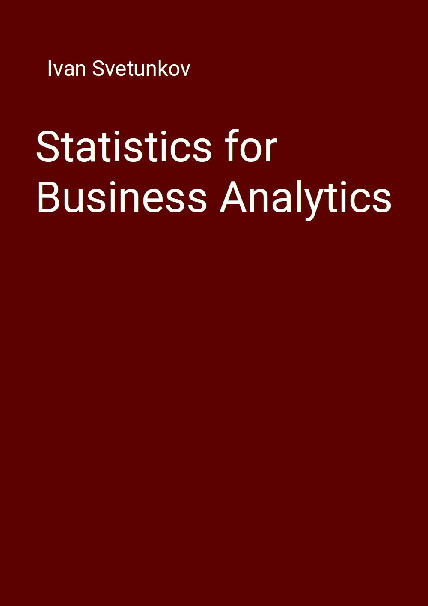

--- 
title: "Statistics for Business Analytics"
author: "Ivan Svetunkov"
date: "`r Sys.Date()`"
site: bookdown::bookdown_site
output: bookdown::gitbook
documentclass: book
bibliography: [library.bib, packages.bib, websites.bib]
csl: elsevier-harvard.csl
biblio-style: elsarticle-harv
link-citations: true
github-repo: config-i1/sba
description: "This book covers the main principles of statistics for Business Analytics, focusing on the application side and how analytics and forecasting can be done with conventional statistical models."
---

# Preface {-}

```{r SBATitle, echo=FALSE, out.width='60%', fig.align='center'}

```

Have you encountered the term "Business Analytics" in your life? If not, then you are probably wondering what it means. If yes, then again, you are probably wondering what it means. It is a term that is used nowadays instead of such terms as "Operations Research" and "Management Science". It is a discipline that covers a variety of qualitative and quantitative methods that can be used in practice for real life decisions. It uses methods and approaches from different scientific areas, including statistics, forecasting, optimisation, operations management etc. These lecture notes are focused on the core of quantitative side of the discipline - statistics. While there are many books on statistics, the author failed to find one that would be focused on the application of statistics both for analysis and forecasting and would rely on modern statistical approaches.

These lecture notes relies heavily on the `greybox` package for R, which focuses on forecasting using regression models. In order to run examples from the lecture notes, you would need to install this package [@R-greybox]:
```{r eval=FALSE}
install.packages("greybox")
```

A very important thing to note is that these lecture notes **do not use `tidyverse` packages**. I like base R, and, to be honest, I am sure that `tidyverse` packages are great, but I have never needed them in my research. So, I will not use pipeline operators, `tibble` or `tsibble` objects and `ggplot2`. It is assumed throughout the lecture notes that you can do all those nice tricks on your own if you want to.

If you want to get in touch with me, there are lots of ways to do that: comments section on any page of [my website](https://forecasting.svetunkov.ru/), [my Russian website](https://ivan.svetunkov.ru/), [vk.com](https://vk.com/isvetunkov), [Facebook](https://www.facebook.com/isvetunkov), [Linkedin](https://www.linkedin.com/in/isvetunkov), [Twitter](https://twitter.com/iSvetunkov).

You can also find me on [ResearchGate](https://www.researchgate.net/profile/Ivan_Svetunkov), [StackExchange](http://stats.stackexchange.com/users/87585/ivan-svetunkov) and [StackOverflow](http://stackoverflow.com/users/5296618/ivan-svetunkov), although I’m not really active there. Finally, I also have [GitHub](https://github.com/config-i1) account.

```{r include=FALSE}
# automatically create a bib database for R packages
knitr::write_bib(c(
  .packages(), 'bookdown', 'knitr', 'rmarkdown', 'greybox', 'DescTools', 'plotrix'
), 'packages.bib')
# Load the necessary packages
library("latex2exp")
library("kableExtra")
library("statmod")
library("pracma")
library("greybox")
library("vioplot")
library("DescTools")
library("plotrix")
library("scatterplot3d")
```

---

You can use the following to cite the online version of this book:

::: adamCitation
- Svetunkov, I. (2022) Statistics for Business Analytics: Lancaster, UK. openforecast.org/sba. Accessed on [current date].
:::

If you use LaTeX, the following can be used instead:

```{r eval=FALSE}
@MISC{SvetunkovSBA,
    title = {Statistics for Business Analytics},
    author = {Ivan Svetunkov},
    howpublished = {Lecture notes. OpenForecast},
    note = {(version: [current date])},
    url = {https://openforecast.org/sba/},
    year = {2022}
}
```

### License {-}

These lecture notes are licensed under [Creative Common License by-nc-sa 4.0](https://creativecommons.org/licenses/by-nc-sa/4.0/), which means that you can share, copy, redistribute and remix the content of the lecture notes for non-commercial purposes as long as you give appropriate credit to the author and provide the link to the original license. If you remix, transform, or build upon the material, you must distribute your contributions under the same CC-BY-NC-SA 4.0 license. See [the explanation on the Creative Commons website](https://creativecommons.org/licenses/by-nc-sa/4.0/).
